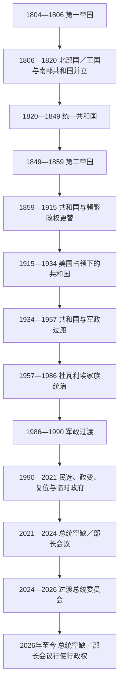

# 海地国家元首与政府首脑表

## 时间

1804年至2026年7月14日。革命时期的殖民行政与军队领袖不等同于独立后的国家元首，本表从1804年独立起排列；1988年宪法下总理职位另表列出。

## 概括

海地政体先后经历帝国、南北并立、共和国、第二帝国、美国占领下的共和国、杜瓦利埃终身总统制、军政府、民选总统制和集体过渡机构。表中按实际在位顺序列出君主、总统、代总统、委员会和事实掌权者；并立或法统与事实控制不一致时明确标注，不把它们误写成无缝单线继承。

任期日期在19世纪短期委员会和革命政府部分偶有不同记载，本表采用常见日期；只存在数日的交接空档，以“国务秘书委员会”“公共秩序委员会”等集体机关表示。完整表的作用是说明权力连续性，不表示所有过渡机构都具有相同的宪法合法性。

## 政体演变图

## 1804—1859：帝国、南北并立与再统一

| 顺序 | 统治者或机关 | 称号／政权 | 在位 | 与前任关系 | 关键事件与备注 |
|---:|---|---|---|---|---|
| 1 | **让-雅克·德萨林** | 海地终身总督；1804年9月后为皇帝雅克一世 | 1804年1月1日—1806年10月17日 | 革命军总司令宣布独立 | 建立第一帝国与1805年宪法；以军政方式维持农业；1806年遇刺。 |
| 2A | **亨利·克里斯托夫** | 北部临时政府首脑、海地国总统；1811年后为国王亨利一世 | 1806年10月17日—1820年10月8日 | 德萨林遇刺后掌握北部 | 与南部并立；建立世袭王国、拉费里埃城堡及等级行政；叛乱中自杀。 |
| 2B | 布鲁诺·布朗谢 | 南部共和国代行政首脑 | 约1807年1月—3月10日 | 南部参议院建立共和体制后的短期代理 | 为佩蒂翁当选前的过渡；起始日期在不同名录中略有差异。 |
| 3B | **亚历山大·佩蒂翁** | 南部共和国总统，1816年后为终身总统 | 1807年3月10日—1818年3月29日 | 南部参议院选举 | 分配国有土地、形成南部政治网络；援助玻利瓦尔并要求推动废奴。 |
| 4B | **让-皮埃尔·博耶** | 南部共和国终身总统 | 1818年3月30日—1820年10月18日 | 佩蒂翁指定的政治继承者 | 北部王国崩溃后接管北部。 |
| 4 | **让-皮埃尔·博耶** | 统一海地终身总统 | 1820年10月18日—1843年2月13日 | 由南部总统成为全国统治者 | 1822—1844年统治全岛；1825年接受法国承认与赔款条件；1843年革命中下台。 |
| 5 | 临时人民委员会／临时政府 | 集体过渡机关 | 1843年2月—4月4日 | 博耶流亡后的革命过渡 | 夏尔·里维耶尔-埃拉尔为主要军事政治人物；筹备新宪政。 |
| 6 | 夏尔·里维耶尔-埃拉尔 | 海地共和国总统 | 1843年4月4日—1844年5月3日 | 从临时政府取得总统职位 | 面对岛东部独立和国内反对，被迫离任。 |
| 7 | 菲利普·格里耶 | 海地共和国总统 | 1844年5月3日—1845年4月15日 | 军政精英推举 | 年长将领，被视为短期妥协人选，任内去世。 |
| 8 | 让-路易·皮埃罗 | 海地共和国总统 | 1845年4月16日—1846年3月1日 | 接替格里耶 | 试图从北部强化中央权力，遭反对后退位。 |
| 9 | 让-巴蒂斯特·里谢 | 海地共和国总统 | 1846年3月1日—1847年2月27日 | 军政妥协继承 | 恢复部分1846年宪制，任内去世。 |
| 10 | **福斯坦·苏鲁克** | 总统；1849年后为皇帝福斯坦一世 | 1847年3月2日—1859年1月15日 | 被精英推举，随后建立个人权力 | 1849年建立第二帝国；多次进攻多米尼加失败；被法布尔·热夫拉尔推翻。 |

说明：1806—1820年同一时间存在北部克里斯托夫政权与南部佩蒂翁—博耶政权，因此顺序以“A／B”表示并立，不能把两条线当作先后继承。克里斯托夫之子雅克-维克托·亨利被部分拥护者视为“亨利二世”，但未能建立有效统治，通常不列为正式在位君主。

## 1859—1915：共和国、临时机关与军政更替

| 顺序 | 统治者或机关 | 职位 | 在位 | 继承方式 | 关键事件与备注 |
|---:|---|---|---|---|---|
| 11 | **法布尔·尼古拉·热夫拉尔** | 终身总统 | 1859年1月15日—1867年3月13日 | 起兵迫使福斯坦一世退位 | 恢复共和国，推动教育和行政改革；反对运动中辞职。 |
| 12 | 让-尼古拉·尼萨热·萨热 | 临时总统 | 1867年3月13日—5月4日 | 热夫拉尔辞职后的过渡 | 向制宪与新总统交接。 |
| 13 | 西尔万·萨尔纳夫 | 总统 | 1867年5月4日—1869年12月27日 | 制宪机关选出 | 与议会、卡科武装冲突；失败后被俘并处决。 |
| 14 | **尼萨热·萨热** | 总统 | 1869年12月27日—1874年5月14日 | 反萨尔纳夫力量胜利 | 完成宪定任期并和平交权，是19世纪少见案例。 |
| — | 国务秘书委员会 | 集体代行行政权 | 1874年5月14日—6月14日 | 萨热任期届满 | 为米歇尔·多曼格就任过渡。 |
| 15 | 米歇尔·多曼格 | 总统 | 1874年6月14日—1876年4月15日 | 制宪机关选出 | 侄子塞普蒂米斯·拉莫实际影响很大；财政和政治危机中流亡。 |
| 16 | **皮埃尔·泰奥马·布瓦龙-卡纳尔** | 临时总统，后为总统 | 1876年4月23日—1879年7月17日 | 多曼格倒台后的临时政府；后正式当选 | 试图恢复行政秩序；党争和起义迫使其辞职。 |
| — | 公共秩序委员会 | 集体机关 | 1879年7月17日—7月26日 | 布瓦龙-卡纳尔辞职 | 短期应急过渡。 |
| — | 约瑟夫·拉莫特 | 临时总统 | 1879年7月26日—10月3日 | 公共秩序委员会后继 | 全国不同派系继续竞争。 |
| — | 弗洛维尔·伊波利特等临时政府 | 集体临时政权 | 1879年10月3日—10月26日 | 拉莫特过渡结束 | 伊波利特名义主持，随后向萨洛蒙交权。 |
| 17 | **利西于斯·萨洛蒙** | 总统 | 1879年10月26日—1888年8月10日 | 国民议会选出 | 建立国家银行、推进财政行政；因反对运动辞职。 |
| — | 皮埃尔·布瓦龙-卡纳尔 | 临时总统 | 1888年8月10日—10月16日 | 萨洛蒙离任后的过渡 | 第二次代行国家元首。 |
| 18 | 弗朗索瓦·德尼·莱吉蒂姆 | 总统 | 1888年10月16日—1889年8月23日 | 南部政治集团支持 | 与北部伊波利特阵营内战，失败下台。 |
| — | 蒙普万·热讷 | 临时总统 | 1889年8月23日—10月17日 | 莱吉蒂姆倒台后的北部胜利方过渡 | 向伊波利特正式政府交权。 |
| 19 | **弗洛维尔·伊波利特** | 总统 | 1889年10月17日—1896年3月24日 | 内战胜利后就任 | 强化中央政府并改善部分基础设施；任内去世。 |
| — | 国务秘书委员会 | 集体代行 | 1896年3月24日—3月31日 | 伊波利特去世 | 为新总统就任过渡。 |
| 20 | 蒂雷西亚·西蒙·萨姆 | 总统 | 1896年3月31日—1902年5月12日 | 国民议会选出 | 任期届满前后党争加剧。 |
| — | 皮埃尔·布瓦龙-卡纳尔 | 公共安全委员会主席、临时总统 | 1902年5月14日—12月17日 | 西蒙·萨姆离任后的第三次过渡执政 | 内战期间主持首都临时政府。 |
| 21 | 皮埃尔·诺尔·阿历克西 | 总统 | 1902年12月17日—1908年12月2日 | 击败竞争者后当选 | 高龄军人政府；叛乱中流亡。 |
| — | 公共秩序委员会 | 集体机关 | 1908年12月2日—12月6日 | 阿历克西倒台 | 数日过渡。 |
| 22 | 弗朗索瓦·安托万·西蒙 | 总统 | 1908年12月6日—1911年8月2日 | 反阿历克西起义后掌权 | 外国资本与铁路特许引发争议；革命中下台。 |
| 23 | **辛辛纳图斯·勒孔特** | 革命最高首领，后为总统 | 1911年8月初—1912年8月8日 | 革命军胜利；8月15日前后完成正式就任程序 | 国家宫爆炸中死亡。 |
| 24 | 唐克雷德·奥古斯特 | 总统 | 1912年8月8日—1913年5月2日 | 勒孔特死后继任 | 任内病逝。 |
| — | 国务秘书委员会 | 集体代行 | 1913年5月2日—5月12日 | 奥古斯特去世 | 为新总统选举过渡。 |
| 25 | 米歇尔·奥雷斯特 | 总统 | 1913年5月12日—1914年1月27日 | 国民议会选出 | 文官总统，军政反对中辞职。 |
| — | 埃德蒙·波利尼斯 | 临时总统 | 1914年1月27日—2月8日 | 奥雷斯特辞职后的过渡 | 向奥雷斯特·扎莫尔交权。 |
| 26 | 奥雷斯特·扎莫尔 | 总统 | 1914年2月8日—10月29日 | 军事集团支持 | 被竞争军阀推翻。 |
| — | 埃德蒙·波利尼斯 | 临时总统 | 1914年10月29日—11月6日 | 第二次短期代理 | 向达维尔马·泰奥多尔交权。 |
| 27 | 约瑟夫·达维尔马·泰奥多尔 | 总统 | 1914年11月7日—1915年2月22日 | 推翻扎莫尔后就任 | 无力兑现军队承诺，迅速失势。 |
| 28 | 维尔布伦·纪尧姆·萨姆 | 总统 | 1915年2月25日—7月28日 | 军事竞争中掌权 | 下令处决政治犯后被暴民杀死，成为美国占领的直接危机背景。 |
| — | 革命委员会 | 集体临时机关 | 1915年7月28日—8月11日 | 萨姆死亡后的权力真空 | 美国海军陆战队已经登陆，国家主权受到直接控制。 |

## 1915—1957：美国占领、共和国与1957年危机

| 顺序 | 统治者或机关 | 职位 | 在位 | 权力环境 | 关键事件与备注 |
|---:|---|---|---|---|---|
| 29 | 菲利普·叙德雷·达蒂格纳夫 | 总统 | 1915年8月12日—1922年5月15日 | 美国占领军和美国财政控制下当选 | 批准有利于占领体制的条约；本国政府权力受限。 |
| 30 | 路易·博尔诺 | 总统 | 1922年5月15日—1930年5月15日 | 美国占领下由国务委员会选出 | 与美国高级专员合作推进工程，也面对反占领批评。 |
| 31 | 路易·欧仁·鲁瓦 | 临时总统 | 1930年5月15日—11月18日 | 负责恢复议会选举的过渡 | 向经议会选出的文森特交权。 |
| 32 | **斯泰尼奥·文森特** | 总统 | 1930年11月18日—1941年5月15日 | 先在占领下执政，1934年后恢复较完整主权 | 1934年美军撤出；1937年面对多米尼加“香芹大屠杀”危机。 |
| 33 | 埃利·莱斯科 | 总统 | 1941年5月15日—1946年1月11日 | 国民议会选出 | 二战时期亲美；1946年群众运动和军方压力下辞职。 |
| 34 | 弗朗克·拉沃 | 军事执行委员会主席 | 1946年1月11日—8月16日 | 军方临时政权 | 组织制宪和总统选举。 |
| 35 | **迪马瑟·埃斯蒂梅** | 总统 | 1946年8月16日—1950年5月10日 | 国民议会选出 | 扩大黑人中产政治代表和公共工程；谋求延任时被军方推翻。 |
| 36 | 弗朗克·拉沃 | 政府军政府主席 | 1950年5月10日—12月6日 | 第二次军政府 | 组织海地首次总统直接普选。 |
| 37 | 保罗·马格卢瓦尔 | 总统 | 1950年12月6日—1956年12月12日 | 直接选举并获军方支持 | 旅游和工程增长后遭经济、飓风与延任危机；辞职。 |
| 38 | 约瑟夫·内穆尔·皮埃尔-路易 | 临时总统 | 1956年12月12日—1957年2月3日 | 最高法院院长代理 | 选举危机中被迫离任。 |
| 39 | 弗朗克·西尔万 | 临时总统 | 1957年2月7日—4月2日 | 候选阵营妥协产生 | 与军方冲突后下台。 |
| — | 莱昂·康塔夫 | 代国家元首 | 1957年4月2日—4月6日 | 陆军参谋长短期接管 | 向集体委员会移交。 |
| — | 执行政府委员会 | 集体国家元首 | 1957年4月6日—5月20日 | 多党派过渡机关 | 内部分裂，被军方终止。 |
| — | 莱昂·康塔夫 | 代国家元首 | 1957年5月20日—5月25日 | 第二次短期军方代理 | 任命新的临时总统。 |
| 40 | 丹尼尔·菲尼奥莱 | 临时总统 | 1957年5月25日—6月14日 | 劳工运动领袖获任 | 仅20天即被军方推翻并流亡。 |
| 41 | 安东尼奥·特拉西比尔·凯布罗 | 军事委员会主席 | 1957年6月14日—10月22日 | 军政府 | 组织1957年选举并向杜瓦利埃交权。 |

## 1957—2026：终身总统、军政过渡与选举危机

| 顺序 | 统治者或机关 | 职位／法统 | 在位 | 与前任关系 | 关键事件与备注 |
|---:|---|---|---|---|---|
| 42 | **弗朗索瓦·杜瓦利埃** | 总统；1964年后为终身总统 | 1957年10月22日—1971年4月21日 | 1957年选举获胜 | 以军队清洗、通顿马库特和个人崇拜建立独裁；任内去世。 |
| 43 | **让-克洛德·杜瓦利埃** | 终身总统 | 1971年4月21日—1986年2月7日 | 经宪法安排继承父亲 | 19岁继位；群众抗议和外部压力下出逃。 |
| 44 | 亨利·南菲 | 全国执政委员会主席 | 1986年2月7日—1988年2月7日 | 杜瓦利埃倒台后的军政委员会 | 监督1987年宪法，但选举暴力破坏过渡。 |
| 45 | 莱斯利·马尼加 | 总统 | 1988年2月7日—6月20日 | 争议选举后就任 | 被南菲发动政变推翻。 |
| 44复 | 亨利·南菲 | 总统／军政府首脑 | 1988年6月20日—9月17日 | 推翻马尼加复掌权力 | 又被普罗斯佩·阿夫里尔政变推翻。 |
| 46 | 普罗斯佩·阿夫里尔 | 军政府国家元首 | 1988年9月17日—1990年3月10日 | 军事政变 | 抗议和国际压力下辞职。 |
| — | 埃拉尔·亚伯拉罕 | 代总统 | 1990年3月10日—3月13日 | 阿夫里尔离任后的三日过渡 | 向文官临时总统交权。 |
| 47 | 埃尔塔·帕斯卡尔-特鲁约 | 临时总统 | 1990年3月13日—1991年2月7日 | 最高法院法官获任 | 组织1990年竞争性选举。 |
| 48 | **让-贝特朗·阿里斯蒂德** | 民选总统 | 1991年2月7日—9月29日 | 1990年选举获胜 | 被军方政变推翻；此后在海外仍获国际承认为合法总统。 |
| — | 拉乌尔·塞德拉斯 | 武装部队总司令、事实最高掌权者 | 1991年9月29日—1994年10月12日 | 主导推翻阿里斯蒂德 | 与名义总统、总理并存；并非持续担任正式总统。 |
| — | 约瑟夫·内雷特 | 临时总统 | 1991年10月8日—1992年6月19日 | 政变当局安排 | 名义文官元首，实权受军方制约。 |
| — | 马克·巴赞领导的部长会议 | 集体代行国家元首职能 | 1992年6月19日—1993年6月15日 | 内雷特离任后形成 | 巴赞兼政府首脑；军方仍掌握事实强制权。 |
| 48法统 | 让-贝特朗·阿里斯蒂德 | 流亡中的国际承认总统 | 1991年9月29日—1994年10月12日 | 被政变推翻但法统未获国际社会撤销 | 1994年在美国主导干预后复职。 |
| — | 埃米尔·若纳桑 | 政变体制下临时总统 | 1994年5月12日—10月12日 | 军方支持的事实政权 | 与流亡中的阿里斯蒂德法统重叠。 |
| 48复 | **让-贝特朗·阿里斯蒂德** | 复职总统 | 1994年10月12日—1996年2月7日 | 国际干预后恢复职位 | 解散旧军队并完成余下任期。 |
| 49 | **勒内·普雷瓦尔** | 民选总统 | 1996年2月7日—2001年2月7日 | 1995年选举获胜 | 海地首次由一位民选总统向另一位民选总统和平交接。 |
| 48再 | 让-贝特朗·阿里斯蒂德 | 民选总统 | 2001年2月7日—2004年2月29日 | 2000年选举后第二次完整任期 | 反政府武装推进和国际压力中离境；离任性质存在政治争议。 |
| — | 博尼法斯·亚历山大 | 临时总统 | 2004年2月29日—2006年5月14日 | 最高法院院长依过渡安排就任 | 与拉托尔蒂总理及国际特派团共同维持过渡。 |
| 49再 | **勒内·普雷瓦尔** | 民选总统 | 2006年5月14日—2011年5月14日 | 2006年选举后再任 | 任内经历2010年大地震。 |
| 50 | 米歇尔·马尔泰利 | 民选总统 | 2011年5月14日—2016年2月7日 | 2010—2011年选举获胜 | 任期结束而继任选举未完成。 |
| — | 埃文斯·保罗领导的部长会议 | 集体代行国家元首职能 | 2016年2月7日—2月14日 | 总统任期届满后的七日空档 | 向议会选出的临时总统交权。 |
| 51 | 若瑟莱尔姆·普里韦尔 | 临时总统 | 2016年2月14日—2017年2月7日 | 国民议会间接选出 | 原定短期任期延长，直至新总统就任。 |
| 52 | 若弗内尔·莫伊兹 | 民选总统 | 2017年2月7日—2021年7月7日 | 2016年重选获胜 | 任期与议会争议、抗议和帮派扩张中遇刺。 |
| — | 克洛德·约瑟夫领导的部长会议 | 代行行政和国家元首职能 | 2021年7月7日—7月20日 | 总统遇刺时的代理总理 | 与已获任命但未就职的阿里埃尔·亨利发生继承争议。 |
| — | 阿里埃尔·亨利领导的部长会议 | 总统空缺下的行政当局 | 2021年7月20日—2024年4月24日 | 国际支持下由约瑟夫交权 | 未举行全国选举；2024年危机中同意辞职。 |
| — | 过渡总统委员会（主席埃德加·勒布朗·菲斯） | 集体国家元首 | 2024年4月30日—10月7日 | 多方协议建立九人委员会 | 主席是协调者，不是单独总统；委员会任命总理。 |
| — | 过渡总统委员会（主席莱斯利·伏尔泰） | 集体国家元首 | 2024年10月7日—2025年3月7日 | 轮值主席 | 与总理分享行政权。 |
| — | 过渡总统委员会（主席弗里茨·让） | 集体国家元首 | 2025年3月7日—8月7日 | 轮值主席 | 继续安全与选举过渡。 |
| — | 过渡总统委员会（主席洛朗·圣西尔） | 集体国家元首 | 2025年8月7日—2026年2月7日 | 轮值主席 | 任期结束时仍未完成民选政府交接。 |
| — | 阿利克斯·迪迪埃·菲斯-艾梅领导的部长会议 | 总统空缺；部长会议行使完整行政权 | 2026年2月7日—至今 | 过渡总统委员会期满后接权 | 截至2026年7月14日仍由总理领导过渡，目标为恢复安全和举行选举。 |

## 海地总理完整表

1987年宪法确立总统—总理双首长行政框架，总理职位于1988年开始实际运作。军政中断、议会无法确认人选或总统直接掌握行政时，职位曾空缺；“代理”表示未完成通常的议会批准或仅临时履职。

| 顺序 | 政府首脑 | 任期 | 国家元首／权力背景 | 关键事件与备注 |
|---:|---|---|---|---|
| 1 | 马夏尔·塞莱斯坦 | 1988年2月9日—6月20日 | 总统莱斯利·马尼加 | 首任宪制总理；随军事政变离任。 |
| — | 职位空缺 | 1988年6月20日—1991年2月13日 | 南菲、阿夫里尔军政府及文官过渡 | 军政首脑和临时总统直接主持行政。 |
| 2 | **勒内·普雷瓦尔** | 1991年2月13日—10月11日 | 总统阿里斯蒂德；9月后政变体制 | 政变后离任，后来两度任总统。 |
| 3 | 让-雅克·奥诺拉 | 1991年10月11日—1992年6月19日 | 临时总统内雷特、塞德拉斯军方 | 政变后事实政权的文官政府首脑。 |
| 4 | 马克·巴赞 | 1992年6月19日—1993年8月30日 | 总统法统争议、军方事实控制 | 一段时期由其部长会议代行国家元首职能。 |
| 5 | 罗贝尔·马尔瓦尔 | 1993年8月30日—1994年11月8日 | 阿里斯蒂德法统与若纳桑事实政权重叠 | 由流亡总统任命，行政能力受军政府限制；阿里斯蒂德复职后继续短期任职。 |
| 6 | 斯马克·米歇尔 | 1994年11月8日—1995年11月7日 | 复职总统阿里斯蒂德 | 处理制裁后经济与军队解散时期。 |
| 7 | 克洛黛特·韦莱 | 1995年11月7日—1996年2月27日 | 阿里斯蒂德、后普雷瓦尔 | 海地首位女性总理。 |
| 8 | 罗尼·斯马特 | 1996年2月27日—1997年10月20日 | 总统普雷瓦尔 | 与议会和总统冲突后辞职。 |
| — | 职位空缺 | 1997年10月20日—1999年3月26日 | 总统普雷瓦尔 | 提名与议会僵局导致政府首脑长期空缺。 |
| 9 | 雅克-爱德华·亚历克西 | 1999年3月26日—2001年3月2日 | 总统普雷瓦尔、后阿里斯蒂德 | 第一次任期。 |
| 10 | 让-马里·谢雷斯塔尔 | 2001年3月2日—2002年3月15日 | 总统阿里斯蒂德 | 争议选举后的政治经济压力中辞职。 |
| 11 | 伊冯·内普蒂纳 | 2002年3月15日—2004年3月12日 | 总统阿里斯蒂德 | 2004年政权危机后被临时政府取代。 |
| 12 | 热拉尔·拉托尔蒂 | 2004年3月12日—2006年6月9日 | 临时总统博尼法斯·亚历山大 | 国际支持的过渡政府首脑。 |
| 9再 | **雅克-爱德华·亚历克西** | 2006年6月9日—2008年9月5日 | 总统普雷瓦尔 | 第二次任期；粮价抗议后被参议院罢免。 |
| 13 | 米谢勒·皮埃尔-路易 | 2008年9月5日—2009年11月11日 | 总统普雷瓦尔 | 参议院不信任后离任。 |
| 14 | 让-马克斯·贝勒里夫 | 2009年11月11日—2011年10月18日 | 总统普雷瓦尔、后马尔泰利 | 任内经历2010年地震及灾后协调。 |
| 15 | 加里·科尼耶 | 2011年10月18日—2012年5月16日 | 总统马尔泰利 | 第一次任期；与总统阵营矛盾后辞职。 |
| 16 | 洛朗·拉莫特 | 2012年5月16日—2014年12月20日 | 总统马尔泰利 | 选举延误与抗议压力下辞职。 |
| — | 弗洛朗丝·迪佩瓦尔·纪尧姆（代理） | 2014年12月20日—2015年1月16日 | 总统马尔泰利 | 作为卫生部长短期代理。 |
| 17 | 埃文斯·保罗 | 2015年1月16日—2016年2月26日 | 总统马尔泰利；其后短期总统空缺 | 马尔泰利任期结束后，其部长会议曾代行国家元首职能七日。 |
| 18 | 弗里茨·让（未获完整议会确认） | 2016年2月26日—3月28日 | 临时总统普里韦尔 | 提名未能获得议会确认，短期履职。 |
| 19 | 埃内克斯·让-夏尔 | 2016年3月28日—2017年3月21日 | 临时总统普里韦尔、后总统莫伊兹 | 组织重选并向新政府交接。 |
| 20 | 杰克·居伊·拉丰唐 | 2017年3月21日—2018年9月17日 | 总统莫伊兹 | 燃油涨价抗议后辞职。 |
| 21 | 让-亨利·塞昂 | 2018年9月17日—2019年3月21日 | 总统莫伊兹 | 众议院不信任动议后离任。 |
| — | 让-米歇尔·拉潘（代理） | 2019年3月21日—2020年3月4日 | 总统莫伊兹 | 未获议会正式批准，长期代理。 |
| 22 | 约瑟夫·茹特 | 2020年3月4日—2021年4月13日 | 总统莫伊兹 | 治安和宪政危机中辞职。 |
| — | 克洛德·约瑟夫（代理） | 2021年4月14日—7月20日 | 总统莫伊兹；7月7日后总统空缺 | 总统遇刺后短期主持政府并与亨利发生继承争议。 |
| — | 阿里埃尔·亨利 | 2021年7月20日—2024年4月24日 | 总统空缺、部长会议代行政 | 长期未举行选举；2024年武装危机和过渡协议后辞职。 |
| — | 米歇尔·帕特里克·布瓦韦尔（代理） | 2024年2月25日—6月3日 | 亨利滞留国外；后为过渡总统委员会 | 先在亨利不在国内时代行职责，4月后受离任内阁正式指定代理。 |
| 15再 | 加里·科尼耶 | 2024年6月3日—11月10日 | 过渡总统委员会 | 第二次任期；与委员会发生权力冲突后被撤换。 |
| — | **阿利克斯·迪迪埃·菲斯-艾梅** | 2024年11月10日—至今 | 过渡总统委员会至2026年2月；其后总统空缺 | 2026年2月7日起主持行使完整行政权的部长会议；截至2026年7月14日在任。 |

## 连续性与争议说明

- 1806—1820年为真正并立政权：北部克里斯托夫与南部佩蒂翁—博耶同时统治不同领土。
- 1843—1915年的数日空档往往由国务秘书、公共秩序委员会或革命委员会集体代行；这些机关不是“被漏掉的总统”。
- 1915—1934年海地仍有本国总统，但美国占领当局控制军队、财政和关键行政，因此名义国家元首与实际最高权力不完全一致。
- 1991—1994年阿里斯蒂德在流亡中保持国际承认法统，塞德拉斯军方控制国内强制机器，内雷特、巴赞部长会议和若纳桑先后承担名义或事实国家元首角色，任期必然重叠。
- 2021—2024年没有总统，总理领导的部长会议承担行政和部分国家元首职能；不能把阿里埃尔·亨利写成总统。
- 2024—2026年国家元首是过渡总统委员会这一集体机关，轮值主席不是单独总统。
- 2026年2月7日委员会任期届满后，总统职位再次空缺，由菲斯-艾梅总理领导的部长会议行使行政权；截至2026年7月14日尚未完成民选总统交接。

## 相关笔记

- 主笔记：[海地革命与法属加勒比](/%E4%BA%BA%E6%96%87%E7%A7%91%E5%AD%A6/%E5%8E%86%E5%8F%B2/%E7%BE%8E%E6%B4%B2/%E5%8A%A0%E5%8B%92%E6%AF%94/%E6%B5%B7%E5%9C%B0%E9%9D%A9%E5%91%BD%E4%B8%8E%E6%B3%95%E5%B1%9E%E5%8A%A0%E5%8B%92%E6%AF%94.md)。
- 区域总览：[加勒比历史](/%E4%BA%BA%E6%96%87%E7%A7%91%E5%AD%A6/%E5%8E%86%E5%8F%B2/%E7%BE%8E%E6%B4%B2/%E5%8A%A0%E5%8B%92%E6%AF%94/README.md)。
- 邻接国家路径：[西班牙加勒比与古巴](/%E4%BA%BA%E6%96%87%E7%A7%91%E5%AD%A6/%E5%8E%86%E5%8F%B2/%E7%BE%8E%E6%B4%B2/%E5%8A%A0%E5%8B%92%E6%AF%94/%E8%A5%BF%E7%8F%AD%E7%89%99%E5%8A%A0%E5%8B%92%E6%AF%94%E4%B8%8E%E5%8F%A4%E5%B7%B4.md)。
