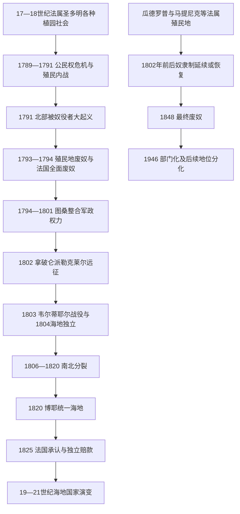

# 海地革命与法属加勒比

## 时间

法属圣多明各约自17世纪后期形成，1791—1804年为海地革命核心阶段；海地与法属加勒比的政治演变延续至2026年7月。

## 概括

法国控制的圣多明各在18世纪成为世界上最重要的糖、咖啡和靛蓝产区之一，财富却建立在高死亡率、持续输入非洲被奴役人口和严酷种植园纪律之上。法国革命引发的公民权争论、自由有色人种的政治动员、被奴役者的大起义、殖民地内部战争以及西班牙和英国的干预相互叠加，最终把一次殖民危机推向全面废奴与独立战争。

海地革命不是单一领袖按既定路线领导的事件，而是被奴役者、自耕者、自由有色人种、白人殖民者、法国共和派、保王派和外国军队不断重组联盟的过程。1804年独立使海地成为近代第一个由大规模奴隶起义建立的独立国家和第一个独立黑人共和国。此后海地既要防止法国重新征服，也要在土地分配、出口生产、军政权力和公民平等之间建立国家；1825年法国以舰队威胁迫使海地承认巨额赔款，又把主权承认与长期债务绑定。

瓜德罗普、马提尼克、法属圭亚那、圣马丁和圣巴泰勒米没有沿海地道路独立。它们经历了废奴、复辟、1848年最终废奴、1946年部门化以及不同形式的地方自治，至今仍属于法兰西共和国，但法律地位和自治程度并不相同。

## 演进图

## 革命前的圣多明各

### 殖民扩张与种植园经济

法国海盗和殖民者在伊斯帕尼奥拉岛西部逐步立足，1697年《赖斯韦克条约》使西班牙正式承认法国对该地区的控制。18世纪的灌溉、磨坊、港口信贷和跨大西洋航运推动糖与咖啡扩张；太子港、海地角和莱凯等港口连接法国商人、非洲奴隶贸易和北美粮食供应。到革命前夕，圣多明各的出口价值在法国殖民贸易中居于核心地位。

这种繁荣极不稳定。种植园依靠酷刑、强制劳动和性暴力维持秩序，死亡率高于自然增长率，因此不断从非洲输入劳动力。许多新近抵达者保留了刚果、达荷美、塞内冈比亚和中西非其他地区的语言、军事经验、宗教与组织网络。逃亡者建立的马龙社群、日常怠工、破坏工具、投毒指控和周期性起义说明奴隶制度从未获得被统治者接受。

### 法律身份与社会群体

| 群体 | 大致位置 | 主要利益与内部差异 |
|---|---|---|
| 大白人种植园主和商人 | 殖民精英 | 希望扩大地方自治和贸易自由，但多数坚持奴隶制；种植园主与港口商人的利益并不完全一致。 |
| 小白人 | 工匠、监工、士兵、小业主 | 常以白人身份特权抵消财富不足，反对自由有色人种平权。 |
| 自由有色人种 | 包括自由黑人和混血自由人 | 部分拥有土地、教育或奴隶财产；要求依法享有公民权，但其内部对奴隶制和革命立场不一。 |
| 被奴役人口 | 占人口绝大多数 | 包括克里奥尔人与新抵达非洲人、家内奴与田间劳工；共同受奴役，但语言、劳动位置和策略不同。 |
| 马龙社群 | 山地、边缘地带和跨殖民边界 | 以逃亡、武装自卫、贸易或谈判维持自治，与种植园劳工保持多种联系。 |

1685年《黑法典》试图规定奴隶身份、主人义务、宗教与惩罚，却没有消除任意暴力。种族、自由身份、财产和出生地共同决定权利，不能把殖民社会简单分成“黑人与白人”两个一致阵营。

## 海地革命的阶段

| 阶段 | 时间 | 主要过程 | 转折 |
|---|---|---|---|
| 公民权与殖民权力危机 | 1789—1791年8月 | 白人殖民者争夺自治，自由有色人种要求平权；樊尚·奥热等人的武装行动被镇压。 | 法国革命的普遍权利语言与殖民奴隶制发生正面冲突。 |
| 北部大起义与多方内战 | 1791年8月—1793年 | 北部种植园大规模焚毁；起义军形成多个军团；西班牙、英国和法国各派介入。 | 1793年法国民事委员在战争压力下先后宣布当地废奴。 |
| 法国全面废奴与图桑崛起 | 1794—1798年 | 法国国民公会废除殖民地奴隶制；图桑·卢维图尔转向法国，驱逐西班牙和英国势力。 | 废奴把反奴隶制武装与法兰西共和国暂时结合。 |
| 内部整合与自治扩大 | 1799—1801年 | 图桑在“刀兵战争”中击败安德烈·里戈；控制全岛并颁布1801年宪法。 | 殖民地保留法国名义主权，却形成高度自治的军政体制。 |
| 法国远征与再奴役危机 | 1802—1803年 | 勒克莱尔远征迫使部分将领投降；图桑被捕；法国在瓜德罗普恢复奴隶制的消息激化抵抗。 | 黄热病、法军暴行和再奴役恐惧促成原革命派重新联合。 |
| 独立战争 | 1803—1804年 | 德萨林、克里斯托夫等整合反法军队；1803年韦尔蒂耶尔战役后法军撤离。 | 1804年1月1日宣布独立并采用“海地”国名。 |

## 革命的具体过程

### 1789—1791：权利争论走向武装冲突

法国三级会议和《人权与公民权宣言》没有自动把权利扩展到殖民地。圣多明各白人议会试图控制贸易和地方政治，自由有色人种则援引财产与自由身份要求选举权。1790年樊尚·奥热起兵失败并遭处决，显示殖民精英不愿接受平权，也使温和申诉空间迅速缩小。

1791年8月北部平原爆发协调程度很高的大起义。传统叙事把“博瓦凯曼仪式”视为动员象征；这一仪式在海地历史记忆中地位重要，但日期、参加者和具体仪式细节存在史料争议。起义者焚毁种植园、攻击殖民武装并建立营地，却没有立刻形成统一中央指挥。宗教网络、夜间集会、军事经验、种植园间通信和奴役制度的共同敌人共同支撑了扩散。

### 1792—1794：外国干预与废奴

法国派莱热-费利西泰·松托纳克和艾蒂安·波尔韦雷尔等民事委员恢复秩序并执行自由有色人种平权。1793年法国与西班牙、英国开战后，圣多明各成为国际战场：西班牙从岛东部招募黑人起义将领，英国占领部分港口，白人保王派和共和派也相互冲突。

在军事崩溃和奴隶军压力下，民事委员于1793年分区宣布解放。1794年2月法国国民公会把废奴扩大到法国殖民地。图桑原先与西班牙合作，在确认法国废奴后转向共和国；这一选择既维护解放成果，也为他取得武器、军衔和合法性提供条件。

### 1794—1801：图桑政权的形成及其矛盾

图桑的军队击退西班牙，迫使英国在1798年撤出，并在1799—1800年的“刀兵战争”中击败控制南部的自由有色人种将领安德烈·里戈。1801年他进入原西班牙属圣多明各东部，宣布全岛废奴，并颁布宪法，自任终身总督。宪法承认法国名义主权，却给予殖民地接近自治国家的权力。

图桑必须面对一个根本矛盾：自由劳工希望拥有土地和自主安排劳动，国家却需要出口收入购买军备并防止法国入侵。他以军令维持大种植园生产、限制劳工迁移，并与部分白人业主和外国商人合作。这种制度不同于法定奴隶制，但仍具有强制劳动性质，导致农村抵抗，也说明“废奴”并不等于经济与社会关系立即自由化。

### 1802—1804：拿破仑远征、再奴役与独立

拿破仑派妹夫夏尔·勒克莱尔率大军于1802年登陆，试图解除黑人将领武装并恢复巴黎控制。图桑在停战后被诱捕并押往法国汝堡，1803年死于囚禁。与此同时，法国在瓜德罗普重新建立奴隶制，圣多明各法军的大规模处决和解除军职措施使“投降后仍会被再奴役”的判断变得可信。

让-雅克·德萨林、亨利·克里斯托夫和亚历山大·佩蒂翁等重新联合。黄热病严重削弱缺乏免疫力的欧洲部队，英国海军封锁又切断补给，但法军失败不能只归因于疾病：革命军控制乡村、持续补充兵员、改变战术并把保卫自由转化为独立目标。1803年11月韦尔蒂耶尔战役后，法国残军撤离；1804年1月1日德萨林宣布海地独立。

## 独立、暴力与革命遗产

革命终结了圣多明各奴隶制和法国殖民主权，却没有以和解收场。1804年德萨林政权下的军队杀害了大批仍留在海地的法国白人平民，受害者包括妇女和儿童；部分波兰籍逃兵、德国聚落居民、医生、技术人员和神职人员等获得豁免。相关人数与地方执行情况存在差异，但这是新国家建立过程中的大规模政治暴力，不应被省略，也不应被用来抹去此前殖民奴隶制、法国远征军暴行或海地革命的解放意义。

海地革命产生了跨大西洋影响：

- 它证明被奴役者能够推翻奴隶制、击败欧洲强国并建立国家，鼓舞美洲其他反奴隶制与黑人政治运动。
- 难民、自由有色人种和被奴役者迁往古巴、路易斯安那、牙买加等地，传播技术、语言、宗教和革命恐惧。
- 拿破仑失去圣多明各后放弃大规模北美帝国计划，1803年把路易斯安那售予美国。
- 奴隶制国家长期孤立海地，担心承认它会削弱本国奴隶制度；美国直到1862年才正式承认海地。
- 革命确立法律自由，却把战争军事化、出口财政、土地分配和国际承认等难题留给独立国家。

## 独立后的国家形成

### 德萨林帝国与南北分裂

德萨林先任终身总督，1804年称皇帝雅克一世。1805年宪法以黑人共同政治身份否定殖民种族等级，并限制外国白人拥有土地；与此同时，国家以军事行政和强制性农业规章维持出口。1806年德萨林遭政敌刺杀，军政精英围绕行政权和土地政策分裂。

北部由亨利·克里斯托夫统治，1811年改建海地王国。其政权以严密等级、强制农业劳动、宫殿与拉费里埃城堡等工程集中资源，也建立学校和行政体系。南部和西部共和国由亚历山大·佩蒂翁掌权，他把较多国有土地分配给军人和小农，以政治庇护维持政权，并援助西蒙·玻利瓦尔，要求其在解放地区推动废奴。两种模式都在“出口国家”与“小农自主”之间作出不同取舍。

### 博耶统一、全岛统治与独立赔款

让-皮埃尔·博耶1818年继承佩蒂翁，1820年在克里斯托夫政权崩溃后统一南北。1822年他接管岛东部，废除那里残存的奴隶制，但征税、土地与教会政策及太子港中心化引发反对；1844年东部脱离，建立多米尼加共和国。

1825年法国国王查理十世派舰队到海地，以承认独立为条件要求向原殖民者赔偿1.5亿金法郎，并给予法国商品关税优惠。海地为支付首期款项向法国银行借款，形成“赔款加贷款”的双重负担。1838年赔款名义总额降为9000万法郎，但海关收入和国家财政此后长期被债务占用。赔款是海地发展受限的重要结构因素，却不能单独解释此后的政变、土地矛盾、国家能力不足和外国干预。

### 19世纪中后期与美国占领

博耶1843年被推翻后，海地经历短期总统、地区军阀、1849—1859年的福斯坦一世第二帝国以及共和国重建。地方武装、军队控制政权交接、出口税依赖、商人信贷与肤色—阶层政治竞争，使中央政府反复更替；同时，小农生产、市场网络、宗教与社区组织维持了社会连续性，不能把这一时期只写成“混乱”。

1915年总统维尔布伦·纪尧姆·萨姆被杀后，美国海军陆战队占领海地，直至1934年。占领者控制海关与财政、重组宪兵并建设部分道路和公共设施，也强迫农村劳工服徭役、镇压卡科抵抗、修改土地制度并强化太子港中央集权。美国军队撤出后，外部财政控制仍延续一段时间；占领建立的集中化军队后来成为政治权力核心之一。

### 杜瓦利埃统治、民主转型与反复干预

弗朗索瓦·杜瓦利埃1957年当选后摧毁竞争机构，以终身总统制、个人崇拜和“通顿马库特”准军事组织实施恐怖统治。1971年其子让-克洛德·杜瓦利埃继位，家族统治延续至1986年。反独裁抗议迫使“小杜瓦利埃”出逃，但军方和旧权力网络继续影响过渡。

让-贝特朗·阿里斯蒂德在1990年选举中获胜，1991年即被军事政变推翻；1994年在美国主导的国际干预下复职。此后民选总统、临时政府、反对派与外国力量反复争夺合法性。2004年阿里斯蒂德再次离任，联合国海地稳定特派团进驻至2017年；维和行动在安全和选举方面发挥作用，也因侵权指控及由维和人员引入霍乱而留下严重责任争议。

2010年大地震造成大规模死亡、流离失所和国家机构损毁。灾后援助增加，却因协调、问责、土地和公共能力不足难以转化为稳定重建。2018年后围绕燃油、腐败、选举与总统任期的冲突升级，武装团体控制范围扩大。2021年总统若弗内尔·莫伊兹遇刺后，国家长期没有民选总统，议会也因选举中断而失去正常运作能力。

## 国家元首、政府首脑与实际权力

完整顺序、并立政权、复位、军事统治、过渡委员会与1988年以来历任总理见：[海地国家元首与政府首脑表](/%E4%BA%BA%E6%96%87%E7%A7%91%E5%AD%A6/%E5%8E%86%E5%8F%B2/%E7%BE%8E%E6%B4%B2/%E5%8A%A0%E5%8B%92%E6%AF%94/%E6%B5%B7%E5%9C%B0%E5%9B%BD%E5%AE%B6%E5%85%83%E9%A6%96%E4%B8%8E%E6%94%BF%E5%BA%9C%E9%A6%96%E8%84%91%E8%A1%A8.md)。

### 关键早期统治者

| 政权或地区 | 统治者 | 在位 | 继承与关键事件 |
|---|---|---|---|
| 海地帝国 | **让-雅克·德萨林／雅克一世** | 1804—1806年 | 革命军总司令；宣布独立并称帝；1806年遇刺。 |
| 北部海地国、海地王国 | **亨利·克里斯托夫／亨利一世** | 1806—1820年 | 与南部共和国并立；1811年称王；1820年政权崩溃时自杀。 |
| 南部共和国 | **亚历山大·佩蒂翁** | 1807—1818年 | 经参议院当选，后任终身总统；土地分配并支持玻利瓦尔。 |
| 南部共和国、统一海地 | **让-皮埃尔·博耶** | 1818—1843年 | 继承佩蒂翁；1820年统一南北，1822年控制全岛；接受1825年法国赔款条件。 |
| 海地共和国、第二帝国 | **福斯坦·苏鲁克／福斯坦一世** | 1847—1859年 | 1847年任总统，1849年称帝；对多米尼加战争受挫，后被热夫拉尔推翻。 |

## 重要事件

| 时间 | 事件 | 直接结果 | 长期影响 |
|---|---|---|---|
| 1697年 | 《赖斯韦克条约》 | 西班牙承认法国控制伊斯帕尼奥拉西部。 | 圣多明各种植园殖民地获得正式国际边界基础。 |
| 1790年 | 樊尚·奥热起事 | 自由有色人种平权武装失败。 | 权利争论进一步军事化。 |
| 1791年8月 | 北部大起义 | 大量种植园被摧毁，殖民军失去乡村控制。 | 革命从精英宪政冲突转为奴隶制存亡之争。 |
| 1793—1794年 | 当地解放与法国全面废奴 | 法国殖民地法律上废除奴隶制。 | 图桑等将领转向法国，联盟格局改变。 |
| 1798年 | 英军撤出 | 法国共和派与黑人军队保住圣多明各。 | 图桑成为殖民地最强政治军事领袖。 |
| 1801年 | 图桑宪法 | 全岛废奴并建立高度自治体制。 | 刺激拿破仑派军恢复中央控制。 |
| 1802年 | 勒克莱尔远征；瓜德罗普恢复奴隶制 | 图桑被捕，法军一度控制主要城市。 | 再奴役威胁促成反法力量重新联合。 |
| 1803年11月 | 韦尔蒂耶尔战役 | 法军决定撤离。 | 独立的直接军事转折。 |
| 1804年1月1日 | 海地独立 | 法国殖民统治终结。 | 大西洋奴隶制世界出现革命性先例。 |
| 1806年 | 德萨林遇刺 | 帝国瓦解。 | 海地进入北部王国与南部共和国并立。 |
| 1820年 | 博耶统一南北 | 北部王国被并入共和国。 | 中央政权重新统一海地。 |
| 1822—1844年 | 海地统治整个伊斯帕尼奥拉岛 | 岛东部奴隶制废除，行政统一。 | 东部反对最终促成多米尼加独立。 |
| 1825、1838年 | 法国赔款及其重订 | 法国承认海地；赔款由1.5亿降为9000万金法郎。 | 债务和关税压力长期压缩公共财政。 |
| 1915—1934年 | 美国占领 | 外国军政与财政控制。 | 国家进一步集中化，亦留下强制劳动和主权受损记忆。 |
| 1957—1986年 | 杜瓦利埃家族统治 | 世袭式终身总统制与准军事恐怖。 | 国家机构个人化、流亡与人权创伤延续。 |
| 1990—1994年 | 阿里斯蒂德当选、政变与复职 | 民主转型被军方中断，后由外国干预恢复。 | 民选合法性与外部介入长期纠缠。 |
| 2004—2017年 | 政权更替与联合国特派团 | 国际维和长期存在。 | 安全支持与霍乱、侵权及问责争议并存。 |
| 2010年 | 海地大地震 | 首都圈重大人员和机构损失。 | 灾后治理、援助依赖与城市脆弱性加重。 |
| 2021年 | 莫伊兹遇刺 | 总统职位空缺，宪政继承争议扩大。 | 政治真空与武装团体扩张相互强化。 |
| 2024—2026年 | 过渡总统委员会 | 集体国家元首与总理分享行政权。 | 未能在授权期限内完成向民选政府交接。 |
| 2026年2月7日 | 委员会任期结束 | 行政权移交由总理领导的部长会议。 | 总统仍空缺，安全与选举成为过渡核心。 |

## 法属加勒比的不同道路

### 瓜德罗普

1794年法国废奴在瓜德罗普一度实施。1802年拿破仑派安托万·里什庞斯恢复旧秩序，路易·德尔格雷斯及其同伴以武装抵抗，失败后许多人战死或集体引爆火药；奴隶制随后恢复。1848年法国第二共和国再次废奴，才成为持久终结。1946年瓜德罗普成为法国海外省，后来同时具有海外省和海外大区地位。

### 马提尼克

马提尼克在1794年废奴法令颁布时处于英国占领之下，种植园主借英国保护维持奴隶制，因此第一次法国废奴没有在岛上实际执行。岛屿回归法国后，奴隶制继续存在，直到1848年起义压力与第二共和国法令促成最终废奴。1946年部门化；2016年起由马提尼克领土集体以单一议会行使原省和大区职权。

### 法属圭亚那与北部小岛

法属圭亚那虽位于南美大陆，历史上与法属安的列斯共享奴隶制、1848年废奴、流放殖民和1946年部门化等制度路径，2016年起实行单一领土集体。圣马丁与圣巴泰勒米原属瓜德罗普行政体系，2007年分别成为法国宪法第74条下的海外集体，拥有比第73条地区更具专门性的制度与权限。

### 截至2026年7月的宪政地位

| 地区 | 法国内部地位 | 地方权力结构 | 是否独立国家 |
|---|---|---|---|
| 瓜德罗普 | 宪法第73条海外省、海外大区 | 省议会与大区议会并存，法国国家由省长代表。 | 否 |
| 马提尼克 | 宪法第73条单一领土集体 | 马提尼克议会及执行委员会行使原省与大区职能。 | 否 |
| 法属圭亚那 | 宪法第73条单一领土集体 | 圭亚那议会及地方行政机构，法国国家保留主权职能。 | 否 |
| 圣马丁 | 宪法第74条海外集体 | 领地委员会与执行委员会，法国国家保留外交、防务、司法等核心职能。 | 否 |
| 圣巴泰勒米 | 宪法第74条海外集体 | 领地委员会及主席，享有较广地方制度与财政权限。 | 否 |

这些地区居民是法国公民，其政治选择不能简单写成“尚未完成独立”。部门化、自治、独立或维持现状在不同时期由不同社会力量竞争；法国中央权力、地方民选机构、欧盟制度和加勒比区域联系共同构成实际治理。

## 当代海地的实际权力结构

截至2026年7月14日，2024年成立的过渡总统委员会已于2026年2月7日结束任期。国家没有另任总统，行政权由阿利克斯·迪迪埃·菲斯-艾梅总理领导的部长会议行使。政府以恢复安全和举行选举为过渡目标，但选举尚未完成，议会也没有恢复正常的完整民选运作。武装团体对太子港及交通走廊的控制、警力和司法能力不足、人道危机、武器流入与政治集团互不信任，使法定行政权不等于全国范围内的有效治理。

| 角色 | 2026年7月状态 | 权力说明 |
|---|---|---|
| 国家元首／总统 | 空缺 | 过渡总统委员会任期已结束，尚无新任民选总统。 |
| 政府首脑 | 总理阿利克斯·迪迪埃·菲斯-艾梅 | 主持部长会议；2026年2月7日以后由部长会议承担完整行政权。 |
| 立法机关 | 未恢复正常完整运作 | 长期未举行全国选举导致代表性和制衡功能中断。 |
| 临时选举机构 | 临时选举委员会 | 负责选举筹备，但安全、后勤与政治共识决定时间表能否落实。 |
| 安全部门 | 海地国家警察、重建中的海地武装力量及国际支持机制 | 法律上执行国家安全职能，实际能力受资源、领土控制和问责问题限制。 |
| 武装团体 | 非国家行为体 | 在部分城市和道路拥有事实控制及经济网络，但不具合法国家权力。 |

## 革命胜利与独立后困境的因果分析

| 类型 | 革命胜利因素 | 独立后长期压力 |
|---|---|---|
| 结构条件 | 被奴役人口占绝对多数；种植园制度高度暴力且依赖持续输入劳动力。 | 出口品和海关收入集中、土地与国家财政矛盾、殖民教育与行政基础狭窄。 |
| 组织与能动性 | 非洲军事与政治经验、马龙网络、种植园间通信、将领整合和农村持续动员。 | 军队成为政权交接工具，地方社会与中央出口国家之间长期紧张。 |
| 国际环境 | 法国革命打破旧合法性；英、西、法战争为起义者提供结盟与转圜空间。 | 奴隶制国家孤立、法国再征服威胁、赔款与外国贷款、美国和其他强国干预。 |
| 军事因素 | 革命军适应当地作战、控制乡村；黄热病和英国封锁削弱法国远征军。 | 防务需求强化军事财政，频繁内战和政变消耗国家能力。 |
| 直接触发 | 法国在瓜德罗普恢复奴隶制及远征军暴行，使圣多明各将领重新联合争取独立。 | 具体危机常由总统遇刺、军变、选举中断、灾害或武装团体进攻触发，但都作用于既有结构弱点。 |

海地的处境不能用“革命后不会治理”、法国赔款、自然灾害、腐败或外国干预中的任何一个单因解释。外部强制与国内精英竞争、农村土地结构、国家财政、社会排斥、灾害暴露度和持续武装化彼此放大，才形成反复危机。

## 关键辨析

- “圣多明各”是法国殖民地名称，主要对应今天的海地；“圣多明各”也可指岛东部城市和西班牙殖民政权，使用时必须看语境。
- 图桑·卢维图尔没有宣布海地独立；他维护废奴并建立高度自治，独立由德萨林领导的联盟在图桑被捕后完成。
- 1794年法国废奴并未在所有法属岛屿同样落实；马提尼克受英国占领，瓜德罗普则在1802年被恢复奴隶制。
- 海地革命同时包含反奴隶制、反殖民、内战、种族与阶层冲突，不宜缩成“黑人反对白人”的单线故事。
- 1825年赔款是以舰队威胁取得的承认条件，不是海地自愿购买独立；但海地后来所有政治经济问题也不能只归因于这笔债务。
- 法属加勒比居民拥有法国公民权并处在多层治理结构中；“法国领土”不等于地方社会没有自治、身份政治或反殖民运动。

## 演变关系

- 殖民经济前史：[加勒比原住民与殖民种植园](/%E4%BA%BA%E6%96%87%E7%A7%91%E5%AD%A6/%E5%8E%86%E5%8F%B2/%E7%BE%8E%E6%B4%B2/%E5%8A%A0%E5%8B%92%E6%AF%94/%E5%8A%A0%E5%8B%92%E6%AF%94%E5%8E%9F%E4%BD%8F%E6%B0%91%E4%B8%8E%E6%AE%96%E6%B0%91%E7%A7%8D%E6%A4%8D%E5%9B%AD.md)。
- 跨区域革命比较：[美洲革命与独立浪潮](/%E4%BA%BA%E6%96%87%E7%A7%91%E5%AD%A6/%E5%8E%86%E5%8F%B2/%E7%BE%8E%E6%B4%B2/%E6%AE%96%E6%B0%91%E4%B8%8E%E7%8B%AC%E7%AB%8B/%E7%BE%8E%E6%B4%B2%E9%9D%A9%E5%91%BD%E4%B8%8E%E7%8B%AC%E7%AB%8B%E6%B5%AA%E6%BD%AE.md)。
- 岛东部国家形成：[西班牙加勒比与古巴](/%E4%BA%BA%E6%96%87%E7%A7%91%E5%AD%A6/%E5%8E%86%E5%8F%B2/%E7%BE%8E%E6%B4%B2/%E5%8A%A0%E5%8B%92%E6%AF%94/%E8%A5%BF%E7%8F%AD%E7%89%99%E5%8A%A0%E5%8B%92%E6%AF%94%E4%B8%8E%E5%8F%A4%E5%B7%B4.md)。
- 所属总览：[加勒比历史](/%E4%BA%BA%E6%96%87%E7%A7%91%E5%AD%A6/%E5%8E%86%E5%8F%B2/%E7%BE%8E%E6%B4%B2/%E5%8A%A0%E5%8B%92%E6%AF%94/README.md)。
