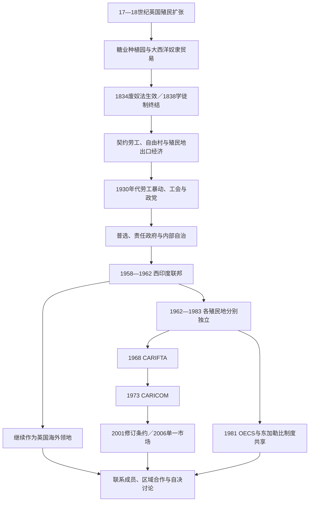

# 英属加勒比去殖民化与区域合作

## 时间

17世纪英国殖民扩张至今；重点为1834—1838年奴隶制终结、1930年代劳工运动、1958—1962年西印度联邦、1962—1983年独立浪潮和1973年至今的加勒比共同体。

## 概括

英属加勒比不是一个单一殖民地，而是由牙买加、巴巴多斯、特立尼达、背风群岛、向风群岛、巴哈马、英属圭亚那、英属洪都拉斯及多个小岛政权组成的行政拼图。英国以海军、特许公司、种植园、奴隶贸易和殖民议会控制这些地区，各殖民地在土地、人口、族群与自治程度上差异很大。1830年代废奴没有结束种植园权力；契约劳工、土地限制、低工资和不平等选举制度继续维持出口经济。

1930年代大萧条、劳工暴动和工会组织推动普选、政党与自治。西印度联邦试图把十个岛屿殖民地组成一个国家，却因税收、迁徙、代表权、联邦权力和大岛竞争而在1962年解体。此后多数殖民地分别独立：有的保留英国君主为本国君主，有的改为共和国；另一些岛屿选择或继续维持英国海外领土地位。

独立没有消除小规模市场、单一产业、债务、飓风和对外部交通金融的依赖。CARIFTA、CARICOM、OECS、东加勒比中央银行和加勒比法院等机构因此承担市场整合、外交协调、货币、司法、灾害与气候合作。区域合作不是“联邦失败后的替代口号”，而是在主权国家和非独立领地并存条件下持续谈判权力与资源的制度工程。

## 演进图

## 英国殖民体系的形成

### 征服、割让与行政拼图

英国在1620年代殖民圣基茨和巴巴多斯，1655年从西班牙夺取牙买加，随后控制巴哈马及背风、向风群岛的多个岛屿。特立尼达1797年被英国占领，1814年获正式割让；荷兰在南美北岸的殖民地于1814年归英国，1831年合并为英属圭亚那。英属洪都拉斯由伐木定居点发展，后来成为今天的伯利兹。

| 类型 | 代表地区 | 统治特点 |
|---|---|---|
| 早期定居与糖业殖民地 | 巴巴多斯、背风群岛、牙买加 | 白人种植园主议会较早形成，但参政权只属于极少数财产拥有者。 |
| 征服或割让殖民地 | 特立尼达、圣卢西亚、格林纳达 | 法国、西班牙、非洲与克里奥尔法律文化并存，英国逐步移植行政制度。 |
| 大陆殖民地 | 英属圭亚那、英属洪都拉斯 | 糖业、木材、边界争议和原住民土地关系比小岛更突出。 |
| 联合殖民行政 | 背风群岛、向风群岛 | 总督和联邦机构统筹部分事务，各岛仍保留不同议会和身份。 |
| 王室殖民地 | 1865年后的牙买加等 | 总督与殖民部直接控制增强，常以镇压危机后“改革治理”为理由。 |

殖民地总督代表英国王室，掌握行政、否决、任命和安全权；地方议会即使历史悠久，也长期被白人男性财产精英垄断。伦敦殖民部、驻岛总督、种植园议会、商人信贷和军队共同构成实际权力，不宜只用“英国政府统治”一笔带过。

### 糖业、奴隶制与抵抗

巴巴多斯17世纪的“糖业革命”把土地集中、资本密集型制糖和非洲奴隶劳动结合起来，随后影响牙买加和其他岛屿。英国商人运输被俘非洲人、粮食、木材和制成品，种植园生产糖、糖蜜、朗姆酒、咖啡和棉花。财富流向地主、商人、保险和港口金融体系，被奴役者则面对高死亡率、惩罚、家庭分离和法律人格剥夺。

抵抗贯穿整个时期：牙买加马龙社群通过战争与条约保持部分自治；1760年“塔基起义”、1816年巴巴多斯“布萨起义”、1823年德梅拉拉起义和1831—1832年牙买加“浸礼会战争”均动摇殖民秩序。传教网络、自由有色人种政治、英国废奴运动和被奴役者自身行动共同推动制度危机，不能把废奴写成伦敦单方面恩赐。

## 废奴后的社会重组

英国1807年禁止本国参与跨大西洋奴隶贸易，1834年《废奴法》生效，但多数前奴隶先被强制纳入“学徒制”，直到1838年才获得完全法律自由。英国政府向奴隶主支付巨额补偿，被奴役者及其后代没有获得同等赔偿或普遍土地分配。

### 土地、劳动与契约移民

种植园主通过控制土地、税收、流浪法和工资迫使被解放者继续劳动。与此同时，许多家庭购买边缘土地、建立“自由村”，发展小农、市场、宗教学校和迁徙网络。牙买加、巴巴多斯与小安的列斯的土地可得性不同，因此小农化程度也不同。

为补充低工资劳动力，殖民政府和种植园主从印度、马德拉、中国及其他地区招募契约劳工。印度契约移民在英属圭亚那和特立尼达规模尤其大，改变了宗教、语言、农业与选举政治。契约合同具有期限和法律工资，形式上不同于奴隶制，但招募欺骗、债务、惩罚性劳动法和性别失衡使其带有强制性。

### 莫兰特湾与王室殖民统治

1865年牙买加莫兰特湾抗议源于土地、司法、税收和政治排斥。总督爱德华·艾尔以戒严大规模处决、鞭打和焚毁村庄。镇压后，牙买加种植园议会放弃自治，转为王室殖民地；这既加强了专业行政和基础设施，也把黑人多数进一步排除在高层政治之外。事件揭示“自由劳动”社会仍以种族化暴力维持权力。

## 劳工运动与自治

大萧条使糖、香蕉和石油出口受挫，工资下降、失业和住房恶化。1934—1939年间伯利兹、圣基茨、圣文森特、特立尼达、巴巴多斯、牙买加和英属圭亚那相继发生罢工与骚乱。乌赖亚·巴特勒、亚历山大·布斯塔曼特、格兰特利·亚当斯、诺曼·曼利、切迪·贾根等劳工和政治领袖把工会、群众组织与政党连接起来。

英国成立莫因委员会调查社会状况。战争使完整报告延迟公开，但殖民发展资金、劳工法规和福利政策逐渐扩大。1940—1950年代，成年普选、部长制、责任政府和内部自治先后实施；政党不再只是精英俱乐部，而成为组织工人、农民、族群和中产利益的主要工具。

| 变化 | 旧制度 | 转型结果 | 局限 |
|---|---|---|---|
| 选举权 | 财产、收入和性别限制 | 成年普选逐步建立 | 选区划分、殖民总督保留权和资源不平等仍影响竞争。 |
| 行政 | 总督与任命官员主导 | 民选部长和首席部长取得国内事务权力 | 外交、防务、宪法和部分财政仍由伦敦控制。 |
| 劳工 | 雇主支配、工会受限 | 工会合法化并形成集体谈判 | 季节性就业和种植园依赖持续。 |
| 区域政治 | 殖民地各自向伦敦负责 | 联邦主义和跨岛政党网络发展 | 岛屿身份、距离和税收分配阻碍统一。 |

## 西印度联邦

### 建立

西印度联邦于1958年成立，成员为牙买加、特立尼达和多巴哥、巴巴多斯，以及背风与向风群岛的多个殖民地，共十个成员单元。格兰特利·亚当斯任联邦总理，海尔斯勋爵任总督。联邦拥有议会和内阁，但伦敦保留主权，联邦财政和行政权限有限，也没有在成立时获得清晰、快速的独立时间表。

### 结构矛盾

| 矛盾 | 表现 | 后果 |
|---|---|---|
| 财政 | 联邦缺乏强有力的独立税源，依靠成员缴款 | 无法有效推行发展和再分配。 |
| 代表权 | 牙买加人口最大，却认为议席不足；小岛担心被大岛支配 | 大岛与小岛都认为制度不公平。 |
| 人员流动 | 小岛希望开放迁徙，大岛担心就业和公共服务压力 | 共同市场和共同公民权推进困难。 |
| 首都与资源 | 特立尼达提供联邦驻地，却不愿长期承担高额成本 | 埃里克·威廉斯认为联邦对特立尼达负担过大。 |
| 党派组织 | 联邦党派与各殖民地本地政党并不完全重合 | 联邦选举难以产生稳定的共同政治认同。 |
| 独立路线 | 一派要求联邦整体独立，一派优先本岛主权 | 宪政谈判失去共同目标。 |

1961年牙买加公投决定退出；特立尼达和多巴哥随后拒绝在缺少牙买加的情况下继续承担联邦。联邦于1962年解体。失败不是加勒比社会“天然不能联合”，而是权力过弱、利益分配不清、缺少共同财政与公民制度以及英国去殖民时间表变化共同造成。

## 分别独立与政体选择

| 顺序 | 国家 | 独立时间 | 独立后的政体路径 | 重要转折 |
|---:|---|---|---|---|
| 1 | 牙买加 | 1962年8月6日 | 君主立宪制 | 两党竞争、出口转型、债务调整和侨民网络塑造政治。 |
| 2 | 特立尼达和多巴哥 | 1962年8月31日 | 1976年改为共和国 | 石油、天然气和多族群政党政治；1990年发生未遂政变。 |
| 3 | 圭亚那 | 1966年5月26日 | 1970年改为合作共和国 | 冷战干预、族群化党争、伯纳姆长期统治与1992年竞争性选举。 |
| 4 | 巴巴多斯 | 1966年11月30日 | 2021年改为共和国 | 议会制度延续，旅游、服务业与气候融资外交突出。 |
| 5 | 巴哈马 | 1973年7月10日 | 君主立宪制 | 多数统治运动、旅游和离岸金融成为主线。 |
| 6 | 格林纳达 | 1974年2月7日 | 君主立宪制 | 1979年革命、1983年内部政变与美国主导入侵后恢复议会选举。 |
| 7 | 多米尼克 | 1978年11月3日 | 独立时即为共和国 | 1979年政治危机、尤金妮娅·查尔斯政府和灾害韧性建设。 |
| 8 | 圣卢西亚 | 1979年2月22日 | 君主立宪制 | 两党交替、旅游和OECS制度共享。 |
| 9 | 圣文森特和格林纳丁斯 | 1979年10月27日 | 君主立宪制 | 2009年修宪公投未改共和制；2021年火山喷发重创社会。 |
| 10 | 安提瓜和巴布达 | 1981年11月1日 | 君主立宪制 | 巴布达土地、自主治理和飓风灾后重建争议持续。 |
| 11 | 伯利兹 | 1981年9月21日 | 君主立宪制 | 危地马拉领土主张使英国防务与国际司法路径长期重要。 |
| 12 | 圣基茨和尼维斯 | 1983年9月19日 | 联邦君主立宪制 | 尼维斯拥有自治岛政府；1998年脱离公投未达宪定三分之二门槛。 |

各国完整国家元首和政府首脑顺序见：[英属加勒比独立国家领导序列表](/%E4%BA%BA%E6%96%87%E7%A7%91%E5%AD%A6/%E5%8E%86%E5%8F%B2/%E7%BE%8E%E6%B4%B2/%E5%8A%A0%E5%8B%92%E6%AF%94/%E8%8B%B1%E5%B1%9E%E5%8A%A0%E5%8B%92%E6%AF%94%E7%8B%AC%E7%AB%8B%E5%9B%BD%E5%AE%B6%E9%A2%86%E5%AF%BC%E5%BA%8F%E5%88%97%E8%A1%A8.md)。

## 格林纳达革命与1983年危机

埃里克·盖里独立政府因威权、腐败指控和“猫鼬帮”暴力失去支持。1979年新宝石运动趁盖里出国发动几乎无血政变，莫里斯·毕晓普领导人民革命政府，暂停旧宪法，推动识字、医疗、妇女组织和基础设施，并与古巴合作修建机场。政府社会项目获得支持，但未恢复竞争性选举，权力集中和党内秘密决策引发矛盾。

1983年党内强硬派要求毕晓普与伯纳德·科尔德分享权力。毕晓普被软禁后获群众释放，随后与多名支持者被军队处决；哈德森·奥斯汀成立革命军事委员会并实施宵禁。美国以保护侨民、地区安全和东加勒比国家请求为理由，联合部分加勒比国家入侵。入侵推翻军政府，1984年恢复选举。危机同时包含革命内部权力斗争、冷战、宪政中断和外部军事干预，不应只写成“美国解放”或“社会主义被入侵”的单因叙事。

## 继续作为英国海外领地

并非所有英属加勒比殖民地都选择独立。安圭拉在1967年反对由圣基茨主导的联合国家，驱逐当地警察并要求恢复英国直接管理，1980年正式从圣基茨和尼维斯分离为单独属地。蒙特塞拉特1995年起的苏弗里耶尔火山喷发摧毁普利茅斯并造成大规模迁移，重塑财政和治理。百慕大、开曼和英属维尔京群岛发展金融与旅游；特克斯和凯科斯曾在2009—2012年因治理调查由英国暂停部分自治。

截至2026年7月，以下地区仍为英国海外领地：

| 领地 | 地方政府 | 英国代表 | 实际权力边界 |
|---|---|---|---|
| 安圭拉 | 民选议会与总理 | 总督 | 地方政府主管多数国内事务；总督保留外交、防务、内部安全和特定保留权。 |
| 百慕大 | 议会与总理，自治传统较强 | 总督 | 地方内阁权力广；英国保留主权、外交与防务。 |
| 英属维尔京群岛 | 议会与总理 | 总督 | 金融监管、治安和善治改革中，总督保留干预权限。 |
| 开曼群岛 | 议会与总理 | 总督 | 国内财政和经济政策高度自治，英国保留宪法与主权职能。 |
| 蒙特塞拉特 | 立法议会与总理 | 总督 | 火山灾后人口和财政规模缩小，对英国预算援助依赖较高。 |
| 特克斯和凯科斯群岛 | 众议院与总理 | 总督 | 2012年恢复民选自治；总督继续掌握若干保留领域。 |

它们不是英国议会中的普通地方行政区，也不是主权国家。宪法由英国枢密院令、领地法律和政治惯例共同构成；总督有时仅按内阁建议行事，有时在警务、公共财政或“善治”领域拥有实质权力。

## 区域一体化

### 从CARIFTA到CARICOM

1965年安提瓜、巴巴多斯和英属圭亚那签署迪金森湾协议，1968年加勒比自由贸易协会开始运作，随后吸纳更多国家。自由贸易区降低区域商品壁垒，却缺乏共同对外关税和更广泛政策协调。1973年巴巴多斯、圭亚那、牙买加、特立尼达和多巴哥签署《查瓜拉马斯条约》，建立加勒比共同体和共同市场。

2001年《修订查瓜拉马斯条约》把单一市场与经济纳入共同体法律，2006年加勒比单一市场正式启动。商品、服务、资本、企业设立和特定技能类别人员流动逐步扩大，但各国执行速度、行政容量和利益不同，距离完整单一经济仍有差距。

### OECS、货币与司法共享

东加勒比国家组织于1981年成立，成员中的多数小岛共享东加勒比最高法院、东加勒比中央银行和东加勒比元。2010年《修订巴斯特尔条约》加强经济联盟和人员流动。OECS说明小国可以在保留主权的同时，把货币、法院、民航、采购和外交代表等职能制度化共享。

加勒比法院2005年启用，既负责解释CARICOM条约，也可在接受其终审管辖的国家取代英国枢密院。各国是否采用其上诉管辖权并不一致，反映殖民司法遗产、修宪门槛、国内信任与区域主权之间的争论。

### 截至2026年7月的CARICOM

| 类别 | 数量与成员 | 说明 |
|---|---|---|
| 正式成员 | 15个：安提瓜和巴布达、巴哈马、巴巴多斯、伯利兹、多米尼克、格林纳达、圭亚那、海地、牙买加、蒙特塞拉特、圣基茨和尼维斯、圣卢西亚、圣文森特和格林纳丁斯、苏里南、特立尼达和多巴哥 | 蒙特塞拉特虽非主权国家，却是正式成员；巴哈马未全面参加单一市场。 |
| 联系成员 | 8个：安圭拉、百慕大、英属维尔京群岛、开曼群岛、特克斯和凯科斯、库拉索、马提尼克、法属圭亚那 | 马提尼克会籍自2026年6月16日生效；法属圭亚那于2026年7月7日成为第八个联系成员。 |
| 主要机关 | 政府首脑会议、共同体部长理事会、秘书处等 | 国家在正式机关中原则上地位平等，但执行依赖各国国内法与行政。 |
| 相关制度 | CSME、加勒比法院、加勒比灾害应急管理局、加勒比公共卫生署等 | 覆盖贸易、司法、灾害、卫生、安全和外交协调。 |

CARICOM并不等于“英联邦加勒比俱乐部”：海地、苏里南以及新的法属联系成员扩大了语言和法律多样性。它也不是超国家联邦，秘书处不能像主权政府一样直接在所有成员领土执行政策。

## 截至2026年7月的独立国家权力结构

| 国家 | 国家元首形式 | 政府首脑 | 实际权力说明 |
|---|---|---|---|
| 安提瓜和巴布达 | 查理三世为本国君主，总督代行礼仪与宪法职能 | 加斯顿·布朗 | 总理及对议会负责的内阁掌握日常行政。 |
| 巴哈马 | 查理三世为本国君主，总督代行职能 | 菲利普·戴维斯 | 议会多数政府执政；2026年选举后继续任总理。 |
| 巴巴多斯 | 总统杰弗里·博斯蒂克 | 米娅·莫特利 | 总统主要承担礼仪和宪法保障，内阁掌握行政。 |
| 伯利兹 | 查理三世为本国君主，总督代行职能 | 约翰·布里塞尼奥 | 总理及内阁负责行政；边界和防务仍有重要国际维度。 |
| 多米尼克 | 议会选出的总统 | 罗斯福·斯凯里特 | 总统主要为礼仪元首，总理依议会多数执政。 |
| 格林纳达 | 查理三世为本国君主，总督代行职能 | 迪肯·米切尔 | 1983年后恢复威斯敏斯特式议会政府。 |
| 圭亚那 | 民选总统 | 总统为主要行政首脑；总理马克·菲利普斯协助 | 总统兼国家元首和实际政府核心，总理不是与总统并列的最高行政者。 |
| 牙买加 | 查理三世为本国君主，总督代行职能 | 安德鲁·霍尔尼斯 | 总理及内阁掌握行政，共和制改革仍为政治议题。 |
| 圣基茨和尼维斯 | 查理三世为本国君主，总督代行职能 | 特伦斯·德鲁 | 联邦总理执政；尼维斯另有岛议会和总理。 |
| 圣卢西亚 | 查理三世为本国君主，总督代行职能 | 菲利普·皮埃尔 | 议会内阁制；参与OECS共同制度。 |
| 圣文森特和格林纳丁斯 | 查理三世为本国君主，总督代行职能 | 戈德温·弗赖迪 | 2025年政党轮替后就任；内阁对议会负责。 |
| 特立尼达和多巴哥 | 议会间接选出的总统克里斯廷·坎加卢 | 卡姆拉·佩萨德-比塞萨 | 总统主要承担礼仪与保留权，总理及内阁掌握日常行政。 |

## 去殖民化与区域合作的因果分析

| 类型 | 推动独立与自治 | 限制联邦与一体化 | 当代延续 |
|---|---|---|---|
| 结构因素 | 殖民教育扩大、城市化、工人和小农形成群众政治 | 岛屿规模、距离、产业差异与税基悬殊 | 小市场和外部冲击使共享制度仍有必要。 |
| 社会动员 | 1930年代罢工、工会、政党、普选运动 | 政党主要在本岛组织，跨岛共同选民身份较弱 | 劳工、侨民、青年与修复正义继续推动区域议题。 |
| 帝国环境 | 二战后英国财政和殖民合法性下降 | 英国给予联邦权限有限，又允许大岛分别独立 | 英国海外领地仍在自治与保留权之间谈判。 |
| 直接触发 | 牙买加公投、各地宪政会议和选举胜利 | 牙买加退出和特立尼达拒绝承担剩余联邦成本 | 飓风、疫情、债务和气候融资促成务实合作。 |
| 制度选择 | 君主制或共和国均可配合议会民主 | 主权敏感使成员不愿轻易让渡执行权 | CARICOM、OECS和共同法院以分层方式整合。 |

## 关键辨析

- “英属西印度”是历史殖民概念，不等于今天所有英语加勒比国家，也不包括每一个CARICOM成员。
- 1834年不是所有被奴役者立即获得完全自由；学徒制到1838年才终结。
- 西印度联邦是仍在英国主权下通往独立的联邦实验，不是已经独立的加勒比合众国。
- 保留英国君主不等于仍是英国殖民地；牙买加、巴哈马等是主权国家，君主在法律上分别以各国王位身份存在。
- 英国海外领地有民选地方政府，但外交、防务和若干保留事项仍由英国负责，因此不具完整外部主权。
- CARICOM、OECS、英联邦和加勒比国家联盟是不同组织，成员、权限和目标不能互换。

## 演变关系

- 殖民与奴隶制背景：[加勒比原住民与殖民种植园](/%E4%BA%BA%E6%96%87%E7%A7%91%E5%AD%A6/%E5%8E%86%E5%8F%B2/%E7%BE%8E%E6%B4%B2/%E5%8A%A0%E5%8B%92%E6%AF%94/%E5%8A%A0%E5%8B%92%E6%AF%94%E5%8E%9F%E4%BD%8F%E6%B0%91%E4%B8%8E%E6%AE%96%E6%B0%91%E7%A7%8D%E6%A4%8D%E5%9B%AD.md)。
- 法语加勒比：[海地革命与法属加勒比](/%E4%BA%BA%E6%96%87%E7%A7%91%E5%AD%A6/%E5%8E%86%E5%8F%B2/%E7%BE%8E%E6%B4%B2/%E5%8A%A0%E5%8B%92%E6%AF%94/%E6%B5%B7%E5%9C%B0%E9%9D%A9%E5%91%BD%E4%B8%8E%E6%B3%95%E5%B1%9E%E5%8A%A0%E5%8B%92%E6%AF%94.md)。
- 区域总览：[加勒比历史](/%E4%BA%BA%E6%96%87%E7%A7%91%E5%AD%A6/%E5%8E%86%E5%8F%B2/%E7%BE%8E%E6%B4%B2/%E5%8A%A0%E5%8B%92%E6%AF%94/README.md)。
- 跨区域殖民比较：[欧洲殖民帝国与美洲](/%E4%BA%BA%E6%96%87%E7%A7%91%E5%AD%A6/%E5%8E%86%E5%8F%B2/%E7%BE%8E%E6%B4%B2/%E6%AE%96%E6%B0%91%E4%B8%8E%E7%8B%AC%E7%AB%8B/%E6%AC%A7%E6%B4%B2%E6%AE%96%E6%B0%91%E5%B8%9D%E5%9B%BD%E4%B8%8E%E7%BE%8E%E6%B4%B2.md)。
