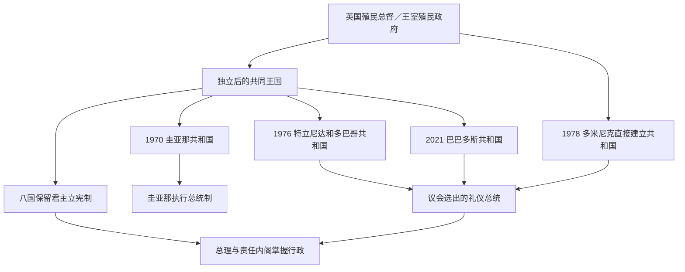

# 英属加勒比独立国家领导序列表

## 时间

1962年至2026年7月14日。表中“英属加勒比”指从英国殖民体系独立、以英语和英语克里奥尔语为主要公共语言的加勒比国家，也包括位于大陆的伯利兹和圭亚那。

## 概括

十二个国家独立后采用三种国家元首结构：

- 牙买加、巴哈马、伯利兹、格林纳达、圣卢西亚、圣文森特和格林纳丁斯、安提瓜和巴布达、圣基茨和尼维斯保留共同王国制度；英国君主分别以各国君主身份任国家元首，总督为本国任命程序下的代表。
- 特立尼达和多巴哥、圭亚那、巴巴多斯先以君主立宪制独立，后改为共和国。
- 多米尼克1978年独立时即建立议会共和国。

除圭亚那总统兼掌实际行政权外，其余多数国家由总理和对议会负责的内阁掌握日常行政。总统或总督在正常情况下主要履行礼仪和宪法保障职能，但在悬峙议会、总理死亡、政府失去多数或紧急状态下可能行使保留权。

## 国家元首制度演变图

## 共同王国的完整君主序列

这些国家的王位在法律上彼此独立，虽然由同一人担任。伊丽莎白二世和查理三世不是以“英国君主统治外国”的方式在位，而是分别具有牙买加国王、巴哈马国王等本国法律身份。

| 国家 | 伊丽莎白二世在位 | 查理三世在位 | 截至2026年7月的总督 | 政府首脑 |
|---|---|---|---|---|
| 牙买加 | 1962年8月6日—2022年9月8日 | 2022年9月8日—至今 | 帕特里克·艾伦 | 安德鲁·霍尔尼斯 |
| 巴哈马 | 1973年7月10日—2022年9月8日 | 2022年9月8日—至今 | 辛西娅·普拉特 | 菲利普·戴维斯 |
| 格林纳达 | 1974年2月7日—2022年9月8日 | 2022年9月8日—至今 | 塞茜尔·拉格雷纳德 | 迪肯·米切尔 |
| 圣卢西亚 | 1979年2月22日—2022年9月8日 | 2022年9月8日—至今 | 埃罗尔·查尔斯 | 菲利普·皮埃尔 |
| 圣文森特和格林纳丁斯 | 1979年10月27日—2022年9月8日 | 2022年9月8日—至今 | 苏珊·杜根 | 戈德温·弗赖迪 |
| 伯利兹 | 1981年9月21日—2022年9月8日 | 2022年9月8日—至今 | 弗罗伊拉·察拉姆 | 约翰·布里塞尼奥 |
| 安提瓜和巴布达 | 1981年11月1日—2022年9月8日 | 2022年9月8日—至今 | 罗德尼·威廉斯 | 加斯顿·布朗 |
| 圣基茨和尼维斯 | 1983年9月19日—2022年9月8日 | 2022年9月8日—至今 | 马塞拉·利伯德 | 特伦斯·德鲁 |

总督不是英国政府派驻的殖民总督。形式上由君主依该国总理建议任命，并按该国宪法行事；外交、防务和立法权属于本国政府与议会。

## 改制为共和国的国家元首

### 圭亚那

圭亚那1966年独立时由伊丽莎白二世任女王，1970年改为共和国。1970—1980年的总统主要为礼仪元首；1980年宪法建立执行总统制，此后总统兼国家元首和实际政府核心，总理是总统的首席助手与国民议会政府事务领导人，不是最高行政首脑。

| 顺序 | 国家元首 | 职位 | 在位 | 继承与关键事件 |
|---:|---|---|---|---|
| 1 | 伊丽莎白二世 | 圭亚那女王 | 1966年5月26日—1970年2月23日 | 独立宪法下的国家元首，由总督代表。 |
| 2 | 阿瑟·钟 | 礼仪总统 | 1970年2月23日—1980年10月6日 | 共和国成立后由议会选出。 |
| 3 | **福布斯·伯纳姆** | 执行总统 | 1980年10月6日—1985年8月6日 | 从总理转任新宪法下执行总统；任内去世。 |
| 4 | 德斯蒙德·霍伊特 | 执行总统 | 1985年8月6日—1992年10月9日 | 依继承规则接任，后在1992年选举中败北。 |
| 5 | **切迪·贾根** | 执行总统 | 1992年10月9日—1997年3月6日 | 竞争性选举实现政党轮替；任内去世。 |
| 6 | 塞缪尔·海因兹 | 执行总统 | 1997年3月6日—12月19日 | 以总理身份依宪法继任，向选举产生的珍妮特·贾根交权。 |
| 7 | 珍妮特·贾根 | 执行总统 | 1997年12月19日—1999年8月11日 | 圭亚那首位女性总统；因健康原因辞职。 |
| 8 | **巴拉特·贾格迪奥** | 执行总统 | 1999年8月11日—2011年12月3日 | 先由总理继任，后赢得选举；完成两届民选任期。 |
| 9 | 唐纳德·拉莫塔尔 | 执行总统 | 2011年12月3日—2015年5月16日 | 人民进步党继承；在2015年选举中败北。 |
| 10 | 戴维·格兰杰 | 执行总统 | 2015年5月16日—2020年8月2日 | 反对党联盟获胜；2018年不信任案及2020年计票争议延迟交接。 |
| 11 | **穆罕默德·伊尔凡·阿里** | 执行总统 | 2020年8月2日—至今 | 2025年连任；截至2026年7月在任。 |

### 特立尼达和多巴哥

| 顺序 | 国家元首 | 职位 | 在位 | 继承与关键事件 |
|---:|---|---|---|---|
| 1 | 伊丽莎白二世 | 特立尼达和多巴哥女王 | 1962年8月31日—1976年8月1日 | 独立共同王国时期，由总督代表。 |
| 2 | **埃利斯·克拉克** | 总统 | 1976年8月1日—1987年3月19日 | 末任总督转任首任总统；议会选举团选出。 |
| 3 | 努尔·哈桑纳利 | 总统 | 1987年3月20日—1997年3月17日 | 完成两个五年任期。 |
| 4 | A·N·R·罗宾逊 | 总统 | 1997年3月19日—2003年3月17日 | 前总理；在2001年悬峙选举后任命曼宁组阁，引发保留权讨论。 |
| 5 | 乔治·马克斯韦尔·理查兹 | 总统 | 2003年3月17日—2013年3月17日 | 完成两个任期。 |
| 6 | 安东尼·卡莫纳 | 总统 | 2013年3月18日—2018年3月19日 | 由选举团选出。 |
| 7 | 保拉-梅·威克斯 | 总统 | 2018年3月19日—2023年3月20日 | 该国首位女性总统。 |
| 8 | **克里斯廷·坎加卢** | 总统 | 2023年3月20日—至今 | 截至2026年7月在任。 |

### 巴巴多斯

| 顺序 | 国家元首 | 职位 | 在位 | 继承与关键事件 |
|---:|---|---|---|---|
| 1 | 伊丽莎白二世 | 巴巴多斯女王 | 1966年11月30日—2021年11月30日 | 独立共同王国时期，由总督代表。 |
| 2 | **桑德拉·梅森** | 总统 | 2021年11月30日—2025年11月30日 | 末任总督转任首任总统；共和国成立。 |
| 3 | **杰弗里·博斯蒂克** | 总统 | 2025年11月30日—至今 | 议会依宪法程序选出；截至2026年7月在任。 |

### 多米尼克

多米尼克官方名录把1979年政治危机中的代理元首单独列出，因此下表不以正式当选总统编号掩盖实际交接。

| 顺序 | 国家元首 | 职位 | 在位 | 继承与关键事件 |
|---:|---|---|---|---|
| 1 | 路易·库尔斯-拉蒂格 | 临时总统 | 1978年11月3日—1979年1月 | 独立前总督，按过渡条款代理至首任总统选出。 |
| 2 | 弗雷德里克·德加松 | 总统 | 1979年 | 首任当选总统；政治危机中离境，无法正常履职。 |
| — | J·B·M·阿穆尔 | 代总统 | 1979—1980年 | 在德加松不能履职及辞职过渡期代行职权。 |
| 3 | 奥勒留斯·马里 | 总统 | 1980—1983年 | 议会选出，恢复常态任期。 |
| 4 | 克拉伦斯·塞尼奥雷 | 总统 | 1983—1993年 | 完成两个任期。 |
| 5 | 克里斯平·索兰多 | 总统 | 1993—1998年 | 议会选出。 |
| 6 | 弗农·肖 | 总统 | 1998—2003年 | 完成一届任期。 |
| 7 | 尼古拉斯·利物浦 | 总统 | 2003—2012年 | 第二任期内因健康原因辞职。 |
| 8 | 埃利乌德·威廉斯 | 总统 | 2012—2013年 | 完成利物浦余下过渡并任至新总统就职。 |
| 9 | 查尔斯·萨瓦林 | 总统 | 2013—2023年 | 完成两个任期。 |
| 10 | **西尔瓦妮·伯顿** | 总统 | 2023年—至今 | 该国首位女性且首位原住民出身总统；截至2026年7月在任。 |

## 历届政府首脑

### 牙买加

| 顺序 | 总理 | 任期 | 继承与重要事件 |
|---:|---|---|---|
| 1 | **亚历山大·布斯塔曼特** | 1962—1967年 | 独立时总理；牙买加工党领袖。 |
| 2 | 唐纳德·桑斯特 | 1967年2—4月 | 接替退休的布斯塔曼特，任内病逝。 |
| 3 | 休·希勒 | 1967—1972年 | 工党政府延续，任期届满后选举失利。 |
| 4 | **迈克尔·曼利** | 1972—1980年 | 推动民主社会主义和不结盟外交；经济与政治暴力压力下败选。 |
| 5 | 爱德华·西加 | 1980—1989年 | 市场化和亲美路线，后败于曼利。 |
| 4再 | 迈克尔·曼利 | 1989—1992年 | 回归后调整经济路线；因健康退休。 |
| 6 | P·J·帕特森 | 1992—2006年 | 接替曼利并连续赢得选举。 |
| 7 | 波蒂娅·辛普森-米勒 | 2006—2007年 | 牙买加首位女性总理；首次短任。 |
| 8 | 布鲁斯·戈尔丁 | 2007—2011年 | 工党胜选；蒂沃利花园危机后辞职。 |
| 9 | **安德鲁·霍尔尼斯** | 2011—2012年 | 接替戈尔丁，提前选举失利。 |
| 7再 | 波蒂娅·辛普森-米勒 | 2012—2016年 | 第二次执政，2016年败选。 |
| 9再 | **安德鲁·霍尔尼斯** | 2016年—至今 | 2025年再次赢得选举；截至2026年7月在任。 |

### 特立尼达和多巴哥

| 顺序 | 总理 | 任期 | 继承与重要事件 |
|---:|---|---|---|
| 1 | **埃里克·威廉斯** | 1962—1981年 | 独立建国总理；能源国家和共和国改制，任内去世。 |
| 2 | 乔治·钱伯斯 | 1981—1986年 | 接替威廉斯；油价下跌后选举失败。 |
| 3 | A·N·R·罗宾逊 | 1986—1991年 | 反对党联盟胜选；1990年遭伊斯兰大会党未遂政变。 |
| 4 | 帕特里克·曼宁 | 1991—1995年 | 第一次任期，提前选举后失去多数。 |
| 5 | 巴斯德奥·潘戴 | 1995—2001年 | 首位印度裔总理；联盟政治与党内分裂。 |
| 4再 | **帕特里克·曼宁** | 2001—2010年 | 2001年平票危机后获总统任命，随后赢得选举；2010年败选。 |
| 6 | **卡姆拉·佩萨德-比塞萨** | 2010—2015年 | 首位女性总理；人民伙伴联盟执政。 |
| 7 | 基思·罗利 | 2015—2025年3月 | 连任后在任期末退休。 |
| 8 | 斯图尔特·扬 | 2025年3—5月 | 接替罗利并提前选举，任期约六周。 |
| 6再 | **卡姆拉·佩萨德-比塞萨** | 2025年5月—至今 | 联合民族大会赢得选举；截至2026年7月在任。 |

### 巴巴多斯

| 顺序 | 总理 | 任期 | 继承与重要事件 |
|---:|---|---|---|
| 1 | **埃罗尔·巴罗** | 1966—1976年 | 独立建国总理，推动教育和区域一体化。 |
| 2 | 汤姆·亚当斯 | 1976—1985年 | 发展服务业；任内去世。 |
| 3 | 哈罗德·伯纳德·圣约翰 | 1985—1986年 | 接替亚当斯，随后败选。 |
| 1再 | 埃罗尔·巴罗 | 1986—1987年 | 再次执政，任内去世。 |
| 4 | 劳埃德·厄斯金·桑迪福德 | 1987—1994年 | 继任后面对经济紧缩，失去议会支持。 |
| 5 | 欧文·阿瑟 | 1994—2008年 | 连续执政三届，推进经济和区域单一市场。 |
| 6 | 戴维·汤普森 | 2008—2010年 | 民主工党胜选；任内病逝。 |
| 7 | 弗罗因德尔·斯图尔特 | 2010—2018年 | 接任并赢得2013年选举，2018年惨败。 |
| 8 | **米娅·莫特利** | 2018年—至今 | 推动2021年共和改制和气候融资；2026年连任。 |

### 圭亚那

圭亚那1980年后由执行总统担任实际政府首脑。下表仍列法定总理，以区分总统与协助行政、领导议会事务的职位。

| 顺序 | 总理 | 任期 | 国家元首与备注 |
|---:|---|---|---|
| 1 | **福布斯·伯纳姆** | 1966—1980年 | 女王、后礼仪总统时期的政府首脑；1980年转任执行总统。 |
| 2 | 托勒密·里德 | 1980—1984年 | 总统伯纳姆的首席助手。 |
| 3 | 德斯蒙德·霍伊特 | 1984—1985年 | 伯纳姆去世后继任总统。 |
| 4 | 汉密尔顿·格林 | 1985—1992年 | 总统霍伊特任内。 |
| 5 | **塞缪尔·海因兹** | 1992年—1997年3月 | 总统切迪·贾根任内；贾根去世后继任总统。 |
| 6 | 珍妮特·贾根 | 1997年3—12月 | 总统海因兹任内；随后当选总统。 |
| 5再 | 塞缪尔·海因兹 | 1997年12月—1999年8月 | 总统珍妮特·贾根任内。 |
| 7 | 巴拉特·贾格迪奥 | 1999年8月9—11日 | 仅两日；珍妮特辞职后依继承规则转任总统。 |
| 5三 | **塞缪尔·海因兹** | 1999年8月—2015年5月 | 先后辅佐总统贾格迪奥与拉莫塔尔。 |
| 8 | 摩西·纳加穆图 | 2015—2020年 | 总统格兰杰任内。 |
| 9 | **马克·菲利普斯** | 2020年—至今 | 总统伊尔凡·阿里任内；截至2026年7月在任。 |

### 巴哈马

| 顺序 | 总理 | 任期 | 继承与重要事件 |
|---:|---|---|---|
| 1 | **林登·平德林** | 1973—1992年 | 独立建国总理；多数统治运动领袖。 |
| 2 | 休伯特·英格拉哈姆 | 1992—2002年 | 结束平德林长期执政。 |
| 3 | 佩里·克里斯蒂 | 2002—2007年 | 首次任期。 |
| 2再 | 休伯特·英格拉哈姆 | 2007—2012年 | 第二次执政，随后败选。 |
| 3再 | 佩里·克里斯蒂 | 2012—2017年 | 第二次执政。 |
| 4 | 休伯特·明尼斯 | 2017—2021年 | 任内经历飓风多里安和新冠疫情。 |
| 5 | **菲利普·戴维斯** | 2021年—至今 | 2026年选举后继续执政；截至7月在任。 |

### 格林纳达

| 顺序 | 政府首脑或实际最高行政机关 | 任期 | 政体与重要事件 |
|---:|---|---|---|
| 1 | 埃里克·盖里 | 1974—1979年3月 | 独立总理；新宝石运动政变中被推翻。 |
| 2 | **莫里斯·毕晓普** | 1979年3月—1983年10月 | 人民革命政府总理；党内冲突中被处决。 |
| — | 哈德森·奥斯汀领导的革命军事委员会 | 1983年10月19—25日 | 暂停政治活动并实施军事统治；美国主导入侵后瓦解。 |
| — | 尼古拉斯·布雷思韦特领导的临时咨询委员会 | 1983—1984年 | 由总督任命的过渡行政，组织选举。 |
| 3 | 赫伯特·布莱兹 | 1984—1989年 | 恢复议会政府；任内去世。 |
| 4 | 本·琼斯 | 1989—1990年 | 接替布莱兹完成过渡。 |
| 5 | 尼古拉斯·布雷思韦特 | 1990—1995年 | 经选举任总理。 |
| 6 | 乔治·布里赞 | 1995年2—6月 | 大选前短期继任。 |
| 7 | **基思·米切尔** | 1995—2008年 | 新民族党长期执政。 |
| 8 | 蒂尔曼·托马斯 | 2008—2013年 | 全国民主大会执政。 |
| 7再 | 基思·米切尔 | 2013—2022年 | 第二阶段执政。 |
| 9 | **迪肯·米切尔** | 2022年—至今 | 全国民主大会胜选；截至2026年7月在任。 |

### 多米尼克

| 顺序 | 总理 | 任期 | 继承与重要事件 |
|---:|---|---|---|
| 1 | 帕特里克·约翰 | 1978—1979年6月 | 独立时总理；政治危机和议会不信任后离任。 |
| 2 | 奥利弗·塞拉芬 | 1979年6月—1980年7月 | 临时政府，组织大选并处理飓风戴维灾后。 |
| 3 | **尤金妮娅·查尔斯** | 1980—1995年 | 加勒比首位女性政府首脑；连续执政十五年。 |
| 4 | 爱迪生·詹姆斯 | 1995—2000年2月 | 联合工人党胜选。 |
| 5 | 罗西·道格拉斯 | 2000年2—10月 | 劳工党政府，任内去世。 |
| 6 | 皮埃尔·查尔斯 | 2000年10月—2004年1月 | 接替道格拉斯，任内去世。 |
| — | 奥斯本·里维耶尔 | 2004年1月6—8日 | 两日代理。 |
| 7 | **罗斯福·斯凯里特** | 2004年1月—至今 | 多次赢得选举；截至2026年7月在任。 |

### 圣卢西亚

| 顺序 | 总理 | 任期 | 继承与重要事件 |
|---:|---|---|---|
| 1 | **约翰·康普顿** | 1979年2—7月 | 独立时总理，首次独立后任期。 |
| 2 | 艾伦·路易西 | 1979—1981年 | 工党胜选，党内分裂后辞职。 |
| 3 | 温斯顿·塞纳克 | 1981—1982年1月 | 政府失去稳定支持后辞职。 |
| — | 迈克尔·皮尔格里姆 | 1982年1—5月 | 代理总理，组织提前选举。 |
| 1再 | **约翰·康普顿** | 1982—1996年 | 连续执政，后退休。 |
| 4 | 沃恩·刘易斯 | 1996—1997年 | 接替康普顿，次年败选。 |
| 5 | 肯尼·安东尼 | 1997—2006年 | 工党执政。 |
| 1三 | 约翰·康普顿 | 2006—2007年 | 复出胜选，任内去世。 |
| 6 | 斯蒂芬森·金 | 2007—2011年 | 接替康普顿。 |
| 5再 | 肯尼·安东尼 | 2011—2016年 | 第二阶段执政。 |
| 7 | 艾伦·沙塔内 | 2016—2021年 | 联合工人党执政。 |
| 8 | **菲利普·皮埃尔** | 2021年—至今 | 工党胜选；截至2026年7月在任。 |

### 圣文森特和格林纳丁斯

| 顺序 | 总理 | 任期 | 继承与重要事件 |
|---:|---|---|---|
| 1 | 米尔顿·卡托 | 1979—1984年 | 独立建国总理。 |
| 2 | **詹姆斯·米切尔** | 1984—2000年 | 新民主党长期执政，退休后交权。 |
| 3 | 阿恩希姆·尤斯塔斯 | 2000—2001年 | 接替米切尔，次年败选。 |
| 4 | **拉尔夫·冈萨尔维斯** | 2001—2025年 | 连续五次胜选；任内经历2021年苏弗里耶尔火山喷发。 |
| 5 | **戈德温·弗赖迪** | 2025年11月—至今 | 新民主党实现政党轮替；截至2026年7月在任。 |

### 安提瓜和巴布达

| 顺序 | 总理 | 任期 | 继承与重要事件 |
|---:|---|---|---|
| 1 | **维尔·伯德** | 1981—1994年 | 独立建国总理；伯德家族与工党长期统治。 |
| 2 | 莱斯特·伯德 | 1994—2004年 | 接替父亲；2004年败选。 |
| 3 | 鲍德温·斯潘塞 | 2004—2014年 | 联合进步党结束伯德家族连续执政。 |
| 4 | **加斯顿·布朗** | 2014年—至今 | 2026年选举后继续执政；截至7月在任。 |

### 伯利兹

| 顺序 | 总理 | 任期 | 继承与重要事件 |
|---:|---|---|---|
| 1 | **乔治·卡德尔·普赖斯** | 1981—1984年 | 独立建国总理；人民联合党领袖。 |
| 2 | 曼努埃尔·埃斯基韦尔 | 1984—1989年 | 民主党首次执政。 |
| 1再 | 乔治·普赖斯 | 1989—1993年 | 第二阶段执政。 |
| 2再 | 曼努埃尔·埃斯基韦尔 | 1993—1998年 | 第二阶段执政。 |
| 3 | 赛义德·穆萨 | 1998—2008年 | 人民联合党连续执政两届。 |
| 4 | 迪安·巴罗 | 2008—2020年 | 民主党连续执政三届。 |
| 5 | **约翰·布里塞尼奥** | 2020年—至今 | 2025年连任；截至2026年7月在任。 |

### 圣基茨和尼维斯

| 顺序 | 总理 | 任期 | 继承与重要事件 |
|---:|---|---|---|
| 1 | **肯尼迪·西蒙兹** | 1983—1995年 | 独立建国总理，联邦制度下与尼维斯岛政府并存。 |
| 2 | **登齐尔·道格拉斯** | 1995—2015年 | 工党连续执政二十年。 |
| 3 | 蒂莫西·哈里斯 | 2015—2022年 | 团结联盟执政；联盟瓦解后提前选举。 |
| 4 | **特伦斯·德鲁** | 2022年—至今 | 工党重新执政；截至2026年7月在任。 |

## 权力结构辨析

| 制度 | 国家元首 | 政府首脑 | 实际权力 |
|---|---|---|---|
| 共同王国议会制 | 本国君主，由总督代表 | 总理 | 总理和责任内阁掌握日常行政；总督在特定宪法危机中保留有限裁量。 |
| 议会共和国 | 议会选举的总统 | 总理 | 多米尼克、巴巴多斯、特立尼达和多巴哥均以总理和内阁为行政核心。 |
| 执行总统制 | 总统 | 总统为实际政府首脑；另设总理 | 圭亚那总统掌握行政，总理主要协助总统并领导议会政府事务。 |
| 革命或军事过渡 | 总督或名义国家元首可能仍在 | 革命政府、军事委员会或临时委员会 | 格林纳达1979—1984年不能用普通议会内阁表解释，须按事实权力机关列出。 |

## 连续性说明

- 多次任职者分别列出每一段任期，避免把中间的政党轮替吞并。
- 君主制国家的总督不是国家元首世系中的另一个君主，也不是英国殖民总督；表中列现任总督用于说明代行角色。
- 圭亚那1980年后总统兼具国家元首和实际政府首脑权力，因此同时列总统与总理，但不能把总理误写成最高领导人。
- 格林纳达1983年10月没有正常总理继承：毕晓普遇害后由革命军事委员会掌权，随后由临时咨询委员会恢复选举。
- 多米尼克1979年的当选总统、代理总统和总理危机部分重叠；短期代理也列出，以保持权力连续性。
- 截至2026年7月的现任人物已考虑2025—2026年牙买加、圭亚那、圣文森特和格林纳丁斯、特立尼达和多巴哥、巴巴多斯、安提瓜和巴布达及巴哈马等近期选举或交接。

## 相关笔记

- 主笔记：[英属加勒比去殖民化与区域合作](/%E4%BA%BA%E6%96%87%E7%A7%91%E5%AD%A6/%E5%8E%86%E5%8F%B2/%E7%BE%8E%E6%B4%B2/%E5%8A%A0%E5%8B%92%E6%AF%94/%E8%8B%B1%E5%B1%9E%E5%8A%A0%E5%8B%92%E6%AF%94%E5%8E%BB%E6%AE%96%E6%B0%91%E5%8C%96%E4%B8%8E%E5%8C%BA%E5%9F%9F%E5%90%88%E4%BD%9C.md)。
- 区域总览：[加勒比历史](/%E4%BA%BA%E6%96%87%E7%A7%91%E5%AD%A6/%E5%8E%86%E5%8F%B2/%E7%BE%8E%E6%B4%B2/%E5%8A%A0%E5%8B%92%E6%AF%94/README.md)。
- 殖民比较：[欧洲殖民帝国与美洲](/%E4%BA%BA%E6%96%87%E7%A7%91%E5%AD%A6/%E5%8E%86%E5%8F%B2/%E7%BE%8E%E6%B4%B2/%E6%AE%96%E6%B0%91%E4%B8%8E%E7%8B%AC%E7%AB%8B/%E6%AC%A7%E6%B4%B2%E6%AE%96%E6%B0%91%E5%B8%9D%E5%9B%BD%E4%B8%8E%E7%BE%8E%E6%B4%B2.md)。
