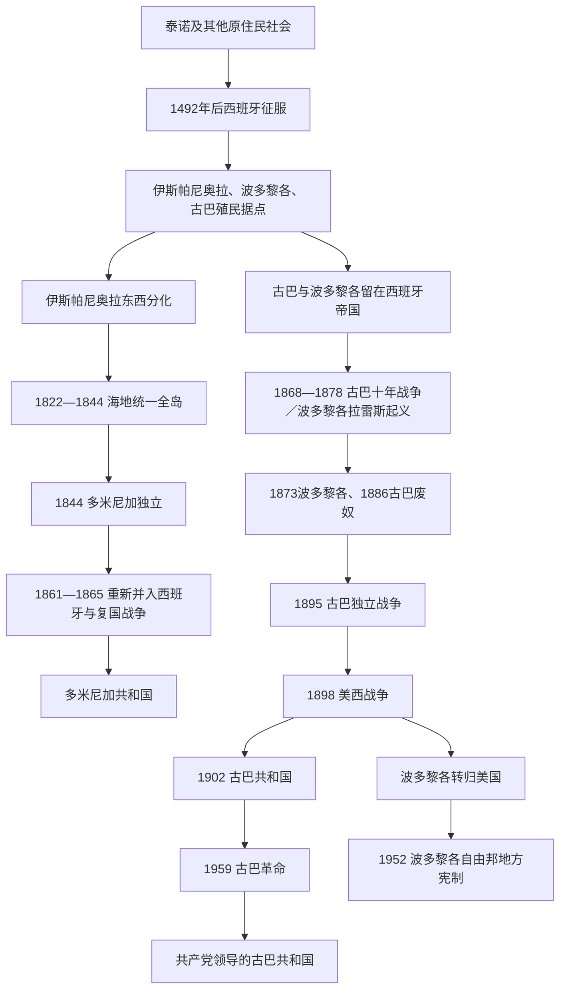

# 西班牙加勒比与古巴

## 时间

1492年至今；重点为西班牙殖民体系、19世纪独立与废奴、1898年美西战争，以及古巴、波多黎各和多米尼加共和国的分化道路。

## 概括

伊斯帕尼奥拉、波多黎各和古巴是西班牙在美洲最早建立殖民统治的地区。征服、强迫劳动、疫病和移民使泰诺等原住民社会遭到毁灭性打击，但原住民血缘、地名、农作物和文化并未完全消失。随着墨西哥和南美大陆征服展开，加勒比一度由帝国中心退为航运和军事前沿；18世纪后期的波旁改革、哈瓦那贸易扩张、糖业和奴隶贸易又使古巴成为重要殖民经济核心。

19世纪大陆西属美洲纷纷独立时，古巴和波多黎各仍受西班牙统治。奴隶种植园利益、驻军、精英对海地革命的恐惧、贸易政策和岛内政治分歧共同延缓独立。伊斯帕尼奥拉东部则经历法国接管、海地统一、1844年多米尼加独立、1861年重新并入西班牙和1865年复国，形成不同国家路径。

古巴1868—1878年十年战争和1895年独立战争逐步摧毁殖民秩序。1898年美国对西班牙开战后占领古巴和波多黎各：古巴1902年建立受《普拉特修正案》制约的共和国，1959年革命后形成共产党领导的社会主义国家；波多黎各成为美国非合并领土，1952年建立“自由邦”地方宪制，但最终地位仍受美国国会的领土权力支配；多米尼加共和国则在美国占领、特鲁希略独裁和1965年内战后发展为总统制共和国。

## 演进图

## 西班牙征服与早期殖民

### 伊斯帕尼奥拉

哥伦布1492年抵达伊斯帕尼奥拉，1493年建立拉伊莎贝拉殖民点，圣多明各随后成为西班牙美洲殖民行政、教会和远征的重要基地。殖民者通过监护征赋制和后来的委托监护制索取黄金、粮食与劳动。战争、饥荒、欧洲和非洲传入疾病、强制迁徙及生育崩溃导致泰诺人口锐减。

原住民并非被动消失。恩里基约等领袖在山地长期抵抗，殖民者也依赖原住民农业知识、木薯、独木舟和岛屿地理。幸存者与非洲人、欧洲人相互通婚或融入农村社区。把当代加勒比人简单称为“泰诺灭绝后的纯外来人口”会忽视这种延续。

西班牙征服墨西哥和秘鲁后，贵金属航线和帝国资源转向大陆。伊斯帕尼奥拉西部因人口稀少、走私和法国海盗定居逐渐脱离西班牙控制；1697年《赖斯韦克条约》确认法国占有西部圣多明各，岛屿的法语西部与西语东部由此制度化分化。

### 波多黎各

胡安·庞塞·德莱昂1508年开始殖民波多黎各。早期金矿枯竭后，岛屿依靠畜牧、农业、走私和王室补贴维持。圣胡安位于通往大西洋航线的入口，西班牙修筑圣费利佩·德尔莫罗城堡等防御工事，使其成为军事驻防岛。英国、荷兰和法国攻击促使王室强化驻军，但高额防务支出也使地方经济长期依赖墨西哥银款补贴。

### 古巴

迭戈·委拉斯开兹1511年开始征服古巴，哈图埃等原住民领袖抵抗失败。圣地亚哥和哈瓦那逐步建立；哈瓦那因港湾和海流位置成为西班牙珍宝船队集合、修船和补给中心。殖民经济包括畜牧、烟草、小农和城市服务，直到18世纪末糖业才以更大规模重组土地和劳动。

## 帝国改革、糖业与奴隶制

1762年七年战争中英国短暂占领哈瓦那，开放贸易并输入大量被奴役非洲人。西班牙次年收回古巴后扩大防务、行政和商业改革。1791年海地革命摧毁圣多明各种植园霸权，法国种植园主、技术和资本迁入古巴，国际糖价和奴隶贸易推动古巴糖业迅速扩张。

| 地区 | 主要出口与功能 | 奴隶制特点 | 19世纪变化 |
|---|---|---|---|
| 古巴 | 糖、咖啡、烟草；哈瓦那港与军港 | 大型糖厂持续输入非洲劳动力，奴隶制扩张最晚也最强 | 奴隶贸易虽受条约禁止仍非法延续；1886年最终废奴。 |
| 波多黎各 | 糖、咖啡、烟草、军事驻防 | 规模小于古巴，自由有色人口比例较高 | 1873年废奴，但前奴隶仍受劳动合同和土地结构限制。 |
| 西属圣多明各 | 畜牧、木材、小农和边境贸易 | 奴隶制规模远小于法属西部 | 1801年图桑进入东部后废奴；此后不再恢复稳定种植园奴隶制。 |

古巴白人种植园主既要求自由贸易和更多地方权力，又担心废奴和黑人政治动员。海地革命成为精英反独立的重要警示；西班牙驻军、移民和王室对种植园的保护使殖民联盟延续。与此同时，奴隶逃亡、秘密结社、1844年“阶梯阴谋”镇压、自由黑人和混血军人参与战争不断冲击种族秩序。

## 伊斯帕尼奥拉东部与多米尼加国家形成

### 法国接管、再征服与短暂独立

1795年《巴塞尔和约》规定西班牙把圣多明各殖民地割让法国，但实际接管拖延。1801年图桑·卢维图尔进入东部，宣布全岛废奴；1802年拿破仑军队到来后重新控制主要城市。1808—1809年东部殖民者在西班牙和英国支持下驱逐法国，恢复西班牙统治，进入被称为“愚蠢西班牙时期”的财政和行政停滞。

1821年何塞·努涅斯·德·卡塞雷斯宣布“西属海地”独立，计划加入大哥伦比亚，却缺乏军队和广泛社会基础。1822年海地总统让-皮埃尔·博耶接管东部，废除奴隶制并统一全岛行政；征税、土地登记、对天主教会财产的处置和太子港中心化则引发东部反对。

### 1844年独立与复国

胡安·巴勃罗·杜阿尔特创建“三位一体会”，拉蒙·马蒂亚斯·梅利亚和弗朗西斯科·德尔罗萨里奥·桑切斯等在1844年宣布多米尼加共和国。佩德罗·桑塔纳凭借地主和军队力量成为首任总统，布埃纳文图拉·巴埃斯则代表另一主要强人集团。新国家人口、财政和军力有限，多次抵御海地进攻，统治者又寻求法国、西班牙或美国保护。

桑塔纳1861年把国家重新并入西班牙，希望获得军事和财政保障。西班牙恢复殖民税制、种族等级和行政权，引发1863年复国战争。山地游击队和临时政府坚持斗争，西班牙因战争成本、疾病和本国政治压力于1865年撤出。多米尼加由此第二次恢复共和国。

### 强人、美国占领与特鲁希略

19世纪后期的党派—军阀竞争、区域武装和外债反复引发政变。乌利塞斯·厄鲁“利利斯”通过军队、秘密警察和外债在1880—1890年代集中权力，1899年遇刺后财政危机加剧。美国1905年控制关税，1916—1924年直接军事占领，解散旧军队、建造道路并建立国民卫队，同时镇压农村“加维列罗”抵抗。

拉斐尔·特鲁希略从占领时期建立的军队崛起，1930年取得总统职位，建立延续至1961年的家族—军事独裁。即使由代理总统任职，土地、企业、军队和警察仍由特鲁希略控制。1937年军队在海地边境杀害大量海地人和被认定为海地人的居民，即“香芹大屠杀”。特鲁希略1961年遇刺后，旧势力、改革派和军方争夺权力。

1963年民选总统胡安·博什被政变推翻。1965年要求恢复宪政的军人和群众起义引发内战，美国以防止“第二个古巴”为由出兵，随后由美洲国家组织部队接管部分任务。华金·巴拉格尔1966—1978年在强大安全机构和不平等竞争下执政，后来又于1986—1996年任总统。1978年和平政党轮替和1996年后的选举改革逐步巩固竞争性政治，但总统权力、腐败、社会不平等、海地移民与国籍问题仍具争议。

完整总统、军政府、复位和代理顺序见：[多米尼加共和国国家元首表](/%E4%BA%BA%E6%96%87%E7%A7%91%E5%AD%A6/%E5%8E%86%E5%8F%B2/%E7%BE%8E%E6%B4%B2/%E5%8A%A0%E5%8B%92%E6%AF%94/%E5%A4%9A%E7%B1%B3%E5%B0%BC%E5%8A%A0%E5%85%B1%E5%92%8C%E5%9B%BD%E5%9B%BD%E5%AE%B6%E5%85%83%E9%A6%96%E8%A1%A8.md)。

## 古巴独立战争

### 十年战争与废奴问题

1868年卡洛斯·曼努埃尔·德·塞斯佩德斯在亚拉起事并释放其奴隶，十年战争开始。东部种植结构较分散，独立支持较强；西部糖业精英和西班牙移民更担心废奴与战争。起义共和国建立代表机构，安东尼奥·马塞奥和马克西莫·戈麦斯发展机动作战，但领导层在军民权力、种族、地区和是否接受妥协上分裂。

1878年《桑洪和约》结束主要战争，给予有限改革和部分参战奴隶自由，却没有实现独立和全面废奴。马塞奥以“巴拉瓜抗议”拒绝无独立、无废奴的和平。1879—1880年“小战争”再度失败。西班牙1886年最终废除古巴奴隶制，但种族化土地和就业关系继续存在。

### 1895年战争与美国介入

何塞·马蒂在流亡社群中建立古巴革命党，试图联合黑人、白人、工人、农民和旧将领，避免军事独裁及美国吞并。1895年起义爆发后马蒂很快战死，戈麦斯和马塞奥把战争推进西部。西班牙将军瓦莱里亚诺·魏勒实施“集中营”政策，把农村人口强制迁入城镇，饥饿和疾病造成大量死亡。

1898年美国战舰“缅因号”在哈瓦那爆炸，美国国会要求西班牙撤出并声明不吞并古巴，随后开战。古巴军队已使西班牙殖民统治陷入危机，美国海军和远征军则决定性击败西班牙正规军。古巴独立军被排除在部分投降和巴黎和谈之外。战争因此既是古巴长期独立战争的终局，也是美国扩大加勒比权力的转折，不能简单称为美国“解放古巴”。

## 从受限共和国到古巴革命

### 美国占领与《普拉特修正案》

美国1898—1902年军事占领古巴，整顿卫生、行政和选举，也解散独立军并限定制宪空间。1901年《普拉特修正案》赋予美国干预权，限制古巴对外借款和条约，并为关塔那摩基地租借提供依据。1902年托马斯·埃斯特拉达·帕尔马就任首任总统；1906年选举危机后美国再次占领至1909年，1912年又协助镇压有色人独立党起义。

糖业、美国资本和关税关系使共和国高度依赖外部市场。赫拉尔多·马查多从当选总统转向独裁，1933年大罢工、学生和军人运动将其推翻。“中士兵变”使富尔亨西奥·巴蒂斯塔掌握军队，1930年代虽有多位短期总统，实际强制权长期受其影响。1940年进步宪法建立社会权利，巴蒂斯塔经选举任总统；1944—1952年文官政府却受腐败和暴力困扰。巴蒂斯塔1952年政变取消选举，建立军警独裁。

### 1953—1959年的革命过程

| 阶段 | 时间 | 过程 | 转折 |
|---|---|---|---|
| 蒙卡达袭击 | 1953年7月26日 | 菲德尔·卡斯特罗等进攻军营失败，被捕受审。 | 审判演说和大赦使“七二六运动”形成政治象征。 |
| 墨西哥流亡与登陆 | 1955—1956年 | 卡斯特罗兄弟、切·格瓦拉等训练；“格拉玛号”登陆伤亡惨重。 | 少数幸存者在马埃斯特腊山区重建游击队。 |
| 山区战争与城市地下运动 | 1957—1958年 | 游击队、学生组织、工人和城市网络并行；巴蒂斯塔军队镇压失去合法性。 | 美国暂停部分军援，反对派和旧精英开始放弃巴蒂斯塔。 |
| 最后攻势 | 1958年下半年 | 革命军向中部和西部推进，圣克拉拉战役切断交通。 | 巴蒂斯塔1959年1月1日出逃，旧军政权崩溃。 |

革命胜利来自独裁失去联盟、军队士气低落、城乡反对网络、游击队军事政治组织和外部支持变化的结合，不是少数山区战士单独“打下全国”。

## 革命国家的形成与演变

1959年初曼努埃尔·乌鲁蒂亚任总统，菲德尔·卡斯特罗任总理。土地改革、审判旧政权人员、国有化和群众组织迅速改变权力结构；自由派与革命左翼分裂，菲德尔成为实际最高领导人。美国削减糖配额、实施制裁并支持流亡者，古巴转向苏联。1961年猪湾入侵失败加强革命政府，1962年导弹危机把美苏核对抗带到加勒比。

1965年古巴共产党形成，1976年宪法把一党领导、人民政权机关和国有经济制度化。古巴扩大教育、医疗和公共卫生，同时限制反对党、新闻、结社和出境自由；大批古巴人经卡马里奥卡、马列尔和后续海路迁往美国。古巴军队和医生参与安哥拉等海外行动，使岛国内政与冷战全球史相连。

1991年苏联解体后，补贴、石油和市场骤减，古巴进入“和平时期的特殊时期”。政府开放旅游、美元和有限个体经营以维持体制，社会不平等和迁徙压力上升。劳尔·卡斯特罗2006年代行菲德尔职权，2008年正式接任，推进土地、个体经营和旅行改革。2014年美古关系短暂解冻，但制裁、国内制度和美国政策变化使正常化未完成。

2019年宪法恢复“共和国总统”和“总理”分职：总统兼国家元首，部长会议由总理主持；共产党第一书记仍是政治体系最高领导职位。米格尔·迪亚斯-卡内尔2018年接任国家主席，2019年任共和国总统，2021年又接任共产党第一书记。2021年全国多地抗议反映停电、短缺、疫情、政治权利和经济困境，政府以支持者动员、逮捕和审判回应。

截至2026年7月14日，迪亚斯-卡内尔兼共产党第一书记和共和国总统，曼努埃尔·马雷罗任总理。古巴正面对能源短缺、人口外流、低生产率、外汇匮乏、美国制裁和社会保障压力；政府在2026年提出新的经济调整，但党国政治核心未改变。完整元首、短期代理、复位及政府首脑见：[古巴国家元首与政府首脑表](/%E4%BA%BA%E6%96%87%E7%A7%91%E5%AD%A6/%E5%8E%86%E5%8F%B2/%E7%BE%8E%E6%B4%B2/%E5%8A%A0%E5%8B%92%E6%AF%94/%E5%8F%A4%E5%B7%B4%E5%9B%BD%E5%AE%B6%E5%85%83%E9%A6%96%E4%B8%8E%E6%94%BF%E5%BA%9C%E9%A6%96%E8%84%91%E8%A1%A8.md)。

## 波多黎各的美国属地道路

### 从西班牙自治到美国统治

1868年“拉雷斯呼声”起义虽迅速失败，却成为反殖民和独立象征。西班牙1873年废奴，1897年批准自治宪章，波多黎各于1898年组建自治政府，但美西战争使这一实验只运行数月。美国军队登陆后，《巴黎条约》把岛屿由西班牙割让美国，波多黎各人没有作为平等缔约方参与决定。

1900年《福勒克法》建立文官政府，核心官员由美国任命；1917年《琼斯法》赋予波多黎各人美国公民身份并建立民选参议院，但美国国会仍掌握领土最终权力。总督直到1948年才由当地选民选出，路易斯·穆尼奥斯·马林成为首位民选总督。

### 1952年自由邦与地位争议

波多黎各1952年经当地制宪和美国国会批准建立“波多黎各自由邦”宪制，拥有民选总督、两院议会和地方司法。工业化计划“靴带行动”以税收优惠和美国市场吸引制造业，推动城市化和大规模迁往纽约等地。独立运动、民族主义者1950年起义和美国联邦镇压则表明地位安排始终存在争议。

“自由邦”没有使波多黎各成为主权国家或美国州。美国公民居住岛内时不能参加总统大选，波多黎各在国会只有无最终表决权的驻地专员；美国联邦法律普遍适用，国会可依据领土条款改变制度。2016年《波多黎各监督、管理与经济稳定法》建立联邦财政监督委员会，处理公共债务，显示地方自治受联邦财政权直接制约。

飓风玛丽亚2017年造成电网、住房和公共卫生灾难，暴露殖民地位、基础设施私有化、债务和联邦救援之间的矛盾。多次地位公投分别出现维持现状、建州或其他选择，但投票问题、参与率、国会未承诺执行及独立—自由联合选项设计均引发争议。截至2026年7月，珍妮弗·冈萨雷斯-科隆任总督；岛屿仍为美国非合并领土，地位未由具有约束力的联邦法律最终改变。

美国接管以来完整军事总督、美国任命总督和民选总督顺序见：[波多黎各总督与行政长官表](/%E4%BA%BA%E6%96%87%E7%A7%91%E5%AD%A6/%E5%8E%86%E5%8F%B2/%E7%BE%8E%E6%B4%B2/%E5%8A%A0%E5%8B%92%E6%AF%94/%E6%B3%A2%E5%A4%9A%E9%BB%8E%E5%90%84%E6%80%BB%E7%9D%A3%E4%B8%8E%E8%A1%8C%E6%94%BF%E9%95%BF%E5%AE%98%E8%A1%A8.md)。

## 重要事件

| 时间 | 事件 | 直接结果 | 长期影响 |
|---|---|---|---|
| 1492—1511年 | 西班牙征服三大岛 | 建立殖民据点和强迫劳动制度 | 原住民人口灾难、非洲奴隶输入和大西洋帝国形成。 |
| 1697年 | 《赖斯韦克条约》 | 西班牙承认法国占有伊斯帕尼奥拉西部 | 海地与多米尼加殖民路径分化。 |
| 1762—1763年 | 英国占领哈瓦那 | 西班牙以佛罗里达交换古巴 | 波旁改革、贸易开放和糖业扩张加速。 |
| 1795年 | 《巴塞尔和约》 | 西班牙名义割让圣多明各东部给法国 | 东部进入法国、海地和复归西班牙的连续变局。 |
| 1822—1844年 | 海地统一全岛 | 东部奴隶制终结、行政并入海地 | 东部民族主义与1844年多米尼加独立。 |
| 1844年 | 多米尼加独立 | 建立共和国 | 桑塔纳、巴埃斯强人竞争与对外保护诉求。 |
| 1861—1865年 | 并入西班牙与复国战争 | 西班牙撤出，多米尼加复国 | 第二次独立成为国家合法性核心。 |
| 1868年 | 亚拉呼声与拉雷斯呼声 | 古巴十年战争、波多黎各起义 | 独立与废奴议程公开结合。 |
| 1873、1886年 | 波多黎各、古巴废奴 | 法律奴隶制终结 | 土地、劳工和种族不平等仍延续。 |
| 1895—1898年 | 古巴独立战争 | 西班牙殖民统治崩溃 | 美国介入并重组加勒比权力。 |
| 1898年 | 美西战争与《巴黎条约》 | 美国占领古巴、取得波多黎各 | 西班牙加勒比帝国终结。 |
| 1902年 | 古巴共和国成立 | 美国军事占领结束 | 《普拉特修正案》和关塔那摩使主权受限。 |
| 1916—1924年 | 美国占领多米尼加 | 军政与关税控制、建立集中化武装力量 | 为特鲁希略从军队崛起提供制度条件。 |
| 1930—1961年 | 特鲁希略独裁 | 家族—军警国家形成 | 1937年边境屠杀、人权创伤和经济垄断。 |
| 1952年 | 波多黎各自由邦宪制 | 扩大地方自治 | 美国国会仍保有领土条款下的上位权力，地位争议延续。 |
| 1959年 | 古巴革命胜利 | 巴蒂斯塔政权崩溃 | 土地改革、国有化、一党社会主义和美古对立。 |
| 1961—1962年 | 猪湾与导弹危机 | 入侵失败、核对峙 | 古巴与苏联结盟和美国制裁长期化。 |
| 1965年 | 多米尼加内战与美国出兵 | 宪政派失败，国际部队介入 | 巴拉格尔时代和冷战安全国家巩固。 |
| 1991年后 | 古巴特殊时期 | 苏联支持骤停 | 旅游、美元化、移民和有限市场改革扩大。 |
| 2016年 | 波多黎各财政监督法 | 联邦监督委员会成立 | 地方预算自主与美国国会权力矛盾突出。 |
| 2017年 | 飓风玛丽亚 | 基础设施与人口重大损失 | 灾害治理、债务和领土地位争论加剧。 |
| 2019年 | 古巴新宪法 | 恢复总统—总理分职 | 共产党领导和社会主义制度继续居核心。 |
| 2021年 | 古巴全国抗议 | 大规模逮捕与司法案件 | 经济短缺、政治权利和迁移危机公开化。 |

## 截至2026年7月的实际权力结构

| 地区 | 国家元首／主权 | 政府首脑 | 实际权力 |
|---|---|---|---|
| 古巴 | 共和国总统米格尔·迪亚斯-卡内尔 | 总理曼努埃尔·马雷罗 | 共产党是宪定领导力量；迪亚斯-卡内尔兼党第一书记和总统，处于党国最高正式位置，总理主持部长会议。 |
| 多米尼加共和国 | 总统路易斯·阿比纳德 | 总统兼政府首脑 | 总统经直选产生，领导行政；阿比纳德2024年连任，任期至2028年。 |
| 波多黎各 | 美国拥有领土主权；无独立国家元首 | 总督珍妮弗·冈萨雷斯-科隆 | 总督和地方议会处理地方行政；美国国会、联邦法院和财政监督委员会在关键领域拥有上位权力。 |

## 西班牙帝国失去加勒比据点的因果分析

| 类型 | 延缓独立的因素 | 殖民统治衰落因素 | 直接触发 |
|---|---|---|---|
| 经济结构 | 古巴糖业和奴隶主依赖西班牙军队；波多黎各防务补贴 | 关税、贸易限制和西班牙资本偏好引发克里奥尔不满 | 经济危机、税制和战争破坏削弱忠诚联盟。 |
| 社会政治 | 精英畏惧海地式废奴革命，岛内地区和种族利益分裂 | 奴隶、自由有色人、农民、工人和流亡者形成跨阶层反对网络 | 魏勒集中政策和镇压扩大民众伤亡。 |
| 帝国军事 | 海军基地和驻军可快速镇压早期起义 | 长期游击战成本高，西班牙国内政局反复 | “缅因号”爆炸后美国宣战。 |
| 国际环境 | 欧洲列强和美国早期接受西班牙名义主权 | 美国资本、侨民网络和门罗主义扩大外部压力 | 1898年美国海军击败西班牙舰队。 |
| 殖民改革 | 代表名额、废奴和1897年自治一度争取温和派 | 改革过晚且容易被战争中断，不能满足主权要求 | 《巴黎条约》由西美决定领土，古巴与波多黎各被排除。 |

## 关键辨析

- “西班牙加勒比”不是一个同时独立的国家集团；三个主要岛屿在19世纪走向海地统一、独立共和国、美国领土或社会主义国家等不同路径。
- 多米尼加共和国与多米尼克是两个国家：前者位于伊斯帕尼奥拉岛东部、主要使用西班牙语；后者是小安的列斯英语国家。
- 古巴独立战争在美国参战前已持续多年；美国军事胜利决定了1898年结局，但不能取代古巴起义者的长期战争。
- 1902年古巴是国际法上的共和国，却受美国条约干预权、经济资本和关塔那摩租借制约；“独立”与“完全自主”不是同义词。
- 菲德尔·卡斯特罗1959年初先任总理而非总统，但很快成为实际最高领导人；1976年后才兼任国家和政府委员会主席。
- 波多黎各的“自由邦”是美国领土内部的地方宪制名称，不是与美国自由联合的主权国家。
- 多米尼加1865年是从重新并入的西班牙殖民统治下复国，故其国家记忆同时纪念1844年独立和1863—1865年复国战争。

## 演变关系

- 原住民与种植园背景：[加勒比原住民与殖民种植园](/%E4%BA%BA%E6%96%87%E7%A7%91%E5%AD%A6/%E5%8E%86%E5%8F%B2/%E7%BE%8E%E6%B4%B2/%E5%8A%A0%E5%8B%92%E6%AF%94/%E5%8A%A0%E5%8B%92%E6%AF%94%E5%8E%9F%E4%BD%8F%E6%B0%91%E4%B8%8E%E6%AE%96%E6%B0%91%E7%A7%8D%E6%A4%8D%E5%9B%AD.md)。
- 岛屿西部路径：[海地革命与法属加勒比](/%E4%BA%BA%E6%96%87%E7%A7%91%E5%AD%A6/%E5%8E%86%E5%8F%B2/%E7%BE%8E%E6%B4%B2/%E5%8A%A0%E5%8B%92%E6%AF%94/%E6%B5%B7%E5%9C%B0%E9%9D%A9%E5%91%BD%E4%B8%8E%E6%B3%95%E5%B1%9E%E5%8A%A0%E5%8B%92%E6%AF%94.md)。
- 区域合作：[英属加勒比去殖民化与区域合作](/%E4%BA%BA%E6%96%87%E7%A7%91%E5%AD%A6/%E5%8E%86%E5%8F%B2/%E7%BE%8E%E6%B4%B2/%E5%8A%A0%E5%8B%92%E6%AF%94/%E8%8B%B1%E5%B1%9E%E5%8A%A0%E5%8B%92%E6%AF%94%E5%8E%BB%E6%AE%96%E6%B0%91%E5%8C%96%E4%B8%8E%E5%8C%BA%E5%9F%9F%E5%90%88%E4%BD%9C.md)。
- 区域总览：[加勒比历史](/%E4%BA%BA%E6%96%87%E7%A7%91%E5%AD%A6/%E5%8E%86%E5%8F%B2/%E7%BE%8E%E6%B4%B2/%E5%8A%A0%E5%8B%92%E6%AF%94/README.md)。
- 美国干预背景：[19世纪帝国主义与门罗主义](/%E4%BA%BA%E6%96%87%E7%A7%91%E5%AD%A6/%E5%8E%86%E5%8F%B2/%E7%BE%8E%E6%B4%B2/%E6%AE%96%E6%B0%91%E4%B8%8E%E7%8B%AC%E7%AB%8B/19%E4%B8%96%E7%BA%AA%E5%B8%9D%E5%9B%BD%E4%B8%BB%E4%B9%89%E4%B8%8E%E9%97%A8%E7%BD%97%E4%B8%BB%E4%B9%89.md)。
