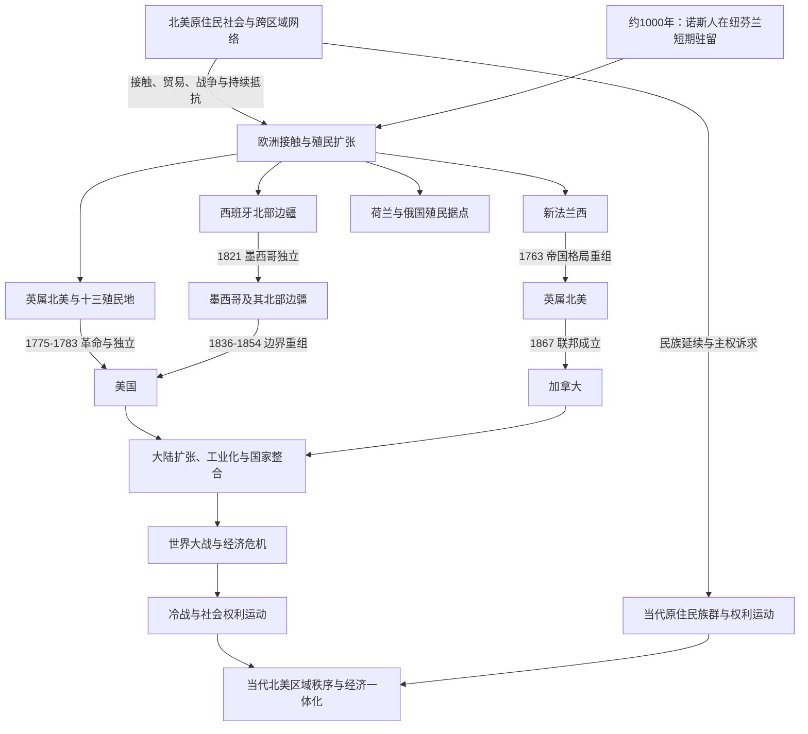

# 北美历史

## 范围与概括

本目录以北美大陆的跨区域历史为框架，整理今日美国、加拿大和墨西哥。墨西哥在此建立连续国家通史；古代中部美洲文明和新西班牙核心等跨国文化区域细节仍集中放入[中美洲与中部美洲入口](/%E4%BA%BA%E6%96%87%E7%A7%91%E5%AD%A6/%E5%8E%86%E5%8F%B2/%E7%BE%8E%E6%B4%B2/%E4%B8%AD%E7%BE%8E%E6%B4%B2/README.md)，国家通史通过链接复用，不重复维护。

北美历史不能简化成欧洲殖民者到来后的国家史。原住民社会在欧洲接触前已经形成跨越北极、太平洋沿岸、大平原、西南、密西西比河流域和东部林地的多种政治、贸易与文化网络；殖民、国家扩张、强制迁移和同化政策改变了这些网络，但原住民族群及其主权诉求延续至今。

## 历史主线

北美历史的近代主线由多条并行过程构成：西班牙、法国、英国、荷兰和俄国在不同区域建立殖民据点；七年战争重组帝国格局；十三殖民地革命产生美国，英属北美逐步形成加拿大，墨西哥独立及美墨战争重新划定南部边界。19世纪后半叶，美国和加拿大完成大陆性国家整合，同时伴随原住民失地、保留地制度、寄宿学校和资源开发。20世纪的世界大战、经济危机、冷战、民权与社会权利运动，以及后来的区域经济一体化，共同塑造现代北美。

## 历史演进图

图中箭头表示历史联系、制度转变或边界重组，不表示原住民社会被后继国家取代。

## 主题与国家入口

| 类别 | 入口 | 覆盖重点 |
|---|---|---|
| 跨国原住民史 | [北美原住民](/%E4%BA%BA%E6%96%87%E7%A7%91%E5%AD%A6/%E5%8E%86%E5%8F%B2/%E7%BE%8E%E6%B4%B2/%E5%8C%97%E7%BE%8E/%E5%8C%97%E7%BE%8E%E5%8E%9F%E4%BD%8F%E6%B0%91/README.md) | 各生态区社会、贸易网络、政治联盟、殖民冲击、条约关系与当代延续。 |
| 殖民体系 | [殖民北美](/%E4%BA%BA%E6%96%87%E7%A7%91%E5%AD%A6/%E5%8E%86%E5%8F%B2/%E7%BE%8E%E6%B4%B2/%E5%8C%97%E7%BE%8E/%E6%AE%96%E6%B0%91%E5%8C%97%E7%BE%8E/README.md) | 新法兰西、英属殖民地、西班牙北部边疆、荷兰与俄国据点及帝国竞争。 |
| 美国 | [美国历史](/%E4%BA%BA%E6%96%87%E7%A7%91%E5%AD%A6/%E5%8E%86%E5%8F%B2/%E7%BE%8E%E6%B4%B2/%E5%8C%97%E7%BE%8E/%E7%BE%8E%E5%9B%BD/README.md) | 十三殖民地、革命与建国、大陆扩张、内战、工业化、世界大战、冷战和当代美国。 |
| 加拿大 | [加拿大历史](/%E4%BA%BA%E6%96%87%E7%A7%91%E5%AD%A6/%E5%8E%86%E5%8F%B2/%E7%BE%8E%E6%B4%B2/%E5%8C%97%E7%BE%8E/%E5%8A%A0%E6%8B%BF%E5%A4%A7/README.md) | 新法兰西、英属北美、责任政府、1867年联邦、国家自主、战后国家与当代加拿大。 |
| 墨西哥 | [墨西哥历史](/%E4%BA%BA%E6%96%87%E7%A7%91%E5%AD%A6/%E5%8E%86%E5%8F%B2/%E7%BE%8E%E6%B4%B2/%E5%8C%97%E7%BE%8E/%E5%A2%A8%E8%A5%BF%E5%93%A5/README.md) | 中部美洲文明、新西班牙、独立、共和国、法国干涉、革命和当代墨西哥。 |
| 墨西哥北部边疆 | [墨西哥北部边疆](/%E4%BA%BA%E6%96%87%E7%A7%91%E5%AD%A6/%E5%8E%86%E5%8F%B2/%E7%BE%8E%E6%B4%B2/%E5%8C%97%E7%BE%8E/%E5%A2%A8%E8%A5%BF%E5%93%A5%E5%8C%97%E9%83%A8%E8%BE%B9%E7%96%86.md) | 新西班牙北疆、墨西哥独立、得克萨斯、美墨战争和现代美墨边境。 |
| 大陆边界 | [北美大陆的边界重组](/%E4%BA%BA%E6%96%87%E7%A7%91%E5%AD%A6/%E5%8E%86%E5%8F%B2/%E7%BE%8E%E6%B4%B2/%E5%8C%97%E7%BE%8E/%E5%8C%97%E7%BE%8E%E5%A4%A7%E9%99%86%E7%9A%84%E8%BE%B9%E7%95%8C%E9%87%8D%E7%BB%84.md) | 1763年以后帝国、国家与原住民土地之间的边界变化。 |
| 现代区域史 | [现代北美区域秩序](/%E4%BA%BA%E6%96%87%E7%A7%91%E5%AD%A6/%E5%8E%86%E5%8F%B2/%E7%BE%8E%E6%B4%B2/%E5%8C%97%E7%BE%8E/%E7%8E%B0%E4%BB%A3%E5%8C%97%E7%BE%8E%E5%8C%BA%E5%9F%9F%E7%A7%A9%E5%BA%8F.md) | 工业化、世界大战、冷战、安全合作、权利运动、迁移与经济一体化。 |

## 区域阶段导航

| 顺序 | 阶段 | 时间 | 主要入口 | 简要概括 |
|---:|---|---|---|---|
| 1 | 原住民社会与跨区域网络 | 至少约1.5万年前至今 | [北美原住民](/%E4%BA%BA%E6%96%87%E7%A7%91%E5%AD%A6/%E5%8E%86%E5%8F%B2/%E7%BE%8E%E6%B4%B2/%E5%8C%97%E7%BE%8E/%E5%8C%97%E7%BE%8E%E5%8E%9F%E4%BD%8F%E6%B0%91/README.md) | 多种语言、政治组织和生计方式随生态区发展，并延续为当代民族共同体。 |
| 2 | 欧洲接触与早期据点 | 约1000年；15世纪末-17世纪初 | [殖民北美](/%E4%BA%BA%E6%96%87%E7%A7%91%E5%AD%A6/%E5%8E%86%E5%8F%B2/%E7%BE%8E%E6%B4%B2/%E5%8C%97%E7%BE%8E/%E6%AE%96%E6%B0%91%E5%8C%97%E7%BE%8E/README.md) | 诺斯人短期驻留之后，欧洲航海者、渔民与殖民者建立持续接触。 |
| 3 | 殖民体系与帝国竞争 | 16世纪-1763年 | [殖民北美](/%E4%BA%BA%E6%96%87%E7%A7%91%E5%AD%A6/%E5%8E%86%E5%8F%B2/%E7%BE%8E%E6%B4%B2/%E5%8C%97%E7%BE%8E/%E6%AE%96%E6%B0%91%E5%8C%97%E7%BE%8E/README.md) | 西、法、英、荷、俄殖民体系与原住民外交网络相互作用。 |
| 4 | 革命、独立与国家形成 | 1763-1867年 | [美国历史](/%E4%BA%BA%E6%96%87%E7%A7%91%E5%AD%A6/%E5%8E%86%E5%8F%B2/%E7%BE%8E%E6%B4%B2/%E5%8C%97%E7%BE%8E/%E7%BE%8E%E5%9B%BD/README.md)、[加拿大历史](/%E4%BA%BA%E6%96%87%E7%A7%91%E5%AD%A6/%E5%8E%86%E5%8F%B2/%E7%BE%8E%E6%B4%B2/%E5%8C%97%E7%BE%8E/%E5%8A%A0%E6%8B%BF%E5%A4%A7/README.md)、[墨西哥历史](/%E4%BA%BA%E6%96%87%E7%A7%91%E5%AD%A6/%E5%8E%86%E5%8F%B2/%E7%BE%8E%E6%B4%B2/%E5%8C%97%E7%BE%8E/%E5%A2%A8%E8%A5%BF%E5%93%A5/README.md) | 美国独立、墨西哥独立、英属北美改革和加拿大联邦建立。 |
| 5 | 大陆扩张与边界重组 | 1783-1890年代 | [北美大陆的边界重组](/%E4%BA%BA%E6%96%87%E7%A7%91%E5%AD%A6/%E5%8E%86%E5%8F%B2/%E7%BE%8E%E6%B4%B2/%E5%8C%97%E7%BE%8E/%E5%8C%97%E7%BE%8E%E5%A4%A7%E9%99%86%E7%9A%84%E8%BE%B9%E7%95%8C%E9%87%8D%E7%BB%84.md) | 购地、战争、条约、铁路和移民拓殖改变国家边界与原住民土地控制。 |
| 6 | 工业化、国家整合与革命 | 1865-1914年 | [美国历史](/%E4%BA%BA%E6%96%87%E7%A7%91%E5%AD%A6/%E5%8E%86%E5%8F%B2/%E7%BE%8E%E6%B4%B2/%E5%8C%97%E7%BE%8E/%E7%BE%8E%E5%9B%BD/README.md)、[加拿大历史](/%E4%BA%BA%E6%96%87%E7%A7%91%E5%AD%A6/%E5%8E%86%E5%8F%B2/%E7%BE%8E%E6%B4%B2/%E5%8C%97%E7%BE%8E/%E5%8A%A0%E6%8B%BF%E5%A4%A7/README.md)、[墨西哥历史](/%E4%BA%BA%E6%96%87%E7%A7%91%E5%AD%A6/%E5%8E%86%E5%8F%B2/%E7%BE%8E%E6%B4%B2/%E5%8C%97%E7%BE%8E/%E5%A2%A8%E8%A5%BF%E5%93%A5/README.md) | 跨大陆交通、城市化、资本和移民加强国家市场；墨西哥的不平等和政治排斥导向革命。 |
| 7 | 世界大战与经济危机 | 1914-1945年 | [现代北美区域秩序](/%E4%BA%BA%E6%96%87%E7%A7%91%E5%AD%A6/%E5%8E%86%E5%8F%B2/%E7%BE%8E%E6%B4%B2/%E5%8C%97%E7%BE%8E/%E7%8E%B0%E4%BB%A3%E5%8C%97%E7%BE%8E%E5%8C%BA%E5%9F%9F%E7%A7%A9%E5%BA%8F.md) | 两次世界大战与大萧条重塑国家能力、产业和国际地位。 |
| 8 | 冷战与权利运动 | 1945-1991年 | [现代北美区域秩序](/%E4%BA%BA%E6%96%87%E7%A7%91%E5%AD%A6/%E5%8E%86%E5%8F%B2/%E7%BE%8E%E6%B4%B2/%E5%8C%97%E7%BE%8E/%E7%8E%B0%E4%BB%A3%E5%8C%97%E7%BE%8E%E5%8C%BA%E5%9F%9F%E7%A7%A9%E5%BA%8F.md) | 美加安全合作深化，民权、女权、原住民权利和移民制度发生重大变化。 |
| 9 | 区域一体化与当代转型 | 1991年至今 | [现代北美区域秩序](/%E4%BA%BA%E6%96%87%E7%A7%91%E5%AD%A6/%E5%8E%86%E5%8F%B2/%E7%BE%8E%E6%B4%B2/%E5%8C%97%E7%BE%8E/%E7%8E%B0%E4%BB%A3%E5%8C%97%E7%BE%8E%E5%8C%BA%E5%9F%9F%E7%A7%A9%E5%BA%8F.md) | 贸易、供应链、人口流动、安全、气候与数字技术把三国更紧密地联系起来。 |

## 重要转折与时间节点

| 时间 | 事件 | 意义 |
|---|---|---|
| 约1000年 | 诺斯人在纽芬兰建立短期驻留点 | 证明欧洲人与北美已知最早的一次跨大西洋接触，但没有形成后来的连续殖民政权。 |
| 1565年 | 圣奥古斯丁建立 | 西班牙在今日美国境内建立持续存在的殖民城市。 |
| 1607年、1608年 | 詹姆斯敦、魁北克先后建立 | 英国和法国在北美形成长期殖民据点。 |
| 1754-1763年 | 法国与印第安人战争 / 七年战争北美战场 | 法国在加拿大的殖民统治终结，英国成为北美东部主要帝国力量。 |
| 1776年、1783年、1789年 | 《独立宣言》、战争结束与联邦政府运行 | 分别对应宣布独立、国际承认和美国新宪政体制实际开始。 |
| 1810-1821年 | 墨西哥独立运动 | 新西班牙解体，北部边疆转入墨西哥国家主权之下。 |
| 1846-1848年 | 美墨战争 | 《瓜达卢佩-伊达尔戈条约》大幅改变美国与墨西哥领土和边界。 |
| 1861-1865年 | 美国南北战争 | 联邦得以维持，奴隶制经宪法第十三修正案废除。 |
| 1867年 | 加拿大联邦成立 | 安大略、魁北克、新斯科舍和新不伦瑞克组成加拿大自治领；这不是加拿大一次完成全部独立的日期。 |
| 1931年、1982年 | 《威斯敏斯特法令》与加拿大宪法回归 | 标志加拿大立法自主和宪法自主分阶段完成。 |
| 1945年以后 | 美国成为全球超级大国，美加深化防务与经济协作 | 北美区域秩序嵌入冷战和战后全球体系。 |
| 1989年、1994年、2020年 | 美加自由贸易协定、北美自由贸易协定及其后继协定生效 | 北美生产、投资和贸易网络进一步制度化。 |

## 关键辨析

- “中部美洲”（Mesoamerica）是文化历史区，不等于地理上的“中美洲”；墨西哥属于地理北美，但其中南部古代文明与中部美洲历史密切相连。
- “十三殖民地”只是英国北美殖民地中后来组成美国的十三个殖民地，不等于英国在北美的全部领地。
- 1763年改变了殖民统治权，不代表法语人口、法国文化或原住民联盟消失。
- 1867年是加拿大联邦成立；1931年立法自主和1982年宪法回归是另外两个关键阶段。
- 原住民被迫迁移、保留地制度、同化教育及土地权争议没有在19世纪末结束，其后果延续至今。
- 奴隶制在不同北美政体中的废除时间不同，不能用一个年份概括整个地区。

## 相关区域

- 上级入口：[美洲历史](/%E4%BA%BA%E6%96%87%E7%A7%91%E5%AD%A6/%E5%8E%86%E5%8F%B2/%E7%BE%8E%E6%B4%B2/README.md)。
- 跨区域殖民主题：[美洲殖民与独立](/%E4%BA%BA%E6%96%87%E7%A7%91%E5%AD%A6/%E5%8E%86%E5%8F%B2/%E7%BE%8E%E6%B4%B2/%E6%AE%96%E6%B0%91%E4%B8%8E%E7%8B%AC%E7%AB%8B/README.md)。
- 古代中部美洲与墨西哥中南部：[中美洲与中部美洲入口](/%E4%BA%BA%E6%96%87%E7%A7%91%E5%AD%A6/%E5%8E%86%E5%8F%B2/%E7%BE%8E%E6%B4%B2/%E4%B8%AD%E7%BE%8E%E6%B4%B2/README.md)。
- 殖民母国背景：[欧洲历史](/%E4%BA%BA%E6%96%87%E7%A7%91%E5%AD%A6/%E5%8E%86%E5%8F%B2/%E6%AC%A7%E6%B4%B2/README.md)。
- 大西洋奴隶贸易背景：[非洲历史](/%E4%BA%BA%E6%96%87%E7%A7%91%E5%AD%A6/%E5%8E%86%E5%8F%B2/%E9%9D%9E%E6%B4%B2/README.md)。
