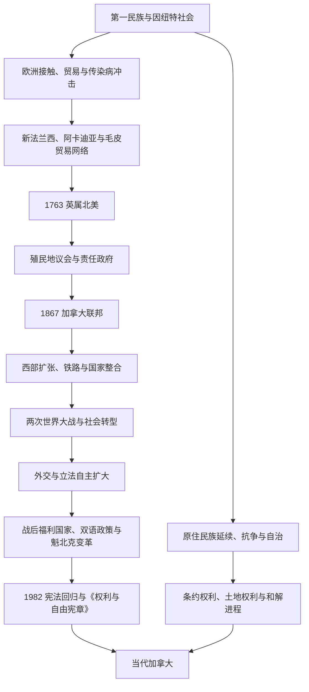

# 加拿大历史

## 范围与名称

本目录整理现代加拿大疆域内的长期历史，以及1867年以后加拿大联邦的国家史。生活在这片土地上的第一民族、因纽特人和后来的梅蒂人拥有各自的政治共同体、语言和历史，不能只被视为加拿大国家形成的“前史”；“加拿大”作为殖民地和国家名称，也不应被倒推到所有早期社会。

本目录按六个阶段组织区域主线。纽芬兰与拉布拉多在1949年才加入加拿大，鲁珀特地、西北地区和北极群岛也分批纳入联邦控制，因此不同时期的“加拿大”疆域并不相同。

## 演变图

## 历史主线

加拿大历史的第一条主线，是第一民族、因纽特人和梅蒂人的社会延续，以及他们与法国、英国和加拿大政府之间不断变化的外交、贸易、战争、条约和殖民关系。欧洲人到来以前，北极、太平洋沿岸、草原、五大湖—圣劳伦斯河流域和大西洋沿岸已经存在多样的经济网络与政治联盟。殖民扩张带来传染病、土地侵占和强制同化，但原住民族并未消失，现代条约、自治和权利确认仍是加拿大政治的重要组成部分。

第二条主线，是法语与英语殖民社会的并存。法国沿圣劳伦斯河和阿卡迪亚建立殖民据点，并以毛皮贸易和原住民联盟连接内陆；1763年以后英国取得主要殖民统治权，却通过《魁北克法》保留法语天主教社会的部分制度。19世纪的殖民地议会、责任政府和英法政治妥协，为1867年的联邦制度奠定基础。

第三条主线，是联邦国家的扩张与自主化。1867年联邦最初只有安大略、魁北克、新斯科舍和新不伦瑞克四省；此后通过领土转让、新省建立和殖民地加入逐步形成今日疆域。两次世界大战、1926年帝国会议和1931年《威斯敏斯特法令》扩大了加拿大自主权，1982年宪法回归使宪法修改不再依赖英国议会。

## 按时间排序的时期导航

| 顺序 | 阶段 | 时间 | 入口 | 简要概括 |
|---:|---|---|---|---|
| 1 | 原住民社会与新法兰西 | 至少约1.5万年前-1763年 | [原住民社会与新法兰西](/%E4%BA%BA%E6%96%87%E7%A7%91%E5%AD%A6/%E5%8E%86%E5%8F%B2/%E7%BE%8E%E6%B4%B2/%E5%8C%97%E7%BE%8E/%E5%8A%A0%E6%8B%BF%E5%A4%A7/%E5%8E%9F%E4%BD%8F%E6%B0%91%E7%A4%BE%E4%BC%9A%E4%B8%8E%E6%96%B0%E6%B3%95%E5%85%B0%E8%A5%BF.md) | 第一民族与因纽特社会长期发展；法国在圣劳伦斯河、阿卡迪亚和内陆贸易网络建立新法兰西。 |
| 2 | 英属北美与责任政府 | 1763年-1867年 | [英属北美与责任政府](/%E4%BA%BA%E6%96%87%E7%A7%91%E5%AD%A6/%E5%8E%86%E5%8F%B2/%E7%BE%8E%E6%B4%B2/%E5%8C%97%E7%BE%8E/%E5%8A%A0%E6%8B%BF%E5%A4%A7/%E8%8B%B1%E5%B1%9E%E5%8C%97%E7%BE%8E%E4%B8%8E%E8%B4%A3%E4%BB%BB%E6%94%BF%E5%BA%9C.md) | 英国统治下保留法语民法和天主教社会，殖民地逐步取得民选议会与责任政府。 |
| 3 | 加拿大联邦建立与西部扩张 | 1867年-1914年 | [加拿大联邦建立与西部扩张](/%E4%BA%BA%E6%96%87%E7%A7%91%E5%AD%A6/%E5%8E%86%E5%8F%B2/%E7%BE%8E%E6%B4%B2/%E5%8C%97%E7%BE%8E/%E5%8A%A0%E6%8B%BF%E5%A4%A7/%E5%8A%A0%E6%8B%BF%E5%A4%A7%E8%81%94%E9%82%A6%E5%BB%BA%E7%AB%8B%E4%B8%8E%E8%A5%BF%E9%83%A8%E6%89%A9%E5%BC%A0.md) | 四省联邦扩展为横跨大陆的国家，铁路、移民、条约和殖民政策共同重塑西部与北部。 |
| 4 | 世界大战与国家自主 | 1914年-1945年 | [世界大战与国家自主](/%E4%BA%BA%E6%96%87%E7%A7%91%E5%AD%A6/%E5%8E%86%E5%8F%B2/%E7%BE%8E%E6%B4%B2/%E5%8C%97%E7%BE%8E/%E5%8A%A0%E6%8B%BF%E5%A4%A7/%E4%B8%96%E7%95%8C%E5%A4%A7%E6%88%98%E4%B8%8E%E5%9B%BD%E5%AE%B6%E8%87%AA%E4%B8%BB.md) | 加拿大经历两次世界大战、征兵危机和大萧条，并逐步获得独立外交与立法地位。 |
| 5 | 战后加拿大 | 1945年-1982年 | [战后加拿大](/%E4%BA%BA%E6%96%87%E7%A7%91%E5%AD%A6/%E5%8E%86%E5%8F%B2/%E7%BE%8E%E6%B4%B2/%E5%8C%97%E7%BE%8E/%E5%8A%A0%E6%8B%BF%E5%A4%A7/%E6%88%98%E5%90%8E%E5%8A%A0%E6%8B%BF%E5%A4%A7.md) | 公民身份、福利制度、双语与多元文化政策发展，魁北克与原住民族政治推动宪政重组。 |
| 6 | 当代加拿大 | 1982年至今 | [当代加拿大](/%E4%BA%BA%E6%96%87%E7%A7%91%E5%AD%A6/%E5%8E%86%E5%8F%B2/%E7%BE%8E%E6%B4%B2/%E5%8C%97%E7%BE%8E/%E5%8A%A0%E6%8B%BF%E5%A4%A7/%E5%BD%93%E4%BB%A3%E5%8A%A0%E6%8B%BF%E5%A4%A7.md) | 《权利与自由宪章》成为宪政核心，国家统一、原住民和解、区域贸易与社会多元化并行发展。 |

## 重要转折与时间节点

| 时间 | 事件 | 意义 |
|---|---|---|
| 约1000年 | 诺斯人在兰塞奥兹牧草地建立短期据点 | 证明欧洲人与北美东北部接触早于哥伦布时代，但未形成连续殖民政权。 |
| 1534年 | 雅克·卡蒂埃航行并代表法国提出领有主张 | 法国在圣劳伦斯河流域活动的重要起点。 |
| 1608年 | 魁北克城建立 | 新法兰西在圣劳伦斯河流域形成持久殖民中心。 |
| 1763年 | 《巴黎条约》与英国统治确立 | 新法兰西主要领地转归英国，英法并存问题成为长期政治主题。 |
| 1774年 | 《魁北克法》 | 保留法国民法和天主教信仰空间，影响此后魁北克的制度传统。 |
| 1791年 | 《宪法法》 | 魁北克殖民地分为上加拿大与下加拿大，并分别设立民选议会。 |
| 1848年前后 | 多个英属北美殖民地实行责任政府 | 行政部门逐步改为对民选议会负责。 |
| 1867年 | 《英属北美法》生效 | 安大略、魁北克、新斯科舍和新不伦瑞克组成加拿大联邦。 |
| 1870年 | 鲁珀特地转让、曼尼托巴建立 | 联邦大幅向西扩展，也加剧与梅蒂人和第一民族的土地冲突。 |
| 1876年 | 《印第安人法》 | 联邦政府将多项殖民管制整合为长期法律框架。 |
| 1931年 | 《威斯敏斯特法令》 | 加拿大在立法和对外事务上的自主地位获得关键法律确认。 |
| 1949年 | 纽芬兰加入联邦 | 加拿大形成第十个省，联邦疆域进一步接近今日格局。 |
| 1965年 | 枫叶旗启用 | 成为区别于英国帝国传统的现代国家象征。 |
| 1982年 | 宪法回归并通过《权利与自由宪章》 | 加拿大取得国内宪法修改框架；同一部《1982年宪法法》的第35条（不属于《权利与自由宪章》）确认原住民族与条约权利。 |
| 1995年 | 魁北克第二次独立公投 | 反对独立一方以极小差距胜出，国家统一问题达到高峰。 |
| 1999年 | 努纳武特建立 | 以因纽特人为人口主体的新领地成立，是土地权利协议与自治进程的重要结果。 |
| 2015年 | 真相与和解委员会发表最终报告 | 寄宿学校历史及其长期伤害成为全国和解议程的核心。 |

## 政体与统治角色

加拿大是联邦制、议会制和君主立宪制国家。国家元首、君主代表与政府首脑属于不同角色，不应混为同一条“统治者世系”。

### 国家元首

| 角色 | 现任与时间 | 职能 | 完整入口 |
|---|---|---|---|
| 加拿大君主 | 查尔斯三世，2022年至今（核验至2026-07-14） | 国家元首；通常依照加拿大政府的宪政建议行使职权。 | [加拿大君主表](/%E4%BA%BA%E6%96%87%E7%A7%91%E5%AD%A6/%E5%8E%86%E5%8F%B2/%E7%BE%8E%E6%B4%B2/%E5%8C%97%E7%BE%8E/%E5%8A%A0%E6%8B%BF%E5%A4%A7/%E5%8A%A0%E6%8B%BF%E5%A4%A7%E5%90%9B%E4%B8%BB%E8%A1%A8.md) |

### 君主代表

| 角色 | 现任与时间 | 职能 | 完整入口 |
|---|---|---|---|
| 加拿大总督 | 路易丝·阿尔布尔，2026-06-08至今（核验至2026-07-14） | 在联邦层面代表君主，通常依总理与内阁建议履行宪政职权。 | [加拿大总督表](/%E4%BA%BA%E6%96%87%E7%A7%91%E5%AD%A6/%E5%8E%86%E5%8F%B2/%E7%BE%8E%E6%B4%B2/%E5%8C%97%E7%BE%8E/%E5%8A%A0%E6%8B%BF%E5%A4%A7/%E5%8A%A0%E6%8B%BF%E5%A4%A7%E6%80%BB%E7%9D%A3%E8%A1%A8.md) |

### 政府首脑

| 角色 | 现任与时间 | 职能 | 完整入口 |
|---|---|---|---|
| 加拿大总理 | 马克·卡尼，2025-03-14至今（核验至2026-07-14） | 领导内阁和联邦政府，通常是能取得众议院信任的政党领袖。 | [加拿大总理表](/%E4%BA%BA%E6%96%87%E7%A7%91%E5%AD%A6/%E5%8E%86%E5%8F%B2/%E7%BE%8E%E6%B4%B2/%E5%8C%97%E7%BE%8E/%E5%8A%A0%E6%8B%BF%E5%A4%A7/%E5%8A%A0%E6%8B%BF%E5%A4%A7%E6%80%BB%E7%90%86%E8%A1%A8.md) |

### 联邦制度

| 层级 / 机构 | 组成 | 主要职能 |
|---|---|---|
| 君主与总督 | 君主由[加拿大总督](/%E4%BA%BA%E6%96%87%E7%A7%91%E5%AD%A6/%E5%8E%86%E5%8F%B2/%E7%BE%8E%E6%B4%B2/%E5%8C%97%E7%BE%8E/%E5%8A%A0%E6%8B%BF%E5%A4%A7/%E5%8A%A0%E6%8B%BF%E5%A4%A7%E6%80%BB%E7%9D%A3%E8%A1%A8.md)在加拿大联邦层面代表 | 召集、休会和解散议会，给予御准，并履行其他宪政职能；惯例上依照总理与内阁建议行事。 |
| 联邦议会 | 君主、参议院、众议院 | 制定联邦法律、审议预算并监督政府。 |
| 总理与内阁 | 由能维持众议院信任的政治领导层组成 | 领导行政部门并向议会负责。 |
| 省与地区 | 10个省、3个地区 | 省拥有宪法规定的立法权；地区的权力主要来自联邦法律并持续经历权力下放。 |
| 司法机关 | 最高法院及联邦、省级法院体系 | 解释宪法和法律，处理联邦与省权限及《权利与自由宪章》争议。 |

## 关键辨析

- 1867年是联邦建立，不是加拿大在一天内完成独立；1931年和1982年是自主化过程中的另外两个关键节点。
- “新法兰西”不等于今日魁北克，其范围和贸易网络曾延伸到阿卡迪亚、五大湖和密西西比河流域。
- “英属北美”不是一个始终统一的殖民地，而是多个殖民地与领地的集合。
- 联邦向西扩张不能只写成无人土地上的“开拓”；当地已有第一民族和梅蒂人的政治、经济与土地秩序。
- 纽芬兰在1949年以前不属于加拿大联邦；努纳武特则在1999年才从西北地区分设。

## 相关历史

- 上级区域：[北美](/%E4%BA%BA%E6%96%87%E7%A7%91%E5%AD%A6/%E5%8E%86%E5%8F%B2/%E7%BE%8E%E6%B4%B2/%E5%8C%97%E7%BE%8E/README.md)、[美洲历史](/%E4%BA%BA%E6%96%87%E7%A7%91%E5%AD%A6/%E5%8E%86%E5%8F%B2/%E7%BE%8E%E6%B4%B2/README.md)。
- 殖民体系与独立运动的横向背景见[殖民与独立](/%E4%BA%BA%E6%96%87%E7%A7%91%E5%AD%A6/%E5%8E%86%E5%8F%B2/%E7%BE%8E%E6%B4%B2/%E6%AE%96%E6%B0%91%E4%B8%8E%E7%8B%AC%E7%AB%8B/README.md)。
- 新法兰西的欧洲背景见[法国历史](/%E4%BA%BA%E6%96%87%E7%A7%91%E5%AD%A6/%E5%8E%86%E5%8F%B2/%E6%AC%A7%E6%B4%B2/%E6%B3%95%E5%9B%BD/README.md)。
- 英属北美和加拿大君主立宪制的母国背景见[联合王国](/%E4%BA%BA%E6%96%87%E7%A7%91%E5%AD%A6/%E5%8E%86%E5%8F%B2/%E6%AC%A7%E6%B4%B2/%E4%B8%8D%E5%88%97%E9%A2%A0%E7%BE%A4%E5%B2%9B/%E8%81%94%E5%90%88%E7%8E%8B%E5%9B%BD/README.md)。
