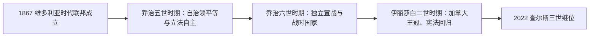

# 加拿大君主表

## 范围

本表列出1867年加拿大联邦建立以来的加拿大君主。维多利亚女王在1837年已经即位，但表中的任期从1867年联邦成立起计算。联邦以前，新法兰西受法国君主统治，1763年后主要加拿大殖民地转入英国君主统治；这些殖民阶段见[加拿大历史](/%E4%BA%BA%E6%96%87%E7%A7%91%E5%AD%A6/%E5%8E%86%E5%8F%B2/%E7%BE%8E%E6%B4%B2/%E5%8C%97%E7%BE%8E/%E5%8A%A0%E6%8B%BF%E5%A4%A7/README.md)的前两篇时期笔记。

加拿大君主是国家元首，不是政府首脑。随着1926年自治领平等原则、1931年《威斯敏斯特法令》和此后的加拿大法律发展，同一自然人所拥有的“加拿大王冠”与英国及其他英联邦王国的王冠在法律上成为可区分的宪政角色。伊丽莎白二世于1953年成为首位获得单独“加拿大女王”正式称号的君主。

## 王冠演变图

## 政体角色

### 国家元首

| 角色 | 主要职能 | 实际运作 |
|---|---|---|
| 加拿大君主 | 国家元首；行政权、议会组成和御准等制度在法律形式上与王冠相连 | 君主本人通常不参与日常党派治理，多数职权由总督依加拿大总理和内阁建议行使。 |

### 君主代表

| 角色 | 主要职能 | 与君主的关系 |
|---|---|---|
| [加拿大总督](/%E4%BA%BA%E6%96%87%E7%A7%91%E5%AD%A6/%E5%8E%86%E5%8F%B2/%E7%BE%8E%E6%B4%B2/%E5%8C%97%E7%BE%8E/%E5%8A%A0%E6%8B%BF%E5%A4%A7/%E5%8A%A0%E6%8B%BF%E5%A4%A7%E6%80%BB%E7%9D%A3%E8%A1%A8.md) | 任命总理、召集和解散议会、宣读施政报告、给予御准并履行礼仪职责 | 在联邦层面代表君主；保留权原则上仅在极少数宪政情形下独立判断。 |

### 政府首脑

| 角色 | 主要职能 | 完整入口 |
|---|---|---|
| 加拿大总理 | 领导内阁和联邦政府，并维持众议院信任 | [加拿大总理表](/%E4%BA%BA%E6%96%87%E7%A7%91%E5%AD%A6/%E5%8E%86%E5%8F%B2/%E7%BE%8E%E6%B4%B2/%E5%8C%97%E7%BE%8E/%E5%8A%A0%E6%8B%BF%E5%A4%A7/%E5%8A%A0%E6%8B%BF%E5%A4%A7%E6%80%BB%E7%90%86%E8%A1%A8.md) |

## 联邦以来君主

| 顺序 | 君主 | 王朝 | 在加拿大联邦中的在位时间 | 继承关系 | 加拿大历史中的关键节点 |
|---:|---|---|---|---|---|
| 1 | **维多利亚女王** | 汉诺威王朝 | 1867-07-01至1901-01-22 | 联邦成立时已在位；本人1837年即位 | 1867年加拿大联邦在其统治下建立；曼尼托巴、不列颠哥伦比亚和爱德华王子岛等加入或建立，跨大陆铁路完成。 |
| 2 | 爱德华七世 | 萨克森-科堡-哥达王朝 | 1901-01-22至1910-05-06 | 维多利亚女王之子 | 阿尔伯塔、萨斯喀彻温于1905年建省；加拿大的帝国身份与自主诉求并行发展。 |
| 3 | **乔治五世** | 萨克森-科堡-哥达王朝；1917年改称温莎王朝 | 1910-05-06至1936-01-20 | 爱德华七世之子 | 经历第一次世界大战、1926年帝国会议和1931年《威斯敏斯特法令》，加拿大王冠开始成为更明确的独立宪政角色。 |
| 4 | 爱德华八世 | 温莎王朝 | 1936-01-20至1936-12-10 | 乔治五世长子 | 因婚姻问题退位；王位继承变更需与加拿大等自治领协调，显示共同君主制度的多国法律性质。 |
| 5 | **乔治六世** | 温莎王朝 | 1936-12-10至1952-02-06 | 爱德华八世之弟 | 加拿大于1939年自行对德宣战；纽芬兰1949年加入联邦，同年加拿大最高法院成为国内最终上诉法院。 |
| 6 | **伊丽莎白二世** | 温莎王朝 | 1952-02-06至2022-09-08 | 乔治六世长女 | 1953年获得“加拿大女王”正式称号；经历枫叶旗启用、1982年宪法回归、努纳武特建立和长期社会转型。 |
| 7 | **查尔斯三世** | 温莎王朝 | 2022-09-08至今 | 伊丽莎白二世长子 | 现任加拿大君主与国家元首；现任信息核验至2026-07-14。加拿大王冠继续作为独立于日常政府的宪政法人和国家权威来源。 |

## 联邦以前的君主统治背景

| 阶段 | 时间 | 君主体系 | 说明 |
|---|---|---|---|
| 法国提出领有主张与早期殖民 | 1534年-1663年 | 法国君主 | 雅克·卡蒂埃代表法国提出领有主张，17世纪初建立皇家港和魁北克城等殖民据点。 |
| 新法兰西王室直辖 | 1663年-1760年军事投降；1763年正式割让 | 法国君主 | 总督、总管和主权会议治理殖民地；1713年法国已向英国让出阿卡迪亚部分领地，1760年蒙特利尔投降，1763年《巴黎条约》完成主要领地割让。 |
| 英属北美 | 1763年-1867年 | 英国君主 | 乔治三世统治下发布《皇家公告》和《魁北克法》；殖民地议会与责任政府逐步发展。 |
| 加拿大联邦 | 1867年至今 | 加拿大君主立宪制 | 联邦从帝国自治领逐步发展为拥有独立王冠角色和国内修宪程序的国家。 |

## 加拿大王冠的宪制演变

| 时间 | 节点 | 意义 |
|---|---|---|
| 1867年 | 《英属北美法》 | 以维多利亚女王及其继承人为联邦君主，建立总督、议会和责任政府框架。 |
| 1926年 | 帝国会议《贝尔福宣言》 | 确认英国与自治领地位平等、彼此不相隶属并共同效忠王室。 |
| 1931年 | 《威斯敏斯特法令》 | 加拿大立法自主获得关键法律确认，共同君主开始通过各自治领分别运作。 |
| 1947年 | 总督职权委任状 | 扩大总督在加拿大境内以君主名义行使职权的制度基础。 |
| 1953年 | 加拿大《王室称号法》 | 伊丽莎白二世正式使用“加拿大女王”称号，明确加拿大君主身份。 |
| 1982年 | 宪法回归 | 伊丽莎白二世签署宪法公告；君主职位成为需要联邦两院和所有省一致同意才能修改的事项。 |
| 2022年 | 查尔斯三世继位 | 王位依加拿大继承法自动承继，随后在加拿大正式宣布。 |

## 关键辨析

- “加拿大君主”和“英国君主”由同一自然人担任，但属于可区分的法律身份；加拿大政府只就加拿大事务提出宪政建议。
- 总督不是加拿大国家元首的替代者，而是君主在加拿大联邦层面的代表。
- 总理掌握日常政府领导权，但其职权来源、议会召集、部长任命和法律御准在形式上仍通过王冠制度运作。
- 1867年以前不能把法国和英国君主简单称为现代意义上的“加拿大国王 / 女王”；当时是殖民主权关系。
- 1953年单独称号不是加拿大王冠突然出现的唯一日期，而是从自治领到独立王冠长期演变中的重要节点。

## 相关笔记

- 国家总览：[加拿大历史](/%E4%BA%BA%E6%96%87%E7%A7%91%E5%AD%A6/%E5%8E%86%E5%8F%B2/%E7%BE%8E%E6%B4%B2/%E5%8C%97%E7%BE%8E/%E5%8A%A0%E6%8B%BF%E5%A4%A7/README.md)。
- 君主代表：[加拿大总督表](/%E4%BA%BA%E6%96%87%E7%A7%91%E5%AD%A6/%E5%8E%86%E5%8F%B2/%E7%BE%8E%E6%B4%B2/%E5%8C%97%E7%BE%8E/%E5%8A%A0%E6%8B%BF%E5%A4%A7/%E5%8A%A0%E6%8B%BF%E5%A4%A7%E6%80%BB%E7%9D%A3%E8%A1%A8.md)。
- 政府首脑：[加拿大总理表](/%E4%BA%BA%E6%96%87%E7%A7%91%E5%AD%A6/%E5%8E%86%E5%8F%B2/%E7%BE%8E%E6%B4%B2/%E5%8C%97%E7%BE%8E/%E5%8A%A0%E6%8B%BF%E5%A4%A7/%E5%8A%A0%E6%8B%BF%E5%A4%A7%E6%80%BB%E7%90%86%E8%A1%A8.md)。
- 联邦建立：[加拿大联邦建立与西部扩张](/%E4%BA%BA%E6%96%87%E7%A7%91%E5%AD%A6/%E5%8E%86%E5%8F%B2/%E7%BE%8E%E6%B4%B2/%E5%8C%97%E7%BE%8E/%E5%8A%A0%E6%8B%BF%E5%A4%A7/%E5%8A%A0%E6%8B%BF%E5%A4%A7%E8%81%94%E9%82%A6%E5%BB%BA%E7%AB%8B%E4%B8%8E%E8%A5%BF%E9%83%A8%E6%89%A9%E5%BC%A0.md)。
- 国家自主：[世界大战与国家自主](/%E4%BA%BA%E6%96%87%E7%A7%91%E5%AD%A6/%E5%8E%86%E5%8F%B2/%E7%BE%8E%E6%B4%B2/%E5%8C%97%E7%BE%8E/%E5%8A%A0%E6%8B%BF%E5%A4%A7/%E4%B8%96%E7%95%8C%E5%A4%A7%E6%88%98%E4%B8%8E%E5%9B%BD%E5%AE%B6%E8%87%AA%E4%B8%BB.md)。
- 当代政体：[当代加拿大](/%E4%BA%BA%E6%96%87%E7%A7%91%E5%AD%A6/%E5%8E%86%E5%8F%B2/%E7%BE%8E%E6%B4%B2/%E5%8C%97%E7%BE%8E/%E5%8A%A0%E6%8B%BF%E5%A4%A7/%E5%BD%93%E4%BB%A3%E5%8A%A0%E6%8B%BF%E5%A4%A7.md)。
