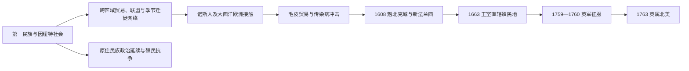

# 原住民社会与新法兰西

## 时间

至少约1.5万年前-1763年。约1000年的诺斯人据点属于短期接触；16世纪以后欧洲航行增加，17世纪初才出现延续至后世的法国殖民中心。

## 概括

现代加拿大疆域在欧洲殖民以前已经存在多样的第一民族与因纽特社会。他们拥有自己的语言、法律传统、亲属网络、外交制度、贸易路线和领土观念。法国殖民者建立新法兰西后，人数长期有限，必须依靠圣劳伦斯河交通、毛皮贸易和原住民联盟维持殖民地。殖民接触也带来传染病、战争升级、宗教传播和人口迁移，深刻改变了各社群之间的力量关系。

这一时期不能写成“空旷土地被发现”。法国、英国和其他欧洲势力进入的是已有居民、政治联盟和跨区域交换网络的土地；原住民族既是贸易伙伴和军事盟友，也是维护自身利益的独立行动者。

## 演变图

## 原住民社会与区域网络

下表只列代表性社群和区域，不能视为固定、完整的民族边界。不同群体会因贸易、战争、婚姻、季节迁徙和环境变化而调整活动范围。

| 区域 | 代表性社群 / 政治网络 | 经济与社会特点 | 与后续历史的关系 |
|---|---|---|---|
| 北极与亚北极 | 因纽特人、甸尼诸族、克里人等 | 海兽捕猎、渔猎、驯鹿与广域交换；因纽特社会适应北极海陆环境 | 欧洲捕鲸、毛皮贸易和传教活动逐步进入，北部殖民控制远晚于圣劳伦斯河流域。 |
| 太平洋西北海岸 | 海达人、努特卡人、海岸萨利希诸族等 | 鲑鱼资源、海上交通、木工、宴礼制度和复杂的等级与亲属组织 | 18世纪末以后海上毛皮贸易扩大，殖民者直到19世纪才强化定居和行政控制。 |
| 草原与林缘 | 黑脚联盟、平原克里人、阿西尼博因人等 | 野牛狩猎、季节移动和跨区域贸易；马匹传入后改变交通与战争 | 毛皮公司、梅蒂人社群和殖民扩张后来重塑草原政治经济。 |
| 五大湖—圣劳伦斯河流域 | 豪德诺索尼联盟、休伦-温达特人、阿尼希纳贝诸族、因努人等 | 部分社群发展玉米农业和聚落，另有广泛渔猎与贸易；联盟外交成熟 | 法国、英国和荷兰殖民者争取其贸易与军事合作，本区成为帝国竞争中心。 |
| 大西洋沿岸 | 米克马克人、沃拉斯托基伊克人、贝奥图克人等 | 海岸渔猎、河流交通和季节性聚落 | 阿卡迪亚殖民、渔业和英法战争直接影响本区；贝奥图克人在殖民压力和疾病下遭受灾难性人口崩溃。 |

## 欧洲接触

- 约1000年，诺斯人在今日纽芬兰的兰塞奥兹牧草地建立短期据点。它证明跨大西洋接触早于15世纪末，但没有形成与后来的法国、英国殖民地连续相承的政权。
- 1497年，约翰·卡伯特受英格兰王室委托航行北大西洋沿岸；16世纪欧洲渔民已频繁前往纽芬兰渔场。
- 1534年至1542年，雅克·卡蒂埃三次航行圣劳伦斯湾和圣劳伦斯河，并代表法国提出领有主张；早期定居尝试未能持续。
- 欧洲传入的天花、麻疹等疾病造成严重人口损失。各地经历接触的时间和后果不同，不能用一个统一比例概括所有原住民族。
- 枪支、金属工具和欧洲商品改变贸易与军事平衡，但原住民贸易网络并非被动附属于欧洲市场。

## 新法兰西的建立

| 时间 | 事件 | 说明 |
|---|---|---|
| 1605年 | 皇家港建立 | 成为阿卡迪亚早期法国殖民中心。 |
| 1608年 | 萨缪尔·德·尚普兰建立魁北克城 | 为法国在圣劳伦斯河流域建立持久据点。 |
| 1634年、1642年 | 三河城、蒙特利尔建立 | 殖民聚落和传教、贸易网络沿河扩展。 |
| 1663年 | 新法兰西改为法国王室直辖殖民地 | 王室加强行政、移民和军事投入。 |
| 1701年 | 蒙特利尔大和平 | 法国与多个原住民族达成广泛和平协议，重组五大湖地区外交与贸易关系。 |
| 1713年 | 《乌得勒支条约》 | 法国向英国让出纽芬兰主权主张、哈得孙湾地区和阿卡迪亚部分领地，英法边界争议仍存。 |
| 1755年 | 阿卡迪亚人大驱逐开始 | 英国当局强制迁移大量拒绝无条件效忠的法语阿卡迪亚居民。 |
| 1759年 | 亚伯拉罕平原战役 | 英军攻占魁北克城，是七年战争北美战局的关键转折。 |
| 1760年 | 蒙特利尔投降 | 法国在加拿大地区的主要军事统治终结。 |
| 1763年 | 《巴黎条约》 | 法国把加拿大主要殖民地让给英国；法国人口、语言、教会和民法传统并未因此消失。 |

## 新法兰西统治结构

### 殖民政府

| 角色 / 机构 | 主要职能 | 说明 |
|---|---|---|
| 法国君主 | 殖民地主权来源，任命高级官员并制定帝国政策 | 1663年以后新法兰西成为王室直辖殖民地。 |
| 总督 | 军事、外交和原住民关系 | 在战争和联盟外交中地位突出。 |
| 总管 | 财政、司法、警务、经济和民政 | 与总督分掌殖民行政。 |
| 主权会议 | 高等司法与行政咨询 | 后称最高会议，是殖民地重要司法机构。 |
| 天主教会 | 教区、教育、医疗和传教 | 教会拥有广泛社会影响，但原住民对传教活动有接受、改造和抵制等不同反应。 |
| 领主与佃户 | 沿圣劳伦斯河组织土地分配和农业定居 | 领主制并非欧洲封建制的简单复制，而是殖民土地制度。 |

王室直辖阶段的总督、署理总督和行政长官（intendant）完整连续序列，统一见[新法兰西](/%E4%BA%BA%E6%96%87%E7%A7%91%E5%AD%A6/%E5%8E%86%E5%8F%B2/%E7%BE%8E%E6%B4%B2/%E5%8C%97%E7%BE%8E/%E6%AE%96%E6%B0%91%E5%8C%97%E7%BE%8E/%E6%96%B0%E6%B3%95%E5%85%B0%E8%A5%BF.md)。总督与总管是并行分权的两种职务，不应拼成一条前后相继的“统治者世系”。

### 原住民政治与外交

| 主体 | 政治位置 | 与殖民政权的关系 |
|---|---|---|
| 第一民族联盟与社群 | 拥有各自领导、议事、法律和领土秩序 | 通过联盟、贸易、战争和条约处理与法国及其他势力的关系。 |
| 因纽特社群 | 维持北极地区的地方社会与交换网络 | 此时与法国殖民行政联系有限，接触主要经渔民、捕鲸者和贸易者逐步增加。 |
| 早期梅蒂社群 | 源于原住民与欧洲人之间的家庭和贸易网络 | 其独特共同体和政治身份在后来的草原毛皮贸易中进一步形成。 |

## 经济与社会

- 毛皮贸易以海狸皮为核心，但交通、粮食、情报和外交高度依赖原住民伙伴。
- “林中居民”等法国贸易者深入内陆，与原住民社群建立长期亲属和商业关系。
- 圣劳伦斯河农业聚落人口增长缓慢，殖民中心主要是魁北克、三河和蒙特利尔。
- 法语阿卡迪亚社会在潮汐农业和渔业基础上发展，长期处于英法势力夹缝。
- 英法帝国战争在北美往往与原住民族自身的联盟和对抗交织，不能只理解为欧洲军队之间的战争。

## 演变关系

- 所属总览：[加拿大历史](/%E4%BA%BA%E6%96%87%E7%A7%91%E5%AD%A6/%E5%8E%86%E5%8F%B2/%E7%BE%8E%E6%B4%B2/%E5%8C%97%E7%BE%8E/%E5%8A%A0%E6%8B%BF%E5%A4%A7/README.md)。
- 欧洲母国背景：[法国历史](/%E4%BA%BA%E6%96%87%E7%A7%91%E5%AD%A6/%E5%8E%86%E5%8F%B2/%E6%AC%A7%E6%B4%B2/%E6%B3%95%E5%9B%BD/README.md)。
- 美洲殖民体系背景：[殖民与独立](/%E4%BA%BA%E6%96%87%E7%A7%91%E5%AD%A6/%E5%8E%86%E5%8F%B2/%E7%BE%8E%E6%B4%B2/%E6%AE%96%E6%B0%91%E4%B8%8E%E7%8B%AC%E7%AB%8B/README.md)。
- 后一阶段：[英属北美与责任政府](/%E4%BA%BA%E6%96%87%E7%A7%91%E5%AD%A6/%E5%8E%86%E5%8F%B2/%E7%BE%8E%E6%B4%B2/%E5%8C%97%E7%BE%8E/%E5%8A%A0%E6%8B%BF%E5%A4%A7/%E8%8B%B1%E5%B1%9E%E5%8C%97%E7%BE%8E%E4%B8%8E%E8%B4%A3%E4%BB%BB%E6%94%BF%E5%BA%9C.md)。
