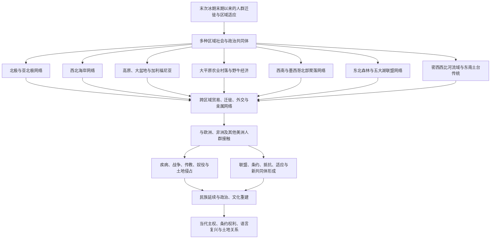

# 北美原住民

## 范围

本笔记讨论北极圈、加拿大与阿拉斯加、今美国本土和墨西哥北部之间的原住民历史。现代国界形成得很晚，许多民族的领地、迁徙路线、亲属关系和贸易网络跨越今天的美国、加拿大与墨西哥，因此不能把它们分别压缩成单一国家的“史前史”。

“北美原住民”是便于导航的总称，不代表一个民族、一种文明或一条统一的发展路线。加拿大常把 First Nations、Inuit、Métis 作为并列的制度性称谓，三者各有特定历史与政治身份；Métis 不是“混血”的泛称。美国有部落民族、阿拉斯加原住民族等不同政治身份，墨西哥北部也有延续至今的原住民族；具体笔记应优先使用各民族自己的名称。

## 概括

考古证据表明，距今至少约1.5万年北美已有稳定人口；更早遗址与进入路线仍在研究和争论中。此后，人们在多种生态环境中形成狩猎、采集、渔业、农业、城镇、联盟和远距离贸易等多样社会。北美历史既包括密西西比河流域的大型土台聚落、西南地区的灌溉农业和普韦布洛聚落，也包括北极海洋生计、太平原野牛经济、西北海岸渔业和东北森林联盟政治。

这些社会从来不是彼此隔绝的“文化岛”。水路、山口、草原与海岸把铜、黑曜石、贝壳、燧石、烟草、玉米、毛皮、马匹和礼仪知识带到远方。欧洲殖民者进入后，原住民族仍通过贸易、联盟、战争、条约、迁徙与文化重建主动塑造北美历史；殖民暴力并未使原住民历史在某一时点结束。

## 历史与关系图

## 主要区域网络

下表是理解环境与交流网络的入口，不是固定不变的民族分类。民族会迁徙、分化、结盟，也可能同时参与多个区域网络。

| 区域 | 代表民族 / 历史传统 | 社会与网络特点 |
|---|---|---|
| 北极与亚北极 | Inuit、Yupik、Unangan、Dene、Cree 等 | 海兽捕猎、渔猎与季节迁徙适应寒冷环境；海岸、河流和内陆路线连接白令海、北冰洋与森林地带。 |
| 西北海岸 | Tlingit、Haida、Tsimshian、Kwakwaka'wakw、海岸萨利希诸民族等 | 鲑鱼和海洋资源支持大型聚落、木构建筑、等级与礼仪交换；独木舟网络连接漫长海岸。 |
| 高原、大盆地与加利福尼亚 | Nimiipuu、Shoshone、Ute、Paiute 以及加利福尼亚众多民族 | 生计随河谷、山地、沙漠和橡树林而变化；根茎、橡实、渔猎和区域贸易都很重要，语言与政治共同体尤其多样。 |
| 大平原 | Blackfoot 联盟、Lakota / Dakota / Nakota、Pawnee、Mandan、Hidatsa、Comanche 等 | 既有定居农业村落，也有流动狩猎社会；马匹在17—18世纪扩散后重组交通、战争、贸易与野牛捕猎。 |
| 西南与墨西哥北部 | Pueblo 诸民族、O'odham、Diné、Apache 以及帕基梅等传统 | 灌溉农业、土坯或石砌聚落和沙漠贸易长期发展；绿松石、贝壳、棉织物等把本区连接到大平原、加利福尼亚和中部美洲。 |
| 东北森林与五大湖 | Haudenosaunee、Wendat、Anishinaabe 及多支阿尔冈昆语民族 | 玉米农业、渔猎、长屋村落与水路贸易并存；联盟、议事和条约外交在殖民竞争中持续发挥作用。 |
| 密西西比河流域与东南 | 密西西比文化诸中心、Muscogee、Cherokee、Choctaw、Chickasaw、Natchez 等 | 玉米农业和河网支持土台、城镇与区域性政治中心；卡霍基亚约在11—14世纪成为墨西哥以北规模最大的城市中心。 |

## 关键历史线索

### 农业、聚落与政治多样性

- 北美东部在玉米普及前已有本地植物驯化传统；玉米、豆类和南瓜后来在许多地区形成重要农业组合。
- 西南地区的祖先普韦布洛、霍霍卡姆等传统发展出聚落、道路、水利和跨沙漠交流，但不能简单等同于任何单一现代民族。
- 约公元1000年后，密西西比文化网络在河谷形成众多土台中心。卡霍基亚影响广泛，却没有统一整个北美。
- Haudenosaunee 联盟等政治共同体以议事、氏族和民族间外交维系秩序；其形成时间与叙事应尊重口述传统，不机械套用一个欧洲纪年起点。

### 接触、殖民与原住民能动性

- 欧洲传入的疾病在不少地区造成严重人口损失，但影响发生的时间、强度和恢复过程并不相同。
- 毛皮贸易、马匹与枪支改变部分地区的力量关系；原住民族会选择伙伴、控制运输节点，并把欧洲帝国纳入既有外交网络。
- 法国、英国、西班牙、荷兰和俄国的殖民扩张依赖原住民知识与劳动力，也伴随传教、奴役、强制迁徙、条约违背和土地侵占。
- 殖民战争常使联盟内部面临艰难选择。例如美国独立战争令 Haudenosaunee 各民族出现不同立场，战争结果又带来新的迁徙和领土压力。
- 美国和加拿大后来推行保留地 / 保留区、寄宿学校、同化和儿童分离政策；墨西哥的国家整合与边疆开发也持续改变北部原住民族的土地与自治。

## 当代延续

- 原住民族不是只存在于“接触前”的群体，而是具有当代政府、社区、法律身份和跨境亲属关系的政治主体。
- 条约权利、土地返还、狩猎与捕鱼权、水资源、圣地保护和文物归还是持续至今的议题。
- 语言教育、口述史、传统生态知识、艺术、仪式和社区档案正在被积极维护或复兴。
- 有些民族生活在保留地或保留区，也有大量原住民生活在城市；居住地变化不等于民族身份和主权关系消失。
- 书写具体民族时，应把其自身名称、口述传统和当代延续放在中心，避免用“消失”“被取代”概括复杂历史。

## 相关笔记

- 上级目录：[北美](/%E4%BA%BA%E6%96%87%E7%A7%91%E5%AD%A6/%E5%8E%86%E5%8F%B2/%E7%BE%8E%E6%B4%B2/%E5%8C%97%E7%BE%8E/README.md)。
- 区域总览：[美洲历史](/%E4%BA%BA%E6%96%87%E7%A7%91%E5%AD%A6/%E5%8E%86%E5%8F%B2/%E7%BE%8E%E6%B4%B2/README.md)。
- 欧洲殖民进入北美后的多方竞争：[殖民北美](/%E4%BA%BA%E6%96%87%E7%A7%91%E5%AD%A6/%E5%8E%86%E5%8F%B2/%E7%BE%8E%E6%B4%B2/%E5%8C%97%E7%BE%8E/%E6%AE%96%E6%B0%91%E5%8C%97%E7%BE%8E/README.md)。
