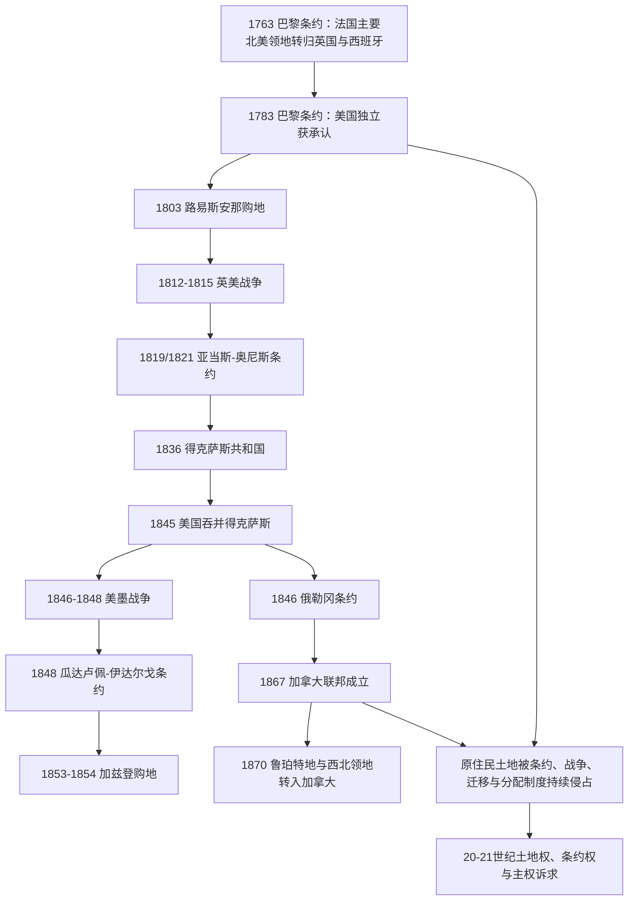

# 北美大陆的边界重组

## 时间

1763年至19世纪末；土地、条约与主权争议延续至今。

## 概括

1763年以后，北美大陆的政治地图先后经历英法帝国权力转移、美国独立、墨西哥独立、美国向西扩张和加拿大联邦扩展。地图上的国家边界变化常由战争、购地和外交条约表示，但这些土地并非“无人边疆”：原住民族拥有自身领地、政治共同体和条约关系。国家扩张通常伴随军事征服、强制迁移、保留地制度、定居殖民和资源控制。

## 边界变化主线

## 主要节点

| 时间 | 变化 | 说明 |
|---|---|---|
| 1763年 | 七年战争后的帝国重组 | 英国取得加拿大及密西西比河以东的多数原法属领地；西班牙取得路易斯安那西部等地。 |
| 1783年 | 美国疆界获英国承认 | 新国家取得从大西洋至密西西比河的广阔权利主张，但实际控制与原住民领地并不重合。 |
| 1803年 | 路易斯安那购地 | 美国从法国购得密西西比河以西的大面积权利主张，推动勘测、贸易和定居扩张。 |
| 1812-1815年 | 英美战争 | 未导致大规模正式割地，却强化美国与英属北美之间的政治分化和边境认同。 |
| 1819年签署、1821年生效 | 《亚当斯-奥尼斯条约》 | 西班牙将佛罗里达让予美国，并划定美国与新西班牙西部边界。 |
| 1836年 | 得克萨斯脱离墨西哥 | 得克萨斯共和国建立；墨西哥不承认其独立，边界争议延续。 |
| 1845年 | 美国吞并得克萨斯 | 直接加剧美墨冲突。 |
| 1846年 | 《俄勒冈条约》 | 英美在落基山以西大体沿北纬49度划界，温哥华岛保留给英国。 |
| 1846-1848年 | 美墨战争与墨西哥割地 | 美国取得今日加利福尼亚、内华达、犹他及亚利桑那、新墨西哥、科罗拉多和怀俄明部分地区的权利主张。 |
| 1853年签署、1854年生效 | 加兹登购地 | 美国取得今日亚利桑那州南部和新墨西哥州西南部，现代美墨陆地边界大体成形；后续河界条约仍继续校定边界。 |
| 1867年 | 加拿大联邦与阿拉斯加易手 | 加拿大联邦成立；同年美国从俄国购得阿拉斯加，两者是相互独立的事件。 |
| 1870年 | 加拿大取得鲁珀特地和西北领地 | 加拿大向西、向北扩展；红河抵抗促成马尼托巴省建立。 |

## 原住民土地与国家扩张

- 美国扩张过程中，联邦和州政府通过战争、条约、迁移法、保留地与土地分配制度削弱原住民族对土地的控制。1830年《印第安人迁移法》及“眼泪之路”是其中的重要节点。
- 加拿大西部扩展依靠编号条约、土地测量、铁路与警察机构，同时与梅蒂人和第一民族发生红河抵抗、1885年西北抵抗等冲突。
- 很多条约的文本、口头承诺、签署条件和主权含义存在长期争议。现代法院判决、土地索赔和自治协定并非“过去问题”的附注，而是边界形成史的延续。
- “边疆关闭”是定居殖民国家的叙事，不表示原住民社会、迁徙路线和土地权关系终止。

## 演变关系

- 前一节点：[殖民北美](/%E4%BA%BA%E6%96%87%E7%A7%91%E5%AD%A6/%E5%8E%86%E5%8F%B2/%E7%BE%8E%E6%B4%B2/%E5%8C%97%E7%BE%8E/%E6%AE%96%E6%B0%91%E5%8C%97%E7%BE%8E/README.md)。
- 美国主线：[美国历史](/%E4%BA%BA%E6%96%87%E7%A7%91%E5%AD%A6/%E5%8E%86%E5%8F%B2/%E7%BE%8E%E6%B4%B2/%E5%8C%97%E7%BE%8E/%E7%BE%8E%E5%9B%BD/README.md)。
- 加拿大主线：[加拿大历史](/%E4%BA%BA%E6%96%87%E7%A7%91%E5%AD%A6/%E5%8E%86%E5%8F%B2/%E7%BE%8E%E6%B4%B2/%E5%8C%97%E7%BE%8E/%E5%8A%A0%E6%8B%BF%E5%A4%A7/README.md)。
- 南部边疆：[墨西哥北部边疆](/%E4%BA%BA%E6%96%87%E7%A7%91%E5%AD%A6/%E5%8E%86%E5%8F%B2/%E7%BE%8E%E6%B4%B2/%E5%8C%97%E7%BE%8E/%E5%A2%A8%E8%A5%BF%E5%93%A5%E5%8C%97%E9%83%A8%E8%BE%B9%E7%96%86.md)。
- 后一节点：[现代北美区域秩序](/%E4%BA%BA%E6%96%87%E7%A7%91%E5%AD%A6/%E5%8E%86%E5%8F%B2/%E7%BE%8E%E6%B4%B2/%E5%8C%97%E7%BE%8E/%E7%8E%B0%E4%BB%A3%E5%8C%97%E7%BE%8E%E5%8C%BA%E5%9F%9F%E7%A7%A9%E5%BA%8F.md)。
- 所属总览：[北美历史](/%E4%BA%BA%E6%96%87%E7%A7%91%E5%AD%A6/%E5%8E%86%E5%8F%B2/%E7%BE%8E%E6%B4%B2/%E5%8C%97%E7%BE%8E/README.md)。
