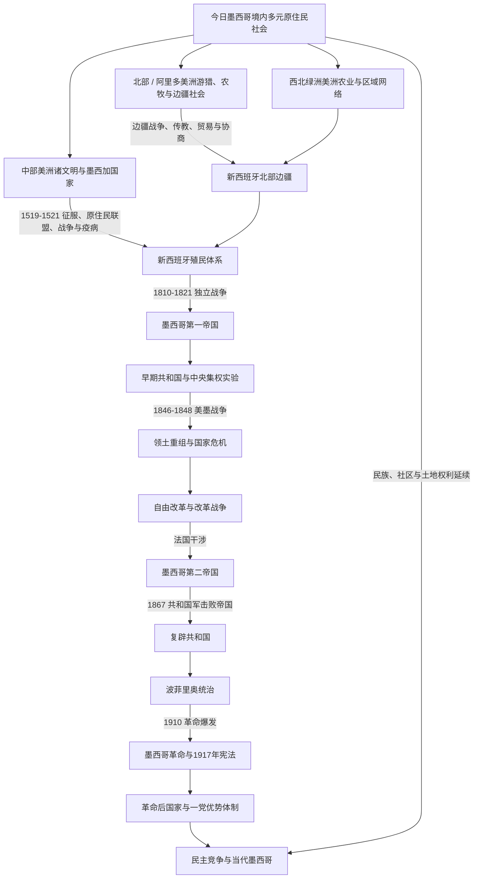

# 墨西哥历史

## 概括

墨西哥历史连接北美、中部美洲、加勒比、太平洋和大西洋世界。今日国境内长期存在多种原住民社会；中部美洲文明只是其中一部分。16世纪西班牙征服和新西班牙殖民体系重组人口、土地、宗教与全球贸易；1821年独立后，国家又经历帝国与共和国转换、领土战争、自由改革、法国干涉、波菲里奥统治、革命和革命后制度化。

墨西哥在地理上属于北美。本目录承担连续的国家通史；中部美洲文明、新西班牙区域史和北部边疆等细节继续由现有专题维护。

## 历史主线

图中的中部美洲、阿里多美洲和绿洲美洲是相互联系的历史文化空间，不是封闭或固定的民族分类。现代墨西哥的原住民前史不能只从墨西加或中部美洲单线起步。

## 阶段导航

| 顺序 | 阶段 | 时间 | 主线 |
|---:|---|---|---|
| 1 | 多元原住民社会：[中部美洲文明与墨西加国家](/%E4%BA%BA%E6%96%87%E7%A7%91%E5%AD%A6/%E5%8E%86%E5%8F%B2/%E7%BE%8E%E6%B4%B2/%E5%8C%97%E7%BE%8E/%E5%A2%A8%E8%A5%BF%E5%93%A5/%E4%B8%AD%E9%83%A8%E7%BE%8E%E6%B4%B2%E6%96%87%E6%98%8E%E4%B8%8E%E5%A2%A8%E8%A5%BF%E5%8A%A0%E5%9B%BD%E5%AE%B6.md)与[墨西哥北部边疆](/%E4%BA%BA%E6%96%87%E7%A7%91%E5%AD%A6/%E5%8E%86%E5%8F%B2/%E7%BE%8E%E6%B4%B2/%E5%8C%97%E7%BE%8E/%E5%A2%A8%E8%A5%BF%E5%93%A5%E5%8C%97%E9%83%A8%E8%BE%B9%E7%96%86.md) | 史前至16世纪，社会延续至今 | 中部美洲、北部 / 阿里多美洲与西北绿洲美洲等多条主线并行。 |
| 2 | [西班牙征服与新西班牙](/%E4%BA%BA%E6%96%87%E7%A7%91%E5%AD%A6/%E5%8E%86%E5%8F%B2/%E7%BE%8E%E6%B4%B2/%E5%8C%97%E7%BE%8E/%E5%A2%A8%E8%A5%BF%E5%93%A5/%E8%A5%BF%E7%8F%AD%E7%89%99%E5%BE%81%E6%9C%8D%E4%B8%8E%E6%96%B0%E8%A5%BF%E7%8F%AD%E7%89%99.md) | 1519-1821年 | 征服、殖民治理、白银经济、天主教和全球贸易。 |
| 3 | [独立、第一帝国与早期共和国](/%E4%BA%BA%E6%96%87%E7%A7%91%E5%AD%A6/%E5%8E%86%E5%8F%B2/%E7%BE%8E%E6%B4%B2/%E5%8C%97%E7%BE%8E/%E5%A2%A8%E8%A5%BF%E5%93%A5/%E7%8B%AC%E7%AB%8B%E3%80%81%E7%AC%AC%E4%B8%80%E5%B8%9D%E5%9B%BD%E4%B8%8E%E6%97%A9%E6%9C%9F%E5%85%B1%E5%92%8C%E5%9B%BD.md) | 1810-1855年 | 独立战争、帝制失败、联邦与中央制冲突及美墨战争。 |
| 4 | [改革战争、法国干涉与复辟共和国](/%E4%BA%BA%E6%96%87%E7%A7%91%E5%AD%A6/%E5%8E%86%E5%8F%B2/%E7%BE%8E%E6%B4%B2/%E5%8C%97%E7%BE%8E/%E5%A2%A8%E8%A5%BF%E5%93%A5/%E6%94%B9%E9%9D%A9%E6%88%98%E4%BA%89%E3%80%81%E6%B3%95%E5%9B%BD%E5%B9%B2%E6%B6%89%E4%B8%8E%E5%A4%8D%E8%BE%9F%E5%85%B1%E5%92%8C%E5%9B%BD.md) | 1855-1876年 | 自由改革、内战、第二帝国和共和国重建。 |
| 5 | [波菲里奥统治与墨西哥革命](/%E4%BA%BA%E6%96%87%E7%A7%91%E5%AD%A6/%E5%8E%86%E5%8F%B2/%E7%BE%8E%E6%B4%B2/%E5%8C%97%E7%BE%8E/%E5%A2%A8%E8%A5%BF%E5%93%A5/%E6%B3%A2%E8%8F%B2%E9%87%8C%E5%A5%A5%E7%BB%9F%E6%B2%BB%E4%B8%8E%E5%A2%A8%E8%A5%BF%E5%93%A5%E9%9D%A9%E5%91%BD.md) | 1876-1920年 | 秩序与经济增长、土地集中、革命和宪政重建。 |
| 6 | [革命后国家与当代墨西哥](/%E4%BA%BA%E6%96%87%E7%A7%91%E5%AD%A6/%E5%8E%86%E5%8F%B2/%E7%BE%8E%E6%B4%B2/%E5%8C%97%E7%BE%8E/%E5%A2%A8%E8%A5%BF%E5%93%A5/%E9%9D%A9%E5%91%BD%E5%90%8E%E5%9B%BD%E5%AE%B6%E4%B8%8E%E5%BD%93%E4%BB%A3%E5%A2%A8%E8%A5%BF%E5%93%A5.md) | 1920年至今 | 革命制度化、民族主义发展、一党优势、市场改革和民主竞争。 |

## 关键辨析

- “中部美洲”是文化历史区，不等于现代墨西哥国境，也不等于地理中美洲七国。
- 西班牙征服不是少数欧洲人单独击败整个地区；原住民联盟、既有政治矛盾和疫病都至关重要。
- 1821年独立没有立即带来稳定国家，帝国、联邦共和国和中央共和国多次转换。
- 波菲里奥时期的铁路、出口和财政增长与土地集中、劳工压迫和政治排斥同时存在。
- 墨西哥革命不是单一阵营的一场战争，而是多地区、多领袖和不同社会诉求交错的长期革命。

## 跨区域转折

| 外部区域 / 政治体 | 转折 | 入口 |
|---|---|---|
| 西班牙 | 1519年后征服联盟与殖民建制、王室治理、天主教和帝国贸易重组今日墨西哥多地 | [西班牙历史](/%E4%BA%BA%E6%96%87%E7%A7%91%E5%AD%A6/%E5%8E%86%E5%8F%B2/%E6%AC%A7%E6%B4%B2/%E4%BC%8A%E6%AF%94%E5%88%A9%E4%BA%9A%E5%8D%8A%E5%B2%9B/%E8%A5%BF%E7%8F%AD%E7%89%99/README.md)、[西班牙征服与新西班牙](/%E4%BA%BA%E6%96%87%E7%A7%91%E5%AD%A6/%E5%8E%86%E5%8F%B2/%E7%BE%8E%E6%B4%B2/%E5%8C%97%E7%BE%8E/%E5%A2%A8%E8%A5%BF%E5%93%A5/%E8%A5%BF%E7%8F%AD%E7%89%99%E5%BE%81%E6%9C%8D%E4%B8%8E%E6%96%B0%E8%A5%BF%E7%8F%AD%E7%89%99.md) |
| 美国 | 得克萨斯分离、美墨战争、边界重组以及后来的贸易、迁移与安全关系 | [美国历史](/%E4%BA%BA%E6%96%87%E7%A7%91%E5%AD%A6/%E5%8E%86%E5%8F%B2/%E7%BE%8E%E6%B4%B2/%E5%8C%97%E7%BE%8E/%E7%BE%8E%E5%9B%BD/README.md)、[北美大陆的边界重组](/%E4%BA%BA%E6%96%87%E7%A7%91%E5%AD%A6/%E5%8E%86%E5%8F%B2/%E7%BE%8E%E6%B4%B2/%E5%8C%97%E7%BE%8E/%E5%8C%97%E7%BE%8E%E5%A4%A7%E9%99%86%E7%9A%84%E8%BE%B9%E7%95%8C%E9%87%8D%E7%BB%84.md) |
| 法国 | 19世纪债务争端、军事干涉与墨西哥第二帝国构成共和国重建的重要断裂 | [法国历史](/%E4%BA%BA%E6%96%87%E7%A7%91%E5%AD%A6/%E5%8E%86%E5%8F%B2/%E6%AC%A7%E6%B4%B2/%E6%B3%95%E5%9B%BD/README.md)、[改革战争、法国干涉与复辟共和国](/%E4%BA%BA%E6%96%87%E7%A7%91%E5%AD%A6/%E5%8E%86%E5%8F%B2/%E7%BE%8E%E6%B4%B2/%E5%8C%97%E7%BE%8E/%E5%A2%A8%E8%A5%BF%E5%93%A5/%E6%94%B9%E9%9D%A9%E6%88%98%E4%BA%89%E3%80%81%E6%B3%95%E5%9B%BD%E5%B9%B2%E6%B6%89%E4%B8%8E%E5%A4%8D%E8%BE%9F%E5%85%B1%E5%92%8C%E5%9B%BD.md) |
| 太平洋网络 | 阿卡普尔科—马尼拉大帆船把美洲白银、亚洲商品、菲律宾殖民地与新西班牙连接起来 | [新西班牙与墨西哥中南部](/%E4%BA%BA%E6%96%87%E7%A7%91%E5%AD%A6/%E5%8E%86%E5%8F%B2/%E7%BE%8E%E6%B4%B2/%E4%B8%AD%E7%BE%8E%E6%B4%B2/%E6%96%B0%E8%A5%BF%E7%8F%AD%E7%89%99%E4%B8%8E%E5%A2%A8%E8%A5%BF%E5%93%A5%E4%B8%AD%E5%8D%97%E9%83%A8.md)、[西班牙殖民菲律宾](/%E4%BA%BA%E6%96%87%E7%A7%91%E5%AD%A6/%E5%8E%86%E5%8F%B2/%E4%B8%9C%E5%8D%97%E4%BA%9A/%E8%8F%B2%E5%BE%8B%E5%AE%BE/%E8%A5%BF%E7%8F%AD%E7%89%99%E6%AE%96%E6%B0%91%E8%8F%B2%E5%BE%8B%E5%AE%BE.md) |

## 既有专题

- [中部美洲文明](/%E4%BA%BA%E6%96%87%E7%A7%91%E5%AD%A6/%E5%8E%86%E5%8F%B2/%E7%BE%8E%E6%B4%B2/%E4%B8%AD%E7%BE%8E%E6%B4%B2/%E4%B8%AD%E9%83%A8%E7%BE%8E%E6%B4%B2%E6%96%87%E6%98%8E.md)
- [新西班牙与墨西哥中南部](/%E4%BA%BA%E6%96%87%E7%A7%91%E5%AD%A6/%E5%8E%86%E5%8F%B2/%E7%BE%8E%E6%B4%B2/%E4%B8%AD%E7%BE%8E%E6%B4%B2/%E6%96%B0%E8%A5%BF%E7%8F%AD%E7%89%99%E4%B8%8E%E5%A2%A8%E8%A5%BF%E5%93%A5%E4%B8%AD%E5%8D%97%E9%83%A8.md)
- [墨西哥北部边疆](/%E4%BA%BA%E6%96%87%E7%A7%91%E5%AD%A6/%E5%8E%86%E5%8F%B2/%E7%BE%8E%E6%B4%B2/%E5%8C%97%E7%BE%8E/%E5%A2%A8%E8%A5%BF%E5%93%A5%E5%8C%97%E9%83%A8%E8%BE%B9%E7%96%86.md)

## 直接上级

- [北美历史](/%E4%BA%BA%E6%96%87%E7%A7%91%E5%AD%A6/%E5%8E%86%E5%8F%B2/%E7%BE%8E%E6%B4%B2/%E5%8C%97%E7%BE%8E/README.md)
