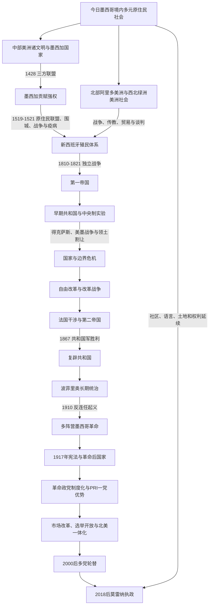

# 墨西哥历史

## 概括

墨西哥位于北美，却同时连接中部美洲、加勒比、大西洋与太平洋世界。今日国境内长期存在中部美洲、阿里多美洲、绿洲美洲及跨区社会，现代国家不能只从墨西加单线起源。15世纪墨西加主导的三方联盟建立贡赋强权；1519—1521年西班牙远征依靠众多原住民盟军、攻城技术和疫病环境摧毁其首都，随后用三个世纪逐步建立新西班牙殖民秩序。

1821年独立没有立即产生稳定共和国。第一帝国迅速倒台，联邦与中央制、文官与军人、州与中央、教会与自由改革派反复冲突；得克萨斯分离和美墨战争造成巨大领土重组。1850—1860年代，自由改革、内战和法国干涉决定世俗联邦共和国最终取代君主制方案。迪亚斯长期统治带来铁路、出口与财政整合，也使土地、劳工和政治排斥加深，1910年后爆发多阵营革命。1920年起革命胜利派以强总统、群众组织和执政党制度化国家，革命制度党形成长期一党优势；1980年代后市场改革与选举开放并行，2000年实现总统府政党轮替，2018年莫雷纳崛起重组政党体系。

## 历史主线

图中的文化区不是封闭民族分类；中部美洲也不等于现代地理“中美洲”。灭亡关系按被灭政权指向征服者 / 后继秩序书写，但原住民社会本身没有随政权更替消失。

## 分期概述

### 多元文明与墨西加晚期国家

玉米农业、城市、城邦、历法、文字和远距离贸易在不同生态区长期发展。奥尔梅克相关中心、特奥蒂瓦坎、萨波特克、米斯特克、玛雅诸城邦和图拉之间存在影响与记忆，却不是一条王朝直系世系。墨西加先依附阿斯卡波察尔科，1428年前后与特斯科科、特拉科潘结成三方联盟，通过间接统治和贡赋迅速扩张；其地方控制不均，为1519年后反墨西加联盟留下政治空间。

### 征服与殖民重组

科尔特斯远征的翻译、托托纳克和特拉斯卡拉等盟军、墨西哥盆地城邦竞争、天花与湖上围城共同导致1521年特诺奇蒂特兰陷落。西班牙王权随后以审理院、总督、教会、原住民共和国和地方城市组成多层殖民国家。人口灾难、土地劳役与宗教强制并存，原住民和非洲裔社区也持续诉讼、协商和文化重建。白银、韦拉克鲁斯贸易和阿卡普尔科—马尼拉航线把新西班牙接入全球网络。波旁改革加强财政军政控制，1808年西班牙王朝危机则摧毁共同合法性。

### 独立、国家危机与自由共和国

1810年伊达尔戈起义、莫雷洛斯制宪、地方游击和1821年伊图尔维德—格雷罗联盟共同完成独立。第一帝国因财政、国会和省级反对在1823年灭亡；1824年联邦共和国建立后，军人计划、薄弱税基和州—中央冲突造成频繁交接。1835年中央制加快得克萨斯分离，美墨战争又使墨西哥割让大片北部领土。

1855年自由派推翻圣安纳，以司法平等、法人土地出售和世俗国家重建共和国；1858—1860年改革战争形成自由派与保守派两政府。法国随后试图建立马克西米连第二帝国，但胡亚雷斯共和国保持宪法连续，法军撤离后于1867年胜利。复辟共和国延续改革，也未解决军人、地方和连任争议。

### 波菲里奥体制与革命

迪亚斯1876年以反连任起兵，1884年后通过州长联盟、受控选举、军警和技术官僚长期连任。铁路、矿业、出口与外资增长和土地集中、劳工镇压、接班封闭同步发展。1910年马德罗反连任起义推翻迪亚斯；1913年韦尔塔政变杀害马德罗，又遭卡兰萨、奥夫雷贡、比利亚和萨帕塔等不同力量反对。韦尔塔倒台后革命联盟内战，卡兰萨派取得主要城市并制定1917年宪法。1920年索诺拉派以阿瓜普列塔起义推翻卡兰萨，主要国家重建阶段开始。

### 革命制度化与当代转型

1929年国民革命党把军政派系纳入继承机制；卡德纳斯通过土地改革、群众组织和石油国有化扩展革命国家。1946年后革命制度党以强总统、公司主义组织和定期选举维持一党优势，工业化与城市化伴随不平等和政治镇压。1982年债务危机推动市场化和贸易开放，1994年北美自由贸易协定、萨帕塔起义与比索危机集中展示转型矛盾。选举改革促成2000年国家行动党胜选；2012年PRI短暂回归，2018年莫雷纳执政。克劳迪娅·辛鲍姆2024年10月1日就任首位女性总统，现任状态核验至2026年7月14日。

## 阶段导航

| 顺序 | 阶段 | 时间 | 主线 |
|---:|---|---|---|
| 1 | [中部美洲文明与墨西加国家](/%E4%BA%BA%E6%96%87%E7%A7%91%E5%AD%A6/%E5%8E%86%E5%8F%B2/%E7%BE%8E%E6%B4%B2/%E5%8C%97%E7%BE%8E/%E5%A2%A8%E8%A5%BF%E5%93%A5/%E4%B8%AD%E9%83%A8%E7%BE%8E%E6%B4%B2%E6%96%87%E6%98%8E%E4%B8%8E%E5%A2%A8%E8%A5%BF%E5%8A%A0%E5%9B%BD%E5%AE%B6.md) | 约前2000年—1521年 | 多中心文明、墨西哥盆地城邦、三方联盟崛起及其瓦解。 |
| 2 | [西班牙征服与新西班牙](/%E4%BA%BA%E6%96%87%E7%A7%91%E5%AD%A6/%E5%8E%86%E5%8F%B2/%E7%BE%8E%E6%B4%B2/%E5%8C%97%E7%BE%8E/%E5%A2%A8%E8%A5%BF%E5%93%A5/%E8%A5%BF%E7%8F%AD%E7%89%99%E5%BE%81%E6%9C%8D%E4%B8%8E%E6%96%B0%E8%A5%BF%E7%8F%AD%E7%89%99.md) | 1519—1821年 | 征服联盟、殖民行政、人口与土地重组、白银和独立战争。 |
| 3 | [独立、第一帝国与早期共和国](/%E4%BA%BA%E6%96%87%E7%A7%91%E5%AD%A6/%E5%8E%86%E5%8F%B2/%E7%BE%8E%E6%B4%B2/%E5%8C%97%E7%BE%8E/%E5%A2%A8%E8%A5%BF%E5%93%A5/%E7%8B%AC%E7%AB%8B%E3%80%81%E7%AC%AC%E4%B8%80%E5%B8%9D%E5%9B%BD%E4%B8%8E%E6%97%A9%E6%9C%9F%E5%85%B1%E5%92%8C%E5%9B%BD.md) | 1810—1855年 | 独立、帝制失败、联邦—中央冲突、得克萨斯与美墨战争。 |
| 4 | [改革战争、法国干涉与复辟共和国](/%E4%BA%BA%E6%96%87%E7%A7%91%E5%AD%A6/%E5%8E%86%E5%8F%B2/%E7%BE%8E%E6%B4%B2/%E5%8C%97%E7%BE%8E/%E5%A2%A8%E8%A5%BF%E5%93%A5/%E6%94%B9%E9%9D%A9%E6%88%98%E4%BA%89%E3%80%81%E6%B3%95%E5%9B%BD%E5%B9%B2%E6%B6%89%E4%B8%8E%E5%A4%8D%E8%BE%9F%E5%85%B1%E5%92%8C%E5%9B%BD.md) | 1855—1876年 | 改革法、两政府内战、第二帝国、共和国复辟与反连任革命。 |
| 5 | [波菲里奥统治与墨西哥革命](/%E4%BA%BA%E6%96%87%E7%A7%91%E5%AD%A6/%E5%8E%86%E5%8F%B2/%E7%BE%8E%E6%B4%B2/%E5%8C%97%E7%BE%8E/%E5%A2%A8%E8%A5%BF%E5%93%A5/%E6%B3%A2%E8%8F%B2%E9%87%8C%E5%A5%A5%E7%BB%9F%E6%B2%BB%E4%B8%8E%E5%A2%A8%E8%A5%BF%E5%93%A5%E9%9D%A9%E5%91%BD.md) | 1876—1920年 | 威权现代化、土地与劳工矛盾、多阵营革命和1917年宪法。 |
| 6 | [革命后国家与当代墨西哥](/%E4%BA%BA%E6%96%87%E7%A7%91%E5%AD%A6/%E5%8E%86%E5%8F%B2/%E7%BE%8E%E6%B4%B2/%E5%8C%97%E7%BE%8E/%E5%A2%A8%E8%A5%BF%E5%93%A5/%E9%9D%A9%E5%91%BD%E5%90%8E%E5%9B%BD%E5%AE%B6%E4%B8%8E%E5%BD%93%E4%BB%A3%E5%A2%A8%E8%A5%BF%E5%93%A5.md) | 1920年至今 | 革命制度化、PRI一党优势、市场转型、多党竞争与莫雷纳。 |

## 世系与行政首脑专表

| 专表 | 覆盖范围 | 使用说明 |
|---|---|---|
| [墨西加特拉托阿尼世系表](/%E4%BA%BA%E6%96%87%E7%A7%91%E5%AD%A6/%E5%8E%86%E5%8F%B2/%E7%BE%8E%E6%B4%B2/%E5%8C%97%E7%BE%8E/%E5%A2%A8%E8%A5%BF%E5%93%A5/%E5%A2%A8%E8%A5%BF%E5%8A%A0%E7%89%B9%E6%8B%89%E6%89%98%E9%98%BF%E5%B0%BC%E4%B8%96%E7%B3%BB%E8%A1%A8.md) | 约1375/1376—1525年 | 从阿卡马皮奇特利至夸乌特莫克，另列传统前王朝领袖特诺奇；说明议选继承与年代争议。 |
| [新西班牙总督与临时行政首脑表](/%E4%BA%BA%E6%96%87%E7%A7%91%E5%AD%A6/%E5%8E%86%E5%8F%B2/%E7%BE%8E%E6%B4%B2/%E5%8C%97%E7%BE%8E/%E5%A2%A8%E8%A5%BF%E5%93%A5/%E6%96%B0%E8%A5%BF%E7%8F%AD%E7%89%99%E6%80%BB%E7%9D%A3%E4%B8%8E%E4%B8%B4%E6%97%B6%E8%A1%8C%E6%94%BF%E9%A6%96%E8%84%91%E8%A1%A8.md) | 1521—1821年 | 连续列科尔特斯政府、两届审理院、历任总督、审理院代行和末任最高政治长官。 |
| [墨西哥国家元首表](/%E4%BA%BA%E6%96%87%E7%A7%91%E5%AD%A6/%E5%8E%86%E5%8F%B2/%E7%BE%8E%E6%B4%B2/%E5%8C%97%E7%BE%8E/%E5%A2%A8%E8%A5%BF%E5%93%A5/%E5%A2%A8%E8%A5%BF%E5%93%A5%E5%9B%BD%E5%AE%B6%E5%85%83%E9%A6%96%E8%A1%A8.md) | 1821年至今 | 摄政成员、皇帝、合议行政、每届总统与临时总统、内战并立政府及多次任职逐项列全。 |

## 重要转折与时间节点

| 时间 | 转折 | 主要后果 |
|---|---|---|
| 约前2000年以后 | 定居农业与复杂聚落扩展 | 中部美洲多种城市和知识传统形成。 |
| 1428年前后 | 墨西加、特斯科科、特拉科潘击败阿斯卡波察尔科 | 三方联盟建立，贡赋扩张加速。 |
| 1521年8月13日 | 特诺奇蒂特兰陷落 | 墨西加首都政权瓦解，新西班牙重组开始。 |
| 1535年 | 新西班牙总督制建立 | 王室官僚制加强，征服者个人统治受限。 |
| 1810年9月 | 多洛雷斯呼声 | 十一年独立战争开始。 |
| 1821年9月 | 三保证军入城与独立宣言 | 殖民最高权力转为独立摄政。 |
| 1823—1824年 | 第一帝国倒台、联邦宪法颁布 | 共和国与联邦建制确立。 |
| 1835—1836年 | 中央制与得克萨斯分离 | 州—中央危机演变为北部领土分裂。 |
| 1846—1848年 | 美墨战争 | 墨西哥战败并割让大片北部领土。 |
| 1857—1860年 | 宪法、改革法与改革战争 | 世俗联邦共和国击败保守派政府。 |
| 1864—1867年 | 第二帝国与共和国并立 | 法军撤离后帝国灭亡，共和国复辟。 |
| 1876年 | 图斯特佩克革命 | 迪亚斯进入权力中心，长期威权体制开始。 |
| 1910—1917年 | 反连任起义、内战与新宪法 | 旧军政秩序瓦解，社会权利写入宪法。 |
| 1929年 | 国民革命党成立 | 总统继承和革命派系竞争制度化。 |
| 1938年 | 石油国有化 | 国家经济民族主义和卡德纳斯改革达到高峰。 |
| 1968年 | 特拉特洛尔科镇压 | 一党优势体制合法性遭重大打击。 |
| 1982年 | 债务危机 | 国家主导发展转向市场改革和贸易开放。 |
| 1994年 | NAFTA、萨帕塔起义和比索危机 | 北美一体化、原住民权利和金融脆弱性同时凸显。 |
| 2000年 | 国家行动党赢得总统选举 | PRI连续71年控制总统府终结。 |
| 2018年 | 莫雷纳赢得总统与国会优势 | 政党体系和政策方向再次重组。 |
| 2024年 | 辛鲍姆就任 | 墨西哥首位女性总统，莫雷纳执政延续。 |

## 关键辨析

- “中部美洲”是历史文化区，不是现代墨西哥或地理中美洲七国的同义词。
- 西班牙征服依靠大规模原住民联盟；疫病重要但不是唯一原因。
- 1821年是政治独立，不是财政、土地、族群和国家能力问题的终点。
- 自由改革建立法律平等和世俗国家，也使部分原住民共同土地更易被私人兼并。
- 波菲里奥时期的经济现代化与政治压制、土地集中并存，不能只用“进步”或“停滞”概括。
- 墨西哥革命由多地区、多领袖和相互冲突的社会目标构成。
- PRI长期统治属于一党优势，而非没有选举的单一形式；2000年轮替也不等于安全和司法问题解决。
- 当代现任人物与“至今”状态会变化，本页核验截止2026年7月14日。

## 跨区域入口

| 区域 / 政治体 | 关键联系 | 入口 |
|---|---|---|
| 西班牙 | 征服、王室治理、教会与帝国贸易；1808年王朝危机触发主权争论。 | [西班牙历史](/%E4%BA%BA%E6%96%87%E7%A7%91%E5%AD%A6/%E5%8E%86%E5%8F%B2/%E6%AC%A7%E6%B4%B2/%E4%BC%8A%E6%AF%94%E5%88%A9%E4%BA%9A%E5%8D%8A%E5%B2%9B/%E8%A5%BF%E7%8F%AD%E7%89%99/README.md) |
| 美国 | 得克萨斯、美墨战争、移民、贸易、安全与制造业供应链。 | [美国历史](/%E4%BA%BA%E6%96%87%E7%A7%91%E5%AD%A6/%E5%8E%86%E5%8F%B2/%E7%BE%8E%E6%B4%B2/%E5%8C%97%E7%BE%8E/%E7%BE%8E%E5%9B%BD/README.md)、[北美大陆的边界重组](/%E4%BA%BA%E6%96%87%E7%A7%91%E5%AD%A6/%E5%8E%86%E5%8F%B2/%E7%BE%8E%E6%B4%B2/%E5%8C%97%E7%BE%8E/%E5%8C%97%E7%BE%8E%E5%A4%A7%E9%99%86%E7%9A%84%E8%BE%B9%E7%95%8C%E9%87%8D%E7%BB%84.md) |
| 法国 | 债务远征、第二帝国和共和国抵抗。 | [法国历史](/%E4%BA%BA%E6%96%87%E7%A7%91%E5%AD%A6/%E5%8E%86%E5%8F%B2/%E6%AC%A7%E6%B4%B2/%E6%B3%95%E5%9B%BD/README.md) |
| 中美洲 | 中部美洲文化区、新西班牙辖区与第一帝国分离。 | [中部美洲文明](/%E4%BA%BA%E6%96%87%E7%A7%91%E5%AD%A6/%E5%8E%86%E5%8F%B2/%E7%BE%8E%E6%B4%B2/%E4%B8%AD%E7%BE%8E%E6%B4%B2/%E4%B8%AD%E9%83%A8%E7%BE%8E%E6%B4%B2%E6%96%87%E6%98%8E.md)、[新西班牙与墨西哥中南部](/%E4%BA%BA%E6%96%87%E7%A7%91%E5%AD%A6/%E5%8E%86%E5%8F%B2/%E7%BE%8E%E6%B4%B2/%E4%B8%AD%E7%BE%8E%E6%B4%B2/%E6%96%B0%E8%A5%BF%E7%8F%AD%E7%89%99%E4%B8%8E%E5%A2%A8%E8%A5%BF%E5%93%A5%E4%B8%AD%E5%8D%97%E9%83%A8.md) |
| 菲律宾与太平洋 | 阿卡普尔科—马尼拉大帆船连接美洲白银与亚洲商品。 | [西班牙殖民菲律宾](/%E4%BA%BA%E6%96%87%E7%A7%91%E5%AD%A6/%E5%8E%86%E5%8F%B2/%E4%B8%9C%E5%8D%97%E4%BA%9A/%E8%8F%B2%E5%BE%8B%E5%AE%BE/%E8%A5%BF%E7%8F%AD%E7%89%99%E6%AE%96%E6%B0%91%E8%8F%B2%E5%BE%8B%E5%AE%BE.md) |

## 直接上级

- [北美历史](/%E4%BA%BA%E6%96%87%E7%A7%91%E5%AD%A6/%E5%8E%86%E5%8F%B2/%E7%BE%8E%E6%B4%B2/%E5%8C%97%E7%BE%8E/README.md)。
- 北部历史专题：[墨西哥北部边疆](/%E4%BA%BA%E6%96%87%E7%A7%91%E5%AD%A6/%E5%8E%86%E5%8F%B2/%E7%BE%8E%E6%B4%B2/%E5%8C%97%E7%BE%8E/%E5%A2%A8%E8%A5%BF%E5%93%A5%E5%8C%97%E9%83%A8%E8%BE%B9%E7%96%86.md)。
