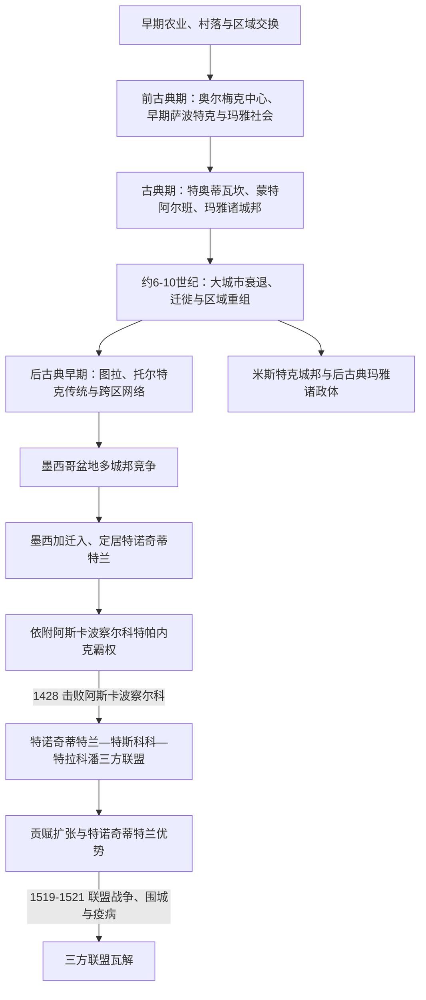

# 中部美洲文明与墨西加国家

## 时间与范围

约前2000年—1521年；其农业、定居与交换网络可上溯到更早的史前时期。这里的“中部美洲”是横跨今日墨西哥中南部和中美洲北部的历史文化区，不等于现代墨西哥国境。今日墨西哥北部的阿里多美洲、西北部的绿洲美洲及众多跨区社会另有自身历史。

## 概括

今日墨西哥中南部不是由一个文明依次替代另一个文明，而是由不同生态区、城市、城邦和区域国家反复连接、竞争与重组。玉米农业、集市和远距离贸易、仪式中心、历法、文字、球赛与多神信仰形成若干共享传统，但语言、政治制度和地方身份始终多样。15世纪兴起的墨西加三方联盟是这段长史的晚期强权，不是全部中部美洲文明的同义词。

## 演进主线

## 长时段发展

| 阶段 | 大致时间 | 主要过程与代表性中心 |
|---|---|---|
| 农业和村落形成 | 约前7000年以后逐步发展 | 玉米、豆类、南瓜、辣椒等作物经历漫长驯化；定居、陶器和交换网络并非一次“农业革命”完成。 |
| 前古典期 | 约前2000年—250年 | 墨西哥湾低地圣洛伦索、拉文塔等奥尔梅克相关中心发展大型雕刻和仪式空间；瓦哈卡蒙特阿尔班、玛雅低地及墨西哥盆地出现复杂聚落。 |
| 古典期 | 约250—900年 | 特奥蒂瓦坎成为人口庞大的多族群城市，与玛雅区、瓦哈卡和墨西哥湾广泛联系；蒙特阿尔班长期统合瓦哈卡谷地；玛雅地区由众多王朝城邦构成。 |
| 古典末期与区域重组 | 约600—1000年 | 特奥蒂瓦坎衰退、部分南部玛雅低地王都停建纪念碑，人口和贸易中心转移；埃尔塔欣、霍奇卡尔科、卡卡斯特拉等区域中心兴起。 |
| 后古典早期 | 约900—1200年 | 图拉成为中部墨西哥重要中心，“托尔特克”在后世既指历史政治体，也成为文明祖先与正统性的象征；尤卡坦北部和米斯特克地区维持多中心政治。 |
| 后古典晚期 | 约1200—1521年 | 墨西哥盆地阿尔特佩特尔密集竞争，普雷佩查 / 塔拉斯卡国家控制西部；米斯特克、萨波特克、玛雅等政体延续。墨西加三方联盟在15世纪扩张。 |

## 墨西加国家的形成

### 迁徙、定居与依附

墨西加传统把自身祖先的出发地称为阿兹特兰。迁徙叙事既保存群体记忆，也为后来政治身份提供神圣解释，不能当作可精确定位的旅行日记。墨西加进入墨西哥盆地时，当地已有库尔瓦坎、阿斯卡波察尔科、特斯科科等成熟城邦。传统上，特诺奇蒂特兰建城定于1325年；特拉特洛尔科随后在同一岛区形成另一城邦和重要市场。

早期墨西加先为更强大的特帕内克统治者服役、纳贡和作战，又借王室婚姻争取库尔瓦坎血统的合法性。首位正式特拉托阿尼阿卡马皮奇特利及其后继者逐步整合卡尔普利、渠道、堤道和神庙体系。墨西加的崛起不是从孤立游民直接跃升为帝国，而是利用既有城邦秩序向上流动。

### 1428年政权转折

阿斯卡波察尔科统治者特索索莫克死后，特帕内克发生继承危机。奇马尔波波卡死亡，伊兹科阿特尔继位；特诺奇蒂特兰与流亡的特斯科科王内萨瓦尔科约特尔、特拉科潘结盟，约在1428年击败阿斯卡波察尔科。胜者建立三方联盟，按协定分配贡赋，特诺奇蒂特兰和特斯科科份额较大。

此后各位统治者通过军事远征、婚姻、威慑和地方同盟，把贡赋网络扩展到墨西哥湾、瓦哈卡、格雷罗和太平洋沿岸。联盟一般不把被征服城邦改造成直属省份，而要求纺织品、可可、羽毛、棉花、食物、奢侈品和军役。统治成本较低，但地方怨恨、贡赋逃避和敌对边疆也因此长期存在。

## 统治结构与社会机制

| 层级 / 机制 | 作用 | 限制与差异 |
|---|---|---|
| 三方联盟 | 特诺奇蒂特兰、特斯科科和特拉科潘共同享有征服与贡赋权，后期特诺奇蒂特兰居首。 | 三城并未合并成统一官僚国家，彼此仍有王室、法律和地方利益。 |
| 特拉托阿尼 | 统帅、最高祭祀和外交核心，由王族高级贵族议选。 | 继承不是单纯父死子继，统治者需依赖贵族、军功集团和祭司。 |
| 西瓦科阿特尔等高级官职 | 协助司法、财政、内政和首都管理；特拉卡埃莱尔常被后世视为制度设计关键人物。 | 殖民时期记载可能放大个别人物作用。 |
| 阿尔特佩特尔 | 以城市、神庙、土地和统治王族为核心的地方政治共同体。 | 被征服后通常保留地方统治者，受控程度不一。 |
| 卡尔普利 | 组织社区土地、贡赋、教育、祭祀和军役。 | 不是完全平等的氏族公社，内部也有身份与财富差异。 |
| 贵族、平民与依附者 | 贵族掌握官职、战争和祭祀资源；平民从事农业、手工业与贸易；另有债务依附和奴役身份。 | 身份有世袭成分，也可凭军功和财富改变，不能套用欧洲封建等级。 |
| 波奇特卡远程商人 | 经营远距离奢侈品贸易，也承担情报和外交功能。 | 市场贸易与国家贡赋并存，二者不是同一系统。 |

## 城市、经济与知识

特诺奇蒂特兰建于特斯科科湖岛屿和浅水区，通过堤道、运河、渡槽与堤坝连接盆地。浅湖“奇南帕”密集农业、周边城镇供给和贡赋共同支撑庞大人口；特拉特洛尔科市场汇集食物、纺织品、陶器、黑曜石和远程奢侈品。城市的繁荣依赖对湖泊水文的工程调控，也容易受到洪水、淡咸水变化和围城切断供给的冲击。

祭司和书吏使用图像、数字符号与纳瓦特尔语口述传统记录贡赋、历法、土地和王朝历史。教育分为面向贵族的卡尔梅卡克与面向社区青年的特尔波奇卡利等机构。宗教仪式、战争俘虏和人祭真实存在，但早期殖民征服叙事常以此为道德正当化工具；理解其规模和意义必须区分不同来源与政治目的。

## 扩张的条件与边界

### 崛起条件

- 墨西哥盆地人口、集市、湖运和密集城邦为军事动员与贡赋提供基础。
- 与特帕内克合作让早期墨西加取得战斗经验和王朝关系；特帕内克继承危机又提供反转机会。
- 三方联盟共享征服成本，而地方间接统治使扩张速度快于直接行政整合。
- 成功战争带来的贡物、俘虏和爵位把贵族、战士与宗教仪式绑定到扩张体系。
- 特诺奇蒂特兰的市场、工艺与政治象征使贡赋财富能够转化为城市权威。

### 结构弱点

- 贡赋和惩罚性远征使特拉斯卡拉、托托纳克等政治体拥有反联盟动机；一些敌对地区始终未被征服。
- 西部普雷佩查国家拥有强大军事组织，阿沙亚卡特尔远征失败后形成相对稳定边界。
- 权力集中在联盟上层而非统一地方行政，危机时属邦可以倒戈或停止贡赋。
- 1502年后蒙特祖马二世强化宫廷等级和动员，既提升控制，也加深部分精英与属地不满。
- 1519年后的天花等旧大陆疾病破坏人口和领导层，但疫病与战争、饥饿、供水中断相互作用，不能作为唯一原因。

## 1519—1521年瓦解过程

1519年科尔特斯违背古巴总督意图深入内陆，以马林钦和赫罗尼莫·德·阿吉拉的翻译能力获取情报，与森波阿拉托托纳克人结盟，随后同特拉斯卡拉军交战并转为同盟。西班牙人进入特诺奇蒂特兰并扣押蒙特祖马二世，改变了城内权力平衡。1520年，佩德罗·德·阿尔瓦拉多在大神庙仪式中屠杀，引发城市起义；西班牙—盟军在撤退中遭重创。

奎特拉瓦克短暂领导抵抗，却死于天花。科尔特斯在特斯科科集结特拉斯卡拉及众多城邦兵力，建造双桅帆船控制湖面，切断堤道、供水和粮食。夸乌特莫克在饥荒、疫病和街区逐段毁灭中坚持防御，1521年8月13日被俘。胜负来自原住民联盟的规模、攻城与湖战、政治倒戈、疾病和资源封锁的共同作用，并非少数欧洲人单独“征服一个民族”。

## 王朝世系

完整的早期统治者、每次继承、在位年代与争议说明见[墨西加特拉托阿尼世系表](/%E4%BA%BA%E6%96%87%E7%A7%91%E5%AD%A6/%E5%8E%86%E5%8F%B2/%E7%BE%8E%E6%B4%B2/%E5%8C%97%E7%BE%8E/%E5%A2%A8%E8%A5%BF%E5%93%A5/%E5%A2%A8%E8%A5%BF%E5%8A%A0%E7%89%B9%E6%8B%89%E6%89%98%E9%98%BF%E5%B0%BC%E4%B8%96%E7%B3%BB%E8%A1%A8.md)。该表从阿卡马皮奇特利列至夸乌特莫克，并把特诺奇作为前王朝领袖单列，不以概括性项目取代具体个人。

## 关键辨析

- “阿兹特克”可能泛指具有阿兹特兰迁徙传统的纳瓦语群体，也常被后世用作墨西加和三方联盟的统称；讨论具体国家时使用“墨西加—特诺奇蒂特兰”更准确。
- 玛雅从来不是一个统一帝国；1521年也不是所有玛雅政体或北部社会被征服的终点。
- “文明影响”不等于民族或王朝直系继承。特奥蒂瓦坎、图拉和墨西加之间存在记忆、象征和网络联系，但不能画成单一血统谱系。
- 原住民社区、语言、宗教实践和地方政治并未随三方联盟灭亡而消失，它们在殖民制度下继续调整并延续至今。

## 演变关系

- 更广的区域比较见[中部美洲文明](/%E4%BA%BA%E6%96%87%E7%A7%91%E5%AD%A6/%E5%8E%86%E5%8F%B2/%E7%BE%8E%E6%B4%B2/%E4%B8%AD%E7%BE%8E%E6%B4%B2/%E4%B8%AD%E9%83%A8%E7%BE%8E%E6%B4%B2%E6%96%87%E6%98%8E.md)。
- 后续见[西班牙征服与新西班牙](/%E4%BA%BA%E6%96%87%E7%A7%91%E5%AD%A6/%E5%8E%86%E5%8F%B2/%E7%BE%8E%E6%B4%B2/%E5%8C%97%E7%BE%8E/%E5%A2%A8%E8%A5%BF%E5%93%A5/%E8%A5%BF%E7%8F%AD%E7%89%99%E5%BE%81%E6%9C%8D%E4%B8%8E%E6%96%B0%E8%A5%BF%E7%8F%AD%E7%89%99.md)。
- 返回[墨西哥历史](/%E4%BA%BA%E6%96%87%E7%A7%91%E5%AD%A6/%E5%8E%86%E5%8F%B2/%E7%BE%8E%E6%B4%B2/%E5%8C%97%E7%BE%8E/%E5%A2%A8%E8%A5%BF%E5%93%A5/README.md)。
