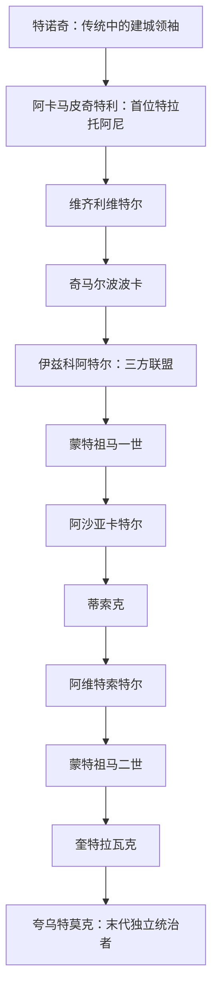

# 墨西加特拉托阿尼世系表

## 时间与范围

约1375/1376年—1525年。表中主体是墨西加—特诺奇蒂特兰的特拉托阿尼（统治者）；1428年三方联盟形成后，特诺奇蒂特兰统治者逐渐取得联盟内的首要地位，后世因而常称“大特拉托阿尼”。1521年特诺奇蒂特兰失守后，夸乌特莫克已不能独立统治，但直到1525年被处决前仍是被俘的王朝首领。

## 世系主线

## 公认统治者完整表

| 顺序 | 统治者 | 在位 | 与前任关系 | 继位与主要事件 |
|---:|---|---|---|---|
| 前置 | **特诺奇**（Tenoch） | 约14世纪中叶—约1370年代，年代有争议 | 不适用 | 传统叙事中的迁徙与建城领袖，不列入正式特拉托阿尼序列；“特诺奇蒂特兰”之名常与其相联系。 |
| 1 | **阿卡马皮奇特利**（Acamapichtli） | 约1375/1376—1395年 | 王室始祖；与库尔瓦坎贵族有婚姻联系 | 贵族议选产生的首位特拉托阿尼；整合不同卡尔普利、扩大婚姻网络，在阿斯卡波察尔科特帕内克霸权下巩固城邦。 |
| 2 | 维齐利维特尔（Huitzilihuitl） | 1396—1417年 | 阿卡马皮奇特利之子 | 通过婚姻与特帕内克统治家族结盟，减轻贡赋并参与区域战争；特诺奇蒂特兰势力上升。 |
| 3 | 奇马尔波波卡（Chimalpopoca） | 1417—1427年 | 维齐利维特尔之子 | 继续依附阿斯卡波察尔科；特帕内克内斗后遭杀或被迫自尽，具体过程存在不同记载。 |
| 4 | **伊兹科阿特尔**（Itzcoatl） | 1427—1440年 | 阿卡马皮奇特利之子、奇马尔波波卡叔辈 | 联合特斯科科的内萨瓦尔科约特尔和特拉科潘，于1428年前后击败阿斯卡波察尔科，建立三方联盟；重组贡赋与历史记忆。 |
| 5 | **蒙特祖马一世**（Moctezuma Ilhuicamina） | 1440—1469年 | 维齐利维特尔之子、伊兹科阿特尔侄 | 将联盟势力扩展到墨西哥湾和瓦哈卡方向；强化贡赋、仪式与水利，在灾荒中调整资源调度。 |
| 6 | 阿沙亚卡特尔（Axayacatl） | 1469—1481年 | 特索索莫克之子，蒙特祖马一世外孙 | 征服特拉特洛尔科并加强特诺奇蒂特兰优势；向西进攻塔拉斯卡国家遭到重大失败，显示联盟扩张边界。 |
| 7 | 蒂索克（Tizoc） | 1481—1486年 | 阿沙亚卡特尔之弟 | 军事成果有限；其死亡常被解释为中毒或宫廷政变，但证据不确定。 |
| 8 | **阿维特索特尔**（Ahuitzotl） | 1486—1502年 | 蒂索克与阿沙亚卡特尔之弟 | 通过南部和东南部远征把贡赋网络推向高峰；扩建大神庙和输水设施，晚年可能死于洪灾后伤病。 |
| 9 | **蒙特祖马二世**（Moctezuma Xocoyotzin） | 1502—1520年 | 阿沙亚卡特尔之子 | 强化宫廷等级与远征；1519年接待科尔特斯一行，后被西班牙人扣押；1520年在特诺奇蒂特兰冲突中死亡，死因在西班牙与原住民叙事中不同。 |
| 10 | 奎特拉瓦克（Cuitláhuac） | 1520年，约80日 | 阿沙亚卡特尔之子、蒙特祖马二世之弟 | 领导墨西加在“悲痛之夜”后驱逐西班牙—特拉斯卡拉军，重整防御；同年死于天花。 |
| 11 | **夸乌特莫克**（Cuauhtémoc） | 1520/1521—1521年独立统治；被俘身份延续至1525年 | 阿维特索特尔之子、奎特拉瓦克堂侄 | 围城期间组织抵抗，1521年8月13日被俘；1525年随科尔特斯远征洪都拉斯时被处决。 |

## 继承机制与王室关系

- 特拉托阿尼由王族与高级贵族中的选举集团推举，不实行简单的父死子继。候选人通常必须出自王族、具有军事和行政资历，因此兄弟、叔侄和外甥之间的承继很常见。
- 统治王朝以阿卡马皮奇特利后裔为核心。跨城邦婚姻同时是合法性、联盟与外交工具；“世系”因而也是区域政治网络。
- 统治者即位后统率战争、祭祀和外交，但贡赋帝国没有把全部属地改造成统一行政区。地方阿尔特佩特尔往往保留自身王族与制度。
- 1428年以前，特诺奇蒂特兰受阿斯卡波察尔科制约；此后是三方联盟成员。把整个序列一概称为“阿兹特克帝国皇帝”会抹平前后政体差异。
- 1521年以后西班牙殖民政府继续任命或认可若干原住民贵族领袖，但其权力基础已经改变，不应与独立时期的特拉托阿尼序列混列。

## 年代与名称辨析

早期统治者的确切即位年会因殖民时期抄本、图像文献和后世编年重建而相差一至数年，因此表中使用“约”。中文译名存在不同音译；拉丁字母纳瓦特尔语名称用于辨识同一人物。蒙特祖马一世与二世也常译“莫特库索马”。

## 相关笔记

- 政治、经济和文明背景见[中部美洲文明与墨西加国家](/%E4%BA%BA%E6%96%87%E7%A7%91%E5%AD%A6/%E5%8E%86%E5%8F%B2/%E7%BE%8E%E6%B4%B2/%E5%8C%97%E7%BE%8E/%E5%A2%A8%E8%A5%BF%E5%93%A5/%E4%B8%AD%E9%83%A8%E7%BE%8E%E6%B4%B2%E6%96%87%E6%98%8E%E4%B8%8E%E5%A2%A8%E8%A5%BF%E5%8A%A0%E5%9B%BD%E5%AE%B6.md)。
- 王朝终结过程见[西班牙征服与新西班牙](/%E4%BA%BA%E6%96%87%E7%A7%91%E5%AD%A6/%E5%8E%86%E5%8F%B2/%E7%BE%8E%E6%B4%B2/%E5%8C%97%E7%BE%8E/%E5%A2%A8%E8%A5%BF%E5%93%A5/%E8%A5%BF%E7%8F%AD%E7%89%99%E5%BE%81%E6%9C%8D%E4%B8%8E%E6%96%B0%E8%A5%BF%E7%8F%AD%E7%89%99.md)。
- 返回[墨西哥历史](/%E4%BA%BA%E6%96%87%E7%A7%91%E5%AD%A6/%E5%8E%86%E5%8F%B2/%E7%BE%8E%E6%B4%B2/%E5%8C%97%E7%BE%8E/%E5%A2%A8%E8%A5%BF%E5%93%A5/README.md)。
