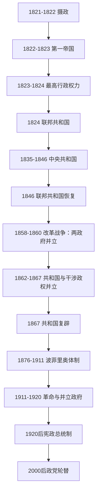

# 墨西哥国家元首表

## 时间与口径

1821年9月28日至2026年7月14日。本表依实际就职次序，列出独立后的摄政成员、皇帝、合议行政成员、宪法总统、临时或代总统，以及内战中具有国家政权主张和实际控制区的并立政府。墨西哥共和国的总统同时是国家元首和联邦政府首脑；无独立总理职位。同一人物每次不连续任职分别列行，不以“多次任职”合并。

## 政体与国家元首主线

## 第一帝国、摄政与最高行政权力

第一、第二摄政和最高行政权力均为合议机构，成员在同一时间共同履职，所以表内日期重叠。这不是重复，而是把每位成员及替补者列全。

| 顺序 | 国家元首 / 合议成员 | 身份 | 任职 | 与前任关系及说明 |
|---:|---|---|---|---|
| 1 | **阿古斯丁·德·伊图尔维德** | 第一摄政主席 | 1821-09-28—1822-04-11 | 三保证军领袖；独立宣言后任摄政主席。 |
| 2 | 胡安·奥多诺胡 | 第一摄政成员 | 1821-09-28—1821-10-08 | 西班牙末任最高政治长官；签署《科尔多瓦条约》，在任内病逝。 |
| 3 | 曼努埃尔·德·拉·巴尔塞纳 | 第一摄政成员 | 1821-09-28—1822-04-11 | 教会人士，参与合议行政。 |
| 4 | 何塞·伊西德罗·亚涅斯 | 第一摄政成员 | 1821-09-28—1822-04-11 | 法官，参与合议行政。 |
| 5 | 曼努埃尔·贝拉斯克斯·德·莱昂 | 第一摄政成员 | 1821-09-28—1822-04-11 | 前王室官员。 |
| 6 | 安东尼奥·佩雷斯·马丁内斯 | 第一摄政成员 | 1821-10-09—1822-04-11 | 普埃布拉主教，接替去世的奥多诺胡。 |
| 7 | **阿古斯丁·德·伊图尔维德** | 第二摄政主席 | 1822-04-11—1822-05-18 | 新摄政缩编并继续由伊图尔维德主持。 |
| 8 | 何塞·伊西德罗·亚涅斯 | 第二摄政成员 | 1822-04-11—1822-05-18 | 第一摄政留任。 |
| 9 | 米格尔·巴伦廷-塔马约 | 第二摄政成员 | 1822-04-11—1822-05-18 | 新任成员。 |
| 10 | 曼努埃尔·德·埃拉斯-索托 | 第二摄政成员 | 1822-04-11—1822-05-18 | 新任成员。 |
| 11 | 尼古拉斯·布拉沃 | 第二摄政成员 | 1822-04-11—1822-05-18 | 独立战争领袖，后来多次代行总统职权。 |
| 12 | **阿古斯丁一世** | 墨西哥皇帝 | 1822-05-19—1823-03-19 | 军队与国会冲突、财政和地方反对加剧；《卡萨马塔计划》后退位。 |
| 13 | 国民制宪会议 | 主权与过渡行政 | 1823-03-19—1823-03-31 | 接受退位，在新合议行政建立前暂掌国家权力。 |
| 14 | **佩德罗·塞莱斯蒂诺·内格雷特** | 最高行政权力正式成员 | 1823-03-31—1824-10-10 | 三人正式成员之一，轮值主持。 |
| 15 | **尼古拉斯·布拉沃** | 最高行政权力正式成员 | 1823-03-31—1824-10-10 | 三人正式成员之一；常因军务由替补代行。 |
| 16 | **瓜达卢佩·维多利亚** | 最高行政权力正式成员 | 1823-03-31—1824-10-10 | 三人正式成员之一；后当选首任宪法总统。 |
| 17 | 何塞·马里亚诺·米切莱纳 | 最高行政权力替补成员 | 1823—1824年间 | 在正式成员离京或从军时参与日常行政。 |
| 18 | 米格尔·多明格斯 | 最高行政权力替补成员 | 1823—1824年间 | 前克雷塔罗地方官，参加合议行政。 |
| 19 | 维森特·格雷罗 | 最高行政权力替补成员 | 1823—1824年间 | 独立战争领袖，在正式成员缺席时补位。 |

## 第一联邦共和国、中央共和国与美墨战争

| 顺序 | 国家元首 | 身份 | 任职 | 交接、阵营与关键事件 |
|---:|---|---|---|---|
| 20 | **瓜达卢佩·维多利亚** | 宪法总统 | 1824-10-10—1829-03-31 | 首任总统，也是早期唯一完成完整四年任期者；处理西班牙最后据点、财政与联邦建制。 |
| 21 | **维森特·格雷罗** | 宪法总统 | 1829-04-01—1829-12-17 | 在争议选举后就职，宣布废奴；布斯塔曼特起兵时离京领兵，后被推翻。 |
| 22 | 何塞·马里亚·博卡内格拉 | 临时总统 | 1829-12-17—1829-12-23 | 国会指定代行，首都兵变后辞职。 |
| 23 | 佩德罗·贝莱斯 | 临时三人行政主席 | 1829-12-23—1829-12-31 | 与金塔纳尔、阿拉曼合议过渡。 |
| 24 | 路易斯·金塔纳尔 | 临时三人行政成员 | 1829-12-23—1829-12-31 | 首都军方代表。 |
| 25 | 卢卡斯·阿拉曼 | 临时三人行政成员 | 1829-12-23—1829-12-31 | 保守派政治家，负责文官行政。 |
| 26 | **安纳斯塔西奥·布斯塔曼特** | 副总统代行总统 | 1830-01-01—1832-08-13 | 以《哈拉帕计划》推翻格雷罗；镇压反对者后被起义迫退。 |
| 27 | 梅尔乔·穆斯基斯 | 临时总统 | 1832-08-14—1832-12-24 | 国会指定过渡，促成与反政府军谈判。 |
| 28 | 曼努埃尔·戈麦斯·佩德拉萨 | 总统 | 1832-12-24—1833-03-31 | 1828年当选却未能就职，按《萨瓦莱塔协定》完成剩余任期。 |
| 29 | **巴伦廷·戈麦斯·法里亚斯** | 副总统代行总统，第1次 | 1833-04-01—1833-05-16 | 圣安纳离京时主持早期自由改革。 |
| 30 | **安东尼奥·洛佩斯·德·圣安纳** | 宪法总统，第1次 | 1833-05-16—1833-06-03 | 就职后很快退居庄园，由副总统理政。 |
| 31 | 巴伦廷·戈麦斯·法里亚斯 | 代总统，第2次 | 1833-06-03—1833-06-18 | 延续改革。 |
| 32 | 安东尼奥·洛佩斯·德·圣安纳 | 总统，第2次 | 1833-06-18—1833-07-05 | 短期复职。 |
| 33 | 巴伦廷·戈麦斯·法里亚斯 | 代总统，第3次 | 1833-07-05—1833-10-27 | 改革教会、教育和军队特权，引发反弹。 |
| 34 | 安东尼奥·洛佩斯·德·圣安纳 | 总统，第3次 | 1833-10-27—1833-12-15 | 再次短期亲政。 |
| 35 | 巴伦廷·戈麦斯·法里亚斯 | 代总统，第4次 | 1833-12-16—1834-04-24 | 自由改革高峰；后被圣安纳撤换。 |
| 36 | 安东尼奥·洛佩斯·德·圣安纳 | 总统，第4次 | 1834-04-24—1835-01-27 | 转向保守和中央集权，解散改革派国会。 |
| 37 | 米格尔·巴拉甘 | 临时总统 | 1835-01-28—1836-02-27 | 任内联邦制被“七法”中央制取代；病重交权。 |
| 38 | 何塞·胡斯托·科罗 | 临时总统 | 1836-02-27—1837-04-19 | 颁布“七法”，得克萨斯战争和西班牙承认墨西哥独立发生在任内。 |
| 39 | **安纳斯塔西奥·布斯塔曼特** | 宪法总统，第2次 | 1837-04-19—1839-03-18 | 中央共和国总统；因出征平乱请假。 |
| 40 | 安东尼奥·洛佩斯·德·圣安纳 | 代总统，第5次 | 1839-03-18—1839-07-10 | 在“糕点战争”后声望回升，代行职权。 |
| 41 | 尼古拉斯·布拉沃 | 代总统，第1次 | 1839-07-11—1839-07-19 | 短期过渡。 |
| 42 | 安纳斯塔西奥·布斯塔曼特 | 总统，第3次 | 1839-07-19—1841-09-22 | 起义和财政危机下垮台。 |
| 43 | 弗朗西斯科·哈维尔·埃切韦里亚 | 临时总统 | 1841-09-22—1841-10-10 | 布斯塔曼特离京后代行，随《塔库巴亚基础》政变辞职。 |
| 44 | 安东尼奥·洛佩斯·德·圣安纳 | 临时总统，第6次 | 1841-10-10—1842-10-26 | 以政变纲领掌权，召集又解散制宪会议。 |
| 45 | 尼古拉斯·布拉沃 | 代总统，第2次 | 1842-10-26—1843-03-04 | 圣安纳请假期间执政。 |
| 46 | 安东尼奥·洛佩斯·德·圣安纳 | 临时总统，第7次 | 1843-03-04—1843-10-04 | 推行《组织基础》，维持中央制。 |
| 47 | 巴伦廷·卡纳利索 | 代总统，第1次 | 1843-10-04—1844-06-04 | 圣安纳亲信。 |
| 48 | 安东尼奥·洛佩斯·德·圣安纳 | 宪法总统，第8次 | 1844-06-04—1844-09-12 | 经间接选举正式就任，旋即请假。 |
| 49 | 何塞·华金·德·埃雷拉 | 临时代总统，第1次 | 1844-09-12—1844-09-21 | 参议院指定的短期替代者。 |
| 50 | 巴伦廷·卡纳利索 | 代总统，第2次 | 1844-09-21—1844-12-06 | 试图解散国会，首都起义后被捕。 |
| 51 | **何塞·华金·德·埃雷拉** | 临时后宪法总统，第2次 | 1844-12-06—1845-12-30 | 倾向谈判承认得克萨斯独立，被主战军人推翻。 |
| 52 | 马里亚诺·帕雷德斯-阿里利亚加 | 临时总统 | 1845-12-31—1846-07-28 | 政变掌权，谋议君主制；美墨战争爆发后离任领军。 |
| 53 | 尼古拉斯·布拉沃 | 代总统，第3次 | 1846-07-28—1846-08-04 | 帕雷德斯离京后短期代行，被联邦派起义推翻。 |
| 54 | 何塞·马里亚诺·萨拉斯 | 临时总统 | 1846-08-05—1846-12-23 | 恢复1824年宪法和联邦制，组织战时政府。 |
| 55 | 巴伦廷·戈麦斯·法里亚斯 | 副总统代行，第5次 | 1846-12-23—1847-03-21 | 为对美战争筹款，征用教会财产引发“波尔科斯”叛乱。 |
| 56 | 安东尼奥·洛佩斯·德·圣安纳 | 总统，第9次 | 1847-03-21—1847-04-02 | 平息首都叛乱后赴前线。 |
| 57 | 佩德罗·马里亚·阿纳亚 | 代总统，第1次 | 1847-04-02—1847-05-20 | 负责战时行政。 |
| 58 | 安东尼奥·洛佩斯·德·圣安纳 | 总统，第10次 | 1847-05-20—1847-09-16 | 美军攻占墨西哥城后辞职。 |
| 59 | 曼努埃尔·德·拉·佩尼亚-佩尼亚 | 临时总统，第1次 | 1847-09-16—1847-11-13 | 最高法院院长依次继任，在克雷塔罗维持政府。 |
| 60 | 佩德罗·马里亚·阿纳亚 | 临时总统，第2次 | 1847-11-13—1848-01-08 | 继续战时过渡，因拒绝满足美方条件辞职。 |
| 61 | 曼努埃尔·德·拉·佩尼亚-佩尼亚 | 临时总统，第2次 | 1848-01-08—1848-06-03 | 缔结《瓜达卢佩-伊达尔戈条约》，终结战争并割让大片北部领土。 |
| 62 | 何塞·华金·德·埃雷拉 | 宪法总统，第3次 | 1848-06-03—1851-01-15 | 战后重建军政与财政，和平交接。 |
| 63 | 马里亚诺·阿里斯塔 | 宪法总统 | 1851-01-15—1853-01-06 | 财政和军人叛乱夹击下辞职。 |
| 64 | 胡安·包蒂斯塔·塞瓦略斯 | 临时总统 | 1853-01-06—1853-02-08 | 最高法院院长继任，与国会冲突后辞职。 |
| 65 | 曼努埃尔·马里亚·隆巴尔迪尼 | 临时总统 | 1853-02-08—1853-04-20 | 军方推举，等待圣安纳回国。 |
| 66 | 安东尼奥·洛佩斯·德·圣安纳 | 总统，第11次 | 1853-04-20—1855-08-09 | 建立个人独裁并自称“最崇高殿下”；出售拉梅西利亚，阿尤特拉革命后流亡。 |
| 67 | 墨西哥城军事当局 | 事实过渡权力 | 1855-08-09—1855-08-15 | 圣安纳逃离到卡雷拉就任之间，中央行政失去稳定首脑。 |
| 68 | 马丁·卡雷拉 | 临时总统 | 1855-08-15—1855-09-12 | 首都守军推举，试图调和阿尤特拉革命各派，失败后辞职。 |
| 69 | 罗穆洛·迪亚斯·德·拉·维加 | 事实临时总统 | 1855-09-12—1855-10-03 | 未经正式宪法任命，维持首都行政并向革命派交权。 |
| 70 | **胡安·阿尔瓦雷斯** | 临时总统 | 1855-10-04—1855-12-11 | 阿尤特拉革命领袖，组建自由派政府并启动改革法。 |
| 71 | **伊格纳西奥·科蒙福特** | 临时、后宪法总统 | 1855-12-11—1858-01-21 | 承接改革并颁布1857年宪法；参与反宪法政变后失去两派支持并流亡。 |

## 改革战争、法国干涉与共和国复辟

1858—1860年自由派与保守派政府并立，1862—1867年胡亚雷斯共和国与法国支持的摄政、第二帝国并立。以下用“并立”明确同时存在，不把对立政权误排成和平继承。

| 顺序 | 国家元首 | 政权 / 身份 | 任职 | 交接与控制范围 |
|---:|---|---|---|---|
| 72 | **贝尼托·胡亚雷斯** | 宪法共和国总统 | 1858-01-21—1872-07-18 | 以最高法院院长身份依1857年宪法继任；改革战争和法国干涉中迁徙办公，1867年回到首都；连任后逝于任内。 |
| 73 | 费利克斯·马里亚·苏洛亚加 | 保守派总统，第1次，并立 | 1858-01—1858-12-24 | 《塔库巴亚计划》阵营在首都拥立，控制墨西哥中部多地。 |
| 74 | 曼努埃尔·罗夫莱斯·佩苏埃拉 | 保守派临时总统，并立 | 1858-12-24—1859-01-23 | 政变取代苏洛亚加，试图召开和会，旋被推翻。 |
| 75 | 费利克斯·马里亚·苏洛亚加 | 保守派总统，第2次，并立 | 1859-01-24—1859-02-01 | 短暂复位后把实际职权交给米拉蒙。 |
| 76 | **米格尔·米拉蒙** | 保守派代总统，第1次，并立 | 1859-02-02—1860-08-13 | 年轻将领，围攻自由派根据地未果。 |
| 77 | 何塞·伊格纳西奥·帕文 | 保守派临时总统，并立 | 1860-08-13—1860-08-15 | 最高法院院长短期代行，以便重新选任米拉蒙。 |
| 78 | 米格尔·米拉蒙 | 保守派总统，第2次，并立 | 1860-08-15—1860-12-24 | 卡尔普拉尔潘战败后首都政府瓦解；苏洛亚加此后仍提出名义主张但无稳定中央控制。 |
| 79 | 胡安·内波穆塞诺·阿尔蒙特 | 干涉派最高行政首脑，并立 | 1862-04—1863-06 | 法军占领区内组织保守派政权，胡亚雷斯共和国继续存在。 |
| 80 | 胡安·内波穆塞诺·阿尔蒙特 | 帝国摄政成员 | 1863-06—1864-05 | 三人摄政核心，等待马克西米连抵墨。 |
| 81 | 何塞·马里亚诺·萨拉斯 | 帝国摄政成员 | 1863-06—1864-05 | 前共和国临时总统，转而支持君主制。 |
| 82 | 佩拉希奥·安东尼奥·德·拉瓦斯蒂达 | 帝国摄政成员 | 1863-06—1863-11 | 墨西哥大主教；因与法军政策分歧被排除。 |
| 83 | 胡安·包蒂斯塔·奥尔马埃切亚 | 帝国摄政替补成员 | 1863-11—1864-05 | 接替拉瓦斯蒂达参与摄政。 |
| 84 | **马克西米连一世** | 墨西哥第二帝国皇帝，并立 | 1864-04-10接受王冠；1864-05-28抵墨—1867-06-19 | 依赖法国军队与墨西哥保守派，但保留部分自由改革；法军撤离后在克雷塔罗被俘处决。 |
| 85 | 塞瓦斯蒂安·莱尔多·德·特哈达 | 宪法共和国总统 | 1872-07-18—1876-11-20 | 以最高法院院长身份继任胡亚雷斯，后经选举任职；谋求连任引发图斯特佩克革命。 |
| 86 | 何塞·马里亚·伊格莱西亚斯 | 自称宪法临时总统，并立 | 1876-10-31—1877-01-23 | 最高法院院长，以1876年选举违法为由主张继任，在瓜纳华托、克雷塔罗等地短期掌权。 |
| 87 | **波菲里奥·迪亚斯** | 事实临时总统，第1段 | 1876-11-28—1876-12-06 | 图斯特佩克军击败政府后入主首都；为继续对伊格莱西亚斯作战交职。 |
| 88 | 胡安·内波穆塞诺·门德斯 | 临时总统 | 1876-12-06—1877-02-15 | 迪亚斯盟友，代行中央行政并组织选举。 |
| 89 | 波菲里奥·迪亚斯 | 临时总统，第2段 | 1877-02-17—1877-05-05 | 战胜伊格莱西亚斯阵营后返京，随后经选举成为宪法总统。 |

## 波菲里奥时期与革命并立政府

| 顺序 | 国家元首 | 身份 | 任职 | 交接、阵营与关键事件 |
|---:|---|---|---|---|
| 90 | **波菲里奥·迪亚斯** | 宪法总统，第1任 | 1877-05-05—1880-11-30 | 以反连任名义取得总统职位，整合军队和州级联盟。 |
| 91 | 曼努埃尔·冈萨雷斯 | 宪法总统 | 1880-12-01—1884-11-30 | 迪亚斯盟友；铁路、银行与行政集中继续扩张。 |
| 92 | 波菲里奥·迪亚斯 | 宪法总统，第2任 | 1884-12-01—1888-11-30 | 重返总统府，逐步修改连任限制。 |
| 93 | 波菲里奥·迪亚斯 | 宪法总统，第3任 | 1888-12-01—1892-11-30 | 连任制度化。 |
| 94 | 波菲里奥·迪亚斯 | 宪法总统，第4任 | 1892-12-01—1896-11-30 | 通过地方强人、军警和精英协商维持统治。 |
| 95 | 波菲里奥·迪亚斯 | 宪法总统，第5任 | 1896-12-01—1900-11-30 | 出口经济和外资增长。 |
| 96 | 波菲里奥·迪亚斯 | 宪法总统，第6任 | 1900-12-01—1904-11-30 | 接班问题日益突出。 |
| 97 | 波菲里奥·迪亚斯 | 宪法总统，第7任 | 1904-12-01—1910-11-30 | 总统任期改为六年，拉蒙·科拉尔任副总统；劳工与土地矛盾扩大。 |
| 98 | 波菲里奥·迪亚斯 | 宪法总统，第8任，未满 | 1910-12-01—1911-05-25 | 争议选举触发马德罗反连任起义，按《华雷斯城条约》辞职。 |
| 99 | 弗朗西斯科·莱昂·德·拉·巴拉 | 临时总统 | 1911-05-25—1911-11-06 | 组织选举并试图解除革命军，乡村冲突延续。 |
| 100 | **弗朗西斯科·伊格纳西奥·马德罗** | 宪法总统 | 1911-11-06—1913-02-19 | 推进选举开放但未能整合旧军、革命派和地主；“悲惨十日”政变中被迫辞职并遇害。 |
| 101 | 佩德罗·拉斯库赖因 | 临时总统 | 1913-02-19，约45分钟 | 外交部长依继承顺序就职，任命韦尔塔为内政部长后辞职，使政变披上法定继承外衣。 |
| 102 | **维克托里亚诺·韦尔塔** | 临时总统、事实独裁者 | 1913-02-19—1914-07-15 | 军事政变掌权；遭宪政军、萨帕塔派与美国压力共同打击后辞职。 |
| 103 | 弗朗西斯科·卡瓦哈尔 | 临时总统 | 1914-07-15—1914-08-13 | 负责向宪政军交接并解散联邦军。 |
| 104 | **贝努斯蒂亚诺·卡兰萨** | 宪政军“第一首领”、行政权负责人 | 1914-08-14—1917-04-30 | 以反韦尔塔的《瓜达卢佩计划》主张行政权；与公约政府、比利亚和萨帕塔并战。 |
| 105 | 欧拉利奥·古铁雷斯 | 阿瓜斯卡连特斯公约临时总统，并立 | 1914-11-06—1915-01-16 | 公约派推举，受比利亚与萨帕塔军事力量制约；离开首都后另组小规模政府。 |
| 106 | 罗克·冈萨雷斯·加尔萨 | 公约临时总统，并立 | 1915-01-16—1915-06-10 | 公约阵营内部分裂、战场失利中执政。 |
| 107 | 弗朗西斯科·拉戈斯·查萨罗 | 公约临时总统，并立 | 1915-06-10—1915-10 | 随公约政府撤离首都，控制力迅速消失。 |
| 108 | **贝努斯蒂亚诺·卡兰萨** | 宪法总统 | 1917-05-01—1920-05-21 | 1917年宪法实施后的首任总统；试图指定接班人引发阿瓜普列塔起义，逃亡途中被杀。 |
| 109 | 阿瓜普列塔革命军首脑集团 | 事实过渡权力 | 1920-05-21—1920-05-31 | 卡兰萨政府瓦解后，由索诺拉派军事与政治领导人控制首都，等待国会选出临时总统。 |
| 110 | **阿道弗·德·拉·韦尔塔** | 临时总统 | 1920-06-01—1920-11-30 | 促成多支革命军复员与和解，组织总统选举。 |

## 革命后宪政总统制

| 顺序 | 总统 | 身份 | 任职 | 政党 / 政治阶段 | 关键事件与交接 |
|---:|---|---|---|---|---|
| 111 | **阿尔瓦罗·奥夫雷贡** | 宪法总统 | 1920-12-01—1924-11-30 | 革命派、后来的国民革命党体系前身 | 重建中央权威、教育与土地政策；1928年再度当选但就职前被刺杀。 |
| 112 | **普鲁塔尔科·埃利亚斯·卡列斯** | 宪法总统 | 1924-12-01—1928-11-30 | 革命派 | 建设中央银行和国家机构；政教冲突引发基督战争，卸任后成为“最高领袖”。 |
| 113 | 埃米利奥·波特斯·希尔 | 临时总统 | 1928-12-01—1930-02-04 | 革命派；1929年起国民革命党 | 奥夫雷贡遇刺后由国会选任；1929年国民革命党成立，调停基督战争。 |
| 114 | 帕斯夸尔·奥尔蒂斯·鲁维奥 | 宪法总统 | 1930-02-05—1932-09-02 | 国民革命党 | 在卡列斯强大影响下执政，因权力受限辞职。 |
| 115 | 阿韦拉尔多·L·罗德里格斯 | 代总统 | 1932-09-04—1934-11-30 | 国民革命党 | 国会选任完成任期；最低工资、经济和教育制度继续建设。 |
| 116 | **拉萨罗·卡德纳斯** | 宪法总统 | 1934-12-01—1940-11-30 | 国民革命党；1938年起墨西哥革命党 | 终结卡列斯幕后控制，扩大土地改革与群众组织，1938年石油国有化；国民革命党改组为墨西哥革命党。 |
| 117 | 曼努埃尔·阿维拉·卡马乔 | 宪法总统 | 1940-12-01—1946-11-30 | 墨西哥革命党 | 转向“民族团结”，二战中加入同盟国，社会保险制度扩张。 |
| 118 | 米格尔·阿莱曼·巴尔德斯 | 宪法总统 | 1946-12-01—1952-11-30 | 革命制度党 | 首位革命后文官总统；工业化、基础设施和城市增长，腐败与土地集中并存。 |
| 119 | 阿道弗·鲁伊斯·科尔蒂内斯 | 宪法总统 | 1952-12-01—1958-11-30 | 革命制度党 | 女性获得联邦选举权，实行财政稳定政策。 |
| 120 | 阿道弗·洛佩斯·马特奥斯 | 宪法总统 | 1958-12-01—1964-11-30 | 革命制度党 | 电力国有化、社会政策扩张，也镇压铁路工人和政治反对者。 |
| 121 | 古斯塔沃·迪亚斯·奥尔达斯 | 宪法总统 | 1964-12-01—1970-11-30 | 革命制度党 | 经济增长与威权控制并行；1968年特拉特洛尔科镇压发生在任内。 |
| 122 | 路易斯·埃切维里亚 | 宪法总统 | 1970-12-01—1976-11-30 | 革命制度党 | 扩张公共支出和第三世界外交，“肮脏战争”、通胀与债务恶化。 |
| 123 | 何塞·洛佩斯·波蒂略 | 宪法总统 | 1976-12-01—1982-11-30 | 革命制度党 | 依赖石油借贷扩张，1982年债务危机并将银行国有化。 |
| 124 | 米格尔·德拉马德里 | 宪法总统 | 1982-12-01—1988-11-30 | 革命制度党 | 紧缩、私有化和加入关贸总协定；1985年地震暴露治理缺陷。 |
| 125 | 卡洛斯·萨利纳斯·德·戈塔里 | 宪法总统 | 1988-12-01—1994-11-30 | 革命制度党 | 争议选举后加速市场改革，缔结北美自由贸易协定；1994年萨帕塔民族解放军起义。 |
| 126 | 埃内斯托·塞迪略 | 宪法总统 | 1994-12-01—2000-11-30 | 革命制度党 | 处理比索危机，推进选举机构自主与政治开放；2000年完成政党轮替。 |
| 127 | **维森特·福克斯** | 宪法总统 | 2000-12-01—2006-11-30 | 国家行动党 | 结束革命制度党连续71年执掌总统府；分立政府限制改革能力。 |
| 128 | 费利佩·卡尔德龙 | 宪法总统 | 2006-12-01—2012-11-30 | 国家行动党 | 争议选举后就职，大规模动用军队打击贩毒组织，暴力显著升级。 |
| 129 | 恩里克·培尼亚·涅托 | 宪法总统 | 2012-12-01—2018-11-30 | 革命制度党 | 推动能源、教育等“墨西哥契约”改革；阿约齐纳帕失踪案与腐败争议削弱政府。 |
| 130 | **安德烈斯·曼努埃尔·洛佩斯·奥夫拉多尔** | 宪法总统 | 2018-12-01—2024-09-30 | 莫雷纳 | 扩张社会转移、提高最低工资并强化国家能源与军方角色；任期交接日因宪法调整改为9月30日。 |
| 131 | **克劳迪娅·辛鲍姆·帕尔多** | 宪法总统 | 2024-10-01—至今（核验至2026-07-14） | 莫雷纳 | 墨西哥首位女性总统；承接“第四次变革”联盟。共和国总统兼国家元首与政府首脑，六年任期且不得再次出任总统。 |

## 连续性、并立与称号说明

- 1824—1917年间的“临时”“代行”“宪法”称号来自当时宪法、国会任命、军人计划或事实政权，不能简单以今日总统继任规则倒推。
- 改革战争期间，胡亚雷斯政府依据1857年宪法主张连续合法性；保守派政府则控制首都和中部多地。法国干涉期间，第二帝国也没有消灭共和国的国家主张。
- 1876年莱尔多、伊格莱西亚斯和迪亚斯三方重叠；1914—1915年卡兰萨宪政政府与公约政府重叠。表格以“并立”标注，而不是把它们伪造成单线和平交接。
- 总统任期日期以正式就职和离职为主。战争、逃亡和首都陷落有时造成事实控制先于或晚于法定日期；早期个别日界在不同年表中相差一两日，已在相应行使用月份或说明不确定性。
- 1928年当选总统奥夫雷贡在就职前遇刺，因未开始新任期，未另列为国家元首；波特斯·希尔由国会选为临时总统。
- 1934年以后形成六年任期惯例；现行宪制禁止任何曾任总统者再次任职。表中没有另列政府首脑，因为总统同时领导联邦行政部门。

## 分期入口

- 1821—1855年的政体与战争见[独立、第一帝国与早期共和国](/%E4%BA%BA%E6%96%87%E7%A7%91%E5%AD%A6/%E5%8E%86%E5%8F%B2/%E7%BE%8E%E6%B4%B2/%E5%8C%97%E7%BE%8E/%E5%A2%A8%E8%A5%BF%E5%93%A5/%E7%8B%AC%E7%AB%8B%E3%80%81%E7%AC%AC%E4%B8%80%E5%B8%9D%E5%9B%BD%E4%B8%8E%E6%97%A9%E6%9C%9F%E5%85%B1%E5%92%8C%E5%9B%BD.md)。
- 1855—1876年的并立政权见[改革战争、法国干涉与复辟共和国](/%E4%BA%BA%E6%96%87%E7%A7%91%E5%AD%A6/%E5%8E%86%E5%8F%B2/%E7%BE%8E%E6%B4%B2/%E5%8C%97%E7%BE%8E/%E5%A2%A8%E8%A5%BF%E5%93%A5/%E6%94%B9%E9%9D%A9%E6%88%98%E4%BA%89%E3%80%81%E6%B3%95%E5%9B%BD%E5%B9%B2%E6%B6%89%E4%B8%8E%E5%A4%8D%E8%BE%9F%E5%85%B1%E5%92%8C%E5%9B%BD.md)。
- 1876—1920年的长期统治与革命见[波菲里奥统治与墨西哥革命](/%E4%BA%BA%E6%96%87%E7%A7%91%E5%AD%A6/%E5%8E%86%E5%8F%B2/%E7%BE%8E%E6%B4%B2/%E5%8C%97%E7%BE%8E/%E5%A2%A8%E8%A5%BF%E5%93%A5/%E6%B3%A2%E8%8F%B2%E9%87%8C%E5%A5%A5%E7%BB%9F%E6%B2%BB%E4%B8%8E%E5%A2%A8%E8%A5%BF%E5%93%A5%E9%9D%A9%E5%91%BD.md)。
- 1920年后的制度和政策见[革命后国家与当代墨西哥](/%E4%BA%BA%E6%96%87%E7%A7%91%E5%AD%A6/%E5%8E%86%E5%8F%B2/%E7%BE%8E%E6%B4%B2/%E5%8C%97%E7%BE%8E/%E5%A2%A8%E8%A5%BF%E5%93%A5/%E9%9D%A9%E5%91%BD%E5%90%8E%E5%9B%BD%E5%AE%B6%E4%B8%8E%E5%BD%93%E4%BB%A3%E5%A2%A8%E8%A5%BF%E5%93%A5.md)。
- 返回[墨西哥历史](/%E4%BA%BA%E6%96%87%E7%A7%91%E5%AD%A6/%E5%8E%86%E5%8F%B2/%E7%BE%8E%E6%B4%B2/%E5%8C%97%E7%BE%8E/%E5%A2%A8%E8%A5%BF%E5%93%A5/README.md)。
