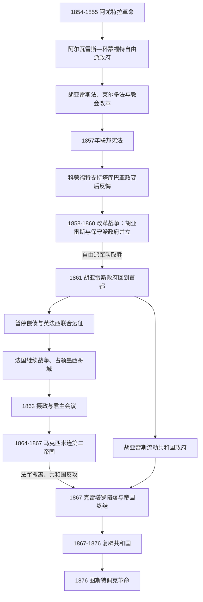

# 改革战争、法国干涉与复辟共和国

## 时间

1855—1876年。从阿尤特拉革命建立自由派政府，到波菲里奥·迪亚斯以图斯特佩克革命推翻莱尔多·德·特哈达。1858—1860年自由派与保守派政府并立；1862—1867年共和国与法国支持的帝国并立。

## 概括

自由改革试图把墨西哥从由教会、军队和地方共同体特权构成的法人秩序，改造为以个人公民、私有财产、联邦宪法和世俗国家为基础的共和国。改革不仅触及宗教，也重分司法、土地、教育、税收和国家合法性，因此引发三年内战。自由派胜利后国家已经破产，暂停外债支付给法国拿破仑三世提供干涉借口；墨西哥保守派则希望借欧洲君主重建秩序。马克西米连第二帝国依赖法军且与支持它的保守派存在政策矛盾，未能消灭胡亚雷斯共和国。1867年复辟后，共和国把改革法纳入国家制度，却继续面对军人起义、地方自治、连任争议和土地流失，最终被迪亚斯的反连任联盟推翻。

## 演进图

## 阿尤特拉革命与改革法

1854年胡安·阿尔瓦雷斯、伊格纳西奥·科蒙福特等在格雷罗发布《阿尤特拉计划》，以推翻圣安纳和召开制宪会议为最低共同纲领。1855年圣安纳流亡，阿尔瓦雷斯短期任临时总统，组建包括贝尼托·胡亚雷斯、米格尔·莱尔多·德·特哈达、梅尔乔·奥坎波在内的自由派内阁。科蒙福特随后继任，希望以温和方式维持军政秩序，但改革已经触及根本利益。

| 法律 / 措施 | 时间 | 核心内容 | 直接影响与争议 |
|---|---:|---|---|
| 胡亚雷斯法 | 1855年 | 限制教会和军队法院对一般民事、刑事案件的特别管辖。 | 把法律平等置于法人特权之上，引起军方与教会反对。 |
| 莱尔多法 | 1856年 | 要求教会和各类民事法人团体出售非直接使用的不动产。 | 目标是形成私人土地市场和税基；原住民共同体也被视为法人，许多村社土地因此被私人和庄园兼并。 |
| 伊格莱西亚斯法 | 1857年 | 限制向贫民收取洗礼、婚姻、葬礼等教区费用。 | 将宗教服务费用变为社会政策冲突。 |
| 1857年宪法 | 1857年 | 恢复联邦共和国，规定个人权利、代表制和权力分立；未明文宣布完全宗教自由。 | 军人、保守派与教会认为它破坏传统秩序；自由派内部也对改革深度分歧。 |
| 改革法 | 1859—1860年 | 没收教会财产、政教分离、民事婚姻与登记、世俗墓地和宗教自由。 | 胡亚雷斯政府在内战中将改革制度化，也借出售财产筹措军费。 |

## 1858—1860年改革战争

### 双重政府的形成

1857年12月保守将领费利克斯·苏洛亚加发布《塔库巴亚计划》，要求废除宪法、召开新制宪会议。科蒙福特先支持政变并解散国会，又发现自己被保守派架空，转而释放胡亚雷斯后出走。依1857年宪法，总统空缺时由最高法院院长继任，胡亚雷斯据此在1858年1月成为宪法总统。

保守派控制墨西哥城，先后拥立苏洛亚加、罗夫莱斯·佩苏埃拉、米格尔·米拉蒙等；自由派政府从瓜纳华托迁至瓜达拉哈拉，最终在韦拉克鲁斯建立海关和港口基地。两边都不是单纯思想集团：地方军队、州长、教会资源、商人贷款和外国承认决定战场力量。完整并立元首和每次交接见[墨西哥国家元首表](/%E4%BA%BA%E6%96%87%E7%A7%91%E5%AD%A6/%E5%8E%86%E5%8F%B2/%E7%BE%8E%E6%B4%B2/%E5%8C%97%E7%BE%8E/%E5%A2%A8%E8%A5%BF%E5%93%A5/%E5%A2%A8%E8%A5%BF%E5%93%A5%E5%9B%BD%E5%AE%B6%E5%85%83%E9%A6%96%E8%A1%A8.md)。

### 战争阶段与转折

战争初期保守军拥有较成熟的职业军官，在萨拉曼卡等战役击败自由派；米拉蒙两次围攻韦拉克鲁斯，却无法夺取港口和关税。胡亚雷斯在韦拉克鲁斯颁布改革法，同时与美国签署但未获美国参议院批准的《麦克莱恩—奥坎波条约》，以过境权换取资金和支持，显示共和国的财政绝境。

自由派州级军队在北部和西部逐渐整合，赫苏斯·冈萨雷斯·奥尔特加等将领掌握主动。1860年12月卡尔普拉尔潘战役击溃米拉蒙主力，保守派首都政府瓦解；胡亚雷斯1861年1月回到墨西哥城。内战胜利确立了自由派宪法连续性，却留下双方处决、没收、地方复仇和巨额债务。

## 债务危机与法国干涉

1861年政府宣布暂停外债支付两年。英国、法国和西班牙依据《伦敦公约》联合占领韦拉克鲁斯，名义上要求偿债。墨西哥与英国、西班牙代表达成初步安排，两国认识到法国目标超出债务后撤军。拿破仑三世希望在美国内战期间建立亲法的拉丁天主教君主国，扩大市场并遏制美国；墨西哥保守流亡者则承诺国内会欢迎君主制。

1862年5月5日，伊格纳西奥·萨拉戈萨率墨军在普埃布拉击退法军，成为“五月五日”纪念来源，但不是战争终点。法国增兵后于1863年围困并攻占普埃布拉，随后进入墨西哥城。胡亚雷斯政府向北迁移，依次在圣路易斯波托西、萨尔蒂约、蒙特雷、奇瓦瓦和帕索-德尔诺特等地办公；保留档案、内阁与外交承认，使共和国没有出现法律上的断裂。

## 第二帝国

### 建立与统治结构

法国占领区的名流会议宣布君主制，阿尔蒙特、马里亚诺·萨拉斯和拉瓦斯蒂达等组成摄政。奥地利哈布斯堡大公斐迪南·马克西米连在米拉马尔接受王冠，声称已由墨西哥多数人邀请；实际“民意”是在法军控制下组织。1864年5月他与比利时妻子卡洛塔抵墨。

| 权力中心 | 角色 | 内在矛盾 |
|---|---|---|
| 马克西米连皇帝 | 任命大臣、颁布帝国法令、巡视和塑造调和君主形象。 | 保留民事婚姻、教会地产出售等部分自由改革，令保守派失望。 |
| 法国远征军与巴赞元帅 | 帝国主要军事支柱，控制战略城市和交通。 | 法国目标、军费追偿与墨西哥政府需要不一致。 |
| 墨西哥保守派和教会 | 提供本地合法性、官员和军队。 | 期待恢复教会财产与特权，却未从皇帝得到全面满足。 |
| 帝国地方官与外国志愿军 | 管理占领区、征税和镇压游击。 | 控制随法军驻防变化，广大农村和北部长期处于争夺中。 |
| 胡亚雷斯共和国 | 保有宪法政府、州级军队和美国承认。 | 资源匮乏、不断迁都，但从未正式投降。 |

马克西米连试图以君主制调和改革成果与天主教社会，制定劳工、土地和行政措施，并邀请温和自由派入阁。他拒绝完全归还教会地产，失去部分保守支持；帝国财政却要承担法国军费和旧债，无法建立独立税源。1865年美国内战结束，美国援引门罗主义向法国施压，并在边境为共和国军获得武器创造条件。普鲁士崛起和法国国内反对又使拿破仑三世决定撤军。

### 衰落与灭亡

1866—1867年法军逐步撤离，帝国城市相继失守。卡洛塔赴欧洲求援失败后精神崩溃；马克西米连一度考虑退位，最终留在墨西哥。米拉蒙、托马斯·梅希亚等集中于克雷塔罗，被马里亚诺·埃斯科韦多共和国军围困。1867年5月城防被突破，马克西米连被俘；军事法庭判处他、米拉蒙和梅希亚死刑，6月19日枪决。6月共和国军收复墨西哥城。

帝国灭亡的结构原因是缺少独立财政和全国行政、依赖外国军队、支持联盟内部政策冲突；外部压力是美国内战结束和法国战略改变；直接触发是法军撤离后共和国军恢复铁路与城市控制、克雷塔罗守军瓦解。把帝国失败只解释为马克西米连个人理想主义，会忽略这些制度和国际条件。

## 1867—1876年复辟共和国

### 胡亚雷斯重建

胡亚雷斯回到首都后恢复1857年宪法体系、举行选举、重开国会并削减军队。政府推动世俗教育、铁路和财政整顿，把改革法确立为国家基础。战时将领和州级军队并未自动服从；波菲里奥·迪亚斯等拥有独立军事声望。1871年胡亚雷斯再度参选，迪亚斯以《拉诺里亚计划》反对连任，起义失败。胡亚雷斯1872年去世后，最高法院院长塞瓦斯蒂安·莱尔多·德·特哈达继任。

### 莱尔多政府与1876年危机

莱尔多把改革法原则纳入宪法，扩展铁路、电报与中央行政，1873年完成连接墨西哥城和韦拉克鲁斯的铁路。他同时加强中央对州长和地方军事集团的控制。曼努埃尔·洛萨达在纳亚里特的地区势力被镇压，教会反改革活动和克里斯特罗式地方冲突的前兆仍然存在。土地法人化改革和铁路测量继续促进私人兼并，许多村社利益受损。

1876年莱尔多谋求连任。迪亚斯发布《图斯特佩克计划》，再次以“不连任”和恢复地方宪政为号召；最高法院院长何塞·马里亚·伊格莱西亚斯则宣布选举违法，依据继任条款自称临时总统。迪亚斯军在特科阿克战役击败政府军，莱尔多流亡；随后又压倒伊格莱西亚斯阵营。共和国没有被君主制推翻，而是被一场以宪法和反连任为名的军事革命改变权力中心。

## 重要事件

| 时间 | 事件 | 结果与长期影响 |
|---|---|---|
| 1855年 | 阿尤特拉革命胜利、胡亚雷斯法 | 推翻圣安纳并开始限制军教特权。 |
| 1856年 | 莱尔多法 | 建立法人地产强制出售框架，也加速部分原住民共同土地流失。 |
| 1857年 | 新宪法与塔库巴亚政变 | 联邦宪政出台后立即陷入政权分裂。 |
| 1858—1860年 | 改革战争 | 自由派击败保守派，改革法在战争中深化。 |
| 1861—1863年 | 债务暂停、联合远征与法国单独战争 | 外债争端转化为政权更替式干涉。 |
| 1862年5月5日 | 普埃布拉战役 | 墨军暂时阻止法军推进，成为共和国抵抗象征。 |
| 1864年 | 马克西米连就位 | 第二帝国建立，与胡亚雷斯共和国并立。 |
| 1867年 | 克雷塔罗陷落、皇帝被处决、共和国复辟 | 外国支持的君主制终结，改革共和国恢复首都。 |
| 1871年 | 拉诺里亚起义 | 迪亚斯首次以反连任起兵失败。 |
| 1876年 | 图斯特佩克革命 | 莱尔多政府倒台，迪亚斯进入国家权力中心。 |

## 改革的成就、代价与未解问题

- 改革废除法人司法特权、建立民事登记和婚姻、推动宗教自由与世俗教育，为现代国家提供共同法律框架。
- 没收和出售教会地产打破大法人土地持有，却没有普遍造就小农；有资本的商人、庄园主和官员常取得土地。
- 原住民村社作为民事法人也受莱尔多法影响，共同土地被分割或侵占。法律上的个人平等可能削弱集体保护。
- 共和国战胜外来帝国，形成强烈主权记忆；但战时紧急权力、军人威望和中央集权也延续。
- 联邦、州长和地方武装关系仍不稳定，反连任原则既是宪政诉求，也成为迪亚斯夺权工具。

## 国家元首与并立政权

1855—1876年所有总统、保守派并立总统、帝国摄政成员、马克西米连、胡亚雷斯、莱尔多、伊格莱西亚斯及迪亚斯—门德斯过渡的精确交接见[墨西哥国家元首表](/%E4%BA%BA%E6%96%87%E7%A7%91%E5%AD%A6/%E5%8E%86%E5%8F%B2/%E7%BE%8E%E6%B4%B2/%E5%8C%97%E7%BE%8E/%E5%A2%A8%E8%A5%BF%E5%93%A5/%E5%A2%A8%E8%A5%BF%E5%93%A5%E5%9B%BD%E5%AE%B6%E5%85%83%E9%A6%96%E8%A1%A8.md)。胡亚雷斯与保守派、胡亚雷斯与第二帝国的任期重叠是内战事实，不应删成单线王朝表。

## 关键辨析

- “改革战争”也称“三年战争”，核心不只是教会财产，而是国家以个人公民还是法人团体为基础、联邦与地方如何组织。
- 1862年普埃布拉胜利没有终结法国干涉；法军次年攻占城市和首都。
- 马克西米连不是保守派政策的完全执行者，他保留部分自由改革；这也使帝国支持联盟更脆弱。
- 1867年的“复辟”指共和国宪法政府恢复首都，不是恢复旧王朝。
- 迪亚斯1876年以不连任起兵，后来却建立连续连任体制，这是理解波菲里奥时期合法性的重要反差。

## 演变关系

- 前一阶段：[独立、第一帝国与早期共和国](/%E4%BA%BA%E6%96%87%E7%A7%91%E5%AD%A6/%E5%8E%86%E5%8F%B2/%E7%BE%8E%E6%B4%B2/%E5%8C%97%E7%BE%8E/%E5%A2%A8%E8%A5%BF%E5%93%A5/%E7%8B%AC%E7%AB%8B%E3%80%81%E7%AC%AC%E4%B8%80%E5%B8%9D%E5%9B%BD%E4%B8%8E%E6%97%A9%E6%9C%9F%E5%85%B1%E5%92%8C%E5%9B%BD.md)。
- 后一阶段：[波菲里奥统治与墨西哥革命](/%E4%BA%BA%E6%96%87%E7%A7%91%E5%AD%A6/%E5%8E%86%E5%8F%B2/%E7%BE%8E%E6%B4%B2/%E5%8C%97%E7%BE%8E/%E5%A2%A8%E8%A5%BF%E5%93%A5/%E6%B3%A2%E8%8F%B2%E9%87%8C%E5%A5%A5%E7%BB%9F%E6%B2%BB%E4%B8%8E%E5%A2%A8%E8%A5%BF%E5%93%A5%E9%9D%A9%E5%91%BD.md)。
- 法国一侧背景见[法国历史](/%E4%BA%BA%E6%96%87%E7%A7%91%E5%AD%A6/%E5%8E%86%E5%8F%B2/%E6%AC%A7%E6%B4%B2/%E6%B3%95%E5%9B%BD/README.md)。
- 返回[墨西哥历史](/%E4%BA%BA%E6%96%87%E7%A7%91%E5%AD%A6/%E5%8E%86%E5%8F%B2/%E7%BE%8E%E6%B4%B2/%E5%8C%97%E7%BE%8E/%E5%A2%A8%E8%A5%BF%E5%93%A5/README.md)。
