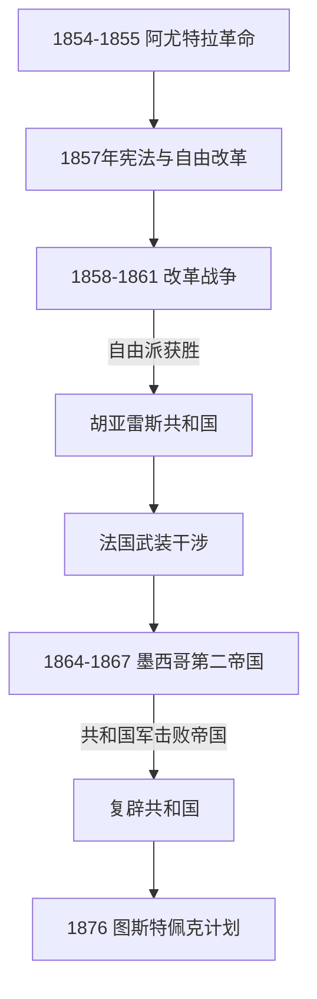

# 改革战争、法国干涉与复辟共和国

## 时间

1855年-1876年

## 概括

阿尤特拉革命后，自由派试图限制教会和军队特权、没收法人团体地产并重建联邦国家。1857年宪法引发保守派反抗和改革战争。共和国获胜后又面临法国干涉和哈布斯堡的马克西米连建立第二帝国；1867年共和国军击败帝国，胡亚雷斯恢复政府。

## 演进图

## 国家元首

### 共和国

| 人物 | 任期 | 说明 |
|---|---|---|
| 伊格纳西奥·科蒙福特 | 1855-1858年 | 自由派总统，1857年宪法危机中退出。 |
| 贝尼托·胡亚雷斯 | 1858-1872年 | 改革战争和法国干涉期间领导共和国政府，1867年恢复首都。 |
| 塞瓦斯蒂安·莱尔多·德·特哈达 | 1872-1876年 | 胡亚雷斯去世后继任，后被迪亚斯推翻。 |

### 第二帝国

| 统治者 | 在位时间 | 说明 |
|---|---|---|
| 马克西米连一世 | 1864-1867年 | 由墨西哥保守派支持并依赖法国军队建立帝国，最终被共和国军俘获处决。 |

## 重要事件

| 时间 | 事件 | 意义 |
|---|---|---|
| 1855-1860年 | 改革法 | 限制教会和军队特权，推动教会及法人团体土地私有化。 |
| 1857年 | 新宪法 | 确立联邦、个人权利和世俗国家方向。 |
| 1858-1861年 | 改革战争 | 自由派与保守派争夺国家制度。 |
| 1862年 | 普埃布拉战役 | 墨军一度击败法国远征军，成为五月五日纪念来源。 |
| 1864-1867年 | 第二帝国 | 法国干涉下的君主制实验，与共和国并存交战。 |
| 1867年 | 共和国恢复 | 马克西米连被处决，胡亚雷斯政府回到墨西哥城。 |
| 1876年 | 迪亚斯夺权 | 以反对总统连任为号召，开启波菲里奥时代。 |

## 关键辨析

- 改革法推动世俗化和市场化，也使部分原住民社区共有土地更易流失。
- 第二帝国不是法国对全境始终有效控制的政权；共和国政府和地方抵抗持续存在。
- 1867年共和国恢复不等于政治冲突结束，军人、州长和中央政府仍在争夺权力。

## 演变关系

- 前一阶段：[独立、第一帝国与早期共和国](/%E4%BA%BA%E6%96%87%E7%A7%91%E5%AD%A6/%E5%8E%86%E5%8F%B2/%E7%BE%8E%E6%B4%B2/%E5%8C%97%E7%BE%8E/%E5%A2%A8%E8%A5%BF%E5%93%A5/%E7%8B%AC%E7%AB%8B%E3%80%81%E7%AC%AC%E4%B8%80%E5%B8%9D%E5%9B%BD%E4%B8%8E%E6%97%A9%E6%9C%9F%E5%85%B1%E5%92%8C%E5%9B%BD.md)。
- 后续见[波菲里奥统治与墨西哥革命](/%E4%BA%BA%E6%96%87%E7%A7%91%E5%AD%A6/%E5%8E%86%E5%8F%B2/%E7%BE%8E%E6%B4%B2/%E5%8C%97%E7%BE%8E/%E5%A2%A8%E8%A5%BF%E5%93%A5/%E6%B3%A2%E8%8F%B2%E9%87%8C%E5%A5%A5%E7%BB%9F%E6%B2%BB%E4%B8%8E%E5%A2%A8%E8%A5%BF%E5%93%A5%E9%9D%A9%E5%91%BD.md)。
