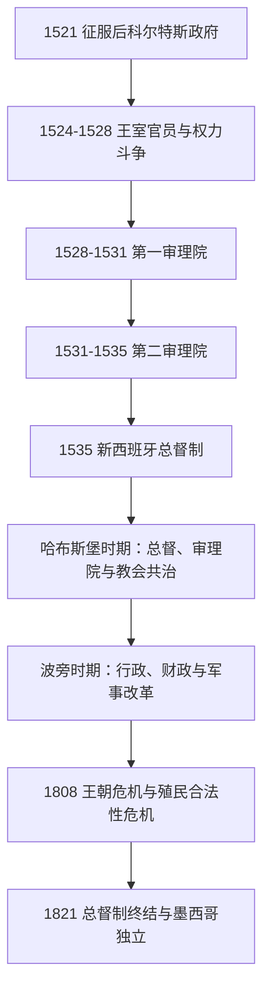

# 新西班牙总督与临时行政首脑表

## 时间与范围

1521—1821年。本表连续整理征服后的最高殖民行政首脑：总督制建立前的科尔特斯政府与审理院、1535年以后历任总督和代行总督职权者，以及独立前最后的最高政治长官。名义最高主权属于西班牙君主；总督同时通常兼任总督区长官、总司令和皇家审理院院长，但受审理院、教会、财政官和地方机构制衡。

## 制度演变

## 总督制建立以前

| 顺序 | 行政首脑或机构 | 任职 | 身份与说明 |
|---:|---|---|---|
| 1 | **埃尔南·科尔特斯**（Hernán Cortés） | 1521—1524年 | 征服军首领，任新西班牙总督与总司令；1524年出征洪都拉斯后权力由王室官员代行。 |
| 2 | 阿隆索·德·埃斯特拉达、罗德里戈·德·阿尔博诺斯、贡萨洛·德·萨拉萨尔、佩德罗·阿尔明德斯·奇里诺等王室官员 | 1524—1528年 | 财政官、监察官和代理长官反复结盟与争权；不是稳定的单一总督政府。 |
| 3 | **第一皇家审理院**，主席努尼奥·德·古斯曼 | 1528—1531年 | 以合议法院兼行政机构取代征服者个人统治，因掠夺、奴役和派系冲突受到批评。 |
| 4 | **第二皇家审理院**，主席塞瓦斯蒂安·拉米雷斯·德·富恩莱亚尔 | 1531—1535年 | 重整司法和原住民政策，为总督制建立过渡；成员包括后来的改革者巴斯科·德·基罗加。 |

## 哈布斯堡时期总督与代行机构

| 顺序 | 总督或代行机构 | 任职 | 交接与要点 |
|---:|---|---|---|
| 1 | **安东尼奥·德·门多萨**（Antonio de Mendoza） | 1535—1550年 | 首任总督；建立较稳定的王室行政、铸币和印刷体系，处理征服者、教会和原住民共同体关系。 |
| 2 | **路易斯·德·贝拉斯科一世**（Luis de Velasco I） | 1550—1564年 | 推动限制原住民奴役及集中定居；其死后由审理院代行。 |
| 代行 | 墨西哥皇家审理院 | 1564—1566年 | 集体行使总督职权。 |
| 3 | 加斯顿·德·佩拉尔塔（Gastón de Peralta） | 1566—1567年 | 在征服者后裔阴谋案与政治猜疑中被召回。 |
| 代行 | 墨西哥皇家审理院 | 1567—1568年 | 等待新总督抵达。 |
| 4 | 马丁·恩里克斯·德·阿尔曼萨（Martín Enríquez de Almanza） | 1568—1580年 | 加强北部军事边疆与宗教裁判机构；后调任秘鲁。 |
| 5 | 洛伦索·苏亚雷斯·德·门多萨（Lorenzo Suárez de Mendoza） | 1580—1583年 | 任内打击官员腐败，逝于任所。 |
| 代行 | 墨西哥皇家审理院 | 1583—1584年 | 集体摄理。 |
| 6 | 佩德罗·莫亚·德·孔特雷拉斯（Pedro Moya de Contreras） | 1584—1585年 | 墨西哥大主教兼监察官，短期代行总督职权。 |
| 7 | 阿尔瓦罗·曼里克·德·苏尼加（Álvaro Manrique de Zúñiga） | 1585—1590年 | 处理地方司法冲突，最终被调查并召回。 |
| 8 | **路易斯·德·贝拉斯科二世**（Luis de Velasco II） | 1590—1595年 | 贝拉斯科一世之子；首次任期后调任秘鲁。 |
| 9 | 加斯帕尔·德·苏尼加（Gaspar de Zúñiga y Acevedo） | 1595—1603年 | 支持北方探索与边疆殖民，后调任秘鲁。 |
| 10 | 胡安·德·门多萨（Juan de Mendoza y Luna） | 1603—1607年 | 处理墨西哥城水患和行政整顿，后调任秘鲁。 |
| 11 | **路易斯·德·贝拉斯科二世** | 1607—1611年 | 第二次任总督；后任印度事务委员会主席。 |
| 12 | 弗赖·加西亚·格拉（Fray García Guerra） | 1611—1612年 | 多米尼加会士、墨西哥大主教，在任内去世。 |
| 代行 | 墨西哥皇家审理院 | 1612年 | 短期代行。 |
| 13 | 迭戈·费尔南德斯·德·科尔多瓦（Diego Fernández de Córdoba） | 1612—1621年 | 推进排水、边疆与太平洋防务。 |
| 代行 | 墨西哥皇家审理院 | 1621年 | 短期过渡。 |
| 14 | 迭戈·卡里略·德·门多萨（Diego Carrillo de Mendoza y Pimentel） | 1621—1624年 | 与墨西哥大主教冲突，在1624年城市骚乱中被推翻。 |
| 代行 | 墨西哥皇家审理院 | 1624年 | 骚乱后临时接管。 |
| 15 | 罗德里戈·帕切科（Rodrigo Pacheco y Osorio） | 1624—1635年 | 重建王室权威，长期任职。 |
| 16 | 洛佩·迪耶斯·德·奥克斯-阿门达里斯（Lope Díez de Aux de Armendáriz） | 1635—1640年 | 首位出生于新西班牙的总督；强化海防与财政。 |
| 17 | 迭戈·洛佩斯·帕切科（Diego López Pacheco Cabrera y Bobadilla） | 1640—1642年 | 葡萄牙复国后因家族联系受猜疑，被监察官罢免。 |
| 18 | 胡安·德·帕拉福克斯-门多萨（Juan de Palafox y Mendoza） | 1642年 | 普埃布拉主教兼王室监察官，短期代行并调查前任。 |
| 19 | 加西亚·萨米恩托·德·索托马约尔（García Sarmiento de Sotomayor） | 1642—1648年 | 处理财政、太平洋贸易与北部边疆。 |
| 20 | 马科斯·德·托雷斯-鲁埃达（Marcos de Torres y Rueda） | 1648—1649年 | 尤卡坦主教，代总督；死后审理院接管。 |
| 代行 | 墨西哥皇家审理院 | 1649—1650年 | 集体摄理。 |
| 21 | 路易斯·恩里克斯·德·古斯曼（Luis Enríquez de Guzmán） | 1650—1653年 | 任满后调任秘鲁。 |
| 22 | 弗朗西斯科·费尔南德斯·德·拉·库埃瓦（Francisco Fernández de la Cueva） | 1653—1660年 | 防务、城市工程和财政整顿。 |
| 23 | 胡安·德·莱瓦·德·拉·塞尔达（Juan de Leyva de la Cerda） | 1660—1664年 | 家族滥权与腐败争议导致辞职。 |
| 24 | 迭戈·奥索里奥·德·埃斯科瓦尔（Diego Osorio de Escobar） | 1664年 | 普埃布拉主教，短期代行。 |
| 25 | 安东尼奥·塞瓦斯蒂安·德·托莱多（Antonio Sebastián de Toledo） | 1664—1673年 | 改善防务和财政，任期相对稳定。 |
| 26 | 佩德罗·努尼奥·科隆·德·波图加尔（Pedro Nuño Colón de Portugal） | 1673年 | 抵达后不久去世。 |
| 27 | 弗赖·帕约·恩里克斯·德·里韦拉（Fray Payo Enríquez de Rivera） | 1673—1680年 | 墨西哥大主教兼总督，支持公共工程与教育。 |
| 28 | 托马斯·安东尼奥·德·拉·塞尔达（Tomás Antonio de la Cerda y Aragón） | 1680—1686年 | 处理北部起事、海盗与边疆问题。 |
| 29 | 梅尔乔·波托卡雷罗（Melchor Portocarrero Lasso de la Vega） | 1686—1688年 | 后调任秘鲁。 |
| 30 | 加斯帕尔·德·拉·塞尔达（Gaspar de la Cerda Sandoval Silva y Mendoza） | 1688—1696年 | 1692年粮食危机与墨西哥城骚乱发生在其任内。 |
| 31 | 胡安·德·奥尔特加-蒙塔涅斯（Juan de Ortega y Montañés） | 1696年 | 米却肯主教，第一次短期代行。 |
| 32 | 何塞·萨米恩托·德·巴利亚达雷斯（José Sarmiento de Valladares） | 1696—1701年 | 哈布斯堡王朝末期最后一任总督。 |

## 波旁时期总督与代行机构

| 顺序 | 总督或代行机构 | 任职 | 交接与要点 |
|---:|---|---|---|
| 33 | 胡安·德·奥尔特加-蒙塔涅斯 | 1701—1702年 | 第二次代行，完成王朝更替之际的过渡。 |
| 34 | 弗朗西斯科·费尔南德斯·德·拉·库埃瓦（Francisco Fernández de la Cueva Enríquez） | 1702—1711年 | 西班牙王位继承战争时期维持财政与防务。 |
| 35 | 费尔南多·德·阿伦卡斯特雷（Fernando de Alencastre Noroña y Silva） | 1711—1716年 | 发展北部边疆和公共赈济。 |
| 36 | 巴尔塔萨尔·德·苏尼加（Baltasar de Zúñiga y Guzmán） | 1716—1722年 | 加强得克萨斯等北部边疆据点。 |
| 37 | 胡安·德·阿库尼亚（Juan de Acuña） | 1722—1734年 | 首位出生于美洲、获正式任命且任期长久的总督之一。 |
| 38 | 胡安·安东尼奥·德·比萨龙（Juan Antonio de Vizarrón y Eguiarreta） | 1734—1740年 | 墨西哥大主教兼总督，处理灾荒与英国威胁。 |
| 39 | 佩德罗·德·卡斯特罗（Pedro de Castro y Figueroa） | 1740—1741年 | 任内早逝。 |
| 代行 | 墨西哥皇家审理院 | 1741—1742年 | 集体摄理。 |
| 40 | 佩德罗·德·塞夫里安（Pedro de Cebrián y Agustín） | 1742—1746年 | 调整财政、防务和太平洋贸易。 |
| 41 | 胡安·弗朗西斯科·德·圭梅斯（Juan Francisco de Güemes y Horcasitas） | 1746—1755年 | 强化税收和边疆治理。 |
| 42 | 阿古斯丁·德·阿乌马达（Agustín de Ahumada y Villalón） | 1755—1760年 | 七年战争前夕强化军备，在任内去世。 |
| 代行 | 墨西哥皇家审理院 | 1760年 | 短期摄理。 |
| 43 | 华金·德·蒙塞拉特（Joaquín de Montserrat） | 1760—1766年 | 七年战争财政压力与军制改革；与王室监察体系冲突。 |
| 44 | 卡洛斯·弗朗西斯科·德·克鲁瓦（Carlos Francisco de Croix） | 1766—1771年 | 执行1767年驱逐耶稣会士和波旁军政改革。 |
| 45 | **安东尼奥·马里亚·德·布卡雷利**（Antonio María de Bucareli） | 1771—1779年 | 整顿财政、防务、交通与公共卫生，评价相对较高。 |
| 代行 | 墨西哥皇家审理院 | 1779年 | 布卡雷利去世后的短期过渡。 |
| 46 | 马丁·德·马约尔加（Martín de Mayorga） | 1779—1783年 | 美国独立战争时期组织财政与加勒比防务。 |
| 47 | 马蒂亚斯·德·加尔韦斯（Matías de Gálvez） | 1783—1784年 | 推进城市工程，在任内去世。 |
| 代行 | 墨西哥皇家审理院 | 1784—1785年 | 集体摄理。 |
| 48 | 贝尔纳多·德·加尔韦斯（Bernardo de Gálvez） | 1785—1786年 | 马蒂亚斯之子、美国独立战争名将；饥荒赈济后在任内去世。 |
| 代行 | 墨西哥皇家审理院 | 1786—1787年 | 短期摄理。 |
| 49 | 阿隆索·努涅斯·德·阿罗（Alonso Núñez de Haro y Peralta） | 1787年 | 墨西哥大主教，短期代总督。 |
| 50 | 曼努埃尔·安东尼奥·弗洛雷斯（Manuel Antonio Flórez） | 1787—1789年 | 调整海防与行政，因健康原因离任。 |
| 51 | **胡安·比森特·德·圭梅斯**（Juan Vicente de Güemes） | 1789—1794年 | 第二代雷维利亚希赫多伯爵；开展人口、城市、治安与财政整顿。 |
| 52 | 米格尔·德·拉·格鲁阿·塔拉曼卡（Miguel de la Grúa Talamanca） | 1794—1798年 | 战争财政和裙带政治引起争议。 |
| 53 | 米格尔·何塞·德·阿桑萨（Miguel José de Azanza） | 1798—1800年 | 应对英国威胁与殖民精英政治。 |
| 54 | 费利克斯·贝伦格尔·德·马尔基纳（Félix Berenguer de Marquina） | 1800—1803年 | 再次处于英西战争和财政紧张之中。 |
| 55 | **何塞·德·伊图里加赖**（José de Iturrigaray） | 1803—1808年 | 1808年西班牙王朝危机后讨论新西班牙自治合法性，被半岛出生精英政变罢黜。 |
| 56 | 佩德罗·德·加里瓦伊（Pedro de Garibay） | 1808—1809年 | 政变集团推立的老将，实际受皇家审理院和商人集团影响。 |
| 57 | 弗朗西斯科·哈维尔·德·利萨纳（Francisco Javier de Lizana y Beaumont） | 1809—1810年 | 墨西哥大主教；因政治危机被摄政机构撤换。 |
| 代行 | 墨西哥皇家审理院 | 1810年 | 独立战争爆发前后短期摄理。 |
| 58 | 弗朗西斯科·哈维尔·贝内加斯（Francisco Javier Venegas） | 1810—1813年 | 镇压伊达尔戈、莫雷洛斯等独立运动，执行加的斯宪政与复辟间的命令。 |
| 59 | **费利克斯·马里亚·卡列哈**（Félix María Calleja） | 1813—1816年 | 重组王党军和财政，对独立运动实施强硬镇压。 |
| 60 | **胡安·鲁伊斯·德·阿波达卡**（Juan Ruiz de Apodaca） | 1816—1821年 | 以赦免与军事手段压制起义；伊图尔维德倒戈后被军官罢免。 |
| 61 | 弗朗西斯科·诺韦利亚（Francisco Novella） | 1821年7—9月 | 兵变后代行最高长官，未经王室正规任命为总督。 |
| 62 | **胡安·奥多诺胡**（Juan O’Donojú） | 1821年8—10月 | 按1812年宪法任“最高政治长官”，严格说不是总督；与伊图尔维德签署《科尔多瓦条约》，承认以《伊瓜拉计划》为基础的权力移交。 |

## 统治连续性与实际权力

- “审理院代行”是法院成员合议摄政，不是遗漏的一位无名总督。表中将每段集体行政单列，以保持交接连续。
- 总督不等于现代殖民地的绝对统治者。王室法令、印度事务委员会、皇家审理院、主教与修会、财政专员、地方市议会、原住民共和国以及矿业和商人团体都能制约政策。
- 新西班牙总督辖区曾覆盖加勒比、中美洲、北美西南和菲律宾等广阔联系网络，但各地隶属关系与总督的实际控制程度不同；本表只列设在墨西哥城的最高行政首脑。
- 18世纪波旁改革增设行政区长、重整税收和常备军，强化王室汲取能力，同时冲击克里奥尔精英、地方法人团体与既有职位网络。
- 1808—1821年的合法性危机，使“效忠被俘君主”“自治”“加的斯宪政”“复辟专制”和“独立”成为不断变化的选择；总督职位最终不是被单次战役取代，而是在政治联盟和军队倒戈中解体。

## 相关笔记

- 殖民社会、征服与经济过程见[西班牙征服与新西班牙](/%E4%BA%BA%E6%96%87%E7%A7%91%E5%AD%A6/%E5%8E%86%E5%8F%B2/%E7%BE%8E%E6%B4%B2/%E5%8C%97%E7%BE%8E/%E5%A2%A8%E8%A5%BF%E5%93%A5/%E8%A5%BF%E7%8F%AD%E7%89%99%E5%BE%81%E6%9C%8D%E4%B8%8E%E6%96%B0%E8%A5%BF%E7%8F%AD%E7%89%99.md)。
- 前一政权世系见[墨西加特拉托阿尼世系表](/%E4%BA%BA%E6%96%87%E7%A7%91%E5%AD%A6/%E5%8E%86%E5%8F%B2/%E7%BE%8E%E6%B4%B2/%E5%8C%97%E7%BE%8E/%E5%A2%A8%E8%A5%BF%E5%93%A5/%E5%A2%A8%E8%A5%BF%E5%8A%A0%E7%89%B9%E6%8B%89%E6%89%98%E9%98%BF%E5%B0%BC%E4%B8%96%E7%B3%BB%E8%A1%A8.md)。
- 后续国家元首见[墨西哥国家元首表](/%E4%BA%BA%E6%96%87%E7%A7%91%E5%AD%A6/%E5%8E%86%E5%8F%B2/%E7%BE%8E%E6%B4%B2/%E5%8C%97%E7%BE%8E/%E5%A2%A8%E8%A5%BF%E5%93%A5/%E5%A2%A8%E8%A5%BF%E5%93%A5%E5%9B%BD%E5%AE%B6%E5%85%83%E9%A6%96%E8%A1%A8.md)。
- 返回[墨西哥历史](/%E4%BA%BA%E6%96%87%E7%A7%91%E5%AD%A6/%E5%8E%86%E5%8F%B2/%E7%BE%8E%E6%B4%B2/%E5%8C%97%E7%BE%8E/%E5%A2%A8%E8%A5%BF%E5%93%A5/README.md)。
