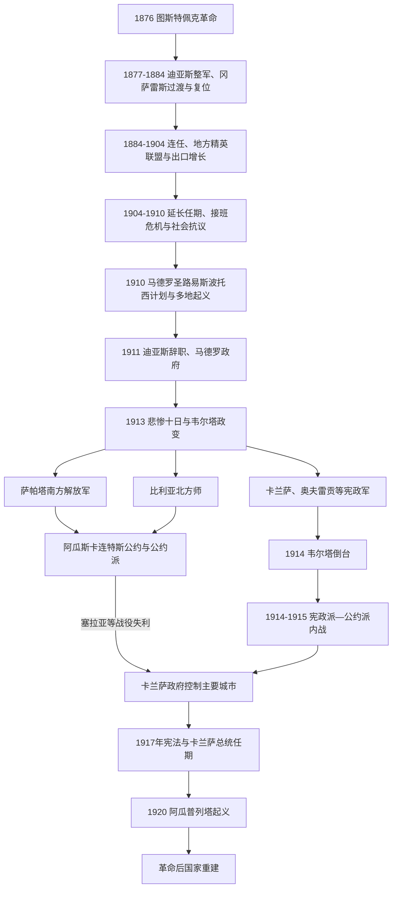

# 波菲里奥统治与墨西哥革命

## 时间

1876—1920年。从图斯特佩克革命到阿瓜普列塔起义后索诺拉派取得中央政权。1910年通常作为革命开端；革命的地区战争、土地冲突和制度落实延续到更晚，本页以1920年作为主要内战和国家元首交接的阶段终点。

## 概括

波菲里奥·迪亚斯先以反对总统连任夺权，后通过修改宪法、控制选举、调停州级强人、吸收军队和技术官僚，建立三十余年的个人化威权秩序。铁路、矿业、石油、出口农业、外国投资和稳定财政把区域市场连接起来，却伴随村社土地被测量公司与庄园兼并、工资和劳工纪律冲突、政治参与封闭以及地区收益失衡。1907年经济危机与接班困局使精英联盟松动，马德罗的反连任运动把地方不满连接成全国挑战。

1910年后不存在一个统一“革命军”。马德罗派要求有效选举；萨帕塔派要求村社土地归还；北方比利亚派依托骑兵、铁路和地方社会；卡兰萨宪政派主张恢复国家权威；索诺拉将领则以更有效的军队与劳工联盟最终胜出。1917年宪法把土地、劳工、世俗教育和国家资源权写入法典，但它既是社会革命成果，也是卡兰萨击败对手后重建中央国家的工具。

## 演进图

## 波菲里奥体制的建立

### 1876—1884年：从反连任起义到权力巩固

迪亚斯在1876年《图斯特佩克计划》中反对莱尔多连任，特科阿克战役获胜后进入首都。最高法院院长伊格莱西亚斯也以选举违法自称临时总统，造成三方合法性竞争；迪亚斯先让胡安·N·门德斯代政，自己击败伊格莱西亚斯，1877年经选举就任。为兑现反连任原则，他1880年把总统职位交给盟友曼努埃尔·冈萨雷斯，但自己仍控制军政网络并任瓦哈卡州长。

冈萨雷斯政府推进铁路、银行、度量衡和外交关系，英国重新承认墨西哥；债务、镍币和腐败争议却削弱其声望。1884年迪亚斯重返总统府。此后宪法先允许隔届再任，再允许连续连任，最终取消实际限制。1888年以后总统选举仍定期举行，却由官员、州长和议会筛选候选人，不再能决定权力更替。

### 统治机制

| 机制 | 运作方式 | 稳定效果与代价 |
|---|---|---|
| 总统与州长协商 | 迪亚斯保留可靠州长，轮换有独立野心者；地方强人控制选举、民兵和土地。 | 减少中央—地方内战，但政治忠诚高于公开竞争。 |
| 军队、乡村警察与私人武装 | 缩减不可靠的旧军官集团，以联邦军、“乡村骑警”和庄园警卫处理叛乱。 | 降低政变频率，也使劳工和村社争议军事化。 |
| “面包或棍棒” | 反对者可获职位、特许和商业机会，不合作则受流放、监禁或武力镇压。 | 吸纳精英和媒体，封闭制度内反对渠道。 |
| 科学家集团与财政官僚 | 以实证主义、“秩序与进步”和外国信用为依据整顿预算、货币和投资。 | 提升国家收入与信用，却把精英利益包装为技术必然。 |
| 选举与国会 | 保留宪法、法院和定期选举的形式。 | 提供法律外观，但候选和计票受行政控制。 |
| 外资平衡 | 在美国、英国、法国和德国资本间寻求平衡。 | 取得铁路、矿业和石油资本，也增加资源与基础设施的外部控制。 |

## 经济整合与社会代价

### 增长条件

1870年代末至1910年，铁路从不足千公里扩展为连接墨西哥城、美国边境、矿区和港口的全国网络，降低大宗货物运输成本并便于军队调动。矿业法和外资促进银、铜、铅和后期石油开发；尤卡坦龙舌兰、莫雷洛斯糖、恰帕斯咖啡和北部畜牧进入出口市场。财政部长何塞·伊夫·利曼图尔整顿债务、税收和货币，使政府预算趋于稳定。城市电力、电话、排水、学校和公共建筑扩展，形成“现代化”形象。

增长并非只由外国人创造。本地商人、庄园主、工匠、铁路工人和迁移劳动力参与市场整合；许多村社也主动生产商品。然而国家法律优先确认可测量、可登记的私人产权，拥有资本和政治关系者更容易获益。经济增长同时制造了更能跨地区协调的工人阶级和中产公共舆论。

### 土地、劳工与地区差异

土地测量公司以测绘“荒地”为交换获得大片土地，许多原住民和村社因缺少国家认可的书面产权而失地。莫雷洛斯糖庄园侵占村庄水源，尤卡坦龙舌兰庄园、瓦耶纳西奥纳尔种植园和北部矿区存在债务束缚、强制迁移与恶劣劳动。亚基人抵抗索诺拉土地扩张，政府以军事征服和驱逐尤卡坦等地回应。

工业和矿业工人要求更高工资、缩短工时、反对外国雇员差别待遇。1906年卡纳内阿铜矿罢工遭墨西哥武装和越境的美国志愿者镇压；1907年里奥布兰科纺织工人冲突造成大量死伤。城市互助社、自由派报刊和墨西哥自由党传播反独裁、劳工与无政府主义思想。体制能够压制单次抗议，却没有合法谈判和接班渠道。

## 波菲里奥体制的衰落

### 结构因素

- 长期连任使州长、军官和年轻精英缺少正常晋升，所有接班竞争集中到年迈总统身上。
- 经济成果依赖出口、外资和土地集中；地区、阶层和国籍间收益不均。
- 司法和选举缺乏可信渠道，土地、劳工和地方自治冲突只能诉诸请愿、逃亡或武装。
- 1907年全球金融危机造成矿山停工、失业和汇款下降，1908—1910年歉收推高食品价格。
- 迪亚斯1908年接受克里尔曼采访时表示欢迎反对党，鼓励精英公开组织；政府随后镇压候选人，暴露承诺与现实落差。

### 直接触发

科阿韦拉庄园主弗朗西斯科·I·马德罗出版《1910年的总统继承》，组织反连任党并竞选总统。政府在选举前逮捕他，宣布迪亚斯—科拉尔再次获胜。马德罗逃往美国，发布日期署为1910年10月5日的《圣路易斯波托西计划》，宣布选举无效、号召11月20日起义，并承诺审查非法夺地。最初起义零散，但奇瓦瓦的帕斯夸尔·奥罗斯科和潘乔·比利亚、莫雷洛斯的埃米利亚诺·萨帕塔等迅速扩大。1911年革命军攻下华雷斯城，联邦军和精英支持瓦解；迪亚斯5月辞职流亡。其政权并非被一次正面决战消灭，而是在全国多点起义、财政和军队信心动摇、和平谈判共同作用下解体。

## 革命第一阶段：马德罗政府

临时总统弗朗西斯科·莱昂·德·拉·巴拉保留联邦军并要求革命部队复员。马德罗1911年11月就任，恢复竞争性选举、新闻和结社，却试图以旧官僚、旧军队和渐进法律改革维持秩序。萨帕塔认为莫雷洛斯村社土地迟迟未归还，发布《阿亚拉计划》，否认马德罗并提出没收与归还土地；奥罗斯科1912年也在北方叛乱，马德罗依靠维克托里亚诺·韦尔塔率旧联邦军镇压。

马德罗同时受到迪亚斯旧精英、美国大使亨利·莱恩·威尔逊、保守军官和激进革命派夹击。1913年2月“悲惨十日”中，费利克斯·迪亚斯等在首都叛乱，韦尔塔表面保卫政府，实与叛军和美国大使达成“使馆协定”。马德罗和副总统何塞·马里亚·皮诺·苏亚雷斯被迫辞职后遇害；外交部长佩德罗·拉斯库赖因按继承程序任总统约45分钟，任命韦尔塔为内政部长后辞职，使韦尔塔取得表面合法性。

马德罗政府灭亡的结构弱点是既未拆除旧军队，也未满足土地和地方武装诉求；外部和精英压力来自美国大使、保守派与外国投资利益；直接触发是首都叛军与韦尔塔倒戈。

## 反韦尔塔战争

科阿韦拉州长贝努斯蒂亚诺·卡兰萨发布《瓜达卢佩计划》，拒绝承认韦尔塔并自称宪政军“第一首领”。索诺拉的阿尔瓦罗·奥夫雷贡、普鲁塔尔科·埃利亚斯·卡列斯等组织较稳定的州级军队；奇瓦瓦的比利亚把地方队伍整编为北方师，利用铁路快速作战；萨帕塔南方解放军继续以村社为基础，拒绝服从卡兰萨。

韦尔塔解散国会、逮捕和杀害反对者，扩大征兵和纸币发行，却无法取得美国总统伍德罗·威尔逊承认。1914年美军占领韦拉克鲁斯，阻止一批军火交付并加重政府困境。比利亚在萨卡特卡斯摧毁联邦军主力，奥夫雷贡沿太平洋和西部推进。韦尔塔7月辞职，临时总统卡瓦哈尔通过《特奥洛尤坎协定》解散旧联邦军，向宪政派交权。

## 革命联盟分裂

### 阿瓜斯卡连特斯公约

反韦尔塔共同目标消失后，卡兰萨与比利亚围绕军事服从、社会改革和临时政府冲突。1914年阿瓜斯卡连特斯公约宣布自己拥有主权，推举欧拉利奥·古铁雷斯为临时总统；比利亚和萨帕塔支持公约军，12月共同进入墨西哥城。卡兰萨退至韦拉克鲁斯，掌握港口税收、部分铁路和奥夫雷贡军队。公约政府内部缺乏统一财政和指挥，古铁雷斯、冈萨雷斯·加尔萨、拉戈斯·查萨罗先后任临时总统。

### 1915年军事转折

奥夫雷贡采用壕沟、铁丝网、机枪和纵深防御，在塞拉亚、莱昂等战役击败比利亚骑兵。美国同年事实上承认卡兰萨政府，比利亚北方师解体为游击队；1916年比利亚袭击新墨西哥州哥伦布，美国潘兴远征军进入墨西哥追捕未果，增加主权紧张。萨帕塔在莫雷洛斯继续土地重分和地方治理，却遭卡兰萨军系统进攻，1919年被诱杀。

## 1917年宪法与卡兰萨政权

卡兰萨在克雷塔罗召集制宪会议，原想修订1857年宪法；较激进代表推动加入社会条款。1917年2月5日宪法颁布，5月卡兰萨成为宪法总统。

| 条款 / 领域 | 核心内容 | 历史意义与落实难题 |
|---|---|---|
| 第3条 | 教育世俗化，后续修订扩大国家教育角色。 | 延续改革时代政教分离，也引发与教会冲突。 |
| 第27条 | 国家对土地、水域和地下资源拥有原始权利，可征收并分配土地。 | 为村社土地恢复、土地改革和石油政策提供宪法基础；落实取决于总统与地方力量。 |
| 第123条 | 八小时工作制、最低工资、组织与罢工权、工伤和妇幼保护。 | 是当时最系统的宪法劳工权利之一，但地方执行差异大。 |
| 政治制度 | 总统制、联邦制和不连任原则；削弱副总统造成的继承冲突。 | 重建中央宪政，也保留强总统可能。 |
| 宗教条款 | 限制教会法人地位、财产和政治活动。 | 为1920年代政教冲突埋下制度基础。 |

卡兰萨优先恢复税收、行政和外交主权，对大规模土地和劳工改革较谨慎。他在第一次世界大战中维持中立，拒绝齐默尔曼电报中的德方联盟提议。1919年萨帕塔被杀，政府仍未消除地方反抗。1920年卡兰萨试图支持文官伊格纳西奥·博尼利亚斯接班，阻止声望最高的奥夫雷贡竞选。索诺拉州领导人发布《阿瓜普列塔计划》，军队和州长迅速倒戈；卡兰萨带政府撤往韦拉克鲁斯，途中在特拉斯卡兰通戈被杀。索诺拉派胜利后，阿道弗·德·拉·韦尔塔任临时总统，促成复员和选举，奥夫雷贡12月就职。

卡兰萨政权灭亡重现波菲里奥体制的接班问题：总统试图从上而下指定继承人，军队与州级联盟缺乏接受结果的制度渠道；直接触发是索诺拉军政集团起兵和全国倒戈。

## 革命阵营与社会基础

| 阵营 / 领袖 | 核心区域与组织 | 主要目标 | 最终处境 |
|---|---|---|---|
| 马德罗派 | 全国反连任俱乐部、中产与部分庄园精英 | 有效选举、不连任、渐进法治。 | 1913年政变瓦解，其民主合法性成为后世革命叙事一部分。 |
| 萨帕塔派 | 莫雷洛斯村社和南方解放军 | 《阿亚拉计划》、土地归还、村社自治。 | 被宪政军压制，萨帕塔1919年遇害；土地诉求后来由国家部分吸收。 |
| 比利亚派 | 奇瓦瓦北方师、牧工、矿工、农民与地方精英 | 反韦尔塔、地方经济和较灵活的土地 / 社会政策。 | 1915年主力战败，后游击；1920年与政府和解。 |
| 卡兰萨派 | 科阿韦拉文官、州政府、宪政军 | 恢复宪政、摧毁旧联邦军、重建中央国家。 | 1915年获胜、制定1917年宪法，1920年被索诺拉派推翻。 |
| 奥夫雷贡—索诺拉派 | 索诺拉州财政、军队、农工联盟 | 务实军事整合、承认部分社会改革、取得国家继承权。 | 1920年掌权，成为革命后国家核心。 |
| 城市工人组织 | 墨西哥城及工业区，“世界工人之家”等 | 工资、工时、组织权；部分与宪政派结盟。 | 1915年红色营支持卡兰萨，1916年罢工又被政府镇压，显示联盟的工具性。 |

## 国家元首与并立政府

1876年三方争位、迪亚斯每个宪法任期、1911年后所有临时总统、拉斯库赖因约45分钟任期、卡兰萨第一首领与总统两种身份，以及公约派三位并立总统，均逐项见[墨西哥国家元首表](/%E4%BA%BA%E6%96%87%E7%A7%91%E5%AD%A6/%E5%8E%86%E5%8F%B2/%E7%BE%8E%E6%B4%B2/%E5%8C%97%E7%BE%8E/%E5%A2%A8%E8%A5%BF%E5%93%A5/%E5%A2%A8%E8%A5%BF%E5%93%A5%E5%9B%BD%E5%AE%B6%E5%85%83%E9%A6%96%E8%A1%A8.md)。该表没有把迪亚斯1884—1911年或革命期多政权合并成一行。

## 革命结果与未完成问题

- 旧联邦军被解散，革命军各派成为新国家军政精英；军队政治化并未立即结束。
- 1917年宪法提供土地、劳工、教育和资源主权框架，具体落实要到卡德纳斯时期等后续阶段才显著扩大。
- 反连任原则重新确立，后来演变为总统不得再次任职和定期六年交接。
- 乡村获得部分土地重分，但战争造成人口死亡、流离、饥荒、疫病和生产破坏；不同地区受损程度差异巨大。
- 女性作为士兵、护士、交通人员、宣传者和间谍参与革命，战后政治权利并未同步实现。
- 革命摧毁波菲里奥精英的封闭接班机制，却没有立即建立稳定多党民主；胜利派随后把竞争制度化于国家和执政党。

## 关键辨析

- “波菲里奥和平”是国家减少精英内战后的相对秩序，不代表村社、劳工和边疆没有强制与战争。
- 经济现代化与威权压迫不是互相排斥的两种评价，而是同一发展模式的相互条件。
- 革命不是马德罗一声号召就由统一民族发动；各地起义有自身土地、劳工和派系历史。
- 萨帕塔和比利亚1914年进入首都不等于建立稳定全国政府；卡兰萨掌握港口和奥夫雷贡军队后反而取得战略优势。
- 1917年宪法是重大制度成果，但写入权利不等于即时兑现。

## 演变关系

- 前一阶段：[改革战争、法国干涉与复辟共和国](/%E4%BA%BA%E6%96%87%E7%A7%91%E5%AD%A6/%E5%8E%86%E5%8F%B2/%E7%BE%8E%E6%B4%B2/%E5%8C%97%E7%BE%8E/%E5%A2%A8%E8%A5%BF%E5%93%A5/%E6%94%B9%E9%9D%A9%E6%88%98%E4%BA%89%E3%80%81%E6%B3%95%E5%9B%BD%E5%B9%B2%E6%B6%89%E4%B8%8E%E5%A4%8D%E8%BE%9F%E5%85%B1%E5%92%8C%E5%9B%BD.md)。
- 后一阶段：[革命后国家与当代墨西哥](/%E4%BA%BA%E6%96%87%E7%A7%91%E5%AD%A6/%E5%8E%86%E5%8F%B2/%E7%BE%8E%E6%B4%B2/%E5%8C%97%E7%BE%8E/%E5%A2%A8%E8%A5%BF%E5%93%A5/%E9%9D%A9%E5%91%BD%E5%90%8E%E5%9B%BD%E5%AE%B6%E4%B8%8E%E5%BD%93%E4%BB%A3%E5%A2%A8%E8%A5%BF%E5%93%A5.md)。
- 返回[墨西哥历史](/%E4%BA%BA%E6%96%87%E7%A7%91%E5%AD%A6/%E5%8E%86%E5%8F%B2/%E7%BE%8E%E6%B4%B2/%E5%8C%97%E7%BE%8E/%E5%A2%A8%E8%A5%BF%E5%93%A5/README.md)。
