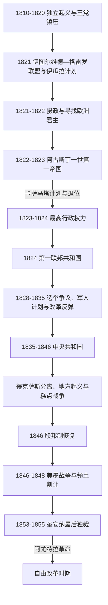

# 独立、第一帝国与早期共和国

## 时间

1810—1855年。独立战争始于1810年；1821年建立独立国家。1855年阿尤特拉革命推翻圣安纳，通常作为自由改革时期的起点。

## 概括

墨西哥独立不是一个稳定民族国家从殖民外壳中直接诞生。1810—1821年的战争摧毁财政、矿业和交通，军队、教会、原住民共同体、州与城市都试图保有权利。伊图尔维德以君主制联合原王党军和独立派，却因欧洲王族拒绝、财政枯竭、国会冲突和地方共和运动而迅速失败。1824年联邦共和国给予各州较大权力，但中央税源、职业军队、教会与军队特权、地区经济和边疆安全没有稳定安排。此后军人“计划”、国会与州起义反复改变政府；中央制导致得克萨斯等地分离，美墨战争又造成巨大领土损失。1855年的崩溃最终使自由派能够把长期争议变成制度改革。

## 政体演变

## 独立战争的阶段

| 阶段 | 主要领导与区域 | 过程 | 转折 |
|---|---|---|---|
| 1810—1811年群众起义 | 米格尔·伊达尔戈、伊格纳西奥·阿连德；巴希奥和中部 | “多洛雷斯呼声”后，农民、矿工、城市民众和地方民兵组成大军，攻占瓜纳华托、巴利亚多利德和瓜达拉哈拉；领导层对社会秩序、战略和是否进攻首都意见不一。 | 卡尔德龙桥战败后北撤，伊达尔戈、阿连德等被俘处决；起义从大军转为区域战争。 |
| 1811—1815年组织化战争 | 何塞·马里亚·莫雷洛斯；南部和太平洋通道 | 莫雷洛斯建立纪律较强的军队，控制瓦哈卡和阿卡普尔科通道；1813年奇尔潘辛戈会议宣布独立，《民族情感》提出人民主权、废除种姓和限制贫富差距；1814年颁布《阿帕钦甘宪法》。 | 王党军反攻、代表会议迁徙，莫雷洛斯1815年被俘处决。 |
| 1815—1820年游击与僵局 | 维森特·格雷罗、瓜达卢佩·维多利亚等 | 起义在山区、南部和韦拉克鲁斯内陆延续；总督阿波达卡结合赦免、地方民兵与军事围剿，多数地区恢复王党控制。 | 1820年西班牙自由革命迫使斐迪南七世恢复加的斯宪法，改变原王党精英的选择。 |
| 1820—1821年联盟独立 | 阿古斯丁·德·伊图尔维德、维森特·格雷罗 | 伊图尔维德原奉命讨伐格雷罗，转而谈判并颁布《伊瓜拉计划》，以天主教、独立和联合为三保证；原王党驻军和地方精英陆续倒戈。 | 三保证军进入墨西哥城；独立宣言建立摄政。 |

## 1821—1823年第一帝国

### 建立背景

《伊瓜拉计划》设想由斐迪南七世或其他欧洲王族出任墨西哥君主，以世袭君主制兼顾独立、社会秩序和殖民精英连续性。西班牙拒绝承认独立，欧洲王族无人接受。伊图尔维德掌握三保证军、群众声望和全国军政网络，国会与军队却对主权归属、预算和省级权力看法不同。1822年5月军营和城市群众拥立伊图尔维德，国会确认其为阿古斯丁一世。

### 统治和灭亡

帝国继承了战争债务、税收崩溃、停产矿区和庞大军队。伊图尔维德削减或废除部分殖民税，却没有替代收入；强制借款和纸币进一步损害信用。他与制宪国会争夺任命、军费和宪法制定权，1822年10月解散国会，以受控的国家机构代替。安东尼奥·洛佩斯·德·圣安纳在韦拉克鲁斯起兵，最初军事失利；1823年《卡萨马塔计划》转而要求恢复国会，各省军政领袖迅速加入。

伊图尔维德失去军队与省份支持，于1823年3月退位。帝国失败的结构原因是财政和合法性同时薄弱，外部王族方案落空，中央与省份没有建立可接受的权力分配；直接触发则是解散国会后军人联盟倒戈。国会宣布其加冕无效，最高行政权力合议过渡。中美洲大多数省份退出原帝国，危地马拉以南形成中美洲联合省，墨西哥版图由此收缩。

## 1824年联邦共和国

1824年宪法建立“墨西哥合众国”，以各州、联邦国会、总统和最高法院构成联邦制。天主教仍是唯一法定宗教，军队与教会的特别司法权未被根本取消。首任总统瓜达卢佩·维多利亚取得英国和美国等承认，1825年攻下西班牙在圣胡安·德乌卢亚的最后据点，并完成完整任期；但政府依赖关税和外国贷款，州掌握重要直接税，中央经常无力支付军饷。

1828年总统选举中曼努埃尔·戈麦斯·佩德拉萨获胜，维森特·格雷罗支持者以首都阿科达达兵变迫使结果逆转。格雷罗1829年就任并在西班牙远征威胁下获紧急权力，宣布废奴；副总统布斯塔曼特随后以《哈拉帕计划》起兵，推翻并最终处死格雷罗。选举失败者诉诸军营“计划”、胜者再以特赦和新选举合法化，形成反复政变机制。

## 自由改革尝试与中央制转向

1833年圣安纳当选总统，常退居庄园，由副总统巴伦廷·戈麦斯·法里亚斯多次代政。戈麦斯·法里亚斯削减军队和教会特权、改革教育、调整教会收入，引发保守精英、军官、部分地方民众与教会反对。圣安纳1834年返京，撤销多项改革并解散国会。1835—1836年“七法”取消州主权，把州改为由中央控制的省，另设“最高保守权力”监督其他机关。

中央制不是简单的行政效率方案。中央希望统一税收、军队和边疆政策，地方精英则担心自治、民兵和土地利益受损。萨卡特卡斯州1835年抵抗被圣安纳击败并受惩罚；尤卡坦多次分离，里奥格兰德共和国等运动短暂出现。频繁起义又迫使中央继续依赖军人和紧急税收，形成恶性循环。

## 得克萨斯分离

墨西哥独立后延续鼓励移民开发得克萨斯的政策，大批来自美国的定居者进入科阿韦拉和得克萨斯州。双方争议涉及移民限制、奴隶制、关税、土地契约、地方英语政治与联邦自治。1835年中央制取代1824年宪法，成为公开叛乱的直接触发。圣安纳军攻下阿拉莫并在戈利亚德处决俘虏，却于1836年圣哈辛托战役被萨姆·休斯敦击败、被俘并签署撤军协议。

墨西哥政府不承认得克萨斯独立，仍把它视为叛乱省；得克萨斯共和国则维持事实独立。1845年美国兼并得克萨斯，将未解决的边界问题转为两国战争。不能把冲突只解释为中央制或移民自治：美国南部奴隶制扩张、墨西哥废奴政策、边疆原住民族行动和两国领土野心都参与其中。

## 外债、糕点战争与政权更替

独立战争后政府收入不足，却要供养军队、偿还伦敦贷款并抵御西班牙复征。海关通常已抵押给债权人，政变和封锁又使贸易下降。法国以本国侨民损失索赔为由在1838年封锁韦拉克鲁斯，引发“糕点战争”；圣安纳在战斗中失去一腿，借民族防卫重新获得声望。英国调停后墨西哥同意赔款，但财政问题没有解决。

1837—1846年间布斯塔曼特、圣安纳、尼古拉斯·布拉沃、巴伦廷·卡纳利索和多个临时总统交替。军人不是独自统治：国会、部长、州长、城市议会、商人和教会通过贷款、税收、地方民兵和政治宣传决定每次政府能否生存。完整到日的交接见[墨西哥国家元首表](/%E4%BA%BA%E6%96%87%E7%A7%91%E5%AD%A6/%E5%8E%86%E5%8F%B2/%E7%BE%8E%E6%B4%B2/%E5%8C%97%E7%BE%8E/%E5%A2%A8%E8%A5%BF%E5%93%A5/%E5%A2%A8%E8%A5%BF%E5%93%A5%E5%9B%BD%E5%AE%B6%E5%85%83%E9%A6%96%E8%A1%A8.md)。

## 美墨战争

### 走向战争

美国1845年兼并得克萨斯后，双方对边界存在争议：墨西哥认为得克萨斯南界在努埃塞斯河，美国主张格兰德河。美国总统詹姆斯·波尔克同时试图购买加利福尼亚和新墨西哥；谈判失败后派扎卡里·泰勒军进入争议地带。1846年4月发生交火，美国国会宣战，墨西哥也进入战争状态。此时墨西哥中央制再度崩溃，联邦制恢复；政府却在总统更替、财政短缺与地区利益分裂中组织抵抗。

### 战争阶段

| 时间 | 战场与事件 | 结果 |
|---|---|---|
| 1846年 | 帕洛阿尔托、雷萨卡-德拉帕尔马与蒙特雷 | 泰勒军控制墨西哥东北通道；美国海军封锁港口。 |
| 1846—1847年 | 新墨西哥与加利福尼亚 | 美国军队、当地定居者和海军占领主要据点；当地墨西哥居民与原住民族反应不一。 |
| 1847年2月 | 布埃纳维斯塔战役 | 圣安纳未能摧毁泰勒军，双方均宣称胜利；墨军退回中部。 |
| 1847年3—9月 | 斯科特从韦拉克鲁斯登陆进军 | 韦拉克鲁斯、塞罗戈多、孔特雷拉斯、丘鲁布斯科、查普尔特佩克相继失守；美国军占领墨西哥城。 |
| 1848年2月 | 《瓜达卢佩-伊达尔戈条约》 | 墨西哥承认格兰德河边界并割让上加利福尼亚、新墨西哥等广阔领土，美国支付补偿并承担部分索赔。 |

### 战败原因与后果

墨西哥军民在多个战场顽强抵抗，战败不能归咎于单一“落后”。结构上，国家财政和补给体系薄弱，正规军受频繁政变破坏，州与中央相互不信任；美国拥有更强海军、工业、信贷和多路远征能力。直接战场上，美军从海上选择韦拉克鲁斯登陆，绕开北部距离问题；墨军指挥分歧与装备、训练差距加重失利。战争造成伤亡、债务与政治羞辱，割让地区的墨西哥居民、原住民族和土地权利此后受美国法律和移民扩张重塑。

## 1848—1855年：重建失败与圣安纳末次独裁

埃雷拉与阿里斯塔政府尝试裁军、整顿财政和重建文官秩序，但战后军官、地方起义、教会财产和税制问题难以调和。1853年保守派和军人迎回圣安纳。他取消联邦安排、扩大军队和秘密警察、压制新闻，以“最崇高殿下”塑造个人权威。政府恢复苛税，包括对门窗、犬只等征税，并在1853年通过“加兹登购地”向美国出售拉梅西利亚，以取得现金和确定南部铁路边界。

1854年胡安·阿尔瓦雷斯、伊格纳西奥·科蒙福特等发布《阿尤特拉计划》，要求罢免圣安纳并召开制宪会议。起义依托格雷罗山区，逐步吸收自由派、地方军队和对税负不满者；圣安纳远征未能消灭。1855年首都和军队支持瓦解，他逃亡。其政权的结构弱点是财政靠临时税与出售领土、地方联盟狭窄、个人独裁破坏精英协商；阿尤特拉军扩展和首都倒戈构成直接灭亡过程。

## 国家元首与实际权力结构

### 元首连续表

摄政成员、阿古斯丁一世、最高行政权力全部成员，以及1824—1855年每一位宪法、临时、代行和事实总统均见[墨西哥国家元首表](/%E4%BA%BA%E6%96%87%E7%A7%91%E5%AD%A6/%E5%8E%86%E5%8F%B2/%E7%BE%8E%E6%B4%B2/%E5%8C%97%E7%BE%8E/%E5%A2%A8%E8%A5%BF%E5%93%A5/%E5%A2%A8%E8%A5%BF%E5%93%A5%E5%9B%BD%E5%AE%B6%E5%85%83%E9%A6%96%E8%A1%A8.md)。圣安纳的十一次分段任职、戈麦斯·法里亚斯五次代行和战争期间各次交接均逐项列出，每段任期都有独立记录。

### 实际权力

| 力量 | 资源 | 对国家稳定的影响 |
|---|---|---|
| 总统与职业军队 | 任命、军饷、首都驻军和全国声望 | 可以保卫政府，也常以“计划”迫使总统更替；军饷拖欠不断制造兵变。 |
| 国会、最高法院与宪法 | 批税、授权、总统继任和政体合法性 | 在战争和政变中经常停摆，但每个新政权仍需要国会或法律形式确认。 |
| 州、地方强人与民兵 | 地方税源、土地和动员网络 | 联邦制时维护自治，中央制下易转为分离或叛乱。 |
| 教会 | 地产、什一税、信贷、教育和社会权威 | 向政府贷款并提供合法性，也反对威胁财产与司法特权的改革。 |
| 商人与海关 | 对外贸易和短期贷款 | 韦拉克鲁斯等海关是中央最可靠收入，却受封锁、抵押和走私制约。 |
| 原住民共同体与乡村社会 | 共同土地、地方自治与民兵 | 国家土地法、税负和战争征发影响不均；许多起义首先是地方生存与自治斗争。 |

## 兴衰因果总结

### 国家难以稳定的结构因素

- 独立战争破坏生产、矿业、道路和税收，同时留下规模庞大的军队与债务。
- 联邦与中央的财政分配没有固定共识，中央缺收入而州不愿交权。
- 教会和军队特权既是殖民遗产，也是政府融资与防卫所依赖的制度。
- 跨越北部荒漠、原住民族领地和稀疏人口区的边疆难以由墨西哥城直接控制。
- 政治集团缺乏稳定政党，军人计划成为纠正选举、推翻政府和重新谈判利益的常用途径。

### 外部压力

- 西班牙复征威胁、法国封锁、英国债权和美国扩张持续消耗财政与外交空间。
- 全球白银和贸易周期影响海关收入；外国贷款违约限制信用。
- 美国人口、资本和军事力量向西扩张，使得得克萨斯和北部边界争端急剧放大。

### 直接转折

- 1822年解散国会触发卡萨马塔联盟，第一帝国灭亡。
- 1834年圣安纳撤销改革、1835年取消联邦制造成得克萨斯和州级反叛。
- 1845年美国兼并得克萨斯及1846年争议边境交火直接引发美墨战争。
- 圣安纳末次独裁的税负、镇压和领土出售，使阿尤特拉地方起义发展为全国联盟。

## 关键辨析

- “保守派”并不都主张永久独裁或外国干涉，“自由派”也并不始终支持同一种联邦制；派别在战争与个人联盟中不断重组。
- 圣安纳影响巨大，却没有连续统治1820—1850年代；他的离任、复职和代理总统本身正说明国家权力是联盟性的。
- 领土丧失不只是地图变化。得克萨斯、加利福尼亚和新墨西哥的墨西哥居民、非裔奴隶与自由民、美国移民和众多原住民族都经历新的主权与财产权冲突。
- 1855年自由派胜利不是早期共和国问题的终点，而是更激烈的改革战争和外国干涉的开端。

## 演变关系

- 前一阶段：[西班牙征服与新西班牙](/%E4%BA%BA%E6%96%87%E7%A7%91%E5%AD%A6/%E5%8E%86%E5%8F%B2/%E7%BE%8E%E6%B4%B2/%E5%8C%97%E7%BE%8E/%E5%A2%A8%E8%A5%BF%E5%93%A5/%E8%A5%BF%E7%8F%AD%E7%89%99%E5%BE%81%E6%9C%8D%E4%B8%8E%E6%96%B0%E8%A5%BF%E7%8F%AD%E7%89%99.md)。
- 后一阶段：[改革战争、法国干涉与复辟共和国](/%E4%BA%BA%E6%96%87%E7%A7%91%E5%AD%A6/%E5%8E%86%E5%8F%B2/%E7%BE%8E%E6%B4%B2/%E5%8C%97%E7%BE%8E/%E5%A2%A8%E8%A5%BF%E5%93%A5/%E6%94%B9%E9%9D%A9%E6%88%98%E4%BA%89%E3%80%81%E6%B3%95%E5%9B%BD%E5%B9%B2%E6%B6%89%E4%B8%8E%E5%A4%8D%E8%BE%9F%E5%85%B1%E5%92%8C%E5%9B%BD.md)。
- 美墨战争的北美背景见[北美大陆的边界重组](/%E4%BA%BA%E6%96%87%E7%A7%91%E5%AD%A6/%E5%8E%86%E5%8F%B2/%E7%BE%8E%E6%B4%B2/%E5%8C%97%E7%BE%8E/%E5%8C%97%E7%BE%8E%E5%A4%A7%E9%99%86%E7%9A%84%E8%BE%B9%E7%95%8C%E9%87%8D%E7%BB%84.md)。
- 返回[墨西哥历史](/%E4%BA%BA%E6%96%87%E7%A7%91%E5%AD%A6/%E5%8E%86%E5%8F%B2/%E7%BE%8E%E6%B4%B2/%E5%8C%97%E7%BE%8E/%E5%A2%A8%E8%A5%BF%E5%93%A5/README.md)。
