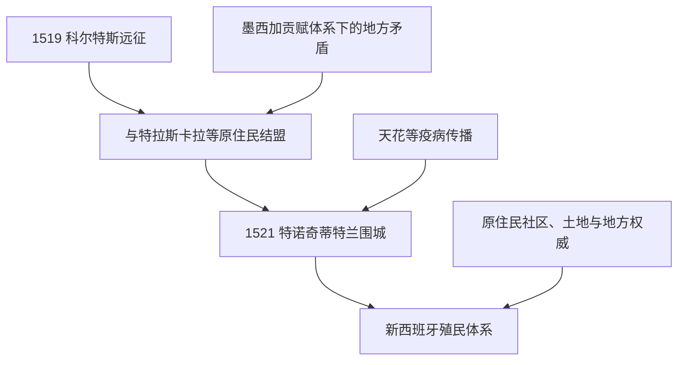

# 西班牙征服与新西班牙

## 时间

1519年-1821年

## 概括

1519年埃尔南·科尔特斯进入墨西哥后，利用翻译、外交和反墨西加联盟推进战争。1521年特诺奇蒂特兰陷落并不等于整个新西班牙立即被征服；玛雅地区、北部边疆和其他区域的战争延续更久。殖民时期，西班牙王权、天主教会、城市精英、原住民社区和非洲裔人口共同构成复杂社会。

## 征服主线

## 统治结构

| 层级 | 机构或群体 | 说明 |
|---|---|---|
| 西班牙君主 | 王权最高来源 | 通过印度事务委员会、法律和官员任命治理殖民地。 |
| 新西班牙总督 | 1535年起设置 | 代表君主管理行政、财政、军事和司法，但受其他机构制衡。 |
| 审理院与地方官 | 高等法院、总督辖区、地方行政 | 司法与地方治理层级多次调整。 |
| 天主教会 | 修会、教区、宗教法庭 | 传教、教育、土地和社会救济均具重要影响。 |
| 原住民共和国与城镇 | 地方议会、酋长和社区土地 | 在殖民体系内保留或重组部分地方组织。 |

## 经济与社会

| 线索 | 说明 |
|---|---|
| 人口灾难 | 战争、强迫劳动、饥荒和欧亚疾病导致16世纪原住民人口剧减。 |
| 土地与劳动 | 委托监护制、贡赋、庄园、矿业劳工和社区土地并存并变化。 |
| 白银 | 萨卡特卡斯等矿区把新西班牙连接到欧洲和亚洲市场。 |
| 太平洋贸易 | 马尼拉大帆船通过阿卡普尔科连接美洲白银与亚洲商品。 |
| 社会分类 | 法律身份、出生地、血统和阶层交错；后世“种姓画”不能被当成固定社会现实。 |

## 重要节点

| 时间 | 节点 | 意义 |
|---|---|---|
| 1519年 | 科尔特斯进入中部墨西哥 | 西班牙远征与地方联盟开始重组地区战争。 |
| 1521年 | 特诺奇蒂特兰陷落 | 墨西加主导的三方联盟瓦解。 |
| 1535年 | 新西班牙总督辖区建立 | 殖民行政制度进一步成形。 |
| 1810年 | 伊达尔戈起义 | 墨西哥独立战争开始。 |
| 1821年 | 《伊瓜拉计划》与独立完成 | 新西班牙的墨西哥核心转为独立国家。 |

## 演变关系

- 前一阶段：[中部美洲文明与墨西加国家](/%E4%BA%BA%E6%96%87%E7%A7%91%E5%AD%A6/%E5%8E%86%E5%8F%B2/%E7%BE%8E%E6%B4%B2/%E5%8C%97%E7%BE%8E/%E5%A2%A8%E8%A5%BF%E5%93%A5/%E4%B8%AD%E9%83%A8%E7%BE%8E%E6%B4%B2%E6%96%87%E6%98%8E%E4%B8%8E%E5%A2%A8%E8%A5%BF%E5%8A%A0%E5%9B%BD%E5%AE%B6.md)。
- 后续见[独立、第一帝国与早期共和国](/%E4%BA%BA%E6%96%87%E7%A7%91%E5%AD%A6/%E5%8E%86%E5%8F%B2/%E7%BE%8E%E6%B4%B2/%E5%8C%97%E7%BE%8E/%E5%A2%A8%E8%A5%BF%E5%93%A5/%E7%8B%AC%E7%AB%8B%E3%80%81%E7%AC%AC%E4%B8%80%E5%B8%9D%E5%9B%BD%E4%B8%8E%E6%97%A9%E6%9C%9F%E5%85%B1%E5%92%8C%E5%9B%BD.md)。
