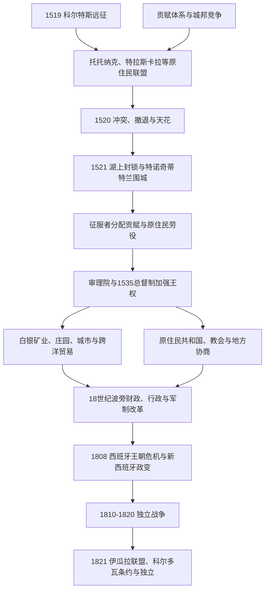

# 西班牙征服与新西班牙

## 时间

1519—1821年。1521年特诺奇蒂特兰失守是中部墨西哥政权重组的关键节点，但新西班牙各地的征服、传教、殖民、抵抗与谈判持续了三个世纪；“征服”不是一场战役即可完成的状态。

## 概括

西班牙殖民统治以原住民盟军和地方统治者为基础，把卡斯蒂利亚王权、天主教会、皇家司法、贡赋与全球贸易叠加到原有社会之上。战争、强迫劳动、饥荒和旧大陆疾病造成16世纪人口灾难；幸存社区同时利用殖民法院、自治议会、宗教组织和土地文书维护权益。萨卡特卡斯等白银矿区、韦拉克鲁斯大西洋航路和阿卡普尔科—马尼拉航线把新西班牙置于最早的全球贸易网络之中。18世纪波旁改革增强财政与军政控制，却冲击克里奥尔精英和地方法人团体；1808年西班牙王朝危机最终把社会矛盾转化为主权战争。

## 演进主线

## 1519—1521年的征服过程

### 远征、翻译与结盟

1519年埃尔南·科尔特斯从古巴出发，在尤卡坦沿岸得到会说玛雅语和西班牙语的赫罗尼莫·德·阿吉拉，又在塔巴斯科获得能在纳瓦特尔语与玛雅语之间翻译的马林钦。翻译不仅传达词句，也帮助识别城邦间的敌友关系。科尔特斯在韦拉克鲁斯建立市议会，以新殖民城市授权绕过古巴总督，并凿沉或处置船只，迫使远征军深入内陆。

森波阿拉等托托纳克城邦希望摆脱墨西加贡赋，率先提供补给和兵力。远征军与特拉斯卡拉交战后转为同盟；这一联盟后来投入数以万计的战士、搬运者和地方情报。乔卢拉屠杀则以预防伏击为名杀害大量居民，既震慑沿途城邦，也展示联盟战争的暴力。

### 特诺奇蒂特兰危机

1519年11月，蒙特祖马二世允许远征军进入特诺奇蒂特兰。西班牙人很快把他扣为人质，利用其名义发号施令。1520年科尔特斯离城迎击古巴派来的潘菲洛·德·纳尔瓦埃斯，并吸收其部队；留守的佩德罗·德·阿尔瓦拉多在托斯卡特尔仪式中发动屠杀，引发全面起义。蒙特祖马二世在冲突中死亡，具体是被城内投石所伤还是遭西班牙人杀害，来源说法不一。西班牙—盟军在“悲痛之夜”撤离时遭受重创。

奎特拉瓦克继位、组织反击，却在天花流行中去世。疫病沿既有贸易和战争网络传播，杀死大量无免疫力居民，也破坏军政领导；但特诺奇蒂特兰仍继续抵抗。科尔特斯在特斯科科重组军队、建造湖上双桅帆船并吸收更多反墨西加城邦。1521年围城同时控制湖面、切断淡水和粮食、逐段摧毁堤道与街区。8月13日夸乌特莫克被俘，三方联盟的首都政权终结。

### 征服并未结束

瓦哈卡、米却肯和北部各地通过不同组合的投降、结盟、远征与暴力进入殖民秩序。普雷佩查统治者先选择接受宗主关系，后被努尼奥·德·古斯曼处死，引发进一步战争。尤卡坦半岛的玛雅政体多次击退或吸收远征，西班牙殖民城市经过数十年才立足；佩滕伊察玛雅政权直到1697年才被攻破。北部奇奇梅卡战争在16世纪后半叶迫使殖民者从单纯军事镇压转向礼物、迁居、传教和谈判。实际边界始终随矿区、堡垒、牧场和原住民力量而移动。

## 殖民建制

### 由征服者统治到王室官僚制

科尔特斯及部属最初以“委托监护制”取得特定社区的贡赋和劳役，但名义上不拥有社区土地或居民。征服者企图把权利世袭化，王室则担心形成独立贵族。1528年第一审理院以法院兼行政机构接管，努尼奥·德·古斯曼任内滥权；1531年第二审理院重整秩序。1535年安东尼奥·德·门多萨到任，正式开启总督制。

完整总督、审理院摄政、末期代行长官及交接原因见[新西班牙总督与临时行政首脑表](/%E4%BA%BA%E6%96%87%E7%A7%91%E5%AD%A6/%E5%8E%86%E5%8F%B2/%E7%BE%8E%E6%B4%B2/%E5%8C%97%E7%BE%8E/%E5%A2%A8%E8%A5%BF%E5%93%A5/%E6%96%B0%E8%A5%BF%E7%8F%AD%E7%89%99%E6%80%BB%E7%9D%A3%E4%B8%8E%E4%B8%B4%E6%97%B6%E8%A1%8C%E6%94%BF%E9%A6%96%E8%84%91%E8%A1%A8.md)。该表从1521年科尔特斯政府连续列至1821年奥多诺胡，不把“审理院代行”或独立前兵变略去。

### 权力层级

| 层级 | 职能 | 制衡与实际运作 |
|---|---|---|
| 西班牙君主与印度事务委员会 | 制定法律、任命总督和主教、受理高级上诉。 | 距离遥远，命令须经地方官员、教会和城市执行；政策常被延迟或变通。 |
| 新西班牙总督 | 代表君主，兼管行政、财政、军事和王家保护教会权。 | 任期有限，须接受到任调查、离任审查和王室监察。 |
| 墨西哥与瓜达拉哈拉皇家审理院 | 高等法院，也在总督空缺时合议行政。 | 可向王室报告总督行为，是合作机构也是竞争中心。 |
| 地方长官、城市议会与18世纪行政区长 | 征税、司法、治安和地方公共事务。 | 城市寡头、矿主和商人常控制地方职位；波旁改革试图削弱旧网络。 |
| 教会 | 教区、修会、教区法庭、教育、慈善、信贷和地产。 | 受王室保教权影响，修会、主教与世俗神职人员之间也有利益冲突。 |
| 原住民共和国 | 由地方议会、世袭或选举的酋长管理贡赋、土地和社区事务。 | 受殖民官员、教会与地方精英介入，但可通过文书和诉讼争取权利。 |

## 人口、土地与劳役

16世纪原住民人口急剧下降，原因包括天花、麻疹、斑疹伤寒等疫病，围城与地方战争，粮食生产中断、迁徙和劳役负担。不同地区下降幅度和时间并不一致；人口灾难不能简化为一次天花暴发。殖民政府为便于传教和征税推行集中定居，使一些社区迁入规划城镇，也改变土地使用。

委托监护制逐步受限制后，轮派劳役、自由或半强制工资劳动、债务依附、庄园雇工和奴隶劳动并存。非洲奴隶被运入糖业、城市服务、牧场和矿区；自由非洲裔及混合家庭很早就成为社会组成部分。庄园扩张并未完全消灭原住民共同土地，社区、私人小农、教会地产和大庄园长期交错。法院档案中的边界图、纳瓦特尔语契约和请愿，显示原住民不是被动接受制度。

## 白银经济与全球网络

1540年代萨卡特卡斯银矿开发后，瓜纳华托、圣路易斯波托西等矿区推动北向殖民、道路、牧场和粮食市场。王室通过铸币、矿业税和水银供应取得收入；矿主、商人和信贷网络把采矿与城市消费相连。白银产量受矿脉、排水技术、水银、劳工和战争影响，并非持续直线上升。

韦拉克鲁斯船队连接塞维利亚 / 加的斯和加勒比，走私与战时中断始终存在。1565年后，阿卡普尔科—马尼拉大帆船把美洲白银运往亚洲，换取丝绸、瓷器、棉布和香料；菲律宾的行政和贸易与新西班牙财政紧密相连。新西班牙由此既是殖民地，也是大西洋—太平洋网络的枢纽。

## 宗教、文化与社会分类

方济各会、多明我会、奥斯定会和后来的耶稣会在不同地区建立修院、学校与传教站。洗礼、教区制度和圣徒崇拜扩展迅速，但原住民语言、地方祭祀、共同体仪式与天主教实践发生多层融合和冲突。1531年瓜达卢佩圣母显现传统后来成为跨族群宗教和国家象征；其意义在不同世纪不断改变。

殖民法律区分“西班牙人共和国”和“印第安人共和国”，又以出生地、奴役或自由身份、名誉、职业、财富和血统分类。18世纪“种姓画”呈现复杂命名，却不能证明社会按一套固定血统表机械运转。半岛出生者、克里奥尔、混血、原住民与非洲裔内部均有巨大阶层差异。

## 波旁改革与殖民危机

18世纪王室在战争财政压力下提高消费税和垄断收入、重组军队、设置行政区长并开放帝国内贸易。1767年驱逐耶稣会士打击教育和克里奥尔网络；1786年行政区制加强财政统计与地方监督。改革提升白银和税收，却使许多美洲出生精英认为职位被半岛官员垄断，也加重社区和城市民众负担。地方骚乱、反税抗议和边疆冲突因此增加。

1808年拿破仑迫使西班牙国王退位。新西班牙总督伊图里加赖与墨西哥城市议会讨论在被俘君主名义下建立本地权力机构，半岛商人集团发动政变将其罢黜。此后“主权在君主缺位时归谁”成为不能回避的问题。秘密社团与地方阴谋遭查禁，却为1810年起义积累网络。

## 1810—1821年独立战争

| 时间 | 事件 | 过程与影响 |
|---|---|---|
| 1810年9月 | 伊达尔戈“多洛雷斯呼声” | 大规模乡村队伍迅速占领中部城市；瓜纳华托粮仓屠杀与随后暴力加剧精英恐惧，起义军在墨西哥城外退却。 |
| 1811年 | 伊达尔戈等被俘处决 | 第一波军队瓦解，但地方游击和南部莫雷洛斯运动延续。 |
| 1812—1815年 | 莫雷洛斯战争与制宪 | 攻占瓦哈卡、控制南部通道；1813年奇尔潘辛戈会议宣布独立，1814年《阿帕钦甘宪法》提出共和国，莫雷洛斯后被捕处决。 |
| 1815—1820年 | 游击阶段 | 维森特·格雷罗、瓜达卢佩·维多利亚等依托山区坚持；总督阿波达卡以赦免和军事围剿削弱运动。 |
| 1820年 | 西班牙自由革命恢复加的斯宪法 | 教会、军官和保守精英担忧自由宪政改革，独立联盟的社会基础发生逆转。 |
| 1821年 | 《伊瓜拉计划》与三保证军 | 王党军官伊图尔维德与格雷罗结盟，以宗教、独立和联合为“三项保证”，承诺君主制与族群法律平等。 |
| 1821年8—9月 | 《科尔多瓦条约》、独立宣言与入城 | 奥多诺胡接受权力移交框架；三保证军9月27日进入墨西哥城，次日宣布独立。西班牙国会未批准条约，圣胡安·德乌卢亚堡仍抵抗至1825年。 |

## 殖民统治终结的原因

### 结构因素

- 克里奥尔精英拥有财富和地方身份，却对高级职位、帝国贸易和税收决策不满。
- 原住民、混血民众、庄园工人和城市贫民承受贡赋、土地争议、物价和劳役压力，各地诉求不同。
- 王室长期战争把白银和税收外流，新西班牙防务与债务负担上升。
- 波旁改革强化国家能力，同时打破原有协商和法人特权，制造新的反对联盟。

### 外部压力与直接触发

- 1808年西班牙王位真空摧毁王权合法性的共同前提。
- 1810年起义把精英宪政争论转为社会战争；十年军事化耗损财政和军队。
- 1820年西班牙恢复自由宪法，使部分原王党精英转向独立，以保留天主教和地方权力。
- 伊图尔维德与格雷罗联盟把王党军资源和残存起义网络结合；这是1821年迅速完成权力转移的直接机制。

## 关键辨析

- 征服不是“西班牙人对阿兹特克人”的二元战争；交战各方大多是原住民，联盟选择随地方利益变化。
- 殖民统治既有剥夺和暴力，也依赖协商、诉讼和原住民中介；强调能动性不等于淡化人口灾难。
- 新西班牙版图与今日墨西哥不同，包含或影响加勒比、中美洲、北美西南和菲律宾，但实际控制高度不均。
- 1821年首先完成政治独立，没有自动解决土地、族群、财政、教会和联邦关系问题。

## 演变关系

- 前一阶段：[中部美洲文明与墨西加国家](/%E4%BA%BA%E6%96%87%E7%A7%91%E5%AD%A6/%E5%8E%86%E5%8F%B2/%E7%BE%8E%E6%B4%B2/%E5%8C%97%E7%BE%8E/%E5%A2%A8%E8%A5%BF%E5%93%A5/%E4%B8%AD%E9%83%A8%E7%BE%8E%E6%B4%B2%E6%96%87%E6%98%8E%E4%B8%8E%E5%A2%A8%E8%A5%BF%E5%8A%A0%E5%9B%BD%E5%AE%B6.md)。
- 后一阶段：[独立、第一帝国与早期共和国](/%E4%BA%BA%E6%96%87%E7%A7%91%E5%AD%A6/%E5%8E%86%E5%8F%B2/%E7%BE%8E%E6%B4%B2/%E5%8C%97%E7%BE%8E/%E5%A2%A8%E8%A5%BF%E5%93%A5/%E7%8B%AC%E7%AB%8B%E3%80%81%E7%AC%AC%E4%B8%80%E5%B8%9D%E5%9B%BD%E4%B8%8E%E6%97%A9%E6%9C%9F%E5%85%B1%E5%92%8C%E5%9B%BD.md)。
- 区域殖民专题见[新西班牙与墨西哥中南部](/%E4%BA%BA%E6%96%87%E7%A7%91%E5%AD%A6/%E5%8E%86%E5%8F%B2/%E7%BE%8E%E6%B4%B2/%E4%B8%AD%E7%BE%8E%E6%B4%B2/%E6%96%B0%E8%A5%BF%E7%8F%AD%E7%89%99%E4%B8%8E%E5%A2%A8%E8%A5%BF%E5%93%A5%E4%B8%AD%E5%8D%97%E9%83%A8.md)。
- 返回[墨西哥历史](/%E4%BA%BA%E6%96%87%E7%A7%91%E5%AD%A6/%E5%8E%86%E5%8F%B2/%E7%BE%8E%E6%B4%B2/%E5%8C%97%E7%BE%8E/%E5%A2%A8%E8%A5%BF%E5%93%A5/README.md)。
