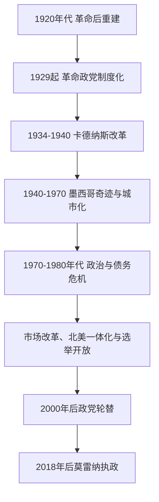

# 革命后国家与当代墨西哥

## 时间

1920年至今

## 概括

革命主要内战结束后，墨西哥通过总统权力、军队整合、土地改革、劳工与农民组织和执政党体系重建国家。革命制度党及其前身形成长期一党优势；20世纪后期经济危机、市场改革和选举制度变化推动更充分的政党竞争。毒品贸易暴力、地区不平等、对美关系、移民、原住民权利和能源政策是当代重要议题。

## 政治阶段

## 国家元首与政府首脑

墨西哥为总统制联邦共和国，总统同时是国家元首和联邦政府首脑，实行六年任期且不得再次担任总统。

| 主要总统或阶段 | 任期 | 说明 |
|---|---|---|
| 阿尔瓦罗·奥夫雷贡 | 1920-1924年 | 革命后重建和中央整合。 |
| 普鲁塔尔科·埃利亚斯·卡列斯 | 1924-1928年 | 推动国家机构建设，卸任后在“最高领袖时期”保持影响。 |
| 拉萨罗·卡德纳斯 | 1934-1940年 | 土地改革、劳工农民组织和1938年石油国有化。 |
| 革命制度党一党优势时期总统 | 1940-2000年 | 总统定期交接，但执政党控制选举、组织和国家资源。 |
| 维森特·福克斯、费利佩·卡尔德龙 | 2000-2012年 | 国家行动党执政，完成首次中央政党轮替。 |
| 恩里克·培尼亚·涅托 | 2012-2018年 | 革命制度党重返总统府。 |
| 安德烈斯·曼努埃尔·洛佩斯·奥夫拉多尔 | 2018-2024年 | 莫雷纳执政，强调社会项目、国家能源角色和政治重组。 |
| 克劳迪娅·辛鲍姆 | 2024年至今 | 墨西哥首位女性总统。 |

## 执政党与实际权力结构

### 主要政党

| 政党 | 主要执政阶段 | 说明 |
|---|---|---|
| 革命制度党及其前身 | 1929-2000年、2012-2018年 | 从革命联盟发展为长期一党优势组织，名称先后为国民革命党、墨西哥革命党、革命制度党。 |
| 国家行动党 | 2000-2012年 | 中右翼政党，结束革命制度党连续执掌总统府。 |
| 莫雷纳 | 2018年至今 | 由洛佩斯·奥夫拉多尔领导的政治运动发展而来。 |

### 实际权力结构

| 层级 | 说明 |
|---|---|
| 总统 | 同时是国家元首和政府首脑；20世纪一党优势时期对执政党和继任安排影响尤其强。 |
| 联邦国会与司法机构 | 随选举竞争和制度改革增强制衡作用。 |
| 州长与地方力量 | 联邦制下具有重要资源和政治网络，地方治理能力差异明显。 |
| 军队与安全机构 | 参与国防、公共安全和部分基础设施任务，其政治角色随时期变化。 |

## 重要节点

| 时间 | 节点 | 影响 |
|---|---|---|
| 1929年 | 国民革命党建立 | 革命派系通过政党机制制度化。 |
| 1938年 | 石油国有化 | 国家经济民族主义的重要象征。 |
| 1968年 | 特拉特洛尔科事件 | 学生运动遭镇压，暴露一党优势体制的政治暴力。 |
| 1982年 | 债务危机 | 推动经济模式和国家企业政策调整。 |
| 1994年 | 北美自由贸易协定生效、萨帕塔民族解放军起义 | 全球经济整合与原住民、土地和民主问题同时凸显。 |
| 2000年 | 反对党赢得总统选举 | 结束革命制度党连续71年执掌总统府。 |
| 2018年 | 莫雷纳赢得总统选举 | 政党体系和政策方向再次重组。 |
| 2024年 | 辛鲍姆当选并就任总统 | 墨西哥首次由女性担任总统。 |

## 关键辨析

- “一党优势”不同于完全没有选举；关键在于长期不对称的资源、组织、媒体和竞争条件。
- 北美经济一体化促进贸易和制造业，也造成地区、产业和劳工收益差异。
- 有组织犯罪暴力涉及非法市场、地方治理、武器、金融和国际需求，不能只用单一“治安问题”解释。
- 当代阶段仍在发展，短期政策效果需要持续核实。

## 演变关系

- 承接[波菲里奥统治与墨西哥革命](/%E4%BA%BA%E6%96%87%E7%A7%91%E5%AD%A6/%E5%8E%86%E5%8F%B2/%E7%BE%8E%E6%B4%B2/%E5%8C%97%E7%BE%8E/%E5%A2%A8%E8%A5%BF%E5%93%A5/%E6%B3%A2%E8%8F%B2%E9%87%8C%E5%A5%A5%E7%BB%9F%E6%B2%BB%E4%B8%8E%E5%A2%A8%E8%A5%BF%E5%93%A5%E9%9D%A9%E5%91%BD.md)。
- 区域背景见[现代北美区域秩序](/%E4%BA%BA%E6%96%87%E7%A7%91%E5%AD%A6/%E5%8E%86%E5%8F%B2/%E7%BE%8E%E6%B4%B2/%E5%8C%97%E7%BE%8E/%E7%8E%B0%E4%BB%A3%E5%8C%97%E7%BE%8E%E5%8C%BA%E5%9F%9F%E7%A7%A9%E5%BA%8F.md)。
