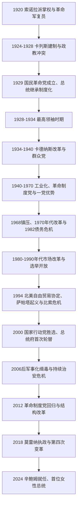

# 革命后国家与当代墨西哥

## 时间

1920年至今；现任总统与“至今”状态核验截止2026年7月14日。

## 概括

1920年后，革命胜利派把地方军队、农民、工会、州长和新官僚逐步纳入中央制度。1929年国民革命党成立，使总统继承从军人叛乱转向执政党内部提名；卡德纳斯时期大规模土地分配、群众组织和石油国有化又赋予国家社会基础。1940—1970年前后的“墨西哥奇迹”带来工业化、城市化和中产增长，也积累城乡不平等、工会控制与政治镇压。革命制度党长期举行选举，却凭国家资源、组织垄断、媒体影响和选择性强制形成一党优势。

1982年债务危机终结国家主导的发展模式，政府转向私有化、贸易开放和北美经济一体化；同一时期，选举机构改革、反对党州长和公民社会逐步打破执政党垄断。2000年国家行动党赢得总统选举，实现中央首次政党轮替。此后墨西哥形成竞争性多党总统制，但治安暴力、失踪与有罪不罚、地区不平等、移民、对美依存、能源和军队公共角色成为长期难题。2018年莫雷纳崛起重组政党体系；2024年克劳迪娅·辛鲍姆就任首位女性总统。

## 政治演进

## 1920年代：从军人联盟到政党继承

### 奥夫雷贡政府

阿尔瓦罗·奥夫雷贡1920年就任后，中央政府通过复员、赦免、职位和军事镇压整合革命将领。教育部长何塞·巴斯孔塞洛推动乡村学校、文化使团、图书馆和壁画运动，迭戈·里维拉、何塞·克莱门特·奥罗斯科等以公共艺术塑造革命国家叙事。土地分配开始推进，但规模有限，政府更重视恢复农业和承认产权。

美国因1917年宪法第27条对地下资源的国家权利而迟迟不承认新政府。1923年《布卡雷利协定》以对既有石油权利的解释换取美国承认。同年财政部长阿道弗·德·拉·韦尔塔因总统接班和协定起兵，奥夫雷贡凭联邦军、美国军火和工农联盟击败叛乱。革命将领仍能发动战争，说明制度化尚未完成。

### 卡列斯、基督战争与最高领袖时期

普鲁塔尔科·埃利亚斯·卡列斯1924—1928年任总统，建立墨西哥银行、道路和灌溉机构，强化公共教育及1917年宪法反教权条款。1926年“卡列斯法”严格执行神职与宗教活动限制，主教暂停公共礼拜，哈利斯科、米却肯等中西部出现“基督万岁”武装起义。政府和基督军均实施处决、报复和强制征集；1929年在美国驻墨大使调停下达成教会恢复礼拜、政府缓和执行的安排，但地方暴力延续。

奥夫雷贡在1928年突破不连任传统再次当选，却在就职前被天主教激进者刺杀。卡列斯宣布结束“个人强人时代”，1929年把革命派系组成国民革命党（PNR）。此后总统由党内协商和国会程序产生：波特斯·希尔、奥尔蒂斯·鲁维奥、阿韦拉尔多·罗德里格斯先后任职。卡列斯以“革命最高领袖”在幕后影响内阁和继承，因此1928—1934年称“最高领袖时期”。政党的建立减少了全国叛乱，却把竞争转入由军政精英控制的组织。

## 卡德纳斯改革

拉萨罗·卡德纳斯1934年就任后巡视全国、联系农民和工人，逐步撤换卡列斯派官员，1936年迫使卡列斯流亡，恢复总统对党和政府的最高控制。他把国民革命党改组为墨西哥革命党（PRM），设工人、农民、人民和军队四部门，通过墨西哥劳工联合会、全国农民联合会等组织动员支持。

| 政策 | 过程 | 影响与限制 |
|---|---|---|
| 土地改革 | 大规模分配庄园土地，扩大“埃希多”村社用地；拉拉古纳、尤卡坦等地建立集体生产单位。 | 数量和规模超过此前各届政府，恢复许多乡村社区；信贷、灌溉、市场和地方权力仍限制生产。 |
| 劳工政策 | 政府承认工会、支持部分罢工，把工人组织纳入执政党。 | 提高工人谈判力，也形成国家认可领导层控制基层的公司主义。 |
| 教育与原住民政策 | 扩展乡村教育、技术教育和文化整合计划。 | 提供公共服务，但常以西班牙语民族整合替代语言与自治多元。 |
| 铁路与石油国有化 | 1937年国有化铁路；1938年外国石油公司拒绝执行劳工裁决后，政府征收资产并建立国家石油体系。 | 石油国有化成为经济主权象征，承受国际抵制后在二战环境中达成赔偿。 |
| 外交庇护 | 接纳西班牙共和派难民，谴责法西斯主义。 | 大量学者、艺术家和专业人员进入墨西哥文化教育体系。 |

卡德纳斯没有无限期连任，而是选择较温和的曼努埃尔·阿维拉·卡马乔接班，军队部门随后退出执政党。总统单任期、在任者指定党内候选人并完成和平交接，成为此后体制核心。

## 1940—1970年：墨西哥奇迹与一党优势

### 发展模式

二战需求、美国合作、进口替代工业化、公共基础设施和农业商业化推动长期增长。政府以关税保护制造业、国家银行提供信贷、国有企业控制能源和交通；比索相对稳定，1954年后固定汇率维持多年。农村人口大量迁往墨西哥城、蒙特雷、瓜达拉哈拉及美国，城市中产、工人和大学扩张。

增长收益不均。北部灌溉商业农业和城市工业获得投资，南部原住民地区与雨养小农落后；“布拉塞罗计划”把墨西哥季节劳工输往美国。快速城市化造成住房、交通和公共服务压力。工会和农民组织得到社会保险、补贴与职位，却由执政党认可的领导层控制，独立工运常遭压制。

### 革命制度党体制

1946年墨西哥革命党改名革命制度党（PRI），取消军队和农民—工人革命语汇中的直接军事组织，转为文官化的总统党。总统每六年选择“指点”继任候选人，各部门、州长和利益集团在党内协商；卸任者不再公开干预。国会、法院、选举和反对党存在，但候选登记、媒体、公共预算、工会和地方计票高度不对称。国家行动党代表部分天主教、中产和企业反对力量，左翼与独立工会则受吸纳或镇压。

| 总统时期 | 主要变化 |
|---|---|
| 阿维拉·卡马乔，1940—1946年 | 二战中与美国结盟，1942年对轴心国宣战；建立社会保险，缓和政教冲突。 |
| 米格尔·阿莱曼，1946—1952年 | 首位革命后文官总统；大规模公路、水坝、旅游和工业投资，腐败与政商联盟扩大。 |
| 鲁伊斯·科尔蒂内斯，1952—1958年 | 1953年女性取得联邦选举权，财政和反腐形象强化。 |
| 洛佩斯·马特奥斯，1958—1964年 | 电力国有化、工人住房与社会政策；铁路工人、教师等独立运动遭镇压。 |
| 迪亚斯·奥尔达斯，1964—1970年 | 经济增长和1968年奥运会并行；学生运动在10月2日特拉特洛尔科遭军警开火和拘捕。 |

1968年镇压不是一党体制即时终结，却摧毁其“革命代表全社会”的道德主张。此后部分青年加入游击，政府在格雷罗等地开展失踪、酷刑和法外处决，形成所谓“肮脏战争”。

## 1970—1988年：发展模式危机

路易斯·埃切维里亚试图以公共支出、大学扩张、外交激进姿态和有限政治开放修复合法性，同时继续镇压左翼；1971年“圣科尔普斯星期四”学生遭准军事团体袭击。债务和通胀上升，1976年比索贬值。洛佩斯·波蒂略政府因坎佩切湾石油发现大量借款，假定高油价可长期维持；1981年油价下跌、美国利率上升和资本外逃后，1982年墨西哥宣布无法按期偿债，并将银行国有化。

债务危机是转折而非单一政策失误。进口替代工业长期依赖受保护企业、外汇和公共赤字，石油借款放大风险；全球衰退和高利率构成外部压力；油价下跌和资本外逃直接触发支付危机。米格尔·德拉马德里政府接受国际援助条件，削减开支、私有化国企、压低工资，并于1986年加入关贸总协定。1985年墨西哥城大地震中，政府迟缓而市民自救网络活跃，推动独立公民组织和住房运动。

1988年选举中，革命制度党候选人卡洛斯·萨利纳斯面对由前党内领导人夸乌特莫克·卡德纳斯组成的民族民主阵线。计票系统中断、选票处理不透明，官方宣布萨利纳斯胜出；反对派认为选举遭操纵。卡德纳斯阵营后来组建民主革命党。选举合法性危机迫使政府逐步接受更独立的选举管理和反对党地方胜利。

## 1988—2000年：市场改革、北美一体化与选举开放

萨利纳斯政府私有化银行、电信等企业，修改第27条以允许埃希多土地权利进入更灵活的市场安排，与美国、加拿大谈判北美自由贸易协定（NAFTA），并通过社会项目重建支持。政府也与天主教会恢复正式外交关系。市场改革降低部分贸易和财政壁垒，促进北部和中部制造业出口，却使受补贴的美国农产品、金融波动和地区基础设施差异对小农及南部造成不同冲击。

1994年1月1日NAFTA生效，同日恰帕斯萨帕塔民族解放军起义，以原住民土地、自治、民主和反新自由主义诉求占领数城。政府军事反攻后停火，1996年《圣安德烈斯协议》承诺原住民权利，却未被完整落实。1994年执政党总统候选人路易斯·多纳尔多·科洛西奥遇刺，年底资本外逃和汇率制度崩溃引发“龙舌兰危机”。塞迪略政府接受国际救助、银行体系重组并承受严重衰退。

塞迪略任内选举制度获得更大自主，联邦选举机构由公民委员主导，墨西哥城市长改为选举产生。1997年革命制度党首次失去众议院多数。2000年国家行动党候选人维森特·福克斯获胜，塞迪略承认结果，革命制度党连续71年执掌总统府终结。

### 一党优势衰落的原因

- 城市化、教育和职业结构扩大了不依赖国家农民—工会组织的选民。
- 1968年镇压、肮脏战争、腐败与1985年地震反应削弱革命合法性。
- 1982年危机和市场改革破坏旧有补贴、国企和工会交换网络，执政党内部也分裂。
- 国家行动党在北部企业和中产州积累地方执政经验，民主革命党整合左翼和前革命民族主义派。
- 选举机构、计票、媒体和国会规则经多次谈判变得更开放；1997年分立国会使总统更难控制资源。
- 2000年反对派围绕“轮替”集中，福克斯胜选并由在任政府承认，是直接交接机制。

## 2000—2018年：多党轮替与安全危机

### 国家行动党十二年

福克斯政府结束总统府党派垄断，但革命制度党仍控制许多州、国会席位和官僚网络。分立政府、既有工会和州长限制税制、能源和司法改革；信息公开制度和宏观稳定有所加强。对美移民协议的期待在2001年“九一一”事件后让位于边境安全议程。

2006年费利佩·卡尔德龙以极小差距被宣布胜选，洛佩斯·奥夫拉多尔阵营指控程序不公并举行长期抗议。卡尔德龙就任后在米却肯等地大规模部署军队打击贩毒组织，抓捕或击毙首领。国家能力和地方警察腐败差异、美国毒品需求与武器流入、组织分裂和争夺路线共同使凶杀、绑架与失踪上升。把暴力只归因于“毒枭”或只归因于军队均不充分；有罪不罚、地方政商关系和跨国市场同样关键。

### 革命制度党回归

2012年恩里克·培尼亚·涅托胜选，革命制度党重返总统府。主要政党签署“墨西哥契约”，通过教育、电信、税收和能源改革，允许更多私人和外国资本进入油气领域。改革展示多党立法能力，也因执行、利益分配和油价变化未能形成普遍获得感。

2014年格雷罗州阿约齐纳帕师范学校43名学生失踪，调查暴露地方警察、犯罪组织和各级政府责任及证据处理问题，成为有罪不罚象征。“白宫”房产等利益冲突、地方州长腐败和持续暴力进一步削弱执政党。低增长、不平等和对传统政党的不信任为莫雷纳提供空间。

## 2018年后：莫雷纳与“第四次变革”

### 洛佩斯·奥夫拉多尔政府

安德烈斯·曼努埃尔·洛佩斯·奥夫拉多尔（AMLO）在2018年以反腐、社会优先和“第四次变革”赢得多数。他扩大老年养老金、青年和助学项目，提高最低工资，推进玛雅铁路、特万特佩克走廊和多斯博卡斯炼油厂，强调墨西哥国家石油公司和联邦电力委员会的作用。政府以“紧缩共和”削减部分独立机构与行政部门预算，并通过每日记者会直接塑造议程。

安全方面，政府成立国民警卫队，但其控制与公共安全职能日益军事化；军队还参与海关、机场、铁路和大型工程。凶杀率未按承诺快速下降，失踪与地方暴力持续。新冠疫情造成严重公共卫生与经济冲击，政府在有限财政刺激、医疗体系重组和疫苗接种之间应对。对美关系同时涵盖美国—墨西哥—加拿大协定（USMCA）、近岸制造、芬太尼、武器、移民与边境管控。

AMLO维持高个人支持，也因对选举机构、司法、透明与监管机构的批评引起权力制衡争论。2024年莫雷纳及盟友赢得总统和国会强势席位，任期末推动司法和国民警卫队等宪法调整。对这些改革的评价分歧集中于：民选或重组能否增加问责，还是会削弱专业独立与少数权利。

### 辛鲍姆政府

克劳迪娅·辛鲍姆·帕尔多在2024年6月总统选举获胜，10月1日就任，是墨西哥首位女性总统。她曾任墨西哥城市长，代表莫雷纳及盟友，承接“第四次变革”社会政策，同时面对财政、能源、司法重组、安全、缺水、气候风险、对美贸易与迁移等议题。核验至2026年7月14日，她仍任墨西哥合众国总统；总统兼任国家元首和联邦政府首脑。

对于仍在进行的任期，本笔记只记录已经发生的就任、制度位置与可确认议题，不以短期事件预判整个政府的成败。

## 国家元首与政府结构

### 连续总统表

1920年阿道弗·德·拉·韦尔塔起，所有临时、代任与宪法总统均按任期逐人列于[墨西哥国家元首表](/%E4%BA%BA%E6%96%87%E7%A7%91%E5%AD%A6/%E5%8E%86%E5%8F%B2/%E7%BE%8E%E6%B4%B2/%E5%8C%97%E7%BE%8E/%E5%A2%A8%E8%A5%BF%E5%93%A5/%E5%A2%A8%E8%A5%BF%E5%93%A5%E5%9B%BD%E5%AE%B6%E5%85%83%E9%A6%96%E8%A1%A8.md)。其中没有把1940—2000年革命制度党总统合并为一项；每位总统的完整六年任期、政党与关键事件均单列。

### 宪制角色

| 机构 / 层级 | 正式职能 | 历史与现实中的权力 |
|---|---|---|
| 总统 | 国家元首、政府首脑和联邦行政权；任命内阁、执行法律、统率武装力量。 | 一党优势时期还控制执政党继承；多党化后受国会、法院、州长和舆论更强制衡。 |
| 联邦国会 | 众议院与参议院立法、预算、审查和宪法修正。 | 1997年后分立政府成为常态之一；超级多数时宪法改革能力又增强。 |
| 联邦司法 | 最高法院及各级法院审查法律、保护权利和裁判联邦争议。 | 法官任命、独立、效率和司法改革长期是政治冲突焦点。 |
| 州与市镇 | 州长、州议会、地方司法和市政服务；墨西哥城具有特殊地方制度。 | 地方财政和警务能力差异大，州长可成为全国权力中介，也可能形成封闭网络。 |
| 政党与群众组织 | 提名候选、组织议会和社会利益。 | PRI曾以公司主义部门控制竞争；PAN、PRD、莫雷纳及新联盟使体系多次重组。 |
| 军队与国民警卫队 | 国防、公共安全和联邦交办任务。 | 革命后军队退出公开党争，但21世纪在治安、边境和基础设施中的角色扩大。 |
| 独立 / 自治机构 | 选举、透明、统计、竞争、货币等专业治理。 | 1990年代后成为民主化支柱，也因问责、成本与总统改革而面临争议。 |

## 重要事件

| 时间 | 事件 | 长期影响 |
|---|---|---|
| 1926—1929年 | 基督战争 | 体现革命国家世俗化与地方天主教社会的激烈冲突。 |
| 1929年 | 国民革命党成立 | 总统继承由军人叛乱转向执政党内部制度。 |
| 1938年 | 石油国有化、政党改组 | 经济民族主义和群众公司主义成为革命国家核心。 |
| 1946年 | 革命制度党定名 | 文官化的一党优势体制成形。 |
| 1953年 | 女性取得联邦选举权 | 扩展公民权；女性实际参政仍经历长期推进。 |
| 1968年 | 特拉特洛尔科镇压 | 暴露发展主义国家的威权和暴力边界。 |
| 1982年 | 债务危机 | 国家主导工业化转向紧缩、私有化和贸易开放。 |
| 1988年 | 争议总统选举 | 执政党分裂，推动左翼重组和选举制度改革。 |
| 1994年 | NAFTA、萨帕塔起义、科洛西奥遇刺与比索危机 | 同一年集中呈现全球化、原住民权利、政治暴力和金融脆弱性。 |
| 2000年 | 国家行动党赢得总统府 | PRI连续71年总统执政终结，和平政党轮替实现。 |
| 2006年后 | 联邦安全行动扩大 | 军队投入公共安全，犯罪组织分裂与暴力成为长期国家危机。 |
| 2014年 | 阿约齐纳帕43名学生失踪 | 有罪不罚、地方国家与犯罪网络关系成为全国抗议核心。 |
| 2018年 | 莫雷纳赢得总统和国会优势 | 传统三党格局重组，国家社会政策和机构方向改变。 |
| 2024年 | 辛鲍姆当选并就任 | 墨西哥首次由女性担任总统，莫雷纳执政延续。 |

## 长期成就与结构难题

### 制度化成就

- 军人通过全国叛乱争夺总统职位的周期在1929年后基本终结，六年交接和不得连任成为强规范。
- 革命宪法、土地分配、公共教育、社会保险和国有能源构成现代国家共同框架。
- 20世纪工业化和城市化形成大规模制造业、专业阶层和基础设施。
- 1990年代至2000年的选举改革使反对党能在地方、国会和总统选举中获胜，权力交接不再由单一政党决定。
- 女性、原住民族、劳工与公民组织逐步扩大权利议程，尽管落实不均。

### 持续难题

- 北部和中部出口制造区、石油和旅游区、南部乡村与原住民地区的发展差异显著。
- 司法调查能力不足、腐败、证人风险与地方警务薄弱造成高有罪不罚率。
- 美国是主要贸易、投资和移民目的地，两国经济高度整合，但边境、安全、武器、毒品和劳工政策常不对称。
- 石油财政、气候转型和国有能源企业债务使能源政策同时涉及主权、预算与环境。
- 总统直选和强行政传统能快速动员政策，也可能压缩自治机构、法院和反对派的制衡空间。
- 土地改革遗产、城市住房、缺水、极端天气和大型工程在不同社区产生不同收益与环境代价。

## 关键辨析

- PRI一党优势不等于没有宪法、选举或反对党；关键是资源、组织、媒体、计票和强制手段长期不对称。
- “墨西哥奇迹”的高增长真实存在，但不能用全国平均掩盖乡村贫困、工人控制与政治镇压。
- 1980年代后的市场改革既促进出口制造和北美供应链，也削弱部分国家保护和小农生计；结果按地区与阶层不同。
- 2000年轮替是民主化里程碑，不等于司法、安全和地方国家同步完成民主转型。
- 有组织犯罪暴力来自非法市场、美国需求和武器、地方治理、金融洗钱、国家行动和组织分裂的互动，不能用单一总统或单一贩毒集团解释。
- 当代政府仍在进行，现任人物和“至今”日期应随时间复核；本页截止2026年7月14日。

## 演变关系

- 前一阶段：[波菲里奥统治与墨西哥革命](/%E4%BA%BA%E6%96%87%E7%A7%91%E5%AD%A6/%E5%8E%86%E5%8F%B2/%E7%BE%8E%E6%B4%B2/%E5%8C%97%E7%BE%8E/%E5%A2%A8%E8%A5%BF%E5%93%A5/%E6%B3%A2%E8%8F%B2%E9%87%8C%E5%A5%A5%E7%BB%9F%E6%B2%BB%E4%B8%8E%E5%A2%A8%E8%A5%BF%E5%93%A5%E9%9D%A9%E5%91%BD.md)。
- 区域背景见[现代北美区域秩序](/%E4%BA%BA%E6%96%87%E7%A7%91%E5%AD%A6/%E5%8E%86%E5%8F%B2/%E7%BE%8E%E6%B4%B2/%E5%8C%97%E7%BE%8E/%E7%8E%B0%E4%BB%A3%E5%8C%97%E7%BE%8E%E5%8C%BA%E5%9F%9F%E7%A7%A9%E5%BA%8F.md)。
- 美国一侧见[美国历史](/%E4%BA%BA%E6%96%87%E7%A7%91%E5%AD%A6/%E5%8E%86%E5%8F%B2/%E7%BE%8E%E6%B4%B2/%E5%8C%97%E7%BE%8E/%E7%BE%8E%E5%9B%BD/README.md)。
- 返回[墨西哥历史](/%E4%BA%BA%E6%96%87%E7%A7%91%E5%AD%A6/%E5%8E%86%E5%8F%B2/%E7%BE%8E%E6%B4%B2/%E5%8C%97%E7%BE%8E/%E5%A2%A8%E8%A5%BF%E5%93%A5/README.md)。
