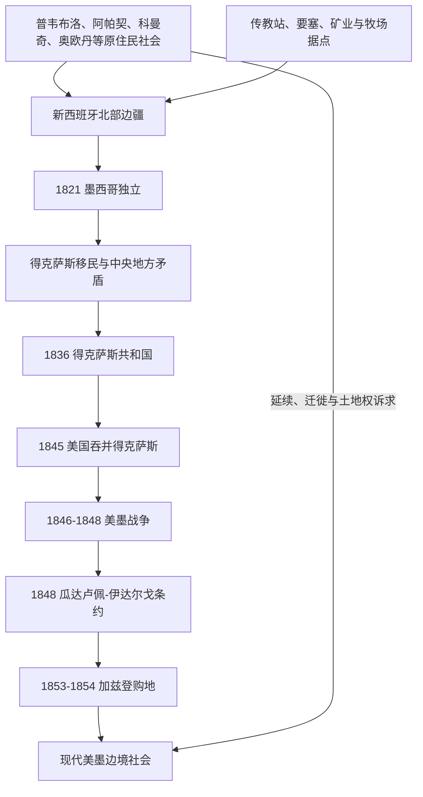

# 墨西哥北部边疆

## 时间

16世纪至今；本页重点为1821年墨西哥独立前后的边疆演变。

## 范围

这里的“北部边疆”主要指新西班牙及后来墨西哥北部与今日美国西南部相连的广大区域，包括不同时期的得克萨斯、新墨西哥、上加利福尼亚、索诺拉、奇瓦瓦、科阿韦拉等地。它不是一条固定边界，而是原住民领地、传教区、牧场、矿业据点、城镇和军事要塞交错的接触地带。

古代墨西哥中南部和中部美洲文明另见[中美洲与中部美洲入口](/%E4%BA%BA%E6%96%87%E7%A7%91%E5%AD%A6/%E5%8E%86%E5%8F%B2/%E7%BE%8E%E6%B4%B2/%E4%B8%AD%E7%BE%8E%E6%B4%B2/README.md)。

## 概括

西班牙殖民者从墨西哥中部向北扩张，但在许多地区只能依靠稀疏据点、传教站、联盟和军事行动维持影响。普韦布洛、阿帕契、科曼奇、奥欧丹等原住民族群主动参与贸易、战争、迁徙和外交，边疆并非由殖民政府单向控制。1821年墨西哥独立后，中央政府继承辽阔北部领土，却面临人口稀少、地方自治、原住民力量和美国移民进入等问题。得克萨斯革命、美国吞并与美墨战争最终把大片原墨西哥北部领土纳入美国，并形成现代边界。

## 演变图

## 主要阶段

| 阶段 | 时间 | 主要特征 |
|---|---|---|
| 新西班牙向北扩张 | 16世纪-18世纪 | 通过矿区、传教站、要塞和城镇建立权利主张，但实际控制不均衡。 |
| 波旁改革与边防调整 | 18世纪 | 西班牙强化军事和行政体系，尝试稳定北部省份并应对英法俄等势力。 |
| 墨西哥独立后的北部 | 1821-1835年 | 联邦与中央集权之争、移民政策和地方安全问题相互叠加。 |
| 得克萨斯革命与共和国 | 1835-1845年 | 得克萨斯脱离墨西哥并建立共和国；墨西哥不承认其独立。 |
| 美墨战争与割地 | 1846-1848年 | 美国获胜并取得大面积墨西哥北部领土；格兰德河成为得克萨斯边界。 |
| 国家边界奠定与校定 | 1848-1970年 | 1848年和1853-1854年条约奠定陆地边界主线，后续河界条约继续处理河道变化和争议地段。 |
| 铁路、矿业与跨境资本 | 1876-1910年 | 波菲里奥时期北部铁路、矿业、牧业和美国投资增长，土地集中与劳工矛盾加深。 |
| 墨西哥革命与边境军事化 | 1910-1924年 | 边境城市成为革命中心，美国远征和新式执法机构强化国界。 |
| 劳工计划与跨境社区 | 1924-1964年 | 移民限制、边境巡逻和美墨客工计划并存，跨境家庭与劳动力市场仍保持联系。 |
| 边境工业与区域一体化 | 1965年至今 | 出口加工制造业、自由贸易协定和跨国供应链重塑北部城市与环境。 |

## 重要事件

- 1598年以后，西班牙在新墨西哥建立殖民据点；1680年普韦布洛起义一度将西班牙殖民者逐出该地区。
- 18世纪，科曼奇势力扩展形成跨越大平原南部的贸易和军事网络，迫使西班牙、墨西哥及其他原住民族调整关系。
- 1821年墨西哥独立，新西班牙北部省份转入墨西哥主权之下。
- 墨西哥政府允许来自美国的移民进入得克萨斯，但奴隶制、移民管理、宗教和中央集权等问题加剧冲突。
- 1836年得克萨斯宣布独立；1845年美国将其吞并。
- 1846-1848年美墨战争后，墨西哥割让今日美国西部和西南部的广大地区。当地墨西哥居民在国籍、财产和土地权方面面对长期变化与争议。
- 1853年签署、1854年生效的加兹登购地补充划定美国亚利桑那南部和新墨西哥西南部边界；1963年《查米萨尔公约》和1970年边界条约等又继续处理河道变化造成的争议。
- 边界形成后，原有原住民领地、牧场经济、语言和亲属网络没有随国界整齐分开。
- 1910-1920年墨西哥革命期间，华雷斯等边境城市是军事和政治中心；1916年潘乔·比利亚袭击美国新墨西哥州哥伦布后，潘兴远征军进入墨西哥但未捕获比利亚。
- 美国于1924年正式建立边境巡逻队，说明现代高强度边境执法并非1848年国界划定后立即完整形成。
- 1942-1964年美墨客工计划为美国农业和铁路引入大量墨西哥劳工，同时伴随工资、住房和劳动权利侵害。
- 1965年以后出口加工制造业在边境扩展；1994年北美自由贸易协定和2020年后继协定进一步整合三国供应链。

## 关键辨析

- 地理上的墨西哥属于北美；“中部美洲”则是跨越墨西哥中南部和中美洲北部的文化历史区。
- “墨西哥割地”是国家间条约的概括，不表示当地居民和原住民族自愿转移忠诚或放弃土地。
- 得克萨斯革命、美墨战争与加利福尼亚淘金潮相互接近但不是同一事件。
- 西班牙传教站是殖民扩张机构，同时也是强迫劳动、宗教改造、文化交流和人口重组的场所，不能只视为普通聚落。

## 演变关系

- 殖民前及殖民时期背景：[北美原住民](/%E4%BA%BA%E6%96%87%E7%A7%91%E5%AD%A6/%E5%8E%86%E5%8F%B2/%E7%BE%8E%E6%B4%B2/%E5%8C%97%E7%BE%8E/%E5%8C%97%E7%BE%8E%E5%8E%9F%E4%BD%8F%E6%B0%91/README.md)、[西班牙北部边疆](/%E4%BA%BA%E6%96%87%E7%A7%91%E5%AD%A6/%E5%8E%86%E5%8F%B2/%E7%BE%8E%E6%B4%B2/%E5%8C%97%E7%BE%8E/%E6%AE%96%E6%B0%91%E5%8C%97%E7%BE%8E/%E8%A5%BF%E7%8F%AD%E7%89%99%E5%8C%97%E9%83%A8%E8%BE%B9%E7%96%86.md)。
- 国家边界变化：[北美大陆的边界重组](/%E4%BA%BA%E6%96%87%E7%A7%91%E5%AD%A6/%E5%8E%86%E5%8F%B2/%E7%BE%8E%E6%B4%B2/%E5%8C%97%E7%BE%8E/%E5%8C%97%E7%BE%8E%E5%A4%A7%E9%99%86%E7%9A%84%E8%BE%B9%E7%95%8C%E9%87%8D%E7%BB%84.md)。
- 美国扩张主线：[美国历史](/%E4%BA%BA%E6%96%87%E7%A7%91%E5%AD%A6/%E5%8E%86%E5%8F%B2/%E7%BE%8E%E6%B4%B2/%E5%8C%97%E7%BE%8E/%E7%BE%8E%E5%9B%BD/README.md)。
- 墨西哥中南部与中部美洲：[中美洲与中部美洲入口](/%E4%BA%BA%E6%96%87%E7%A7%91%E5%AD%A6/%E5%8E%86%E5%8F%B2/%E7%BE%8E%E6%B4%B2/%E4%B8%AD%E7%BE%8E%E6%B4%B2/README.md)。
- 所属总览：[北美历史](/%E4%BA%BA%E6%96%87%E7%A7%91%E5%AD%A6/%E5%8E%86%E5%8F%B2/%E7%BE%8E%E6%B4%B2/%E5%8C%97%E7%BE%8E/README.md)。
