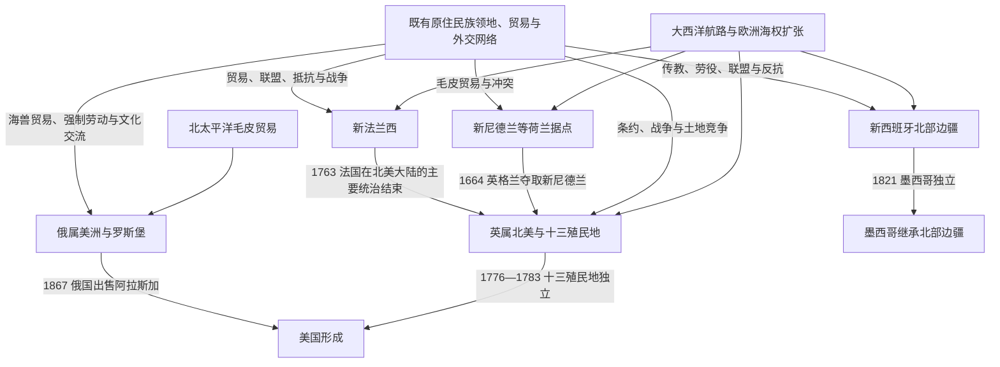

# 殖民北美

## 时间

约16世纪初—19世纪中叶；不同殖民体系的起止时间并不一致。

## 概括

殖民北美不是一批欧洲国家在空白地图上划分领土的过程。法国、英国、西班牙、荷兰和俄国的据点覆盖在既有原住民族领地、贸易网络与政治秩序之上；许多殖民地在相当长时间内只能控制港口、河谷、堡垒或传教站周边。原住民族通过结盟、贸易、战争、迁徙和条约直接影响各帝国的边界与存亡。

不同殖民体系的重点也不相同：新法兰西依赖水路、毛皮贸易和原住民联盟；英属大西洋殖民地形成较密集的定居农业、港口和地方议会；新西班牙北部以传教站、要塞和城镇构成边疆走廊；新尼德兰和俄属美洲则以公司经营的贸易据点为核心。

## 演变图

## 殖民体系导航

| 殖民体系 | 主要时期 | 入口 | 主线 |
|---|---:|---|---|
| 新法兰西 | 约1534—1763年 | [新法兰西](/%E4%BA%BA%E6%96%87%E7%A7%91%E5%AD%A6/%E5%8E%86%E5%8F%B2/%E7%BE%8E%E6%B4%B2/%E5%8C%97%E7%BE%8E/%E6%AE%96%E6%B0%91%E5%8C%97%E7%BE%8E/%E6%96%B0%E6%B3%95%E5%85%B0%E8%A5%BF.md) | 圣劳伦斯河、阿卡迪亚、五大湖和密西西比水系；王室政府、毛皮贸易与原住民联盟。 |
| 英属北美与十三殖民地 | 1607年起；十三殖民地于1776—1783年独立，本笔记以1867年为主线分界 | [英属北美与十三殖民地](/%E4%BA%BA%E6%96%87%E7%A7%91%E5%AD%A6/%E5%8E%86%E5%8F%B2/%E7%BE%8E%E6%B4%B2/%E5%8C%97%E7%BE%8E/%E6%AE%96%E6%B0%91%E5%8C%97%E7%BE%8E/%E8%8B%B1%E5%B1%9E%E5%8C%97%E7%BE%8E%E4%B8%8E%E5%8D%81%E4%B8%89%E6%AE%96%E6%B0%91%E5%9C%B0.md) | 大西洋定居殖民、地方议会、种植园与奴隶制、帝国征税和美国独立。 |
| 西班牙北部边疆 | 16世纪—1821年 | [西班牙北部边疆](/%E4%BA%BA%E6%96%87%E7%A7%91%E5%AD%A6/%E5%8E%86%E5%8F%B2/%E7%BE%8E%E6%B4%B2/%E5%8C%97%E7%BE%8E/%E6%AE%96%E6%B0%91%E5%8C%97%E7%BE%8E/%E8%A5%BF%E7%8F%AD%E7%89%99%E5%8C%97%E9%83%A8%E8%BE%B9%E7%96%86.md) | 佛罗里达、新墨西哥、得克萨斯、北墨西哥与加利福尼亚的传教站、要塞和城镇。 |
| 荷兰殖民据点 | 约1614—1674年 | [荷兰与俄国殖民据点](/%E4%BA%BA%E6%96%87%E7%A7%91%E5%AD%A6/%E5%8E%86%E5%8F%B2/%E7%BE%8E%E6%B4%B2/%E5%8C%97%E7%BE%8E/%E6%AE%96%E6%B0%91%E5%8C%97%E7%BE%8E/%E8%8D%B7%E5%85%B0%E4%B8%8E%E4%BF%84%E5%9B%BD%E6%AE%96%E6%B0%91%E6%8D%AE%E7%82%B9.md) | 哈得孙河与新阿姆斯特丹的公司贸易、庄园和多族群港口社会。 |
| 俄国殖民据点 | 约1741—1867年 | [荷兰与俄国殖民据点](/%E4%BA%BA%E6%96%87%E7%A7%91%E5%AD%A6/%E5%8E%86%E5%8F%B2/%E7%BE%8E%E6%B4%B2/%E5%8C%97%E7%BE%8E/%E6%AE%96%E6%B0%91%E5%8C%97%E7%BE%8E/%E8%8D%B7%E5%85%B0%E4%B8%8E%E4%BF%84%E5%9B%BD%E6%AE%96%E6%B0%91%E6%8D%AE%E7%82%B9.md) | 阿留申群岛、阿拉斯加和罗斯堡的海兽毛皮贸易、俄美公司与东正教网络。 |

## 统治结构比较

| 体系 | 权力核心 | 基层节点 | 主要经济 | 与原住民族关系的典型特点 |
|---|---|---|---|---|
| 法国 | 国王、总督、行政长官与主权会议 | 圣劳伦斯聚落、领主土地、堡垒、传教站和贸易站 | 毛皮、渔业、农业与密西西比贸易 | 人口较少，广泛依靠联盟和中介网络；同时存在战争、传教、奴役和领土扩张。 |
| 英国 | 王室、议会、殖民总督；部分殖民地由业主或特许状治理 | 殖民议会、县、城镇、港口和种植园 | 大西洋贸易、谷物、烟草、稻米、靛蓝、渔业与造船 | 定居人口快速增长，条约和联盟与持续土地侵占并存。 |
| 西班牙 | 西班牙王室、新西班牙总督辖区及边疆军政机构 | 传教站、要塞、城镇、牧场和矿区 | 农牧业、矿业、区域贸易与军需 | 传教和集中居住常带有强制性；原住民族也通过起义、联盟和贸易限制西班牙控制。 |
| 荷兰 | 荷兰西印度公司及殖民地总督 | 商站、新阿姆斯特丹、庄园与河港 | 毛皮、转口贸易、农业 | 商业合作与土地争端并存，战争和殖民扩张破坏既有社会。 |
| 俄国 | 帝国特许的俄美公司及其总管 | 海岸商站、狩猎基地、教会和罗斯堡 | 海獭等海兽毛皮与补给农业 | 强制原住民猎手劳动造成严重伤害，同时形成混合家庭、东正教社群和翻译传统。 |

## 关键转折

| 时间 | 事件 | 影响 |
|---:|---|---|
| 1607—1608年 | 詹姆斯敦与魁北克相继建立 | 英法在大西洋北美形成持久殖民据点。 |
| 1620—1624年 | 新英格兰聚落扩展，新尼德兰开始殖民 | 大西洋沿岸出现不同公司、宗教与定居模式。 |
| 1663—1664年 | 法国王室直接接管新法兰西；英格兰夺取新尼德兰 | 法英两大殖民体系逐渐成为东北北美竞争主角。 |
| 1680年 | 普韦布洛起义 | 普韦布洛诸民族一度驱逐新墨西哥的西班牙统治，显示边疆控制并不稳固。 |
| 1754—1763年 | 北美英法战争；1756年后并入全球七年战争 | 英国取得加拿大等法国领地，北美帝国均势重组。 |
| 1776—1783年 | 美国独立战争 | 十三殖民地脱离英国；原住民族、忠诚派和其他英属殖民地面临新的边界与迁徙。 |
| 1803—1821年 | 路易斯安那转让、佛罗里达易手与墨西哥独立 | 西班牙和法国殖民遗产被美国、墨西哥等新国家重新划分。 |
| 1867年 | 阿拉斯加转让与加拿大联邦成立 | 俄属美洲结束；多块英属北美殖民地组成加拿大联邦，纽芬兰等地尚未加入。 |

## 重要辨析

- “十三殖民地”只是后来参加美国独立的英属大西洋殖民地，不等于全部英属北美。
- 帝国地图标出的大片“领地”通常不是连续有效统治区；堡垒、河路和联盟关系往往比地图边界更能说明实际控制。
- 原住民族不是殖民竞争的附属角色。法国、英国、西班牙、荷兰和俄国都必须应对原住民族的主权、军事力量、贸易选择和地方知识。
- 殖民体系不仅带来欧洲移民，也牵涉被强迫迁移的非洲人、帝国内部移民以及跨族群家庭与新共同体。
- 美国、加拿大和墨西哥形成后，殖民式土地扩张、同化政策和边疆战争并未自动结束。

## 相关笔记

- 上级目录：[北美](/%E4%BA%BA%E6%96%87%E7%A7%91%E5%AD%A6/%E5%8E%86%E5%8F%B2/%E7%BE%8E%E6%B4%B2/%E5%8C%97%E7%BE%8E/README.md)。
- 接触前后都持续存在的政治主体与区域网络：[北美原住民](/%E4%BA%BA%E6%96%87%E7%A7%91%E5%AD%A6/%E5%8E%86%E5%8F%B2/%E7%BE%8E%E6%B4%B2/%E5%8C%97%E7%BE%8E/%E5%8C%97%E7%BE%8E%E5%8E%9F%E4%BD%8F%E6%B0%91/README.md)。
- 欧洲母国与海权背景：[欧洲历史](/%E4%BA%BA%E6%96%87%E7%A7%91%E5%AD%A6/%E5%8E%86%E5%8F%B2/%E6%AC%A7%E6%B4%B2/README.md)。
- 大西洋奴隶贸易背景：[非洲历史](/%E4%BA%BA%E6%96%87%E7%A7%91%E5%AD%A6/%E5%8E%86%E5%8F%B2/%E9%9D%9E%E6%B4%B2/README.md)。
