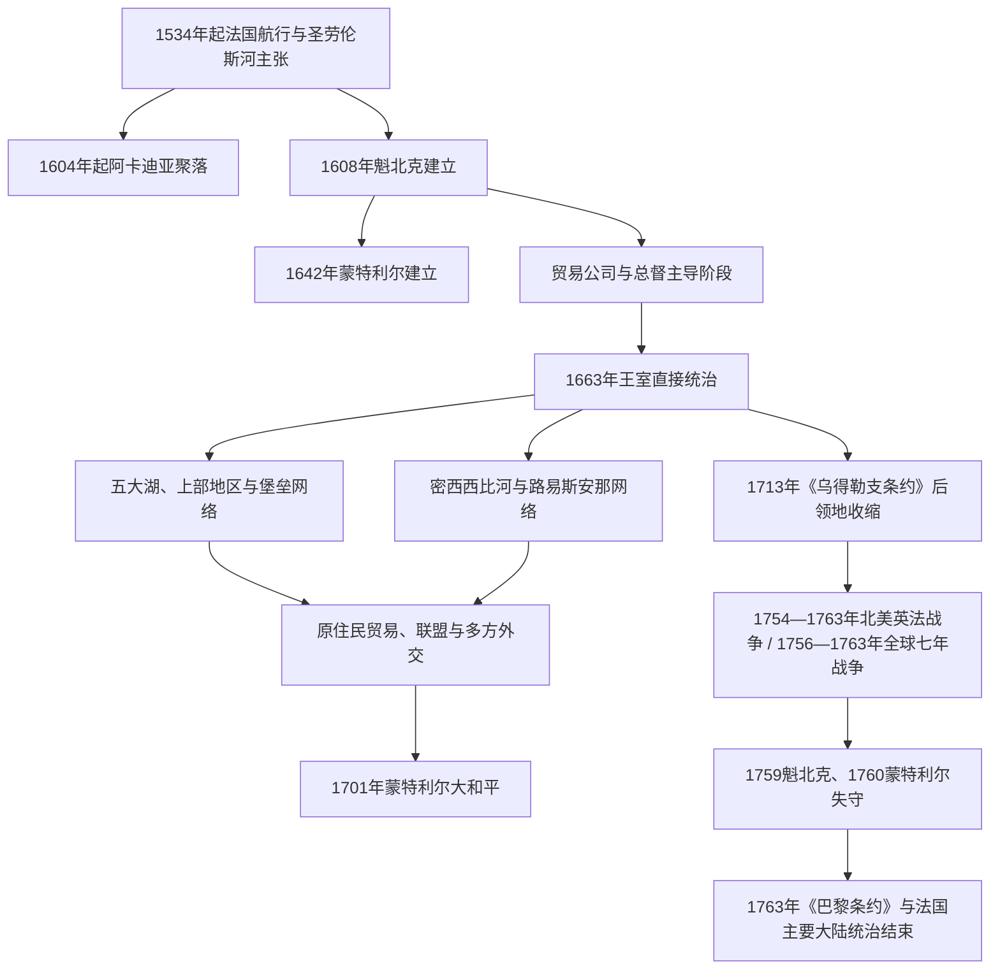

# 新法兰西

## 时间

约1534—1763年；圣劳伦斯河核心殖民政权为1608—1760年。

## 范围

“新法兰西”是法国在北美多块领地与网络的总称，核心包括圣劳伦斯河沿岸的加拿大殖民地、阿卡迪亚、五大湖与上部地区，以及后来沿密西西比河延伸的路易斯安那。法国在地图上的主张很广，实际控制却集中在城镇、河路、堡垒、传教站和原住民联盟能够维系的节点。

## 概括

新法兰西人口少于英属大西洋殖民地，其力量主要来自圣劳伦斯—五大湖—密西西比水路、毛皮贸易、军事堡垒和复杂的原住民外交。法国商人、传教士和军官依赖 Innu、Wendat、Anishinaabe 等民族的地理知识、运输、贸易和联盟，同时又卷入与 Haudenosaunee 等政治力量的战争与谈判。

这种关系不能浪漫化成平等合作：疾病、传教压力、战争、奴役和法国领土扩张都造成伤害。另一方面，原住民族并非被动接受法国政策，而是利用贸易与联盟维护自身利益，并迫使法国政府适应既有外交规则。

## 演变图

## 统治结构

| 层级 / 机构 | 主要时期 | 职能 |
|---|---:|---|
| 特许贸易公司 | 17世纪初—1663年 | 获王室垄断权，经营毛皮贸易并承担有限移民和治理责任；商业目标常压倒定居建设。 |
| 总督 | 全时期，1663年后权力更制度化 | 代表法国国王，负责军事、对外关系与原住民外交。 |
| 行政长官 | 1663年后 | 负责司法、财政、治安、经济与殖民地日常行政，与总督形成分工和竞争。 |
| 主权会议 / 高等会议 | 1663年后 | 处理司法、法令登记和高级行政事务，由总督、行政长官、主教及获任命成员参与。 |
| 天主教会 | 17—18世纪 | 建立教区、学校、医院和传教网络；主教是殖民政治的重要力量。 |
| 领主制与堂区 | 主要在圣劳伦斯河谷 | 王室把狭长河岸土地授予领主，领主再分配给居民；村落、堂区和家庭农场构成定居核心。 |
| 边疆军官、商人与中介者 | 五大湖和密西西比水系 | 维持堡垒、贸易、运输与外交；实际运作高度依赖原住民伙伴和跨文化家庭网络。 |

## 加拿大殖民地总督序列

下表整理圣劳伦斯河核心“加拿大殖民地”的主要最高行政与军事负责人，而不是把阿卡迪亚、路易斯安那等各自总督并入一条虚假的单一序列。早期官衔在“新法兰西总督”“加拿大总督”“指挥官”和公司代理之间变化；1663年王室直辖后，正式总督通常主掌军事与外交。代理、复任和上级特派专员均分行说明。

| 顺序 / 性质 | 负责人 | 任期 | 身份与交接 | 关键事件 / 说明 |
|---:|---|---:|---|---|
| 1 | **萨缪尔·德·尚普兰** | 1627—1635年 | 公司体系下的总督代理 / 新法兰西指挥官；任内去世 | 重建1629—1632年英军占领后的魁北克，并维系圣劳伦斯河联盟与贸易。 |
| 2 | 马克-安托万·德·布拉斯-德费·德·沙托福尔 | 1635—1636年 | 尚普兰去世后临时代行 | 保持魁北克行政连续，等待王室任命继任者。 |
| 3 | 夏尔·于奥·德·蒙马尼 | 1636—1648年 | 接替沙托福尔 | 主持三河城、魁北克与新建蒙特利尔之间防务，卷入易洛魁战争。 |
| 4 | 路易·达耶布·德·库隆日 | 1648—1651年 | 接替蒙马尼 | 强化殖民防务；温达特人离散使法国贸易和联盟体系遭受冲击。 |
| 5 | 让·德·洛宗 | 1651—1656年 | 接替达耶布 | 易洛魁战争与人口、防务危机持续。 |
| 署理 | 夏尔·德·洛宗-沙尔尼 | 1656—1657年 | 让·德·洛宗之子，临时代行 | 在正式继任者抵达前主持殖民行政。 |
| 6 | 皮埃尔·德·瓦耶·德·阿让松 | 1658—1661年 | 接替洛宗体系 | 殖民地请求王室提供更直接的军事与财政援助。 |
| 7 | 皮埃尔·迪布瓦·达沃古尔 | 1661—1663年 | 接替阿让松 | 公司治理失灵和酒类贸易争议推动王室接管。 |
| 8 | 奥古斯坦·德·萨弗雷·德·梅齐 | 1663—1665年 | 王室直辖后的首任正式总督 | 与主教、主权会议发生权力冲突，显示新体制内部制衡尚未稳定。 |
| 特派上级 | **亚历山大·德·普鲁维尔·德·特雷西** | 1665—1667年 | 法属美洲中将，权位在地方总督之上 | 率卡里尼昂—萨利埃团远征，迫使易洛魁联盟东部诸族议和；不计正式地方总督序号。 |
| 9 | 达尼埃尔·德·雷米·德·库尔塞勒 | 1665—1672年 | 与特雷西、总管塔隆共同重建王室治理 | 军事行动后推进和平、人口与内陆交通政策。 |
| 10a | **路易·德·比阿德·德·弗龙特纳克** | 1672—1682年 | 接替库尔塞勒；因与总管、教会冲突被召回 | 扩大五大湖堡垒和贸易网络，同时激化官员与商贸集团矛盾。 |
| 11 | 约瑟夫-安托万·勒费弗尔·德·拉巴尔 | 1682—1685年 | 接替弗龙特纳克 | 对易洛魁军事行动失败，因贸易利益与外交失误被撤换。 |
| 12 | 雅克-勒内·德·布里赛·德·德农维尔 | 1685—1689年 | 接替拉巴尔 | 远征塞内卡人并修筑堡垒；绑架首领等行动使战争升级。 |
| 10b | **弗龙特纳克** | 1689—1698年 | 九年战争中复任；任内去世 | 抵御英军进攻，以突袭和原住民联盟维持新法兰西；复任不得与首任合并。 |
| 13 | 路易-埃克托尔·德·卡利埃 | 1698—1703年 | 弗龙特纳克去世后继任 | 促成1701年蒙特利尔大和平，重组法国与数十个原住民族的关系。 |
| 14 | **菲利普·德·里戈·德·沃德勒伊** | 1703—1725年 | 接替卡利埃；任内去世 | 安妮女王战争与《乌得勒支条约》时期维持圣劳伦斯核心和内陆联盟。 |
| 署理 | 夏尔·勒穆瓦纳，隆格伊男爵 | 1725—1726年 | 沃德勒伊去世后首次署理 | 维持交接，等待博阿尔努瓦到任。 |
| 15 | 夏尔·德·拉布瓦什，博阿尔努瓦侯爵 | 1726—1747年 | 接替沃德勒伊体系 | 堡垒与五大湖网络扩张，卷入狐狸战争和奥地利王位继承战争。 |
| 署理 | 罗兰-米歇尔·巴兰·德·拉加利索尼埃 | 1747—1749年 | 署理总督 | 加强俄亥俄河谷主张、制图和堡垒政策，为英法冲突升级埋下伏笔。 |
| 16 | 雅克-皮埃尔·德·塔法内尔，拉容基耶侯爵 | 1749—1752年 | 正式继任；任内去世 | 推进边疆堡垒和贸易控制，官员商业利益争议加剧。 |
| 署理 | 隆格伊男爵 | 1752年 | 第二次署理 | 在迪凯纳到任前短暂主持行政。 |
| 17 | 安热·迪凯纳·德·梅讷维尔 | 1752—1755年 | 接替拉容基耶体系 | 沿俄亥俄河建立堡垒链，直接加剧与英国殖民地的战争。 |
| 18 | **皮埃尔·德·里戈·德·沃德勒伊-卡瓦尼亚尔** | 1755—1760年 | 新法兰西最后一任正式总督 | 与蒙卡尔姆等军方指挥体系矛盾；魁北克失守后于1760年在蒙特利尔投降。 |

## 行政长官（intendant）完整序列

行政长官分掌司法、财政、警务、经济与民政。总督和行政长官是并列而常有竞争的职务，不能把两表当作前后相继的同一种统治者。任命、生效和实际到任年份偶有差异，下表以实际主政阶段为主；空缺期由主权会议和其他官员维持行政。

| 任段 | 行政长官 | 任期 | 与前任关系 | 关键事务 / 备注 |
|---:|---|---:|---|---|
| 1a | **让·塔隆** | 1665—1668年 | 王室直辖后首位实际到任的行政长官 | 推动人口调查、“国王女儿”移民、农业与手工业多样化。 |
| 2 | 克洛德·德·布特鲁 | 1668—1670年 | 塔隆首次离任后接替 | 维持财政、司法和贸易监管。 |
| 1b | **让·塔隆** | 1670—1672年 | 第二次任职 | 推动内陆探察、产业与殖民人口政策；复任单列。 |
| 空缺 | 主权会议及其他官员分担 | 1672—1675年 | 无常驻正式行政长官 | 反映总督权力扩张与王室监督调整。 |
| 3 | 雅克·迪谢诺 | 1675—1682年 | 塔隆体系后正式继任 | 与弗龙特纳克围绕毛皮贸易、酒类贸易和权力边界冲突。 |
| 4 | 雅克·德·默勒 | 1682—1686年 | 接替迪谢诺 | 整顿财政并发行纸牌货币以缓解现金短缺。 |
| 5 | 让·博沙尔·德·尚皮尼 | 1686—1702年 | 接替德·默勒 | 长期处理战争财政、司法、贸易和内陆扩张。 |
| 6 | 弗朗索瓦·德·博阿尔努瓦 | 1702—1705年 | 接替尚皮尼 | 西班牙王位继承战争初期筹措防务与财政。 |
| 7 | 雅克·拉乌多与安托万-德尼·拉乌多 | 1705—1710年 | 父子共同 / 分工任职 | 调查贸易与殖民弊病，试图限制利益集团垄断。 |
| 8 | 米歇尔·贝贡 | 1710年获任命，约1712—1726年实际主政 | 接替拉乌多父子 | 任期跨越《乌得勒支条约》后重整；处理火灾、贸易与财政。 |
| 9 | 克洛德-托马·迪皮 | 1726—1728年 | 接替贝贡；后被召回 | 与总督和主权会议发生尖锐管辖冲突。 |
| 10 | **吉勒·奥卡尔** | 1729—1748年 | 先署理后正式任职 | 发展造船、铁业和粮食贸易；战争财政使管制与债务压力上升。 |
| 11 | **弗朗索瓦·比戈** | 1748—1760年 | 最后一任行政长官 | 七年战争中负责供应和财政；垄断、贪腐与物价危机削弱殖民防务，征服后在法国受审。 |

## 经济与社会

- 毛皮贸易尤其是河狸皮贸易连接圣劳伦斯河、五大湖、哈得孙湾和密西西比水系，也是法国联盟政策的重要基础。
- 圣劳伦斯河谷以农业、渔业和地方手工业支持魁北克、三河城与蒙特利尔等城镇；阿卡迪亚发展出适应潮汐地带的农业社区。
- 路易斯安那以新奥尔良、密西西比河交通和种植业为核心，使用非洲奴隶劳动，也与北方毛皮和军贸网络相连。
- 新法兰西存在对原住民和非洲人的奴役；法国殖民社会并非只有自由农民、商人与传教士。
- 商贸、婚姻和亲属关系产生跨文化家庭与中介群体，为后来五大湖和草原地区的 Métis 社群发展提供部分历史基础，但不能把所有跨族群家庭都直接归为同一种身份。

## 重要事件

| 时间 | 事件 | 意义 |
|---:|---|---|
| 1534—1542年 | 雅克·卡蒂埃多次航行 | 法国以圣劳伦斯河为主要入口提出领土主张，但早期殖民尝试未能持续。 |
| 1604—1608年 | 阿卡迪亚定居与魁北克建立 | 法国在北美形成持久据点。 |
| 1642年 | 蒙特利尔建立 | 圣劳伦斯河上游的传教、贸易和军事节点逐渐发展。 |
| 1663年 | 法国王室接管 | 新法兰西由公司主导转为王室殖民地，总督、行政长官和主权会议体制确立。 |
| 1701年 | 蒙特利尔大和平 | 法国与多个原住民族达成多边和平，重组五大湖地区外交和贸易。 |
| 1713年 | 《乌得勒支条约》 | 法国向英国放弃哈得孙湾、纽芬兰主张和阿卡迪亚大陆部分，保留圣劳伦斯核心及部分海湾岛屿。 |
| 1718年 | 新奥尔良建立 | 法属路易斯安那获得密西西比河下游的行政和贸易中心。 |
| 1754—1760年 | 北美英法战争中的战事、魁北克与蒙特利尔失守 | 这场北美战争在1756年后成为全球七年战争的一部分；英国征服圣劳伦斯河殖民核心。 |
| 1763年 | 《巴黎条约》 | 法国把加拿大及密西西比河以东的大部分主张让予英国；密西西比河以西的路易斯安那此前已转予西班牙。 |

## 演变关系

- 所属总览：[殖民北美](/%E4%BA%BA%E6%96%87%E7%A7%91%E5%AD%A6/%E5%8E%86%E5%8F%B2/%E7%BE%8E%E6%B4%B2/%E5%8C%97%E7%BE%8E/%E6%AE%96%E6%B0%91%E5%8C%97%E7%BE%8E/README.md)。
- 加拿大疆域主线中的对应阶段：[原住民社会与新法兰西](/%E4%BA%BA%E6%96%87%E7%A7%91%E5%AD%A6/%E5%8E%86%E5%8F%B2/%E7%BE%8E%E6%B4%B2/%E5%8C%97%E7%BE%8E/%E5%8A%A0%E6%8B%BF%E5%A4%A7/%E5%8E%9F%E4%BD%8F%E6%B0%91%E7%A4%BE%E4%BC%9A%E4%B8%8E%E6%96%B0%E6%B3%95%E5%85%B0%E8%A5%BF.md)。
- 殖民前后持续参与贸易、联盟和战争的政治主体：[北美原住民](/%E4%BA%BA%E6%96%87%E7%A7%91%E5%AD%A6/%E5%8E%86%E5%8F%B2/%E7%BE%8E%E6%B4%B2/%E5%8C%97%E7%BE%8E/%E5%8C%97%E7%BE%8E%E5%8E%9F%E4%BD%8F%E6%B0%91/README.md)。
- 主要竞争者及1763年后的继承：[英属北美与十三殖民地](/%E4%BA%BA%E6%96%87%E7%A7%91%E5%AD%A6/%E5%8E%86%E5%8F%B2/%E7%BE%8E%E6%B4%B2/%E5%8C%97%E7%BE%8E/%E6%AE%96%E6%B0%91%E5%8C%97%E7%BE%8E/%E8%8B%B1%E5%B1%9E%E5%8C%97%E7%BE%8E%E4%B8%8E%E5%8D%81%E4%B8%89%E6%AE%96%E6%B0%91%E5%9C%B0.md)。
- 法国母国背景：[法国历史](/%E4%BA%BA%E6%96%87%E7%A7%91%E5%AD%A6/%E5%8E%86%E5%8F%B2/%E6%AC%A7%E6%B4%B2/%E6%B3%95%E5%9B%BD/README.md)。
- 西班牙接收路易斯安那后的边疆体系：[西班牙北部边疆](/%E4%BA%BA%E6%96%87%E7%A7%91%E5%AD%A6/%E5%8E%86%E5%8F%B2/%E7%BE%8E%E6%B4%B2/%E5%8C%97%E7%BE%8E/%E6%AE%96%E6%B0%91%E5%8C%97%E7%BE%8E/%E8%A5%BF%E7%8F%AD%E7%89%99%E5%8C%97%E9%83%A8%E8%BE%B9%E7%96%86.md)。
