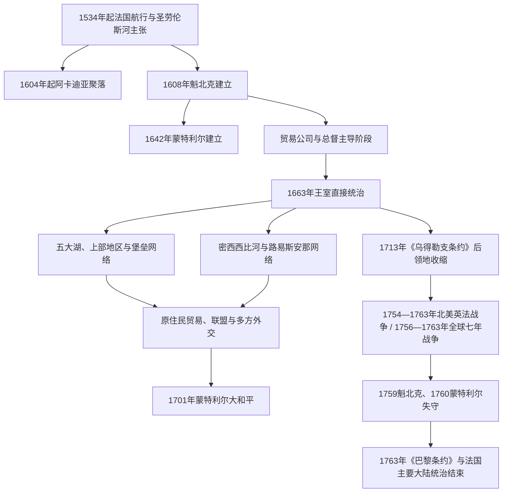

# 新法兰西

## 时间

约1534—1763年；圣劳伦斯河核心殖民政权为1608—1760年。

## 范围

“新法兰西”是法国在北美多块领地与网络的总称，核心包括圣劳伦斯河沿岸的加拿大殖民地、阿卡迪亚、五大湖与上部地区，以及后来沿密西西比河延伸的路易斯安那。法国在地图上的主张很广，实际控制却集中在城镇、河路、堡垒、传教站和原住民联盟能够维系的节点。

## 概括

新法兰西人口少于英属大西洋殖民地，其力量主要来自圣劳伦斯—五大湖—密西西比水路、毛皮贸易、军事堡垒和复杂的原住民外交。法国商人、传教士和军官依赖 Innu、Wendat、Anishinaabe 等民族的地理知识、运输、贸易和联盟，同时又卷入与 Haudenosaunee 等政治力量的战争与谈判。

这种关系不能浪漫化成平等合作：疾病、传教压力、战争、奴役和法国领土扩张都造成伤害。另一方面，原住民族并非被动接受法国政策，而是利用贸易与联盟维护自身利益，并迫使法国政府适应既有外交规则。

## 演变图

## 统治结构

| 层级 / 机构 | 主要时期 | 职能 |
|---|---:|---|
| 特许贸易公司 | 17世纪初—1663年 | 获王室垄断权，经营毛皮贸易并承担有限移民和治理责任；商业目标常压倒定居建设。 |
| 总督 | 全时期，1663年后权力更制度化 | 代表法国国王，负责军事、对外关系与原住民外交。 |
| 行政长官 | 1663年后 | 负责司法、财政、治安、经济与殖民地日常行政，与总督形成分工和竞争。 |
| 主权会议 / 高等会议 | 1663年后 | 处理司法、法令登记和高级行政事务，由总督、行政长官、主教及获任命成员参与。 |
| 天主教会 | 17—18世纪 | 建立教区、学校、医院和传教网络；主教是殖民政治的重要力量。 |
| 领主制与堂区 | 主要在圣劳伦斯河谷 | 王室把狭长河岸土地授予领主，领主再分配给居民；村落、堂区和家庭农场构成定居核心。 |
| 边疆军官、商人与中介者 | 五大湖和密西西比水系 | 维持堡垒、贸易、运输与外交；实际运作高度依赖原住民伙伴和跨文化家庭网络。 |

## 经济与社会

- 毛皮贸易尤其是河狸皮贸易连接圣劳伦斯河、五大湖、哈得孙湾和密西西比水系，也是法国联盟政策的重要基础。
- 圣劳伦斯河谷以农业、渔业和地方手工业支持魁北克、三河城与蒙特利尔等城镇；阿卡迪亚发展出适应潮汐地带的农业社区。
- 路易斯安那以新奥尔良、密西西比河交通和种植业为核心，使用非洲奴隶劳动，也与北方毛皮和军贸网络相连。
- 新法兰西存在对原住民和非洲人的奴役；法国殖民社会并非只有自由农民、商人与传教士。
- 商贸、婚姻和亲属关系产生跨文化家庭与中介群体，为后来五大湖和草原地区的 Métis 社群发展提供部分历史基础，但不能把所有跨族群家庭都直接归为同一种身份。

## 重要事件

| 时间 | 事件 | 意义 |
|---:|---|---|
| 1534—1542年 | 雅克·卡蒂埃多次航行 | 法国以圣劳伦斯河为主要入口提出领土主张，但早期殖民尝试未能持续。 |
| 1604—1608年 | 阿卡迪亚定居与魁北克建立 | 法国在北美形成持久据点。 |
| 1642年 | 蒙特利尔建立 | 圣劳伦斯河上游的传教、贸易和军事节点逐渐发展。 |
| 1663年 | 法国王室接管 | 新法兰西由公司主导转为王室殖民地，总督、行政长官和主权会议体制确立。 |
| 1701年 | 蒙特利尔大和平 | 法国与多个原住民族达成多边和平，重组五大湖地区外交和贸易。 |
| 1713年 | 《乌得勒支条约》 | 法国向英国放弃哈得孙湾、纽芬兰主张和阿卡迪亚大陆部分，保留圣劳伦斯核心及部分海湾岛屿。 |
| 1718年 | 新奥尔良建立 | 法属路易斯安那获得密西西比河下游的行政和贸易中心。 |
| 1754—1760年 | 北美英法战争中的战事、魁北克与蒙特利尔失守 | 这场北美战争在1756年后成为全球七年战争的一部分；英国征服圣劳伦斯河殖民核心。 |
| 1763年 | 《巴黎条约》 | 法国把加拿大及密西西比河以东的大部分主张让予英国；密西西比河以西的路易斯安那此前已转予西班牙。 |

## 演变关系

- 所属总览：[殖民北美](/%E4%BA%BA%E6%96%87%E7%A7%91%E5%AD%A6/%E5%8E%86%E5%8F%B2/%E7%BE%8E%E6%B4%B2/%E5%8C%97%E7%BE%8E/%E6%AE%96%E6%B0%91%E5%8C%97%E7%BE%8E/README.md)。
- 殖民前后持续参与贸易、联盟和战争的政治主体：[北美原住民](/%E4%BA%BA%E6%96%87%E7%A7%91%E5%AD%A6/%E5%8E%86%E5%8F%B2/%E7%BE%8E%E6%B4%B2/%E5%8C%97%E7%BE%8E/%E5%8C%97%E7%BE%8E%E5%8E%9F%E4%BD%8F%E6%B0%91/README.md)。
- 主要竞争者及1763年后的继承：[英属北美与十三殖民地](/%E4%BA%BA%E6%96%87%E7%A7%91%E5%AD%A6/%E5%8E%86%E5%8F%B2/%E7%BE%8E%E6%B4%B2/%E5%8C%97%E7%BE%8E/%E6%AE%96%E6%B0%91%E5%8C%97%E7%BE%8E/%E8%8B%B1%E5%B1%9E%E5%8C%97%E7%BE%8E%E4%B8%8E%E5%8D%81%E4%B8%89%E6%AE%96%E6%B0%91%E5%9C%B0.md)。
- 法国母国背景：[法国历史](/%E4%BA%BA%E6%96%87%E7%A7%91%E5%AD%A6/%E5%8E%86%E5%8F%B2/%E6%AC%A7%E6%B4%B2/%E6%B3%95%E5%9B%BD/README.md)。
- 西班牙接收路易斯安那后的边疆体系：[西班牙北部边疆](/%E4%BA%BA%E6%96%87%E7%A7%91%E5%AD%A6/%E5%8E%86%E5%8F%B2/%E7%BE%8E%E6%B4%B2/%E5%8C%97%E7%BE%8E/%E6%AE%96%E6%B0%91%E5%8C%97%E7%BE%8E/%E8%A5%BF%E7%8F%AD%E7%89%99%E5%8C%97%E9%83%A8%E8%BE%B9%E7%96%86.md)。
