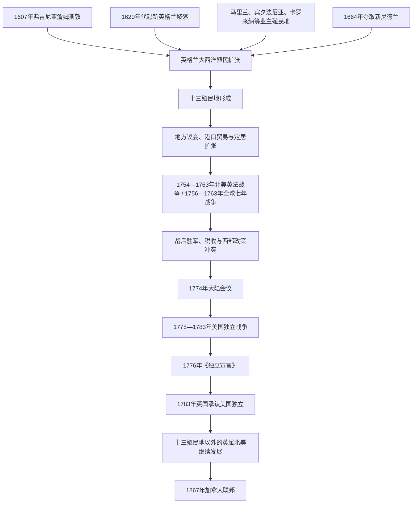

# 英属北美与十三殖民地

## 时间

1607年起；十三殖民地于1776年宣布独立，并在1783年获得英国承认。本笔记以1867年加拿大联邦成立为主线分界，纽芬兰等殖民地此后仍在英国治下。

## 重要辨析

“十三殖民地”不等于全部英属北美。它特指大西洋沿岸参加美国独立的十三个殖民地；纽芬兰、魁北克、诺瓦斯科舍、鲁珀特地等英国领地没有加入这场独立。十三殖民地脱离后，“英属北美”仍包括后来形成加拿大的多块殖民地。

1707年以前更准确地说是英格兰殖民地；英格兰与苏格兰组成大不列颠王国后，才进入严格意义上的英国殖民体系。

## 概括

英属大西洋殖民地从公司据点、宗教移民社区和业主领地发展出人口密集的城镇、农场、港口和种植园。各殖民地在王室、业主或特许状下拥有不同制度，但大多形成总督、参事会和地方议会并存的结构。地方自治经验与帝国主权并不矛盾：英国仍通过贸易法、任命权、战争和征税维持控制。

殖民扩张持续侵占原住民族土地，同时又依赖条约、贸易与军事联盟。殖民经济也深受契约劳工和非洲奴隶劳动塑造，尤其是切萨皮克与南部种植园区。美国独立因此不仅是殖民者与英国的冲突，也改变了原住民族、被奴役者、忠诚派及其他英属殖民地的处境。

## 演变图

## 十三殖民地

| 区域 | 殖民地 | 主要特点 |
|---|---|---|
| 新英格兰 | 新罕布什尔、马萨诸塞、罗得岛、康涅狄格 | 港口、渔业、造船、家庭农场和城镇会议较重要；清教等宗教共同体影响深，但各殖民地宗教制度不同。 |
| 中部殖民地 | 纽约、新泽西、宾夕法尼亚、特拉华 | 谷物、港口和河运发达，族群与宗教背景较多样；纽约继承部分新尼德兰制度与人口。 |
| 切萨皮克与南部 | 马里兰、弗吉尼亚、北卡罗来纳、南卡罗来纳、佐治亚 | 烟草、稻米、靛蓝等商品农业扩张，大种植园与小农并存，非洲奴隶劳动日益成为制度核心。 |

## 统治结构

| 类型 / 机构 | 说明 |
|---|---|
| 王室殖民地 | 国王任命总督，王室保留较强行政与否决权；到独立战争前，多数殖民地属于此类。 |
| 业主殖民地 | 王室把领地和治理权授予个人或家族，如宾夕法尼亚的佩恩家族和马里兰的卡尔弗特家族。 |
| 特许殖民地 | 依据公司或共同体特许状组织政府，罗得岛和康涅狄格保留较强地方选举传统。 |
| 总督与参事会 | 执行帝国政策，负责行政、军事和部分司法；参事会常兼具上院与顾问职能。 |
| 殖民地议会 | 审议地方税收和法律，但选举权通常受财产、性别、种族或宗教条件限制，不能等同于现代普选民主。 |
| 县、城镇和法院 | 处理道路、治安、土地、税收和基层司法；新英格兰城镇与南部县制的权力结构有所不同。 |
| 英国王室与议会 | 通过航海条例、海关、贸易规制、战争与后来的直接税收宣示帝国主权。 |

## 1775年前后的殖民行政首脑

十三殖民地从未共同受一位“北美总督”统治。王室殖民地、业主殖民地和特许殖民地各有自己的行政首脑，英国本土的国王、枢密院、贸易委员会和议会位于帝国层级之上。下表以独立战争爆发时各殖民地最后一位或当时在任的殖民行政首脑为准；总督逃离首府、被地方议会罢黜或仍获伦敦承认的日期往往不同，因此任期终点按殖民统治实际瓦解过程说明。

| 殖民地 | 行政类型 | 1775年前后行政首脑 | 任期 / 结局 | 实际权力与交接 |
|---|---|---|---|---|
| 新罕布什尔 | 王室殖民地 | 约翰·温特沃思（John Wentworth） | 1767—1775年实际主政，后仍获英方承认至1780年 | 议会冲突和革命委员会兴起后离开殖民地；地方爱国派接管。 |
| 马萨诸塞 | 王室殖民地兼军事统治 | **托马斯·盖奇**（Thomas Gage） | 1774—1775年 | 兼任英军北美总司令，强制法令和夺取军火行动直接促成列克星敦与康科德战事；1775年被召回。 |
| 罗得岛 | 特许殖民地 | 约瑟夫·旺顿（Joseph Wanton） | 1769—1775年 | 由当地选民体系产生，因对革命动员不够积极被议会停止职权并罢免；不属于王室任命总督。 |
| 康涅狄格 | 特许殖民地 | **乔纳森·特朗布尔**（Jonathan Trumbull） | 殖民总督1769—1776年；州长延续至1784年 | 由殖民地选举产生并支持独立，政权从殖民特许框架转为州政府时保持连续。 |
| 纽约 | 王室殖民地 | 威廉·特赖恩（William Tryon） | 1771—1777年名义在任 | 1775年后主要在英国军舰和英军控制区活动；革命机构与英军占领政府并立。 |
| 新泽西 | 王室殖民地 | 威廉·富兰克林（William Franklin） | 1763—1776年 | 本杰明·富兰克林之子，坚持效忠王室，1776年被革命政府拘捕并撤除。 |
| 宾夕法尼亚 | 业主殖民地 | 约翰·佩恩（John Penn） | 1773—1776年 | 代表佩恩家族任副总督；革命制宪会议取代业主政府。 |
| 特拉华三县 | 与宾夕法尼亚共戴业主总督、另有议会 | 约翰·佩恩 | 1773—1776年 | 与宾夕法尼亚共享业主行政首脑，但有独立议会；1776年建立特拉华州政府。 |
| 马里兰 | 业主殖民地 | 罗伯特·伊登（Robert Eden） | 1769—1776年 | 代表卡尔弗特家族；革命会议接管实权后离境。 |
| 弗吉尼亚 | 王室殖民地 | **邓莫尔伯爵约翰·默里**（Lord Dunmore） | 1771—1775年在首府主政，1776年撤离 | 宣布戒严并承诺给予投奔英军的叛乱者奴隶自由，既加强英军力量，也扩大革命与奴隶制危机。 |
| 北卡罗来纳 | 王室殖民地 | 乔赛亚·马丁（Josiah Martin） | 1771—1775年实际主政，英方名义至1776年 | 逃往军舰后试图组织效忠派，摩尔溪桥战役失败削弱王室复辟。 |
| 南卡罗来纳 | 王室殖民地 | 威廉·坎贝尔勋爵（Lord William Campbell） | 1775年 | 抵达后不久即因革命局势撤至军舰，王室政府迅速失去陆上控制。 |
| 佐治亚 | 王室殖民地 | **詹姆斯·赖特**（James Wright） | 1760—1776年；英军恢复统治后另有1779—1782年任段 | 1776年逃离；英国占领萨凡纳后复任，第二任段不与首任合并，1782年最终撤离。 |

这种分散结构解释了独立运动为何需要大陆会议协调，也解释了革命推进速度不一：特许殖民地可以较多沿用本地机构，王室殖民地则常经历总督撤离、革命会议接权和英军占领政府之间的竞争。

## 社会、经济与土地扩张

- 新英格兰依靠海运、渔业、造船、贸易与混合农业；中部殖民地是重要谷物和港口区；切萨皮克与南部更依赖出口型种植园经济。
- 欧洲契约劳工在17世纪占重要地位，非洲世袭动产奴隶制随后被殖民地法律固化并扩张。北部殖民地同样参与奴隶制和大西洋奴隶贸易，不能把奴隶制仅视为南部现象。
- 殖民者通过战争、购买、条约、欺诈和非法占地不断扩张。Powhatan 战争、Pequot 战争和17世纪后期新英格兰战争都造成原住民族人口、领土和政治秩序的剧变。
- 英国与 Haudenosaunee 等政治力量发展出贸易和条约关系，但“盟友”身份并不意味着英国承认无限制移民扩张。
- 1763年王室公告试图限制阿巴拉契亚山以西殖民定居，以重组与原住民族的关系；执行有限，却加剧部分殖民者对帝国政策的不满。

## 重要事件

| 时间 | 事件 | 意义 |
|---:|---|---|
| 1607年 | 詹姆斯敦建立 | 英格兰第一个持续存在的北美殖民据点。 |
| 1619年前后 | 弗吉尼亚议会形成；首批有记录的非洲人抵达英属弗吉尼亚 | 这不是北美奴隶制的起点；它显示英属弗吉尼亚的代表制度与非洲人受奴役同时发展，后者的法律地位随后逐步被固化为世袭动产奴隶。 |
| 1620—1630年代 | 普利茅斯、马萨诸塞湾、马里兰等殖民地建立 | 宗教、公司和业主殖民模式并行发展。 |
| 1664年 | 英格兰夺取新尼德兰 | 纽约等中部殖民地纳入英属体系。 |
| 1675—1676年 | 新英格兰战争，常称“菲利普王战争” | 殖民定居扩张与原住民族主权冲突造成严重伤亡和土地丧失。 |
| 1754—1763年 | 北美英法战争；1756年后并入全球七年战争 | 英国击败法国，但战争债务、驻军和新领地治理引发帝国制度危机。 |
| 1765—1774年 | 印花税、汤森税、茶税与强制法令争议 | 殖民抵制逐步转为跨殖民地协调。 |
| 1774—1776年 | 大陆会议、战争爆发与《独立宣言》 | 十三殖民地从争取帝国内权利转向建立独立国家。 |
| 1781—1783年 | 约克镇战役与《巴黎条约》 | 英国承认美国独立，英属北美格局重新调整。 |
| 1783年以后 | 忠诚派迁往魁北克、诺瓦斯科舍等地 | 推动英属北美人口、行政和殖民扩张的新阶段。 |

## 演变关系

- 所属总览：[殖民北美](/%E4%BA%BA%E6%96%87%E7%A7%91%E5%AD%A6/%E5%8E%86%E5%8F%B2/%E7%BE%8E%E6%B4%B2/%E5%8C%97%E7%BE%8E/%E6%AE%96%E6%B0%91%E5%8C%97%E7%BE%8E/README.md)。
- 殖民扩张所进入的既有政治与贸易网络：[北美原住民](/%E4%BA%BA%E6%96%87%E7%A7%91%E5%AD%A6/%E5%8E%86%E5%8F%B2/%E7%BE%8E%E6%B4%B2/%E5%8C%97%E7%BE%8E/%E5%8C%97%E7%BE%8E%E5%8E%9F%E4%BD%8F%E6%B0%91/README.md)。
- 法国竞争者及1763年后领地变化：[新法兰西](/%E4%BA%BA%E6%96%87%E7%A7%91%E5%AD%A6/%E5%8E%86%E5%8F%B2/%E7%BE%8E%E6%B4%B2/%E5%8C%97%E7%BE%8E/%E6%AE%96%E6%B0%91%E5%8C%97%E7%BE%8E/%E6%96%B0%E6%B3%95%E5%85%B0%E8%A5%BF.md)。
- 被英格兰夺取的新尼德兰背景：[荷兰与俄国殖民据点](/%E4%BA%BA%E6%96%87%E7%A7%91%E5%AD%A6/%E5%8E%86%E5%8F%B2/%E7%BE%8E%E6%B4%B2/%E5%8C%97%E7%BE%8E/%E6%AE%96%E6%B0%91%E5%8C%97%E7%BE%8E/%E8%8D%B7%E5%85%B0%E4%B8%8E%E4%BF%84%E5%9B%BD%E6%AE%96%E6%B0%91%E6%8D%AE%E7%82%B9.md)。
- 英国母国主线：[联合王国](/%E4%BA%BA%E6%96%87%E7%A7%91%E5%AD%A6/%E5%8E%86%E5%8F%B2/%E6%AC%A7%E6%B4%B2/%E4%B8%8D%E5%88%97%E9%A2%A0%E7%BE%A4%E5%B2%9B/%E8%81%94%E5%90%88%E7%8E%8B%E5%9B%BD/README.md)。
- 乔治三世与美国独立战争所在王朝：[汉诺威王朝](/%E4%BA%BA%E6%96%87%E7%A7%91%E5%AD%A6/%E5%8E%86%E5%8F%B2/%E6%AC%A7%E6%B4%B2/%E4%B8%8D%E5%88%97%E9%A2%A0%E7%BE%A4%E5%B2%9B/%E8%81%94%E5%90%88%E7%8E%8B%E5%9B%BD/%E6%B1%89%E8%AF%BA%E5%A8%81%E7%8E%8B%E6%9C%9D.md)。
