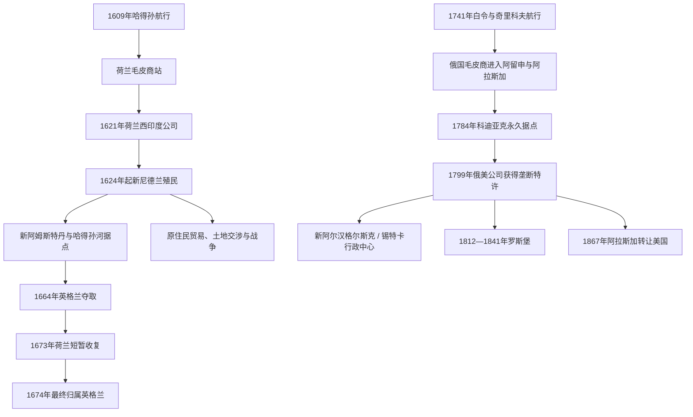

# 荷兰与俄国殖民据点

## 时间

- 荷兰在新尼德兰的主要殖民时期：约1614—1674年。
- 俄国在阿拉斯加及北太平洋的殖民时期：约1741—1867年；罗斯堡存在于1812—1841年。

## 概括

荷兰和俄国在北美都建立了以特许公司、毛皮贸易和少数据点为核心的殖民网络，但两者所处海域、制度与人口构成不同。新尼德兰沿哈得孙河和大西洋港口发展，成为商业化、多族群且使用奴隶劳动的殖民社会；俄属美洲沿阿留申群岛、阿拉斯加海岸和北太平洋展开，依靠原住民海上技术与海兽毛皮，并由俄美公司承担近似殖民政府的职能。

这些据点人口和有效控制范围有限，却留下重要影响：纽约地区继承部分荷兰地名、财产和商业传统；阿拉斯加至今仍有与俄国东正教、原住民语言和混合家庭相关的文化延续。

## 演变图

## 荷兰：新尼德兰

### 范围与经济

新尼德兰以哈得孙河为轴，连接新阿姆斯特丹、奥兰治堡及特拉华河、康涅狄格河方向的商站和殖民主张。荷兰西印度公司希望控制毛皮、航运和大西洋转口贸易，殖民地因此首先是商业工程，而不是一个宗教或民族完全同质的定居社会。

- 奥兰治堡附近的贸易依赖与 Haudenosaunee、Mahican 等民族的交换和外交。
- 新阿姆斯特丹发展为多语言港口，居民包括荷兰人、瓦隆人、德意志人、斯堪的纳维亚人、犹太人及其他欧洲移民。
- 荷兰西印度公司在17世纪20年代起输入被奴役的非洲人；他们修筑道路、防御工事并从事港口、家庭和农业劳动。
- 公司推行庄园主制度：招募一定数量移民者可取得大片土地和司法、租佃特权，伦斯勒斯威克是最持久的例子。
- 商业合作并未避免土地冲突。殖民总督基夫特时期的战争在1640年代造成原住民和平民大量死亡，也削弱殖民地。

### 统治结构

| 机构 / 身份 | 职能 |
|---|---|
| 荷兰西印度公司 | 获国家特许，垄断贸易、任命官员、组织军事与殖民。 |
| 总督与殖民地参事会 | 驻新阿姆斯特丹，执行公司政策、司法和防务。 |
| 庄园主 | 获大片土地，招募佃户并拥有部分地方权力。 |
| 新阿姆斯特丹市政机构 | 1650年代取得较正式的市政官员和法院，但仍受公司总督控制。 |
| 商人、自由殖民者与被奴役者 | 共同维持港口、农场和贸易网络，权利与法律地位极不平等。 |

### 关键节点

| 时间 | 事件 | 影响 |
|---:|---|---|
| 1614—1624年 | 早期商站、奥兰治堡与首批殖民家庭 | 荷兰由季节贸易转向常设据点。 |
| 1625—1626年 | 新阿姆斯特丹形成 | 曼哈顿南端成为殖民行政与港口中心。 |
| 1643—1645年 | 基夫特战争 | 土地、贡赋和暴力政策引发灾难性冲突。 |
| 1655年 | 荷兰吞并特拉华河畔的新瑞典 | 新尼德兰暂时强化对中部大西洋贸易的控制。 |
| 1664年 | 英格兰舰队迫使新阿姆斯特丹投降 | 新阿姆斯特丹改名纽约，新尼德兰大部纳入英属殖民体系。 |
| 1673—1674年 | 荷兰短暂收复后再度让予英格兰 | 荷兰主权结束，但居民、地名和财产制度继续影响纽约地区。 |

## 俄国：俄属美洲

### 范围与经济

俄国毛皮商在1741年以后沿阿留申群岛进入阿拉斯加，目标主要是海獭、海狗等高价值毛皮。早期商人严重依赖 Unangan、Alutiiq 等原住民的航海和捕猎技术，并通过暴力、扣押家属与强制劳动迫使猎手生产。

1784年，舍利霍夫在科迪亚克岛三圣湾建立第一个持续的俄国据点。1799年，俄美公司取得帝国垄断特许，兼营贸易、行政、防务和殖民。新阿尔汉格尔斯克，即后来的锡特卡，成为行政中心；罗斯堡则试图从加利福尼亚获得粮食并扩展海獭贸易。

### 统治结构

| 机构 / 身份 | 职能 |
|---|---|
| 俄国皇帝与帝国政府 | 授予俄美公司垄断特许，保留主权和监管权。 |
| 俄美公司 | 经营毛皮、据点、船运与补给，实际上承担殖民政府职能。 |
| 公司总管 | 驻阿拉斯加管理贸易、外交、军事与人员；巴拉诺夫长期主导扩张。 |
| 俄国东正教会 | 1794年起建立正式传教网络，发展学校、翻译和本地语言宗教文本，也常批评公司虐待。 |
| 原住民猎手、翻译与混合家庭 | 支撑海上生产、地方知识和跨文化社会；法律与劳动关系极不平等。 |

### 关键节点

| 时间 | 事件 | 影响 |
|---:|---|---|
| 1741年 | 白令与奇里科夫航行抵达阿拉斯加沿岸 | 俄国商人随后争夺北太平洋毛皮。 |
| 1784年 | 三圣湾据点建立 | 俄国在科迪亚克形成首个持续殖民中心，伴随对 Alutiiq 社群的暴力。 |
| 1799年 | 俄美公司成立 | 公司取得贸易和治理垄断，俄属美洲制度化。 |
| 1802—1804年 | Tlingit 摧毁俄国据点及锡特卡战役 | 俄国重新夺取锡特卡一带，但 Tlingit 抵抗和区域贸易力量持续存在。 |
| 1808年以后 | 新阿尔汉格尔斯克成为行政中心 | 锡特卡连接公司、教会、原住民和跨太平洋贸易。 |
| 1812—1841年 | 罗斯堡 | 俄美公司在加利福尼亚建立补给和商业据点，人口包括俄国人、阿拉斯加原住民与 Kashaya Pomo 等当地居民。 |
| 1867年 | 俄国把阿拉斯加转让美国 | 俄属美洲结束，俄美公司退出；东正教与原住民社群并未随主权转移消失。 |

## 比较与影响

| 维度 | 新尼德兰 | 俄属美洲 |
|---|---|---|
| 特许公司 | 荷兰西印度公司 | 俄美公司 |
| 核心商品 | 河狸皮、港口和大西洋贸易 | 海獭、海狗等海兽毛皮 |
| 核心据点 | 新阿姆斯特丹、奥兰治堡 | 科迪亚克、新阿尔汉格尔斯克、罗斯堡 |
| 殖民人口 | 港口和河谷定居者逐步增加，族群和宗教背景多样 | 俄国人口较少，原住民猎手与混合家庭构成殖民社会主体 |
| 主权终结 | 1664年被英格兰夺取，1674年最终确认 | 1867年阿拉斯加转让美国 |
| 长期遗产 | 纽约地名、财产关系、商贸文化和非洲裔社群历史 | 阿拉斯加东正教、语言文本、混合社群与北太平洋文化联系 |

## 演变关系

- 所属总览：[殖民北美](/%E4%BA%BA%E6%96%87%E7%A7%91%E5%AD%A6/%E5%8E%86%E5%8F%B2/%E7%BE%8E%E6%B4%B2/%E5%8C%97%E7%BE%8E/%E6%AE%96%E6%B0%91%E5%8C%97%E7%BE%8E/README.md)。
- 两套贸易殖民体系所依赖并伤害的既有社会：[北美原住民](/%E4%BA%BA%E6%96%87%E7%A7%91%E5%AD%A6/%E5%8E%86%E5%8F%B2/%E7%BE%8E%E6%B4%B2/%E5%8C%97%E7%BE%8E/%E5%8C%97%E7%BE%8E%E5%8E%9F%E4%BD%8F%E6%B0%91/README.md)。
- 新尼德兰被英格兰夺取后的继承：[英属北美与十三殖民地](/%E4%BA%BA%E6%96%87%E7%A7%91%E5%AD%A6/%E5%8E%86%E5%8F%B2/%E7%BE%8E%E6%B4%B2/%E5%8C%97%E7%BE%8E/%E6%AE%96%E6%B0%91%E5%8C%97%E7%BE%8E/%E8%8B%B1%E5%B1%9E%E5%8C%97%E7%BE%8E%E4%B8%8E%E5%8D%81%E4%B8%89%E6%AE%96%E6%B0%91%E5%9C%B0.md)。
- 北太平洋和阿拉斯加后来进入美国主线，参见上级区域：[北美](/%E4%BA%BA%E6%96%87%E7%A7%91%E5%AD%A6/%E5%8E%86%E5%8F%B2/%E7%BE%8E%E6%B4%B2/%E5%8C%97%E7%BE%8E/README.md)。
