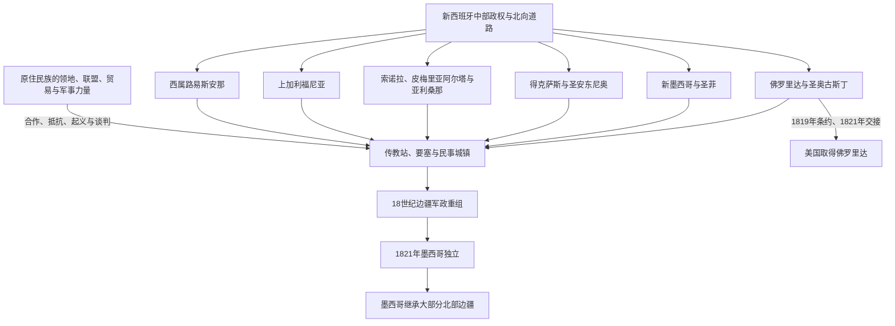

# 西班牙北部边疆

## 时间

16世纪—1821年；部分地区在此后继续保留西班牙殖民制度遗产。

## 范围

西班牙北部边疆是新西班牙北缘的多块接触地带，包括今墨西哥北部、美国西南部、得克萨斯、加利福尼亚和佛罗里达等区域，也与西班牙统治时期的路易斯安那相连。它不是一条固定国界，而是由道路、矿区、牧场、城镇、传教站、要塞和原住民族控制区交错构成。

西班牙王室在地图上拥有广泛主张，实际统治却常局限于少数据点。Pueblo、Apache、Comanche、O'odham、Californian 众民族及其他原住民族通过起义、袭击、联盟、贸易与迁徙持续改变边疆力量关系。

## 概括

新西班牙北部扩张把传教、军事防御、民事定居和资源开发结合起来。传教站试图使原住民改宗、集中居住并纳入殖民劳动与税赋秩序；要塞保护道路和聚落；城镇议会、牧场和矿区则推动永久定居。三者互相依赖，却经常补给不足、人员短缺，无法完全控制周边地区。

殖民社会由来自伊比利亚、美洲其他地区、非洲和本地原住民的人群共同构成。混合家庭、边疆士兵、劳工、牧民、翻译和商贩都很重要，但族群融合不能掩盖强制劳动、疾病、暴力传教、土地占用和法律等级。

## 演变图

## 统治结构

| 层级 / 机构 | 职能与边疆特点 |
|---|---|
| 西班牙国王与印度事务体系 | 授权殖民治理、法律和教会保护权，边疆政策须经过跨大西洋官僚体系。 |
| 新西班牙总督 | 位于墨西哥城，统筹财政、军事、任命和对外政策；遥远边疆的信息与命令传递缓慢。 |
| 内地省总司令部 | 1776年建立，试图把北部多个省份的防务和行政置于更集中指挥下。 |
| 省长与地方军官 | 管理新墨西哥、得克萨斯、加利福尼亚等辖区，负责防务、司法、贸易和与原住民族交涉。 |
| 要塞 | 驻扎边疆士兵及其家庭，保护道路、传教站和聚落，也是贸易、补给和外交节点。 |
| 传教站 | 由方济各会、耶稣会等经营，承担传教、农业和集中居住；常对原住民劳动、迁徙和仪式施加强制。 |
| 镇与城镇议会 | 民事居民、工匠、农牧民和地方精英的自治机构；圣菲、圣安东尼奥等兼具行政、贸易和军事功能。 |
| 牧场、矿区和道路 | 把北部边疆接入新西班牙经济，但也推动土地占用、劳役和生态改变。 |

## 主要区域

| 区域 | 关键节点 | 历史特点 |
|---|---|---|
| 佛罗里达 | 圣奥古斯丁，1565年建立 | 西班牙在今美国境内最早持续存在的欧洲城镇；防范法国、英国并连接加勒比航路。 |
| 新墨西哥 | 1598年殖民推进；圣菲约1610年成为中心 | Pueblo 聚落与西班牙传教、贡赋和劳役制度长期冲突，1680年爆发大规模起义。 |
| 得克萨斯 | 东得克萨斯传教尝试；1718年圣安东尼奥建立 | 法属路易斯安那压力促使西班牙以传教站、要塞和民事聚落巩固边疆。 |
| 索诺拉与皮梅里亚阿尔塔 | 传教站、矿区、牧场和图森等要塞 | 横跨今墨西哥北部与亚利桑那，O'odham、Apache 等民族的行动深刻影响殖民边界。 |
| 上加利福尼亚 | 1769年起传教和军事殖民；1776年旧金山据点 | 海上竞争促使西班牙沿海建立传教站、要塞和城镇，原住民族遭受集中居住、疾病和劳动控制。 |
| 西属路易斯安那 | 1762年获让，1769年正式接管；1800年秘密转还法国，1803年完成交接 | 以新奥尔良和密西西比河为核心，形成法语人口、西班牙行政、非洲奴隶与原住民网络并存的社会。 |

## 重要事件

| 时间 | 事件 | 意义 |
|---:|---|---|
| 1565年 | 圣奥古斯丁建立 | 西班牙在佛罗里达形成持久据点。 |
| 1598—1610年 | 新墨西哥殖民推进与圣菲建立 | 西班牙试图把 Pueblo 地区纳入传教、劳役和行政体系。 |
| 1680年 | 普韦布洛起义 | 多个 Pueblo 共同体驱逐西班牙统治约十二年，恢复部分宗教与政治自主。 |
| 1692年以后 | 西班牙重新进入新墨西哥 | 殖民统治恢复，但不得不调整部分贡赋和宗教做法；冲突并未消失。 |
| 1718年 | 圣安东尼奥的要塞、传教站和城镇体系建立 | 得克萨斯成为对抗法国影响和连接北部道路的核心。 |
| 1769年 | 上加利福尼亚殖民开始 | 西班牙沿太平洋海岸建立新的传教站—要塞链。 |
| 1772—1776年 | 要塞规章调整与内地省总司令部建立 | 王室试图强化从加利福尼亚到得克萨斯的边疆防务和指挥。 |
| 1819—1821年 | 《亚当斯—奥尼斯条约》与墨西哥独立 | 佛罗里达转交美国，新西班牙其余北部边疆成为墨西哥领土。 |

## 历史影响

- 西班牙道路、地名、城镇、灌溉、牧业、天主教和民法传统长期影响美国西南部与墨西哥北部。
- 马、牛、羊和新作物改变区域生态与经济；马匹扩散也帮助 Comanche 等原住民族建立新的贸易和军事力量。
- 传教站保存的建筑和档案不能只被写成文化遗产，也必须同时说明强制改宗、劳动控制、疾病和原住民族反抗。
- 1821年后，墨西哥接收了大部分边疆制度和居民；得克萨斯独立、美国兼并、美墨战争等后来事件又把许多西班牙—墨西哥社区置于美国国界内。

## 演变关系

- 所属总览：[殖民北美](/%E4%BA%BA%E6%96%87%E7%A7%91%E5%AD%A6/%E5%8E%86%E5%8F%B2/%E7%BE%8E%E6%B4%B2/%E5%8C%97%E7%BE%8E/%E6%AE%96%E6%B0%91%E5%8C%97%E7%BE%8E/README.md)。
- 殖民边疆所覆盖和无法完全控制的政治主体：[北美原住民](/%E4%BA%BA%E6%96%87%E7%A7%91%E5%AD%A6/%E5%8E%86%E5%8F%B2/%E7%BE%8E%E6%B4%B2/%E5%8C%97%E7%BE%8E/%E5%8C%97%E7%BE%8E%E5%8E%9F%E4%BD%8F%E6%B0%91/README.md)。
- 法国路易斯安那及法西边界竞争：[新法兰西](/%E4%BA%BA%E6%96%87%E7%A7%91%E5%AD%A6/%E5%8E%86%E5%8F%B2/%E7%BE%8E%E6%B4%B2/%E5%8C%97%E7%BE%8E/%E6%AE%96%E6%B0%91%E5%8C%97%E7%BE%8E/%E6%96%B0%E6%B3%95%E5%85%B0%E8%A5%BF.md)。
- 西班牙母国背景：[西班牙](/%E4%BA%BA%E6%96%87%E7%A7%91%E5%AD%A6/%E5%8E%86%E5%8F%B2/%E6%AC%A7%E6%B4%B2/%E4%BC%8A%E6%AF%94%E5%88%A9%E4%BA%9A%E5%8D%8A%E5%B2%9B/%E8%A5%BF%E7%8F%AD%E7%89%99/README.md)。
- 新西班牙与中部美洲主线：[中美洲](/%E4%BA%BA%E6%96%87%E7%A7%91%E5%AD%A6/%E5%8E%86%E5%8F%B2/%E7%BE%8E%E6%B4%B2/%E4%B8%AD%E7%BE%8E%E6%B4%B2/README.md)。
