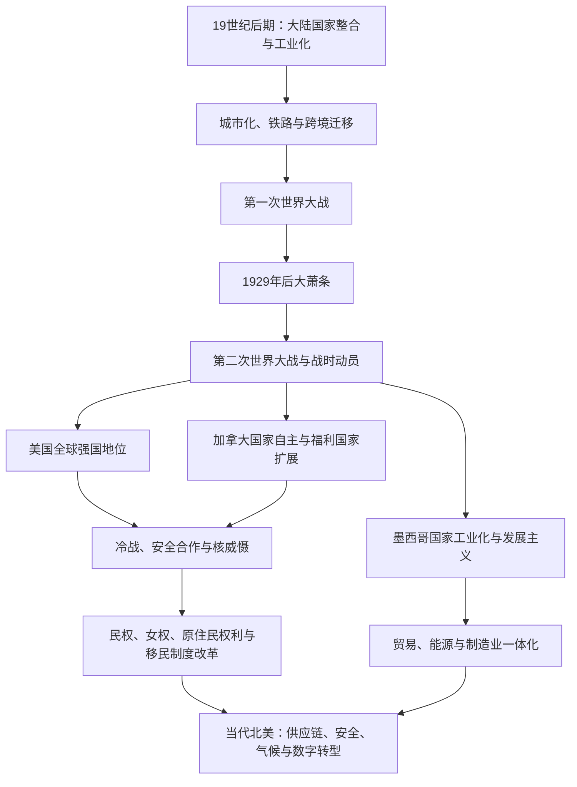

# 现代北美区域秩序

## 时间

约1867年至今，重点为1945年以后。

## 概括

现代北美区域秩序建立在三个相互牵连但不对称的国家主线之上：美国在工业化、两次世界大战和冷战中成为全球强国；加拿大逐步取得立法与宪法自主，同时维持议会制和加拿大王室；墨西哥经历革命、国家重建和经济转型。三国在贸易、能源、供应链、迁移、环境和安全上高度相互依赖，但在国力、制度、语言与社会结构上差异明显。

## 发展主线

## 国家与区域比较

| 维度 | 美国 | 加拿大 | 墨西哥及北部边境 | 区域联系 |
|---|---|---|---|---|
| 政体 | 联邦总统制共和国 | 联邦议会民主制与君主立宪制 | 联邦总统制共和国 | 三国均为联邦制，但行政与议会关系不同。 |
| 工业化 | 19世纪后期形成大规模国内市场和工业体系 | 资源、铁路、制造业与美国市场联系紧密 | 20世纪国家主导工业化，后发展出口制造业 | 汽车、能源、农业和电子产业形成跨境供应链。 |
| 战争与安全 | 两次世界大战后承担全球军事角色 | 参加两次世界大战，战后与美国深度防务合作 | 20世纪外交更强调主权与不干涉 | 1958年建立北美防空司令部，美加安全合作制度化。 |
| 社会权利 | 民权运动、移民改革、女权与原住民运动改变法律和政治 | 双语、多元文化、魁北克问题与原住民权利构成重要主线 | 革命遗产、劳工与农民组织、原住民权利及民主化并行 | 跨境人口流动和社会运动相互影响。 |
| 经济整合 | 最大消费与资本市场 | 能源、资源、制造业和服务业高度依赖跨境贸易 | 北部制造业和出口部门与美加供应链紧密连接 | 1989年美加自由贸易、1994年北美自由贸易协定、2020年后继协定分阶段深化制度联系。 |

## 重要阶段

### 工业化与大陆市场

- 美国南北战争后铁路、钢铁、石油、金融和大企业快速发展；加拿大以跨大陆铁路和关税政策推动东西向国家市场。
- 大规模移民推动城市增长，同时排华法、种族隔离和其他限制性制度塑造公民资格边界。
- 对土地、矿产、森林和农业区的开发继续压缩原住民生活空间，并以保留地、土地分配和同化教育强化国家控制。

### 世界大战与经济危机

- 加拿大自1914年起参战，美国于1917年加入第一次世界大战；两国的参战时间和国内政治反应并不相同。
- 1929年后大萧条造成失业、农业危机和政治重组。美国“新政”扩大联邦政府作用，加拿大也逐步建立更强的社会政策与财政协调机制。
- 第二次世界大战促进工业和军事动员。美国于1941年参战；加拿大自1939年起参战。战争也伴随日裔居民被强制迁移和拘禁等侵权政策。

### 冷战与社会转型

- 美国以遏制战略、军事联盟、核力量和海外战争领导西方阵营；加拿大参与北约、北美防空和联合国维和等机制。
- 朝鲜战争、古巴导弹危机和越南战争把北美安全与全球冷战连接起来。
- 美国民权运动推动废除法定种族隔离并保障投票权；加拿大的双语政策、多元文化政策和魁北克民族主义重塑国家认同。
- 原住民组织反对土地侵占、寄宿学校和单方面同化政策，推动条约权、土地权和自治进入宪法、法院与公共政治。

### 区域一体化与新矛盾

- 自由贸易和跨境投资形成高度整合的生产网络，但也引发产业转移、工资、劳工保障和区域不平等争论。
- 美墨边境既是贸易走廊，也是移民、庇护、执法和家庭网络交叠的空间。
- 能源、水资源、森林火灾、北极航道、气候变化和污染治理无法完全由单一国家处理。
- 2001年后安全政策显著影响边境管理；2008年金融危机与2020年开始的疫情则暴露供应链和社会保障的脆弱性。
- 数字平台、人工智能、关键矿产和半导体产业成为21世纪区域竞争与合作的新领域。

## 不能忽略的连续性

- 现代化没有终结原住民主权与土地问题；加拿大1982年宪法承认原住民和条约权，美国部落主权亦继续通过法律、条约与政治实践运行。
- 民权立法没有自动消除种族、财富、住房、教育和刑事司法差距。
- 经济一体化不等于政治统一。三国保持独立宪政、外交与移民制度，且国力并不对称。
- 北美不仅是大西洋空间，也通过阿拉斯加、加拿大西岸、美国西岸和墨西哥太平洋港口深度参与太平洋世界。

## 演变关系

- 前一节点：[北美大陆的边界重组](/%E4%BA%BA%E6%96%87%E7%A7%91%E5%AD%A6/%E5%8E%86%E5%8F%B2/%E7%BE%8E%E6%B4%B2/%E5%8C%97%E7%BE%8E/%E5%8C%97%E7%BE%8E%E5%A4%A7%E9%99%86%E7%9A%84%E8%BE%B9%E7%95%8C%E9%87%8D%E7%BB%84.md)。
- 美国主线：[美国历史](/%E4%BA%BA%E6%96%87%E7%A7%91%E5%AD%A6/%E5%8E%86%E5%8F%B2/%E7%BE%8E%E6%B4%B2/%E5%8C%97%E7%BE%8E/%E7%BE%8E%E5%9B%BD/README.md)。
- 加拿大主线：[加拿大历史](/%E4%BA%BA%E6%96%87%E7%A7%91%E5%AD%A6/%E5%8E%86%E5%8F%B2/%E7%BE%8E%E6%B4%B2/%E5%8C%97%E7%BE%8E/%E5%8A%A0%E6%8B%BF%E5%A4%A7/README.md)。
- 南部边境：[墨西哥北部边疆](/%E4%BA%BA%E6%96%87%E7%A7%91%E5%AD%A6/%E5%8E%86%E5%8F%B2/%E7%BE%8E%E6%B4%B2/%E5%8C%97%E7%BE%8E/%E5%A2%A8%E8%A5%BF%E5%93%A5%E5%8C%97%E9%83%A8%E8%BE%B9%E7%96%86.md)。
- 太平洋联系：[大洋洲历史](/%E4%BA%BA%E6%96%87%E7%A7%91%E5%AD%A6/%E5%8E%86%E5%8F%B2/%E5%A4%A7%E6%B4%8B%E6%B4%B2/README.md)。
- 所属总览：[北美历史](/%E4%BA%BA%E6%96%87%E7%A7%91%E5%AD%A6/%E5%8E%86%E5%8F%B2/%E7%BE%8E%E6%B4%B2/%E5%8C%97%E7%BE%8E/README.md)。
