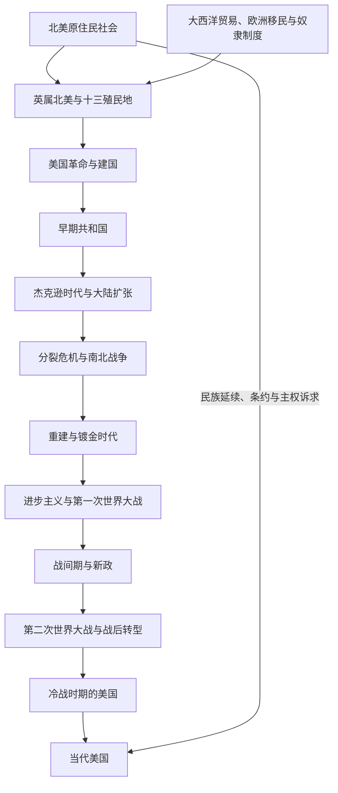

# 美国历史

## 历史主线

美国历史从英属北美十三殖民地的革命与独立开始，但其社会基础同时来自更早的原住民历史、欧洲殖民、大西洋奴隶贸易和多帝国竞争。1776年《独立宣言》宣布脱离英国，1783年独立获得国际承认，1789年联邦宪法体制开始运行。19世纪美国迅速扩展领土和市场，同时原住民被迫迁移、奴隶制扩张与自由州—蓄奴州矛盾加深，最终引发南北战争。战后联邦得以维持并废除奴隶制，但重建失败后种族隔离与剥夺政治权利长期存在。

19世纪末至20世纪初，美国成长为工业和海外强国；两次世界大战、大萧条与“新政”显著扩大联邦政府能力。1945年以后，美国成为冷战超级大国，国内经历民权运动、社会改革、保守主义复兴和经济结构转型。冷战结束后的美国继续居于全球体系核心，同时面对恐怖主义战争、金融危机、社会极化、人口与技术变化等挑战。

## 历史演进图

## 按时间排序的时期导航

| 顺序 | 名称 | 时间 | 简要概括 |
|---:|---|---|---|
| 1 | [英属北美与十三殖民地](/%E4%BA%BA%E6%96%87%E7%A7%91%E5%AD%A6/%E5%8E%86%E5%8F%B2/%E7%BE%8E%E6%B4%B2/%E5%8C%97%E7%BE%8E/%E6%AE%96%E6%B0%91%E5%8C%97%E7%BE%8E/%E8%8B%B1%E5%B1%9E%E5%8C%97%E7%BE%8E%E4%B8%8E%E5%8D%81%E4%B8%89%E6%AE%96%E6%B0%91%E5%9C%B0.md) | 1607-1775年 | 英国在北美建立多个殖民地，其中十三个殖民地形成后来美国的核心。 |
| 2 | [美国革命与建国](/%E4%BA%BA%E6%96%87%E7%A7%91%E5%AD%A6/%E5%8E%86%E5%8F%B2/%E7%BE%8E%E6%B4%B2/%E5%8C%97%E7%BE%8E/%E7%BE%8E%E5%9B%BD/%E7%BE%8E%E5%9B%BD%E9%9D%A9%E5%91%BD%E4%B8%8E%E5%BB%BA%E5%9B%BD.md) | 1775-1789年 | 独立战争、邦联体制、制宪会议和联邦政府建立。 |
| 3 | [早期共和国](/%E4%BA%BA%E6%96%87%E7%A7%91%E5%AD%A6/%E5%8E%86%E5%8F%B2/%E7%BE%8E%E6%B4%B2/%E5%8C%97%E7%BE%8E/%E7%BE%8E%E5%9B%BD/%E6%97%A9%E6%9C%9F%E5%85%B1%E5%92%8C%E5%9B%BD.md) | 1789-1829年 | 联邦制度实际运行，政党政治、市场扩展和领土增长开始成形。 |
| 4 | [杰克逊时代与大陆扩张](/%E4%BA%BA%E6%96%87%E7%A7%91%E5%AD%A6/%E5%8E%86%E5%8F%B2/%E7%BE%8E%E6%B4%B2/%E5%8C%97%E7%BE%8E/%E7%BE%8E%E5%9B%BD/%E6%9D%B0%E5%85%8B%E9%80%8A%E6%97%B6%E4%BB%A3%E4%B8%8E%E5%A4%A7%E9%99%86%E6%89%A9%E5%BC%A0.md) | 1829-1848年 | 白人男性选举政治扩展，同时发生原住民强制迁移、得克萨斯吞并与美墨战争。 |
| 5 | [分裂危机与南北战争](/%E4%BA%BA%E6%96%87%E7%A7%91%E5%AD%A6/%E5%8E%86%E5%8F%B2/%E7%BE%8E%E6%B4%B2/%E5%8C%97%E7%BE%8E/%E7%BE%8E%E5%9B%BD/%E5%88%86%E8%A3%82%E5%8D%B1%E6%9C%BA%E4%B8%8E%E5%8D%97%E5%8C%97%E6%88%98%E4%BA%89.md) | 1848-1865年 | 奴隶制向西部扩张的问题击穿妥协，南部脱离联邦并在内战中失败。 |
| 6 | [重建与镀金时代](/%E4%BA%BA%E6%96%87%E7%A7%91%E5%AD%A6/%E5%8E%86%E5%8F%B2/%E7%BE%8E%E6%B4%B2/%E5%8C%97%E7%BE%8E/%E7%BE%8E%E5%9B%BD/%E9%87%8D%E5%BB%BA%E4%B8%8E%E9%95%80%E9%87%91%E6%97%B6%E4%BB%A3.md) | 1865-1901年 | 重建修正案扩大公民权，随后种族隔离、工业化、移民和企业资本迅速发展。 |
| 7 | [进步主义与第一次世界大战](/%E4%BA%BA%E6%96%87%E7%A7%91%E5%AD%A6/%E5%8E%86%E5%8F%B2/%E7%BE%8E%E6%B4%B2/%E5%8C%97%E7%BE%8E/%E7%BE%8E%E5%9B%BD/%E8%BF%9B%E6%AD%A5%E4%B8%BB%E4%B9%89%E4%B8%8E%E7%AC%AC%E4%B8%80%E6%AC%A1%E4%B8%96%E7%95%8C%E5%A4%A7%E6%88%98.md) | 1901-1920年 | 改革运动、海外扩张、一战动员和妇女选举权改变国家与社会。 |
| 8 | [战间期与新政](/%E4%BA%BA%E6%96%87%E7%A7%91%E5%AD%A6/%E5%8E%86%E5%8F%B2/%E7%BE%8E%E6%B4%B2/%E5%8C%97%E7%BE%8E/%E7%BE%8E%E5%9B%BD/%E6%88%98%E9%97%B4%E6%9C%9F%E4%B8%8E%E6%96%B0%E6%94%BF.md) | 1920-1941年 | 消费繁荣、排外与文化变迁之后，大萧条催生“新政”国家。 |
| 9 | [第二次世界大战与战后转型](/%E4%BA%BA%E6%96%87%E7%A7%91%E5%AD%A6/%E5%8E%86%E5%8F%B2/%E7%BE%8E%E6%B4%B2/%E5%8C%97%E7%BE%8E/%E7%BE%8E%E5%9B%BD/%E7%AC%AC%E4%BA%8C%E6%AC%A1%E4%B8%96%E7%95%8C%E5%A4%A7%E6%88%98%E4%B8%8E%E6%88%98%E5%90%8E%E8%BD%AC%E5%9E%8B.md) | 1941-1947年 | 战时动员、轴心国战败、核武器出现和战后国际制度奠定美国全球领导地位。 |
| 10 | [冷战时期的美国](/%E4%BA%BA%E6%96%87%E7%A7%91%E5%AD%A6/%E5%8E%86%E5%8F%B2/%E7%BE%8E%E6%B4%B2/%E5%8C%97%E7%BE%8E/%E7%BE%8E%E5%9B%BD/%E5%86%B7%E6%88%98%E6%97%B6%E6%9C%9F%E7%9A%84%E7%BE%8E%E5%9B%BD.md) | 1947-1991年 | 遏制战略、朝鲜与越南战争、民权运动、社会改革和保守主义转向并行。 |
| 11 | [当代美国](/%E4%BA%BA%E6%96%87%E7%A7%91%E5%AD%A6/%E5%8E%86%E5%8F%B2/%E7%BE%8E%E6%B4%B2/%E5%8C%97%E7%BE%8E/%E7%BE%8E%E5%9B%BD/%E5%BD%93%E4%BB%A3%E7%BE%8E%E5%9B%BD.md) | 1991年至今 | 冷战后全球化、数字经济、反恐战争、金融危机、疫情与政治极化。 |

## 宪政与统治结构

美国实行联邦总统制共和国。总统兼任国家元首和政府首脑，不另设总理；国会由众议院和参议院组成，联邦最高法院与下级法院行使司法权。联邦政府与各州各有宪法权限，联邦制的边界长期通过选举、立法、战争、修宪和法院判决调整。

| 机构 / 层级 | 角色 | 关键特点 |
|---|---|---|
| 总统 | 国家元首、政府首脑、武装力量总司令 | 由选举人团选出；任期四年，1951年后原则上最多当选两次。 |
| 国会 | 联邦立法机关 | 众议院按人口分配席位，参议院每州两席。 |
| 联邦法院 | 宪法与联邦法律解释 | 最高法院通过司法审查深刻影响联邦权力和公民权利。 |
| 州政府 | 州级立法、行政与司法 | 选举、教育、警务等大量事务由州管理，但受联邦宪法约束。 |
| 原住民族政府 | 具有受承认的有限主权 | 权力来源涉及固有主权、条约、国会立法和法院判例，与联邦及州关系复杂。 |

完整次序见[美国历任总统表](/%E4%BA%BA%E6%96%87%E7%A7%91%E5%AD%A6/%E5%8E%86%E5%8F%B2/%E7%BE%8E%E6%B4%B2/%E5%8C%97%E7%BE%8E/%E7%BE%8E%E5%9B%BD/%E7%BE%8E%E5%9B%BD%E5%8E%86%E4%BB%BB%E6%80%BB%E7%BB%9F%E8%A1%A8.md)。

## 重要转折与时间节点

| 时间 | 事件 | 意义 |
|---|---|---|
| 1776年 | 《独立宣言》 | 十三殖民地宣布脱离英国。 |
| 1783年 | 《巴黎条约》 | 英国承认美国独立。 |
| 1787-1789年 | 制宪、批准与联邦政府运行 | 建立延续至今的联邦宪政框架。 |
| 1803年 | 路易斯安那购地 | 美国领土权利主张大幅向西扩展。 |
| 1830年 | 《印第安人迁移法》 | 联邦支持将东南部原住民族强制迁往密西西比河以西。 |
| 1846-1848年 | 美墨战争 | 美国取得西部和西南部大片领土，奴隶制扩张争论加剧。 |
| 1861-1865年 | 南北战争 | 联邦获胜，南部邦联瓦解，奴隶制废除。 |
| 1865-1870年 | 第十三、十四、十五修正案 | 废除奴隶制，确立出生公民权和法律平等，并禁止以种族为由剥夺投票权。 |
| 1898年 | 美西战争 | 美国取得海外领地并加强加勒比与太平洋影响。 |
| 1929年、1933年 | 股市崩盘与“新政”开始 | 大萧条推动联邦监管、救济和社会保障扩展。 |
| 1941-1945年 | 第二次世界大战 | 战时动员和盟军胜利使美国成为全球超级大国。 |
| 1954-1965年 | 现代民权运动关键立法期 | 法定种族隔离受到打击，民权法和投票权法通过。 |
| 1991年 | 冷战结束 | 美国进入缺少同等级全球对手的短暂“单极时刻”。 |
| 2001年 | 九一一袭击 | 引发反恐战争、国土安全体制和长期海外战争。 |
| 2008年 | 全球金融危机 | 暴露金融体系风险并加剧经济与政治争论。 |
| 2020年 | 新冠疫情与全国性抗议 | 公共卫生、种族正义、经济治理和政治信任问题集中爆发。 |

## 贯穿全史的主题

- 原住民并非只属于殖民前史。条约、部落主权、土地与资源权持续进入美国法律和政治。
- 奴隶制不仅是南北战争前的社会制度，也塑造宪法妥协、经济发展、领土扩张和战后种族秩序。
- “民主扩大”具有不均衡性：白人男性选举权在19世纪前期扩大，但原住民、黑人、女性、亚裔和其他群体长期面对排斥。
- 联邦与州的权力边界贯穿建国、内战、重建、“新政”、民权、福利、监管和当代党争。
- 美国由大陆国家成长为全球强国的过程，与美洲、欧洲、非洲和太平洋世界相互联系。

## 相关入口

- 上级目录：[北美历史](/%E4%BA%BA%E6%96%87%E7%A7%91%E5%AD%A6/%E5%8E%86%E5%8F%B2/%E7%BE%8E%E6%B4%B2/%E5%8C%97%E7%BE%8E/README.md)。
- 殖民背景：[殖民北美](/%E4%BA%BA%E6%96%87%E7%A7%91%E5%AD%A6/%E5%8E%86%E5%8F%B2/%E7%BE%8E%E6%B4%B2/%E5%8C%97%E7%BE%8E/%E6%AE%96%E6%B0%91%E5%8C%97%E7%BE%8E/README.md)。
- 原住民主线：[北美原住民](/%E4%BA%BA%E6%96%87%E7%A7%91%E5%AD%A6/%E5%8E%86%E5%8F%B2/%E7%BE%8E%E6%B4%B2/%E5%8C%97%E7%BE%8E/%E5%8C%97%E7%BE%8E%E5%8E%9F%E4%BD%8F%E6%B0%91/README.md)。
- 大陆扩张背景：[北美大陆的边界重组](/%E4%BA%BA%E6%96%87%E7%A7%91%E5%AD%A6/%E5%8E%86%E5%8F%B2/%E7%BE%8E%E6%B4%B2/%E5%8C%97%E7%BE%8E/%E5%8C%97%E7%BE%8E%E5%A4%A7%E9%99%86%E7%9A%84%E8%BE%B9%E7%95%8C%E9%87%8D%E7%BB%84.md)。
- 美墨关系：[墨西哥北部边疆](/%E4%BA%BA%E6%96%87%E7%A7%91%E5%AD%A6/%E5%8E%86%E5%8F%B2/%E7%BE%8E%E6%B4%B2/%E5%8C%97%E7%BE%8E/%E5%A2%A8%E8%A5%BF%E5%93%A5%E5%8C%97%E9%83%A8%E8%BE%B9%E7%96%86.md)。
- 现代跨国背景：[现代北美区域秩序](/%E4%BA%BA%E6%96%87%E7%A7%91%E5%AD%A6/%E5%8E%86%E5%8F%B2/%E7%BE%8E%E6%B4%B2/%E5%8C%97%E7%BE%8E/%E7%8E%B0%E4%BB%A3%E5%8C%97%E7%BE%8E%E5%8C%BA%E5%9F%9F%E7%A7%A9%E5%BA%8F.md)。
