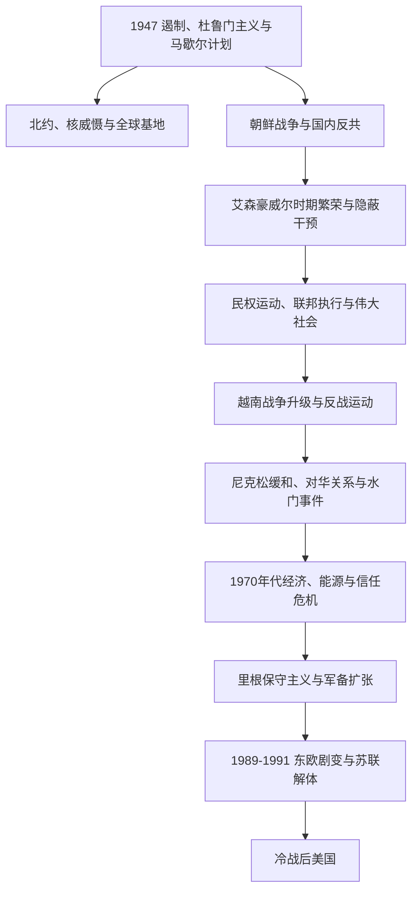

# 冷战时期的美国

## 时间

1947-1991年。

## 概括

冷战时期，美国以遏制共产主义为核心组织军事联盟、海外基地、经济援助、情报与核战略，并同苏联展开全球竞争。朝鲜战争和越南战争显示冷战会转化为高成本的地区战争。国内战后繁荣、郊区化和教育扩张与种族隔离、贫困和性别不平等并存；民权、女权、原住民自决、反战、环保和同性恋解放等运动推动法律与社会转型。1970年代危机后，里根时代形成保守主义政策转向；1989-1991年东欧剧变和苏联解体标志冷战结束。

## 演进图

## 国家元首与政府首脑

| 总统 | 任期 | 党派 | 关键事件 |
|---|---|---|---|
| 哈里·S.·杜鲁门 | 1945-1953年 | 民主党 | 遏制战略、北约、朝鲜战争、军队取消种族隔离。 |
| 德怀特·D.·艾森豪威尔 | 1953-1961年 | 共和党 | 核威慑、隐蔽干预、州际公路与早期民权执行。 |
| 约翰·F.·肯尼迪 | 1961-1963年 | 民主党 | 古巴导弹危机、太空竞赛，遇刺身亡。 |
| 林登·B.·约翰逊 | 1963-1969年 | 民主党 | 民权法、“伟大社会”、越南战争升级。 |
| 理查德·尼克松 | 1969-1974年 | 共和党 | 对华关系、缓和、越战撤军与水门事件。 |
| 杰拉尔德·福特 | 1974-1977年 | 共和党 | 水门事件后恢复政府运作，面对滞胀与越战终结。 |
| 吉米·卡特 | 1977-1981年 | 民主党 | 人权外交、戴维营协议、能源危机与伊朗人质危机。 |
| 罗纳德·里根 | 1981-1989年 | 共和党 | 保守主义经济政策、军备扩张与冷战后期谈判。 |
| 乔治·H. W.·布什 | 1989-1993年 | 共和党 | 东欧剧变、德国统一、海湾战争和苏联解体。 |

详见[美国历任总统表](/%E4%BA%BA%E6%96%87%E7%A7%91%E5%AD%A6/%E5%8E%86%E5%8F%B2/%E7%BE%8E%E6%B4%B2/%E5%8C%97%E7%BE%8E/%E7%BE%8E%E5%9B%BD/%E7%BE%8E%E5%9B%BD%E5%8E%86%E4%BB%BB%E6%80%BB%E7%BB%9F%E8%A1%A8.md)。

## 冷战阶段

| 阶段 | 时间 | 特征 |
|---|---|---|
| 遏制与早期冷战 | 1947-1953年 | 马歇尔计划、北约、柏林危机、核竞赛和朝鲜战争。 |
| 高度对峙与战后繁荣 | 1953-1963年 | 核威慑、太空竞赛、隐蔽行动、古巴导弹危机和郊区扩张。 |
| 民权改革与越南战争 | 1963-1975年 | 民权立法、“伟大社会”、战争升级、反战运动和最终撤军。 |
| 缓和、危机与政治失信 | 1969-1980年 | 对华关系正常化进程、军控、水门、能源危机和滞胀。 |
| 保守主义转向与冷战终结 | 1981-1991年 | 减税与去监管、军备扩张、美苏谈判及苏联解体。 |

## 对外政策与战争

- 1949年美国参与建立北约，把欧洲安全承诺制度化；同年苏联核试验成功和中华人民共和国成立加剧对抗。
- 1950-1953年朝鲜战争在联合国框架下进行，停战而非和平条约结束战斗。
- 美国政府以反共名义支持或参与多地政权更迭和威权盟友，造成长期地区影响。
- 1962年古巴导弹危机把核对抗推向危险高峰，随后美苏发展热线和有限军控。
- 美国在越南逐步扩大军事介入，1964年东京湾决议后升级；1973年撤出主要作战部队，1975年南越政权崩溃。
- 尼克松访华和美苏缓和调整三角关系，但冷战竞争未结束。
- 1980年代里根政府支持反共力量、扩大军费，同时同戈尔巴乔夫达成中程核力量条约。
- 1991年苏联解体，作为美苏全球体系竞争的冷战结束。

## 国内社会与权利

- 1948年杜鲁门命令军队取消种族隔离；1954年“布朗诉教育委员会案”判定公立学校法定种族隔离违宪。
- 1964年《民权法》和1965年《投票权法》打击法定种族隔离和投票压制；住房、财富和刑事司法不平等仍持续。
- “伟大社会”建立医疗照顾和医疗补助项目，扩大反贫困、教育与城市政策。
- 1965年移民与国籍法废除国籍配额体系，长期改变美国人口来源结构。
- 原住民组织以占领、法律诉讼和政治动员反对联邦“终止”政策；1975年《印第安人自决与教育援助法》支持部落更直接管理项目。
- 现代女权运动推动就业、教育与生育权争论；同性恋解放运动在1969年石墙事件后扩大。
- 环境运动推动清洁空气、清洁水和环境保护机构等制度，但污染风险仍不平等分布。
- 1970年代能源危机、去工业化和滞胀削弱新政政治联盟；1980年代减税、去监管和反工会政策扩大市场化转向。
- 水门事件调查迫使尼克松辞职，成为行政权监督和政治信任危机的重要节点。

## 演变关系

- 前一节点：[第二次世界大战与战后转型](/%E4%BA%BA%E6%96%87%E7%A7%91%E5%AD%A6/%E5%8E%86%E5%8F%B2/%E7%BE%8E%E6%B4%B2/%E5%8C%97%E7%BE%8E/%E7%BE%8E%E5%9B%BD/%E7%AC%AC%E4%BA%8C%E6%AC%A1%E4%B8%96%E7%95%8C%E5%A4%A7%E6%88%98%E4%B8%8E%E6%88%98%E5%90%8E%E8%BD%AC%E5%9E%8B.md)。
- 后一节点：[当代美国](/%E4%BA%BA%E6%96%87%E7%A7%91%E5%AD%A6/%E5%8E%86%E5%8F%B2/%E7%BE%8E%E6%B4%B2/%E5%8C%97%E7%BE%8E/%E7%BE%8E%E5%9B%BD/%E5%BD%93%E4%BB%A3%E7%BE%8E%E5%9B%BD.md)。
- 区域背景：[现代北美区域秩序](/%E4%BA%BA%E6%96%87%E7%A7%91%E5%AD%A6/%E5%8E%86%E5%8F%B2/%E7%BE%8E%E6%B4%B2/%E5%8C%97%E7%BE%8E/%E7%8E%B0%E4%BB%A3%E5%8C%97%E7%BE%8E%E5%8C%BA%E5%9F%9F%E7%A7%A9%E5%BA%8F.md)。
- 所属总览：[美国历史](/%E4%BA%BA%E6%96%87%E7%A7%91%E5%AD%A6/%E5%8E%86%E5%8F%B2/%E7%BE%8E%E6%B4%B2/%E5%8C%97%E7%BE%8E/%E7%BE%8E%E5%9B%BD/README.md)。
