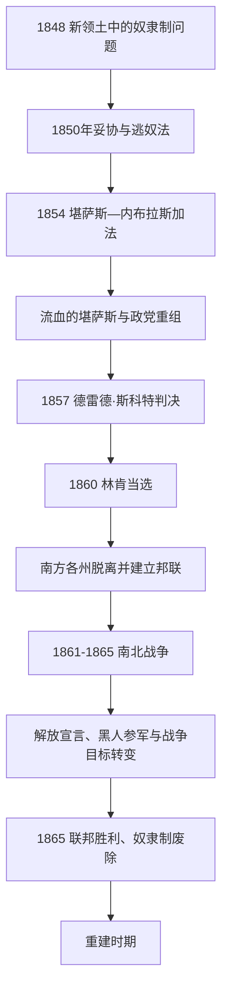

# 分裂危机与南北战争

## 时间

1848-1865年；其中南北战争为1861-1865年。

## 概括

美墨战争取得的新领土把一个长期矛盾推到中央：奴隶制能否向西部扩张。1850年代的政治妥协、法院判决和地方暴力均未解决问题。林肯于1860年当选后，南部十一个蓄奴州脱离联邦并组成美利坚联盟国。联邦在四年内战后获胜，分离政权瓦解；《解放宣言》把战争与解放更紧密相连，第十三修正案最终于1865年在全国废除奴隶制。

## 演进图

## 国家元首与政府首脑

### 美国联邦

| 总统 | 任期 | 党派 | 关键事件 |
|---|---|---|---|
| 扎卡里·泰勒 | 1849-1850年 | 辉格党 | 反对把部分奴隶制争议留给国会长期妥协，任内病逝。 |
| 米勒德·菲尔莫尔 | 1850-1853年 | 辉格党 | 签署1850年妥协案。 |
| 富兰克林·皮尔斯 | 1853-1857年 | 民主党 | 《堪萨斯-内布拉斯加法》。 |
| 詹姆斯·布坎南 | 1857-1861年 | 民主党 | 分裂危机扩大，未能阻止州脱离。 |
| **亚伯拉罕·林肯** | 1861-1865年 | 共和党 / 国家联盟党 | 领导联邦战争、发布《解放宣言》，胜利后遇刺。 |
| 安德鲁·约翰逊 | 1865年起 | 国家联盟党 / 民主党 | 林肯遇刺后继任，开始总统重建。 |

### 美利坚联盟国

| 人物 / 机构 | 时间 | 身份 | 说明 |
|---|---|---|---|
| 杰斐逊·戴维斯 | 1861-1865年 | 联盟国总统 | 领导南部十一州组成的分离政权。 |
| 联盟国国会 | 1861-1865年 | 分离政权立法机关 | 宪法明确保护奴隶制；该政权未获国际普遍承认，也不是美国的合法继承国家。 |

完整美国总统次序见[美国历任总统表](/%E4%BA%BA%E6%96%87%E7%A7%91%E5%AD%A6/%E5%8E%86%E5%8F%B2/%E7%BE%8E%E6%B4%B2/%E5%8C%97%E7%BE%8E/%E7%BE%8E%E5%9B%BD/%E7%BE%8E%E5%9B%BD%E5%8E%86%E4%BB%BB%E6%80%BB%E7%BB%9F%E8%A1%A8.md)。

## 危机升级

- 1850年妥协案让加利福尼亚以自由州加入，同时强化《逃奴法》，把奴隶制冲突带入北方社区。
- 1854年《堪萨斯-内布拉斯加法》以“人民主权”决定奴隶制，推翻密苏里妥协线并引发“流血的堪萨斯”。
- 共和党在反对奴隶制向领地扩张的基础上迅速兴起，但其成员对种族平等的态度并不一致。
- 1857年“德雷德·斯科特诉桑福德案”否认非裔美国人的联邦公民资格，并限制国会禁止领地奴隶制的权力。
- 1859年约翰·布朗袭击哈珀斯费里，试图发动奴隶起义，使南北恐惧进一步升级。
- 1860年林肯当选后，南卡罗来纳率先脱离联邦，随后六州在其就职前跟进，战争爆发后又有四州加入联盟国。

## 战争进程与解放

- 1861年4月萨姆特堡遭炮击，内战正式爆发。肯塔基、密苏里、马里兰、特拉华等蓄奴边境州留在联邦。
- 被奴役者通过逃向联邦军控制区、自我解放、提供情报和参军改变战争性质。近20万非裔士兵和水兵为联邦服役。
- 1863年1月《解放宣言》宣布叛乱地区被奴役者自由，不适用于仍在联邦内的蓄奴州，也不能单独等同于全国废奴。
- 1863年葛底斯堡战役和维克斯堡战役构成重要军事转折；联邦逐步控制密西西比河并削弱联盟国主力。
- 战争实施征兵、所得税、国家银行体系、宅地法和铁路法，显著强化联邦国家能力。
- 1865年4月李将军在阿波马托克斯投降，主要战事结束；林肯数日后遇刺。
- 1865年12月第十三修正案批准，在美国废除奴隶制，但保留“犯罪惩罚”例外条款。

## 战争结果

- 联邦得以维持，州不得单方面脱离的政治结论由战争确立。
- 约四百万被奴役者获得法律自由，但土地、劳动、教育、公民权与人身安全仍需在重建中争取。
- 南方经济和基础设施严重破坏，联邦必须决定如何恢复州、处理前联盟国领导者并保障自由民权利。
- 战争扩大联邦财政、军事和行政能力，为战后工业国家发展奠定制度条件。

## 演变关系

- 前一节点：[杰克逊时代与大陆扩张](/%E4%BA%BA%E6%96%87%E7%A7%91%E5%AD%A6/%E5%8E%86%E5%8F%B2/%E7%BE%8E%E6%B4%B2/%E5%8C%97%E7%BE%8E/%E7%BE%8E%E5%9B%BD/%E6%9D%B0%E5%85%8B%E9%80%8A%E6%97%B6%E4%BB%A3%E4%B8%8E%E5%A4%A7%E9%99%86%E6%89%A9%E5%BC%A0.md)。
- 后一节点：[重建与镀金时代](/%E4%BA%BA%E6%96%87%E7%A7%91%E5%AD%A6/%E5%8E%86%E5%8F%B2/%E7%BE%8E%E6%B4%B2/%E5%8C%97%E7%BE%8E/%E7%BE%8E%E5%9B%BD/%E9%87%8D%E5%BB%BA%E4%B8%8E%E9%95%80%E9%87%91%E6%97%B6%E4%BB%A3.md)。
- 奴隶贸易背景：[非洲历史](/%E4%BA%BA%E6%96%87%E7%A7%91%E5%AD%A6/%E5%8E%86%E5%8F%B2/%E9%9D%9E%E6%B4%B2/README.md)。
- 所属总览：[美国历史](/%E4%BA%BA%E6%96%87%E7%A7%91%E5%AD%A6/%E5%8E%86%E5%8F%B2/%E7%BE%8E%E6%B4%B2/%E5%8C%97%E7%BE%8E/%E7%BE%8E%E5%9B%BD/README.md)。
