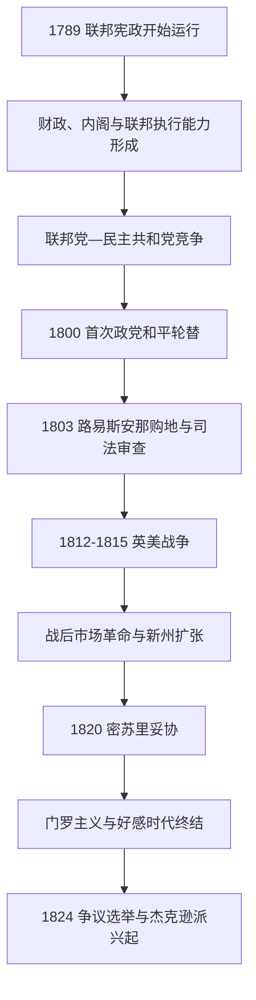

# 早期共和国

## 时间

1789-1829年。

## 概括

早期共和国是联邦宪法从文本转为实际制度的阶段。财政、外交、政党和司法制度逐步成形，美国也通过购地、战争和条约扩展领土权利主张。政治参与在部分州向更多白人男性开放，但奴隶制继续扩展，原住民领地受到军事、条约和定居压力，女性与多数非白人仍被排除在正式政治之外。

## 演进图

## 国家元首与政府首脑

总统兼任国家元首和政府首脑。

| 总统 | 任期 | 党派 | 关键事件 |
|---|---|---|---|
| **乔治·华盛顿** | 1789-1797年 | 无党派 | 建立行政部门先例、联邦财政体系和中立外交。 |
| 约翰·亚当斯 | 1797-1801年 | 联邦党 | 美法“准战争”、《客籍法和惩治叛乱法》。 |
| **托马斯·杰斐逊** | 1801-1809年 | 民主共和党 | 政党和平轮替、路易斯安那购地。 |
| 詹姆斯·麦迪逊 | 1809-1817年 | 民主共和党 | 1812年战争。 |
| 詹姆斯·门罗 | 1817-1825年 | 民主共和党 | 密苏里妥协、门罗主义。 |
| 约翰·昆西·亚当斯 | 1825-1829年 | 民主共和党 / 国家共和党 | 国家发展计划与杰克逊派兴起。 |

详见[美国历任总统表](/%E4%BA%BA%E6%96%87%E7%A7%91%E5%AD%A6/%E5%8E%86%E5%8F%B2/%E7%BE%8E%E6%B4%B2/%E5%8C%97%E7%BE%8E/%E7%BE%8E%E5%9B%BD/%E7%BE%8E%E5%9B%BD%E5%8E%86%E4%BB%BB%E6%80%BB%E7%BB%9F%E8%A1%A8.md)。

## 制度形成

| 领域 | 形成过程 | 长期影响 |
|---|---|---|
| 财政 | 汉密尔顿推动联邦承担州债、建立国家银行与关税财政 | 强化联邦信用，也引发对中央权力和商业利益的争论。 |
| 政党 | 联邦党与民主共和党围绕财政、法国革命和联邦权力形成竞争 | 华盛顿反对党争，但有组织政党很快成为选举政治核心。 |
| 司法 | 1803年“马伯里诉麦迪逊案”确立司法审查先例 | 最高法院成为解释宪法的重要机构。 |
| 权利 | 1791年权利法案保障言论、宗教、程序等自由 | 最初主要约束联邦政府，后来经第十四修正案逐步适用于州。 |
| 领地 | 西北条例、购地和新州加入形成扩张机制 | 州的平等加入与原住民土地被侵占同时发生。 |

## 重要事件

- 1791年权利法案批准；1794年联邦政府镇压威士忌暴动，显示新政府具备执行税法的能力。
- 华盛顿政府宣布在欧洲战争中保持中立，1794年《杰伊条约》暂时缓和英美争端。
- 1798年《客籍法和惩治叛乱法》引发对言论自由、移民和州权的激烈争论。
- 1800年选举实现联邦党向民主共和党的和平权力交接。
- 1803年路易斯安那购地使美国对西部的领土权利主张大幅增长，但并未自动消灭当地原住民族的土地和主权。
- 美国在西北地区和南部持续通过战争与条约迫使原住民族让地。
- 1812-1815年英美战争大体以恢复战前边界结束，未使美国征服加拿大；战争削弱部分跨境原住民联盟。
- 战后市场革命加速：运河、公路、蒸汽船、棉花种植和国内贸易把各区域连接起来，同时推动奴隶制向深南部扩张。
- 1820年密苏里妥协暂时平衡自由州与蓄奴州数量，却显示奴隶制扩张已成为国家级危机。
- 1823年门罗主义反对欧洲在美洲建立新殖民干预，后来成为美国西半球政策的重要依据。
- 1824年总统选举由众议院决定，杰克逊支持者指责“腐败交易”，推动新的大众政党动员。

## 演变关系

- 前一节点：[美国革命与建国](/%E4%BA%BA%E6%96%87%E7%A7%91%E5%AD%A6/%E5%8E%86%E5%8F%B2/%E7%BE%8E%E6%B4%B2/%E5%8C%97%E7%BE%8E/%E7%BE%8E%E5%9B%BD/%E7%BE%8E%E5%9B%BD%E9%9D%A9%E5%91%BD%E4%B8%8E%E5%BB%BA%E5%9B%BD.md)。
- 后一节点：[杰克逊时代与大陆扩张](/%E4%BA%BA%E6%96%87%E7%A7%91%E5%AD%A6/%E5%8E%86%E5%8F%B2/%E7%BE%8E%E6%B4%B2/%E5%8C%97%E7%BE%8E/%E7%BE%8E%E5%9B%BD/%E6%9D%B0%E5%85%8B%E9%80%8A%E6%97%B6%E4%BB%A3%E4%B8%8E%E5%A4%A7%E9%99%86%E6%89%A9%E5%BC%A0.md)。
- 区域背景：[北美大陆的边界重组](/%E4%BA%BA%E6%96%87%E7%A7%91%E5%AD%A6/%E5%8E%86%E5%8F%B2/%E7%BE%8E%E6%B4%B2/%E5%8C%97%E7%BE%8E/%E5%8C%97%E7%BE%8E%E5%A4%A7%E9%99%86%E7%9A%84%E8%BE%B9%E7%95%8C%E9%87%8D%E7%BB%84.md)。
- 所属总览：[美国历史](/%E4%BA%BA%E6%96%87%E7%A7%91%E5%AD%A6/%E5%8E%86%E5%8F%B2/%E7%BE%8E%E6%B4%B2/%E5%8C%97%E7%BE%8E/%E7%BE%8E%E5%9B%BD/README.md)。
