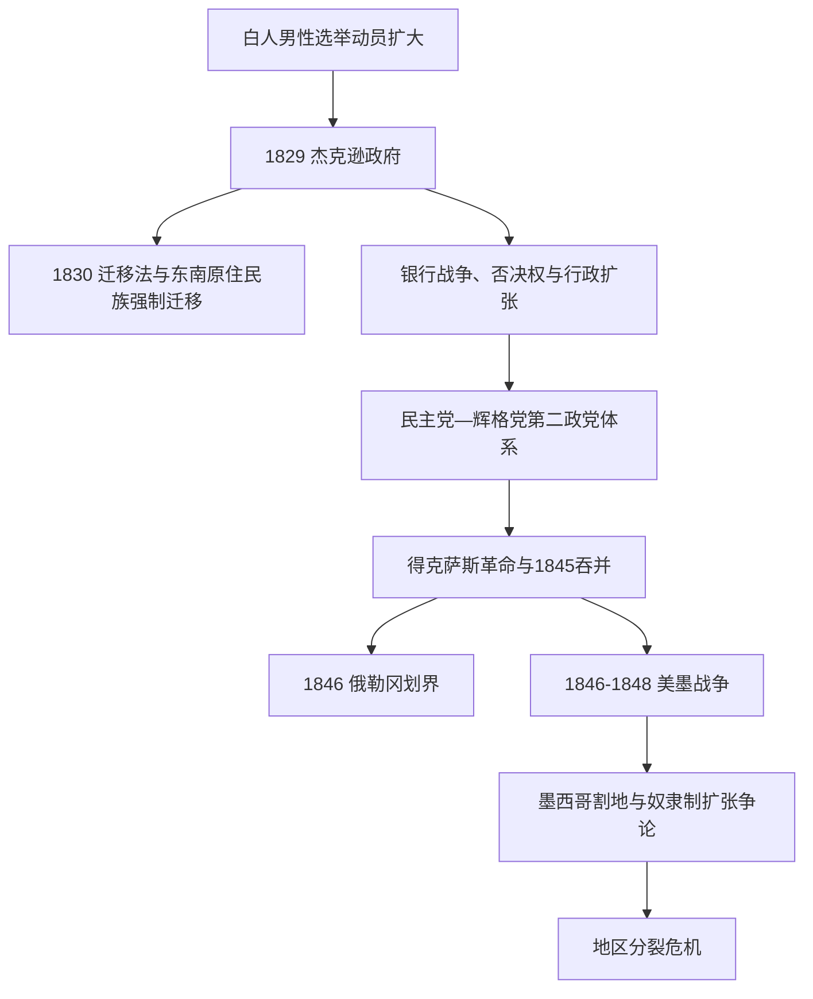

# 杰克逊时代与大陆扩张

## 时间

1829-1848年。

## 概括

这一时期常被称为“杰克逊民主”时代：政党组织和竞选动员发展，多数州取消对白人男性的财产资格限制。然而这种民主扩张与原住民强制迁移、黑人被排斥、奴隶制扩展和女性无选举权同时存在。得克萨斯吞并、俄勒冈划界与美墨战争使美国疆域迅速扩张，也把奴隶制是否进入新领地的问题推向国家分裂危机。

## 演进图

## 国家元首与政府首脑

| 总统 | 任期 | 党派 | 关键事件 |
|---|---|---|---|
| **安德鲁·杰克逊** | 1829-1837年 | 民主党 | 《印第安人迁移法》、废止危机、银行战争。 |
| 马丁·范布伦 | 1837-1841年 | 民主党 | 1837年恐慌与经济萧条。 |
| 威廉·亨利·哈里森 | 1841年 | 辉格党 | 就职一个月后去世。 |
| 约翰·泰勒 | 1841-1845年 | 辉格党当选，后无党派 | 总统继任先例、得克萨斯吞并进程。 |
| **詹姆斯·K.·波尔克** | 1845-1849年 | 民主党 | 俄勒冈条约、美墨战争与西部扩张。 |

详见[美国历任总统表](/%E4%BA%BA%E6%96%87%E7%A7%91%E5%AD%A6/%E5%8E%86%E5%8F%B2/%E7%BE%8E%E6%B4%B2/%E5%8C%97%E7%BE%8E/%E7%BE%8E%E5%9B%BD/%E7%BE%8E%E5%9B%BD%E5%8E%86%E4%BB%BB%E6%80%BB%E7%BB%9F%E8%A1%A8.md)。

## 政治与社会变化

- 民主党和辉格党形成第二政党体系，以全国性报刊、党代会、群众集会和地方组织动员选民。
- 白人男性选举权扩大，但政治制度继续把大多数黑人、原住民和所有女性排除在全国选举之外。
- 1832-1833年南卡罗来纳“废止危机”检验联邦关税与州否认联邦法的冲突。
- 杰克逊否决第二银行续期并撤出联邦存款，“银行战争”强化总统权力，也增加金融不稳定。
- 废奴主义、黑人报刊、女性改革组织和1830年代宗教复兴扩大社会动员。

## 重要事件

- 1830年《印第安人迁移法》授权以密西西比河以西土地交换东部原住民领地。实际执行常伴随胁迫、违约与军事驱逐。
- 1838-1839年切罗基人“眼泪之路”造成大量死亡；乔克托、克里克、奇卡索和塞米诺尔等民族也遭迁移或战争。
- 墨西哥于1829年废除奴隶制，得克萨斯的英美移民社会仍试图维持奴隶劳动，这是得克萨斯冲突的重要背景之一。
- 1836年得克萨斯宣布脱离墨西哥并建立共和国；墨西哥始终未承认其独立。
- 1845年美国吞并得克萨斯，边界争议和扩张主义使美墨关系恶化。
- 1846年《俄勒冈条约》大体沿北纬49度划定美国与英属北美在太平洋西北的边界。
- 1846-1848年美墨战争以美国获胜告终。《瓜达卢佩-伊达尔戈条约》使美国取得加利福尼亚、新墨西哥等大片领土。
- 战争与割地并未使当地墨西哥居民和原住民族的土地权自动消失；此后发生公民资格、财产确认和土地剥夺争议。
- 1848年加利福尼亚发现金矿，淘金潮进一步加速西部移民、国家治理和原住民人口灾难。

## 关键矛盾

| 主题 | 表面扩张 | 被排除或承受代价者 |
|---|---|---|
| 选举民主 | 更多白人男性参与政党政治 | 女性、原住民和多数黑人仍无平等政治权利。 |
| 领土扩张 | 新州、新农场和太平洋通道 | 原住民族被驱逐；墨西哥居民的土地与公民权受冲击。 |
| 棉花经济 | 国内市场和出口增长 | 被奴役者被大规模强迫迁往深南部。 |
| 联邦权力 | 总统和联邦执行力增强 | 州权、银行、关税与迁移政策争议加剧。 |

## 演变关系

- 前一节点：[早期共和国](/%E4%BA%BA%E6%96%87%E7%A7%91%E5%AD%A6/%E5%8E%86%E5%8F%B2/%E7%BE%8E%E6%B4%B2/%E5%8C%97%E7%BE%8E/%E7%BE%8E%E5%9B%BD/%E6%97%A9%E6%9C%9F%E5%85%B1%E5%92%8C%E5%9B%BD.md)。
- 后一节点：[分裂危机与南北战争](/%E4%BA%BA%E6%96%87%E7%A7%91%E5%AD%A6/%E5%8E%86%E5%8F%B2/%E7%BE%8E%E6%B4%B2/%E5%8C%97%E7%BE%8E/%E7%BE%8E%E5%9B%BD/%E5%88%86%E8%A3%82%E5%8D%B1%E6%9C%BA%E4%B8%8E%E5%8D%97%E5%8C%97%E6%88%98%E4%BA%89.md)。
- 美墨边疆：[墨西哥北部边疆](/%E4%BA%BA%E6%96%87%E7%A7%91%E5%AD%A6/%E5%8E%86%E5%8F%B2/%E7%BE%8E%E6%B4%B2/%E5%8C%97%E7%BE%8E/%E5%A2%A8%E8%A5%BF%E5%93%A5%E5%8C%97%E9%83%A8%E8%BE%B9%E7%96%86.md)。
- 大陆边界：[北美大陆的边界重组](/%E4%BA%BA%E6%96%87%E7%A7%91%E5%AD%A6/%E5%8E%86%E5%8F%B2/%E7%BE%8E%E6%B4%B2/%E5%8C%97%E7%BE%8E/%E5%8C%97%E7%BE%8E%E5%A4%A7%E9%99%86%E7%9A%84%E8%BE%B9%E7%95%8C%E9%87%8D%E7%BB%84.md)。
- 所属总览：[美国历史](/%E4%BA%BA%E6%96%87%E7%A7%91%E5%AD%A6/%E5%8E%86%E5%8F%B2/%E7%BE%8E%E6%B4%B2/%E5%8C%97%E7%BE%8E/%E7%BE%8E%E5%9B%BD/README.md)。
