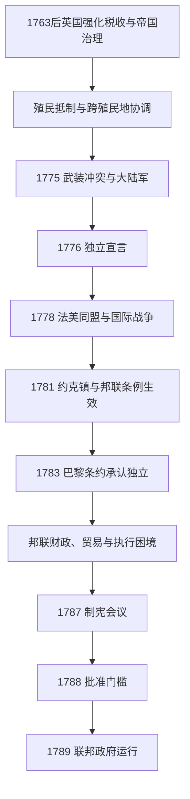

# 美国革命与建国

## 时间

1775-1789年。

## 概括

美国革命既是十三殖民地反抗英国帝国治理的独立战争，也是建立新国家制度的长期过程。殖民地在1776年宣布独立，1783年才由英国正式承认；最初的邦联体制中央权力有限，1787年制宪会议另拟联邦宪法，1788年达到批准门槛，1789年联邦政府开始运行。

革命话语强调自然权利与人民主权，却没有同时消除奴隶制、妇女的政治排斥或对原住民土地的扩张。很多原住民族依据自身利益选择英国、美国或中立立场，战争结果也改变了它们与新国家的关系。

## 演进图

## 统治结构

| 人物或机构 | 时间 | 身份 / 角色 | 关键说明 |
|---|---|---|---|
| 第二届大陆会议 | 1775-1781年 | 革命时期跨殖民地政治机构 | 组织大陆军、发行货币、开展外交并通过《独立宣言》；其主席不是现代意义的国家总统。 |
| **乔治·华盛顿** | 1775-1783年 | 大陆军总司令 | 领导战争，战后交还军权；1789年成为首任联邦总统。 |
| 邦联议会 | 1781-1789年 | 《邦联条例》下的中央机构 | 无独立行政首脑，征税和执行能力有限，重要事项依赖各州合作。 |
| 各州政府 | 革命时期及以后 | 州级立法与行政 | 殖民地改组为州，制定州宪法；选举权仍受性别、财产和种族等条件限制。 |
| 制宪会议 | 1787年 | 宪法起草会议 | 以新联邦体制取代对《邦联条例》的简单修订方案。 |

## 重要事件

- 1763年七年战争结束后，英国加强税收和帝国管理，殖民地反对“无代表不纳税”，危机逐步升级。
- 1775年列克星敦和康科德战斗标志武装冲突开始，第二届大陆会议组织大陆军。
- 1776年7月4日，《独立宣言》宣布十三个联合殖民地为自由独立诸州。
- 1777年萨拉托加战役后，法国于1778年正式与美国结盟，战争成为更广泛的国际冲突。
- 《邦联条例》于1777年通过，但直到1781年3月全部州批准后才正式生效。
- 1781年约克镇战役迫使英军主力投降；1783年《巴黎条约》使英国承认美国独立。
- 邦联政府处理西部土地的条例为新领地转为州提供框架，但这类权利主张与原住民领地和条约关系发生冲突。
- 1786-1787年谢司起义暴露债务、税收和中央政府能力问题，增强了修改体制的呼声。
- 1787年制宪会议设计总统、两院国会和联邦法院；“五分之三条款”等妥协把奴隶制嵌入宪政安排。
- 1788年宪法达到批准门槛，1789年新政府开始运行；权利法案于1791年批准。

## 革命的边界

- 奴隶和自由黑人参加了战争的不同阵营；部分奴隶通过参军、逃亡或英方解放承诺争取自由，但南方奴隶制继续扩展。
- 革命没有承认妇女的全国选举权，“共和母亲”观念扩大女性教育意义，却未给予平等政治身份。
- 易洛魁联盟等原住民政治共同体在战争中发生内部分歧。1783年英美和约未让原住民族作为缔约方参与，却处置了英国声称拥有的西部土地。
- 忠于英国的殖民者大量迁往英属北美、加勒比和英国，推动后来加拿大英语社会的发展。

## 演变关系

- 前一节点：[英属北美与十三殖民地](/%E4%BA%BA%E6%96%87%E7%A7%91%E5%AD%A6/%E5%8E%86%E5%8F%B2/%E7%BE%8E%E6%B4%B2/%E5%8C%97%E7%BE%8E/%E6%AE%96%E6%B0%91%E5%8C%97%E7%BE%8E/%E8%8B%B1%E5%B1%9E%E5%8C%97%E7%BE%8E%E4%B8%8E%E5%8D%81%E4%B8%89%E6%AE%96%E6%B0%91%E5%9C%B0.md)。
- 后一节点：[早期共和国](/%E4%BA%BA%E6%96%87%E7%A7%91%E5%AD%A6/%E5%8E%86%E5%8F%B2/%E7%BE%8E%E6%B4%B2/%E5%8C%97%E7%BE%8E/%E7%BE%8E%E5%9B%BD/%E6%97%A9%E6%9C%9F%E5%85%B1%E5%92%8C%E5%9B%BD.md)。
- 英国背景：[联合王国](/%E4%BA%BA%E6%96%87%E7%A7%91%E5%AD%A6/%E5%8E%86%E5%8F%B2/%E6%AC%A7%E6%B4%B2/%E4%B8%8D%E5%88%97%E9%A2%A0%E7%BE%A4%E5%B2%9B/%E8%81%94%E5%90%88%E7%8E%8B%E5%9B%BD/README.md)。
- 总统次序：[美国历任总统表](/%E4%BA%BA%E6%96%87%E7%A7%91%E5%AD%A6/%E5%8E%86%E5%8F%B2/%E7%BE%8E%E6%B4%B2/%E5%8C%97%E7%BE%8E/%E7%BE%8E%E5%9B%BD/%E7%BE%8E%E5%9B%BD%E5%8E%86%E4%BB%BB%E6%80%BB%E7%BB%9F%E8%A1%A8.md)。
- 所属总览：[美国历史](/%E4%BA%BA%E6%96%87%E7%A7%91%E5%AD%A6/%E5%8E%86%E5%8F%B2/%E7%BE%8E%E6%B4%B2/%E5%8C%97%E7%BE%8E/%E7%BE%8E%E5%9B%BD/README.md)。
