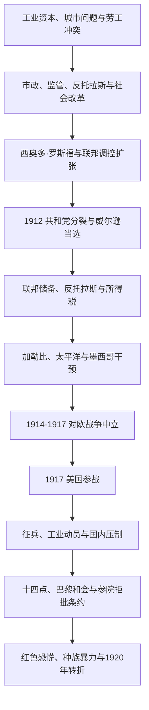

# 进步主义与第一次世界大战

## 时间

1901-1920年。

## 概括

进步主义时代的改革者试图以专业行政、监管、社会调查和直接民主回应垄断、城市贫困、腐败、食品安全和劳工条件等工业化问题。改革扩大了联邦政府能力，却常保留种族隔离和殖民统治。美国在加勒比和太平洋加强干预，1917年加入第一次世界大战；战时动员促进工业与人口迁移，也压缩反战言论和移民群体的自由。1920年第十九修正案禁止因性别剥夺选举权，但许多非白人女性仍受种族性投票障碍限制。

## 演进图

## 国家元首与政府首脑

| 总统 | 任期 | 党派 | 关键事件 |
|---|---|---|---|
| **西奥多·罗斯福** | 1901-1909年 | 共和党 | 反托拉斯、消费者保护、资源保育和“大棒”外交。 |
| 威廉·霍华德·塔夫脱 | 1909-1913年 | 共和党 | 继续反托拉斯诉讼，共和党内部进步派与保守派分裂。 |
| **伍德罗·威尔逊** | 1913-1921年 | 民主党 | 联邦储备制度、进步改革、第一次世界大战和十四点原则。 |

详见[美国历任总统表](/%E4%BA%BA%E6%96%87%E7%A7%91%E5%AD%A6/%E5%8E%86%E5%8F%B2/%E7%BE%8E%E6%B4%B2/%E5%8C%97%E7%BE%8E/%E7%BE%8E%E5%9B%BD/%E7%BE%8E%E5%9B%BD%E5%8E%86%E4%BB%BB%E6%80%BB%E7%BB%9F%E8%A1%A8.md)。

## 国内改革

- 记者和社会改革者揭露垄断、腐败、贫民窟与危险劳动条件，推动市政、州和联邦层级改革。
- 1906年《纯净食品和药品法》与《肉类检查法》扩大联邦消费者保护。
- 联邦加强铁路和企业监管，反托拉斯政策试图区分竞争与垄断，但大企业并未消失。
- 保护森林、公园和水资源的政策发展；部分保护区建立同时排斥原住民传统居住和资源使用。
- 第十六修正案确立联邦所得税，第十七修正案规定参议员直选。
- 妇女争取选举权、劳动保护和社会改革的运动壮大；黑人妇女组织同时反对种族和性别压迫。
- 南方吉姆·克劳制度和私刑暴力持续，威尔逊政府还在部分联邦机构强化种族隔离。

## 对外扩张与战争

- 美西战争后的波多黎各、菲律宾和关岛问题使美国必须处理海外领地、公民资格和反殖民战争。
- 1903年美国支持巴拿马脱离哥伦比亚，并取得运河区控制；巴拿马运河于1914年通航。
- “罗斯福推论”和多次军事干预强化美国在加勒比与中美洲的支配地位。
- 第一次世界大战于1914年爆发后，美国最初保持中立，1917年因无限制潜艇战等因素对德宣战。
- 征兵、战争工业委员会、宣传与粮食管理扩大联邦动员能力。
- 《间谍法》和《煽动叛乱法》被用于惩罚反战言论，显示战时安全与公民自由的冲突。
- 非裔美国人大迁徙在战争工业需求和南方压迫推动下加速，改变北方城市政治和文化。
- 威尔逊提出“十四点原则”，但参议院拒绝批准《凡尔赛条约》，美国未加入国际联盟。

## 1919-1920年的转折

- 战后通货膨胀、罢工与“红色恐慌”激化劳资和政治冲突。
- 1919年多地发生白人袭击黑人社区的“红色夏季”暴力。
- 第十八修正案开启全国禁酒，第十九修正案确立不得以性别为由剥夺投票权。
- 移民限制和“恢复常态”的呼声预示1920年代保守转向。

## 演变关系

- 前一节点：[重建与镀金时代](/%E4%BA%BA%E6%96%87%E7%A7%91%E5%AD%A6/%E5%8E%86%E5%8F%B2/%E7%BE%8E%E6%B4%B2/%E5%8C%97%E7%BE%8E/%E7%BE%8E%E5%9B%BD/%E9%87%8D%E5%BB%BA%E4%B8%8E%E9%95%80%E9%87%91%E6%97%B6%E4%BB%A3.md)。
- 后一节点：[战间期与新政](/%E4%BA%BA%E6%96%87%E7%A7%91%E5%AD%A6/%E5%8E%86%E5%8F%B2/%E7%BE%8E%E6%B4%B2/%E5%8C%97%E7%BE%8E/%E7%BE%8E%E5%9B%BD/%E6%88%98%E9%97%B4%E6%9C%9F%E4%B8%8E%E6%96%B0%E6%94%BF.md)。
- 对外区域背景：[美洲历史](/%E4%BA%BA%E6%96%87%E7%A7%91%E5%AD%A6/%E5%8E%86%E5%8F%B2/%E7%BE%8E%E6%B4%B2/README.md)。
- 所属总览：[美国历史](/%E4%BA%BA%E6%96%87%E7%A7%91%E5%AD%A6/%E5%8E%86%E5%8F%B2/%E7%BE%8E%E6%B4%B2/%E5%8C%97%E7%BE%8E/%E7%BE%8E%E5%9B%BD/README.md)。
