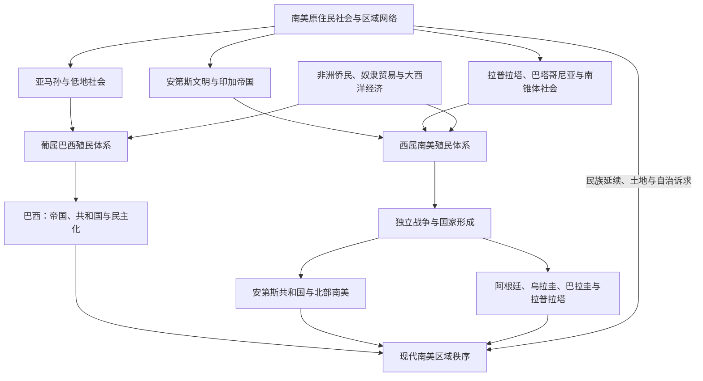

# 南美历史

## 范围与概括

南美历史由安第斯高地、亚马孙流域、大西洋沿岸、拉普拉塔平原、巴塔哥尼亚和圭亚那高原等不同生态区共同构成。它不能只写成“印加—西班牙征服—独立国家”的单线故事：安第斯长期存在多种政治与宗教中心；葡萄牙殖民形成巴西；荷兰、英国和法国的殖民传统塑造圭亚那与苏里南；非洲被强迫迁移者及其后代深刻影响所有沿海社会。

本目录重点以区域主线组织文明、殖民、独立和现代国家史，并展开巴西与阿根廷两条完整国家线。秘鲁、玻利维亚、智利、厄瓜多尔、哥伦比亚、委内瑞拉、巴拉圭、乌拉圭、圭亚那和苏里南的形成，分别置于对应的跨国区域笔记中，避免把共享的殖民与独立过程重复拆写。

## 历史演进图

## 主题与国家入口

| 类型 | 入口 | 重点 |
|---|---|---|
| 文明与原住民史 | [安第斯文明与印加帝国](/%E4%BA%BA%E6%96%87%E7%A7%91%E5%AD%A6/%E5%8E%86%E5%8F%B2/%E7%BE%8E%E6%B4%B2/%E5%8D%97%E7%BE%8E/%E5%AE%89%E7%AC%AC%E6%96%AF%E6%96%87%E6%98%8E%E4%B8%8E%E5%8D%B0%E5%8A%A0%E5%B8%9D%E5%9B%BD.md) | 查文、莫切、纳斯卡、瓦里、蒂亚瓦纳科、奇穆、印加及其延续。 |
| 殖民体系 | [西属南美与葡属巴西](/%E4%BA%BA%E6%96%87%E7%A7%91%E5%AD%A6/%E5%8E%86%E5%8F%B2/%E7%BE%8E%E6%B4%B2/%E5%8D%97%E7%BE%8E/%E8%A5%BF%E5%B1%9E%E5%8D%97%E7%BE%8E%E4%B8%8E%E8%91%A1%E5%B1%9E%E5%B7%B4%E8%A5%BF.md) | 总督区、巴西殖民、矿业、种植园、奴隶贸易与原住民劳役。 |
| 独立 | [南美独立与国家形成](/%E4%BA%BA%E6%96%87%E7%A7%91%E5%AD%A6/%E5%8E%86%E5%8F%B2/%E7%BE%8E%E6%B4%B2/%E5%8D%97%E7%BE%8E/%E5%8D%97%E7%BE%8E%E7%8B%AC%E7%AB%8B%E4%B8%8E%E5%9B%BD%E5%AE%B6%E5%BD%A2%E6%88%90.md) | 西属美洲独立战争、巴西独立、大哥伦比亚与边界争议。 |
| 北部与安第斯 | [北部南美与大哥伦比亚](/%E4%BA%BA%E6%96%87%E7%A7%91%E5%AD%A6/%E5%8E%86%E5%8F%B2/%E7%BE%8E%E6%B4%B2/%E5%8D%97%E7%BE%8E/%E5%8C%97%E9%83%A8%E5%8D%97%E7%BE%8E%E4%B8%8E%E5%A4%A7%E5%93%A5%E4%BC%A6%E6%AF%94%E4%BA%9A.md)、[安第斯共和国](/%E4%BA%BA%E6%96%87%E7%A7%91%E5%AD%A6/%E5%8E%86%E5%8F%B2/%E7%BE%8E%E6%B4%B2/%E5%8D%97%E7%BE%8E/%E5%AE%89%E7%AC%AC%E6%96%AF%E5%85%B1%E5%92%8C%E5%9B%BD.md) | 哥伦比亚、委内瑞拉、厄瓜多尔及秘鲁、玻利维亚、智利。 |
| 南锥体 | [拉普拉塔、巴拉圭与乌拉圭](/%E4%BA%BA%E6%96%87%E7%A7%91%E5%AD%A6/%E5%8E%86%E5%8F%B2/%E7%BE%8E%E6%B4%B2/%E5%8D%97%E7%BE%8E/%E6%8B%89%E6%99%AE%E6%8B%89%E5%A1%94%E3%80%81%E5%B7%B4%E6%8B%89%E5%9C%AD%E4%B8%8E%E4%B9%8C%E6%8B%89%E5%9C%AD.md) | 副王区遗产、巴拉圭战争、乌拉圭形成和阿根廷区域背景。 |
| 圭亚那 | [圭亚那与苏里南](/%E4%BA%BA%E6%96%87%E7%A7%91%E5%AD%A6/%E5%8E%86%E5%8F%B2/%E7%BE%8E%E6%B4%B2/%E5%8D%97%E7%BE%8E/%E5%9C%AD%E4%BA%9A%E9%82%A3%E4%B8%8E%E8%8B%8F%E9%87%8C%E5%8D%97.md) | 荷兰、英国、法国殖民遗产及独立后的北岸国家。 |
| 巴西 | [巴西历史](/%E4%BA%BA%E6%96%87%E7%A7%91%E5%AD%A6/%E5%8E%86%E5%8F%B2/%E7%BE%8E%E6%B4%B2/%E5%8D%97%E7%BE%8E/%E5%B7%B4%E8%A5%BF/README.md) | 葡属殖民、帝国、共和国、军政府与民主化。 |
| 阿根廷 | [阿根廷历史](/%E4%BA%BA%E6%96%87%E7%A7%91%E5%AD%A6/%E5%8E%86%E5%8F%B2/%E7%BE%8E%E6%B4%B2/%E5%8D%97%E7%BE%8E/%E9%98%BF%E6%A0%B9%E5%BB%B7/README.md) | 拉普拉塔革命、联邦整合、庇隆主义、军政府与民主恢复。 |
| 当代区域史 | [现代南美区域秩序](/%E4%BA%BA%E6%96%87%E7%A7%91%E5%AD%A6/%E5%8E%86%E5%8F%B2/%E7%BE%8E%E6%B4%B2/%E5%8D%97%E7%BE%8E/%E7%8E%B0%E4%BB%A3%E5%8D%97%E7%BE%8E%E5%8C%BA%E5%9F%9F%E7%A7%A9%E5%BA%8F.md) | 发展模式、军事政权、民主化、区域一体化与环境议题。 |

## 重要转折

| 时间 | 事件 | 意义 |
|---|---|---|
| 15世纪 | 印加扩张与“塔万廷苏尤”形成 | 将安第斯多种既有社会纳入大规模道路、劳役与再分配网络。 |
| 1494年 | 《托德西利亚斯条约》 | 西班牙与葡萄牙划分海外声索，为巴西的葡语传统提供帝国背景。 |
| 1532-1533年 | 皮萨罗俘获阿塔瓦尔帕、库斯科失守 | 印加国家核心被征服，但安第斯抵抗、地方社会和知识传统仍延续。 |
| 1545年 | 波托西银矿开发 | 白银、强制劳役与全球贸易重塑安第斯及世界经济。 |
| 1808年 | 葡萄牙王室迁至里约热内卢 | 巴西从殖民地转为葡萄牙帝国政治中心之一，改变独立路径。 |
| 1810-1825年 | 西属南美独立战争 | 多个副王区解体，玻利瓦尔、圣马丁等军事政治网络推动国家形成。 |
| 1822年 | 巴西独立 | 巴西以帝国而非共和国形式独立，保留君主制和奴隶制。 |
| 1864-1870年 | 巴拉圭战争 | 改变拉普拉塔地区力量结构，对巴拉圭社会造成灾难性影响。 |
| 20世纪后半叶 | 冷战时期军政府与民主化 | 多国经历政变、国家暴力、债务危机和民主恢复。 |
| 1990年代至今 | 市场改革、区域合作与社会抗争 | 南美围绕贸易、资源、贫困、环境、原住民权利和政治极化持续调整。 |

## 相关区域

- 上级入口：[美洲历史](/%E4%BA%BA%E6%96%87%E7%A7%91%E5%AD%A6/%E5%8E%86%E5%8F%B2/%E7%BE%8E%E6%B4%B2/README.md)。
- 跨区域殖民与独立：[殖民与独立](/%E4%BA%BA%E6%96%87%E7%A7%91%E5%AD%A6/%E5%8E%86%E5%8F%B2/%E7%BE%8E%E6%B4%B2/%E6%AE%96%E6%B0%91%E4%B8%8E%E7%8B%AC%E7%AB%8B/README.md)。
- 殖民母国：[伊比利亚半岛](/%E4%BA%BA%E6%96%87%E7%A7%91%E5%AD%A6/%E5%8E%86%E5%8F%B2/%E6%AC%A7%E6%B4%B2/%E4%BC%8A%E6%AF%94%E5%88%A9%E4%BA%9A%E5%8D%8A%E5%B2%9B/README.md)。
- 大西洋奴隶贸易背景：[非洲历史](/%E4%BA%BA%E6%96%87%E7%A7%91%E5%AD%A6/%E5%8E%86%E5%8F%B2/%E9%9D%9E%E6%B4%B2/README.md)。
