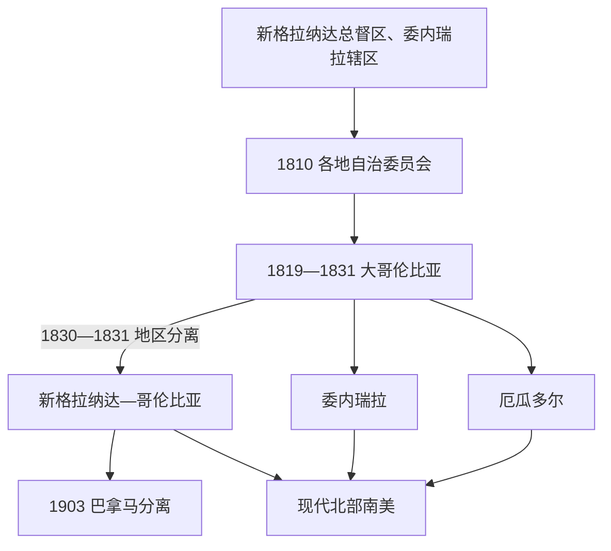

# 北部南美与大哥伦比亚

## 时间

1810年至今；前史涉及新格拉纳达总督区及委内瑞拉总督辖区。

## 概括

北部南美的哥伦比亚、委内瑞拉和厄瓜多尔在独立战争中一度被整合进大哥伦比亚。这个共和国横跨安第斯、加勒比沿岸、奥里诺科平原和太平洋地区，交通困难、地区利益和宪政分歧使其在1830年前后解体。此后各国分别围绕咖啡、石油、农业、内战、中央集权和地方权力发展；巴拿马1903年脱离哥伦比亚也改变了区域格局。

## 大哥伦比亚统治结构

| 层级 | 角色 | 说明 |
|---|---|---|
| 总统 | 西蒙·玻利瓦尔等 | 共和国试图以较强中央行政维持广阔领土。 |
| 副总统与地区政府 | 地方行政与政治协调 | 圣菲波哥大、基多、加拉加斯等中心之间利益不一。 |
| 军事领袖与地方考迪罗 | 战争与地区政治力量 | 独立战争形成的军政网络既支撑建国，也削弱中央统一。 |

## 重要节点

- 1819年玻利瓦尔领导的政治军事联盟建立大哥伦比亚，1821年库库塔宪法确定共和国框架。
- 1820年代关于中央集权、地区代表权和玻利瓦尔权威的争论日益激烈。
- 1830年前后委内瑞拉和厄瓜多尔分离，核心地区继续以新格拉纳达、后来的哥伦比亚发展。
- 19世纪哥伦比亚多次经历联邦与中央集权转换及内战；委内瑞拉的考迪罗政治最终通向石油经济国家；厄瓜多尔在高地与海岸之间维持脆弱平衡。
- 20世纪哥伦比亚经历“暴力时期”、长期武装冲突与和平进程；委内瑞拉的石油租金政治与社会分化深刻影响国家；厄瓜多尔则多次经历政党危机与宪政重组。

## 演进图

## 建立、解体与国家分化

- **建立背景**：委内瑞拉早期共和国两度失败后，玻利瓦尔把奥里诺科根据地、新格拉纳达军事资源和跨安第斯战役结合。1819年博亚卡战役打开波哥大，安戈斯图拉会议先在战争中宣布哥伦比亚共和国，1821年库库塔宪法才确定中央政府和省级架构。
- **扩张过程**：卡拉沃沃战役巩固委内瑞拉，皮钦查战役使基多纳入共和国；巴拿马也在1821年脱离西班牙并加入。共和国因此不是一次会议“画出来”的，而是在连续战役、地方宣誓和军队驻扎中形成。
- **结构矛盾**：首都与边区距离遥远，税收和通信薄弱；加拉加斯、基多、波哥大精英对关税、军队和代表权诉求不同；长期战争形成的地方军政领袖不愿受强中央约束。玻利瓦尔主张强化行政，桑坦德强调1821年宪法程序，两派冲突使合法性分裂。
- **直接解体**：1826年委内瑞拉“科西亚塔”运动挑战中央，1828年奥卡尼亚会议制宪失败，玻利瓦尔转向非常权力并遭刺杀未遂。1830年委内瑞拉、厄瓜多尔相继分离，玻利瓦尔辞职和乌达内塔军事夺权未能恢复统一；1831年新格拉纳达另建共和国。
- **后续国家化**：哥伦比亚在联邦与中央集权之间反复，委内瑞拉由考迪罗政治转向石油财政，厄瓜多尔围绕高地—海岸联盟重组。三国完整国家元首与军政过渡见[北部南美国家元首表](/%E4%BA%BA%E6%96%87%E7%A7%91%E5%AD%A6/%E5%8E%86%E5%8F%B2/%E7%BE%8E%E6%B4%B2/%E5%8D%97%E7%BE%8E/%E5%8C%97%E9%83%A8%E5%8D%97%E7%BE%8E%E5%9B%BD%E5%AE%B6%E5%85%83%E9%A6%96%E8%A1%A8.md)。

## 演变关系

- 前史：[西属南美与葡属巴西](/%E4%BA%BA%E6%96%87%E7%A7%91%E5%AD%A6/%E5%8E%86%E5%8F%B2/%E7%BE%8E%E6%B4%B2/%E5%8D%97%E7%BE%8E/%E8%A5%BF%E5%B1%9E%E5%8D%97%E7%BE%8E%E4%B8%8E%E8%91%A1%E5%B1%9E%E5%B7%B4%E8%A5%BF.md)。
- 独立背景：[南美独立与国家形成](/%E4%BA%BA%E6%96%87%E7%A7%91%E5%AD%A6/%E5%8E%86%E5%8F%B2/%E7%BE%8E%E6%B4%B2/%E5%8D%97%E7%BE%8E/%E5%8D%97%E7%BE%8E%E7%8B%AC%E7%AB%8B%E4%B8%8E%E5%9B%BD%E5%AE%B6%E5%BD%A2%E6%88%90.md)。
- 厄瓜多尔亦见[安第斯共和国](/%E4%BA%BA%E6%96%87%E7%A7%91%E5%AD%A6/%E5%8E%86%E5%8F%B2/%E7%BE%8E%E6%B4%B2/%E5%8D%97%E7%BE%8E/%E5%AE%89%E7%AC%AC%E6%96%AF%E5%85%B1%E5%92%8C%E5%9B%BD.md)。
- 所属总览：[南美历史](/%E4%BA%BA%E6%96%87%E7%A7%91%E5%AD%A6/%E5%8E%86%E5%8F%B2/%E7%BE%8E%E6%B4%B2/%E5%8D%97%E7%BE%8E/README.md)。
