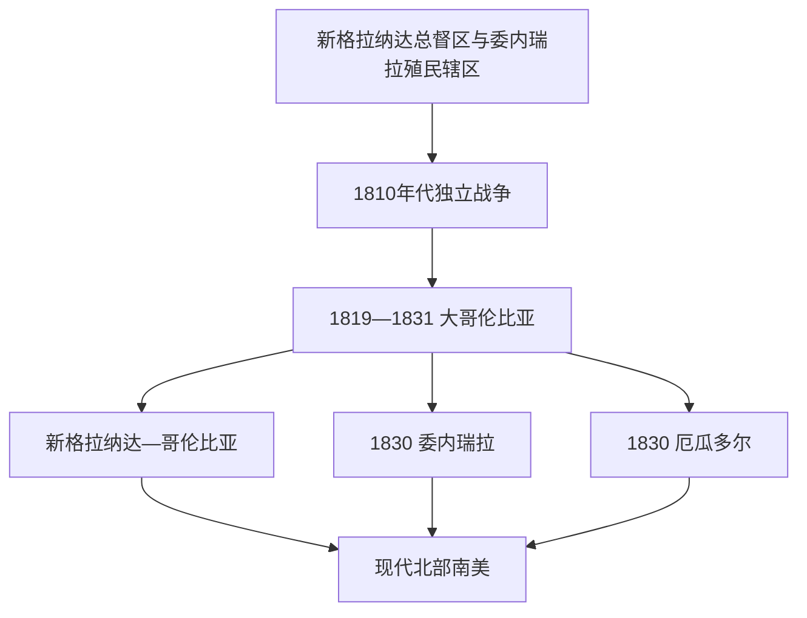

# 北部南美国家元首表

## 范围与口径

本表覆盖大哥伦比亚，以及其主要南美继承国哥伦比亚、委内瑞拉和厄瓜多尔。三国均以总统兼国家元首和政府首脑为主，但19—20世纪多次出现副总统 / 指定者代行、军事委员会、临时集体政府和并立政权。表中按实际就任次序列出，集体机构完整列名；“名义元首”和掌军政资源的实际统治者不混为一谈。现代信息核验截至2026年7月14日。

## 政权分化图

## 大哥伦比亚国家元首

| 国家元首 | 在位 | 地位 | 实际权力与关键事件 |
|---|---|---|---|
| **西蒙·玻利瓦尔** | 1819—1830 | 总统；长期在外领军时由副总统代行 | 共和国创建者；中央集权方案与地区自治冲突。弗朗西斯科·德·保拉·桑坦德在1819—1827年长期实际主持新格拉纳达行政。 |
| 华金·莫斯克拉 | 1830年5—9月 | 国会选出；短暂复位于1831年 | 玻利瓦尔辞职后的宪制总统。 |
| 拉斐尔·乌达内塔 | 1830年9月—1831年4月 | 军事夺权，事实元首 | 试图促玻利瓦尔复位，失去支持后交权。 |
| 多明戈·凯塞多 | 1830—1831年多次代行 | 副总统 / 国务会议主席代行 | 主持解体和新格拉纳达过渡。 |

## 哥伦比亚国家元首完整表

| 国家元首 / 集体机构 | 在位 | 取得权力方式 | 关键事件与备注 |
|---|---|---|---|
| 弗朗西斯科·德·保拉·桑坦德 | 1832—1837 | 选举 | 新格拉纳达共和国制度化。 |
| 何塞·伊格纳西奥·德·马克斯 | 1837—1841 | 选举 | 最高者战争暴露中央—地方与教会矛盾。 |
| 佩德罗·阿尔坎塔拉·埃兰 | 1841—1845 | 选举；军人 | 战后重建与保守秩序。 |
| 托马斯·西普里亚诺·德·莫斯克拉 | 1845—1849 | 选举 | 自由化改革前奏。 |
| 何塞·伊拉里奥·洛佩斯 | 1849—1853 | 选举 | 废奴、削弱教会特权与自由派改革。 |
| 何塞·马里亚·奥万多 | 1853—1854 | 选举；被政变推翻 | 新宪法与军政危机。 |
| 何塞·马里亚·梅洛 | 1854年4—12月 | 军事政变，事实元首 | 工匠与军人联盟，遭跨党派联军击败。 |
| 托马斯·埃雷拉 | 1854年4—8月 | 宪法政府临时元首，与梅洛并立 | 维护合法政府，战斗中去世。 |
| 何塞·德·奥瓦尔迪亚 | 1854—1855 | 副总统 / 指定者继任 | 恢复宪制。 |
| 曼努埃尔·马里亚·马利亚里诺 | 1855—1857 | 副总统继任 | 过渡至格拉纳达邦联。 |
| 马里亚诺·奥斯皮纳·罗德里格斯 | 1857—1861 | 选举 | 联邦制与内战并行；莫斯克拉起兵。 |
| 巴托洛梅·卡尔沃 | 1861年4—7月 | 检察长代行 | 波哥大被攻占前的宪制首脑。 |
| 胡利奥·阿尔沃莱达 | 1861年7—11月 | 保守派选举主张；控制有限 | 内战中与莫斯克拉政权并立。 |
| 托马斯·西普里亚诺·德·莫斯克拉 | 1861年7月—1863年2月10日 | 内战胜利后的事实元首 | 推翻格拉纳达邦联政府并召集里奥内格罗制宪会议。 |
| 五人联邦执行委员会 | 1863年2月10日—5月14日 | 弗罗伊兰·拉尔加查、托马斯·西普里亚诺·德·莫斯克拉、何塞·伊拉里奥·洛佩斯、欧斯托尔希奥·萨尔加尔、桑托斯·古铁雷斯 | 制宪会议设置的集体行政；拉尔加查主持，五位部长共同签署和执行政务。 |
| 托马斯·西普里亚诺·德·莫斯克拉 | 1863年5月14日—1864年4月1日 | 制宪会议选出临时总统 | 实施里奥内格罗宪法，建立哥伦比亚合众国并没收教会财产。 |
| 胡安·阿古斯丁·德·乌里科埃切亚 | 1864年1月29日—2月29日 | 莫斯克拉离任期间代行 | 一个月的宪定代行，不改变莫斯克拉任期连续性。 |
| 曼努埃尔·穆里略·托罗 | 1864—1866 | 选举 | 激进自由主义、联邦与教育改革。 |
| 何塞·马里亚·罗哈斯·加里多 | 1866年4—5月 | 第一指定者代行 | 莫斯克拉就任前过渡。 |
| 托马斯·西普里亚诺·德·莫斯克拉 | 1866—1867 | 选举；政变罢黜 | 与国会冲突后被废。 |
| 桑托斯·阿科斯塔 | 1867—1868 | 军事 / 宪制过渡 | 推翻莫斯克拉后恢复联邦宪法。 |
| 桑托斯·古铁雷斯 | 1868—1870 | 选举 | 联邦自由派执政。 |
| 欧斯托尔希奥·萨尔加尔 | 1870—1872 | 选举 | 教育和交通建设。 |
| 曼努埃尔·穆里略·托罗 | 1872—1874 | 选举；第二任 | 联邦体制继续。 |
| 圣地亚哥·佩雷斯 | 1874—1876 | 选举 | 党派竞争与教育争议。 |
| 阿基莱奥·帕拉 | 1876—1878 | 选举 | 1876年内战后自由派获胜。 |
| 胡利安·特鲁希略 | 1878—1880 | 选举；军人 | “再生运动”前夜。 |
| 拉斐尔·努涅斯 | 1880—1882 | 选举 | 推动中央化和跨党联盟。 |
| 弗朗西斯科·哈维尔·萨尔杜亚 | 1882年4—12月 | 选举；任内去世 | 联邦最后阶段。 |
| 克利马科·卡尔德龙 | 1882年12月21—22日 | 检察长代行 | 一天过渡。 |
| 何塞·欧塞维奥·奥塔洛拉 | 1882—1884 | 第二指定者继任 | 完成任期。 |
| 埃塞基耶尔·乌尔塔多 | 1884年4—8月 | 指定者代行 | 努涅斯就任前过渡。 |
| 拉斐尔·努涅斯 | 1884—1888；名义影响延至1894 | 选举；1886年改国号 | 1886年宪法建立中央集权的哥伦比亚共和国；常把行政交给副总统 / 指定者。 |
| 卡洛斯·奥尔金·马利亚里诺 | 1888—1892 | 指定者实际执政 | 努涅斯退居期间主持中央政府。 |
| 米格尔·安东尼奥·卡罗 | 1892—1898 | 副总统实际执政 | 1894年前名义代努涅斯，后成为国家元首。 |
| 曼努埃尔·安东尼奥·桑克莱门特 | 1898—1900 | 选举；政变罢黜 | 千日战争中被副总统夺权。 |
| 何塞·曼努埃尔·马罗金 | 1900—1904 | 副总统政变继任 | 结束千日战争；巴拿马分离。 |
| 拉斐尔·雷耶斯 | 1904—1909 | 选举；提前辞职 | 行政现代化与个人集权。 |
| 豪尔赫·奥尔金 | 1909年6—8月 | 指定者代行 | 雷耶斯辞职后的过渡。 |
| 拉蒙·冈萨雷斯·巴伦西亚 | 1909—1910 | 国会选出 | 制宪改革与过渡。 |
| 卡洛斯·欧亨尼奥·雷斯特雷波 | 1910—1914 | 选举 | “共和联盟”调和党争。 |
| 何塞·比森特·孔查 | 1914—1918 | 选举 | 一战时期中立与财政压力。 |
| 马尔科·菲德尔·苏亚雷斯 | 1918—1921 | 选举；辞职 | 对美外交与国内危机。 |
| 豪尔赫·奥尔金 | 1921—1922 | 指定者继任 | 完成余任。 |
| 佩德罗·内尔·奥斯皮纳 | 1922—1926 | 选举 | 基础设施与外资增长。 |
| 米格尔·阿瓦迪亚·门德斯 | 1926—1930 | 选举 | 香蕉工人大屠杀、大萧条，保守霸权终结。 |
| 恩里克·奥拉亚·埃雷拉 | 1930—1934 | 选举 | 自由派回归与同秘鲁战争。 |
| 阿方索·洛佩斯·普马雷霍 | 1934—1938 | 选举 | “进行中的革命”土地、教育与劳工改革。 |
| 爱德华多·桑托斯 | 1938—1942 | 选举 | 改革放缓与二战前期。 |
| 阿方索·洛佩斯·普马雷霍 | 1942—1945 | 选举；辞职 | 1944年短暂被扣押；达里奥·埃昌迪亚多次代行。 |
| 阿尔韦托·列拉斯·卡马戈 | 1945—1946 | 第一指定者继任 | 主持选举。 |
| 马里亚诺·奥斯皮纳·佩雷斯 | 1946—1950 | 选举 | 博戈塔骚乱与“暴力时期”扩大。 |
| 劳雷亚诺·戈麦斯 | 1950—1951 | 选举；因病离职 | 保守威权方案。 |
| 罗伯托·乌达内塔·阿尔韦莱斯 | 1951—1953 | 指定者代行 | 军方政变前的名义元首。 |
| 古斯塔沃·罗哈斯·皮尼利亚 | 1953—1957 | 军事政变，事实总统 | 部分停战、建设与审查；社会反对迫其下台。 |
| 五人军事执政委员会 | 1957—1958 | 加夫列尔·帕里斯、德奥格拉西亚斯·丰塞卡、鲁文·彼德拉伊塔、拉斐尔·纳瓦斯·帕尔多、路易斯·奥多涅斯 | 主持公投与向自由—保守“全国阵线”移交。 |
| 阿尔韦托·列拉斯·卡马戈 | 1958—1962 | 选举 | 全国阵线首任，自由保守轮流总统。 |
| 吉列尔莫·莱昂·巴伦西亚 | 1962—1966 | 选举 | 反叛乱与农村冲突。 |
| 卡洛斯·列拉斯·雷斯特雷波 | 1966—1970 | 选举 | 行政和土地改革。 |
| 米萨埃尔·帕斯特拉纳 | 1970—1974 | 选举；结果争议 | 全国阵线最后一任，M-19形成。 |
| 阿方索·洛佩斯·米切尔森 | 1974—1978 | 选举 | 恢复开放党争，通胀与社会抗议。 |
| 胡利奥·塞萨尔·图尔瓦伊 | 1978—1982 | 选举 | 安全法规与人权争议。 |
| 贝利萨里奥·贝坦库尔 | 1982—1986 | 选举 | 和平尝试、司法宫灾难与火山灾害。 |
| 比尔希略·巴尔科 | 1986—1990 | 选举 | 毒品战争、政治暗杀与制宪前夜。 |
| 塞萨尔·加维里亚 | 1990—1994 | 选举 | 1991年宪法、经济开放与部分武装复员。 |
| 埃内斯托·桑佩尔 | 1994—1998 | 选举 | 竞选资金危机削弱政府。 |
| 安德烈斯·帕斯特拉纳 | 1998—2002 | 选举 | 和平谈判与“哥伦比亚计划”。 |
| 阿尔瓦罗·乌里韦 | 2002—2010 | 选举；连任 | 强硬安全政策削弱游击队，亦有“假阳性”等人权争议。 |
| 胡安·曼努埃尔·桑托斯 | 2010—2018 | 选举；连任 | 2016年与FARC和平协议。 |
| 伊万·杜克 | 2018—2022 | 选举 | 和平落实争议、疫情和全国抗议。 |
| **古斯塔沃·佩特罗** | 2022—2026年8月7日 | 选举 | 截至2026年7月14日仍任总统；已进入向候任政府交接期。 |

> 2026年选举后的候任总统尚未在本表截止日就职，因此不列入实际国家元首序列。

## 委内瑞拉国家元首完整表

| 国家元首 / 集体机构 | 在位 | 取得权力方式 | 关键事件与备注 |
|---|---|---|---|
| 独立革命三人执政团 | 1811—1812 | 克里斯托瓦尔·门多萨、胡安·埃斯卡洛纳、巴尔塔萨尔·帕德龙轮值；弗朗西斯科·埃斯佩霍后参与过渡 | 第一共和国集体元首；地震、战争和王党反攻后崩溃。 |
| 西蒙·玻利瓦尔 | 1813—1814、1817—1819 | 第二共和国“解放者” / 第三共和国最高统帅 | 并非1830年后总统制；1819年并入大哥伦比亚。 |
| **何塞·安东尼奥·派斯** | 1830—1835 | 临时后宪制总统 | 推动委内瑞拉脱离大哥伦比亚。 |
| 何塞·马里亚·巴尔加斯 | 1835—1836 | 选举；遭政变、复位后辞职 | 文人总统与军人考迪罗冲突；安德烈斯·纳瓦尔特、何塞·马里亚·卡雷尼奥多次代行。 |
| 安德烈斯·纳瓦尔特 | 1836—1837 | 副总统代行 | 完成巴尔加斯任期。 |
| 卡洛斯·苏布莱特 | 1837—1839 | 副总统 / 选举 | 秩序重建。 |
| 何塞·安东尼奥·派斯 | 1839—1843 | 选举；第二任 | 保守寡头秩序。 |
| 卡洛斯·苏布莱特 | 1843—1847 | 选举 | 文人政府延续。 |
| 何塞·塔德奥·莫纳加斯 | 1847—1851 | 选举 | 打破派斯控制并强化家族权力。 |
| 何塞·格雷戈里奥·莫纳加斯 | 1851—1855 | 选举 | 1854年废奴。 |
| 何塞·塔德奥·莫纳加斯 | 1855—1858 | 选举；革命推翻 | 莫纳加斯家族统治终结。 |
| 佩德罗·瓜尔 | 1858年3月 | 临时元首 | 革命后的短暂过渡。 |
| 胡利安·卡斯特罗 | 1858—1859 | 制宪 / 军政元首 | 联邦战争爆发。 |
| 佩德罗·瓜尔 | 1859年8—9月 | 临时元首 | 继承危机过渡。 |
| 曼努埃尔·费利佩·德·托瓦尔 | 1859—1861 | 选举；辞职 | 联邦战争中宪制政府。 |
| 佩德罗·瓜尔 | 1861年5—8月 | 临时元首 | 把权力交给派斯。 |
| 何塞·安东尼奥·派斯 | 1861—1863 | 独裁者，事实元首 | 联邦派获胜后流亡。 |
| 胡安·克里索斯托莫·法尔孔 | 1863年6月—1868年4月25日 | 联邦胜利后临时、宪制总统 | 建立委内瑞拉合众国，财政和地区控制薄弱；1863年末曾由副总统安东尼奥·古斯曼·布兰科短时代行。 |
| 曼努埃尔·埃塞基耶尔·布鲁苏阿尔 | 1868年4月25日—6月28日 | 临时总统 | 法尔孔辞职后的继承者，在“蓝色革命”中败亡。 |
| 蓝色革命临时全国行政 | 1868年6月28日—1869年2月22日 | 吉列尔莫·特尔·比列加斯、马特奥·格拉·马尔卡诺、马科斯·桑塔纳、多明戈·莫纳加斯、尼卡诺尔·博尔赫斯、安东尼奥·帕雷霍 | 六人集体签署政令，比列加斯主持会议；何塞·塔德奥·莫纳加斯作为革命军最高首脑掌握关键军政影响直至1868年11月去世。 |
| 何塞·鲁佩托·莫纳加斯 | 1869年2月22日—1870年3月20日 | 第一指定者后当选总统 | 自蓝色革命政权继任，在古斯曼进军时离开首都统军。 |
| 胡安·比森特·冈萨雷斯·德尔加多 | 1870年3月20日—4月11日 | 第二指定者代行 | 莫纳加斯离开首都后的短期代行。 |
| 埃斯特班·德·帕拉西奥斯·伊·维加斯 | 1870年4月11—27日 | 第一指定者代行 | 古斯曼·布兰科攻占加拉加斯前的最后宪制代行者。 |
| **安东尼奥·古斯曼·布兰科** | 1870年4月27日—1877年2月20日 | 革命夺权后临时、宪制总统 | 中央化、世俗化和基础设施建设。 |
| 哈辛托·古铁雷斯 | 1877年2月21日—3月2日 | 联邦高等法院院长代行 | 等待当选总统利纳雷斯·阿尔坎塔拉就任。 |
| 弗朗西斯科·利纳雷斯·阿尔坎塔拉 | 1877年3月2日—1878年11月30日 | 选举；任内去世 | 试图摆脱古斯曼影响。 |
| 哈辛托·古铁雷斯与劳雷亚诺·比利亚努埃瓦 | 1878年11月30日—1879年1月1日 | 高等法院主持的临时行政 | 依法在总统死亡后代行并召集继承安排。 |
| 何塞·格雷戈里奥·巴莱拉 | 1879年1月1日—2月13日 | 第一指定者代行 | 在加拉加斯主持政府，被“复权革命”推翻。 |
| 何塞·格雷戈里奥·塞德尼奥 | 1878年12月29日—1879年2月26日 | 复权革命最高首脑，与巴莱拉并立 | 以军队拥立流亡中的古斯曼·布兰科，攻入首都后移交。 |
| 安东尼奥·古斯曼·布兰科 | 1878年12月29日—1879年5月8日 | 复权革命最高指导者，后实际复出 | 革命阶段与巴莱拉政府并立，随后恢复中央控制。 |
| 何塞·拉斐尔·帕切科 | 1879年5月8—12日 | 指定者短时代行 | 古斯曼从革命最高权力转入临时总统职位之间的四日过渡。 |
| 安东尼奥·古斯曼·布兰科 | 1879年5月12日—1884年4月27日 | 临时后宪制总统；第二阶段 | 强化中央与个人统治。 |
| 华金·克雷斯波 | 1884年4月—1886年4月 | 选举 | 古斯曼盟友。 |
| 曼努埃尔·安东尼奥·迭斯 | 1886年4月27日—9月15日 | 国务委员代行 | 等待古斯曼第三次就任。 |
| 安东尼奥·古斯曼·布兰科 | 1886年9月15日—1887年8月8日 | 第三阶段；辞职离国 | 长期“自由自立时期”结束。 |
| 埃尔莫赫内斯·洛佩斯 | 1887年8月8日—1888年7月2日 | 临时总统 | 古斯曼离国后的过渡并主持选举。 |
| 胡安·巴勃罗·罗哈斯·保罗 | 1888年7月—1890年3月 | 选举 | 反古斯曼联盟。 |
| 雷蒙多·安杜埃萨·帕拉西奥 | 1890年3月—1892年6月17日 | 选举；革命推翻 | 试图延长任期。 |
| 吉列尔莫·特尔·比列加斯 | 1892年6月17日—9月2日 | 临时总统 | 合法主义革命中的宪制过渡。 |
| 吉列尔莫·特尔·比列加斯·普利多 | 1892年9月2日—10月6日 | 国务委员代行 | 克雷斯波军攻入首都前的最后临时元首。 |
| 华金·克雷斯波 | 1892年10月—1898年2月20日 | 革命胜利后事实、宪制总统 | 考迪罗统治；1894年2月28日至3月14日曾由曼努埃尔·古斯曼·阿尔瓦雷斯短时代行。 |
| 曼努埃尔·古斯曼·阿尔瓦雷斯 | 1898年2月20—28日 | 政府委员会主席代行 | 克雷斯波任满与安德拉德就任之间的八日过渡。 |
| 伊格纳西奥·安德拉德 | 1898年2月28日—1899年10月20日 | 选举；结果争议，遭推翻 | 安第斯军人集团崛起。 |
| 维克托·罗德里格斯·帕拉加 | 1899年10月20—23日 | 国务委员代行 | 安德拉德出逃至卡斯特罗接管之间的三日过渡。 |
| 西普里亚诺·卡斯特罗 | 1899年10月—1908年12月 | “自由复兴革命”夺权 | 中央军扩张、债务封锁；出国治病时被副总统夺权。 |
| **胡安·比森特·戈麦斯** | 1908—1913 | 副总统政变，事实独裁 | 石油国家和全国军队形成。 |
| 何塞·希尔·福尔图尔 | 1913—1914 | 临时总统 | 戈麦斯保留实际最高权力。 |
| 维克托里诺·马尔克斯·布斯蒂略 | 1914—1922 | 临时总统 | 名义元首；戈麦斯为军队总司令和实际统治者。 |
| 胡安·比森特·戈麦斯 | 1922—1929 | 正式总统 | 个人独裁持续。 |
| 胡安·包蒂斯塔·佩雷斯 | 1929—1931 | 国会选出 | 戈麦斯仍掌军权；后被迫辞职。 |
| 胡安·比森特·戈麦斯 | 1931—1935 | 正式总统；任内去世 | 长期考迪罗独裁终结。 |
| 埃莱亚萨尔·洛佩斯·孔特雷拉斯 | 1935—1941 | 军队与国会承认 | 有限开放和国家现代化。 |
| 伊萨亚斯·梅迪纳·安加里塔 | 1941—1945 | 国会选出；政变推翻 | 石油改革与渐进民主化。 |
| 1945年革命政府委员会 | 1945年10月19日—1948年2月15日 | 罗慕洛·贝坦库尔（主席）、路易斯·贝尔特兰·普列托·菲格罗亚、劳尔·莱奥尼、贡萨洛·巴里奥斯、埃德蒙多·费尔南德斯、卡洛斯·德尔加多·查尔沃、马里奥·里卡多·巴尔加斯 | 五名文职和两名军职委员组成的集体政府，实行普选制宪并安排1947年选举。 |
| 罗慕洛·加列戈斯 | 1948年2月15日—11月24日 | 直接选举；政变推翻 | 首位广泛普选总统。 |
| 1948年军事政府委员会 | 1948年11月24日—1950年11月13日 | 卡洛斯·德尔加多·查尔沃（主席）、马科斯·佩雷斯·希门尼斯、路易斯·费利佩·略韦拉·派斯 | 三名中校组成的集体元首；查尔沃被绑架杀害后改组。 |
| 1950年政府委员会 | 1950年11月27日—1952年12月2日 | 赫尔曼·苏亚雷斯·弗拉梅里奇（名义主席）、马科斯·佩雷斯·希门尼斯、路易斯·费利佩·略韦拉·派斯 | 以文职主席提供外观，佩雷斯·希门尼斯依靠军队掌握实际最高权力。 |
| 马科斯·佩雷斯·希门尼斯 | 1952年12月—1958年1月23日 | 军事强人、事实后正式总统 | 建设、石油繁荣和镇压；军民起义推翻。 |
| 拉腊萨瓦尔政府委员会 | 1958年1月23日—11月14日 | 沃尔夫冈·拉腊萨瓦尔（主席）、卡洛斯·路易斯·阿拉克、佩德罗·何塞·克韦多、罗伯托·卡萨诺瓦、阿韦尔·罗梅罗·比利亚特；卡萨诺瓦与罗梅罗于1月24日由欧亨尼奥·门多萨和布拉斯·兰贝蒂替代 | 军民过渡委员会恢复政党和工会活动并筹备选举；拉腊萨瓦尔辞职参选。 |
| 萨纳布里亚政府委员会 | 1958年11月14日—1959年2月13日 | 埃德加·萨纳布里亚（主席）、卡洛斯·路易斯·阿拉克、佩德罗·何塞·克韦多、欧亨尼奥·门多萨、布拉斯·兰贝蒂 | 延续集体过渡，举行1958年选举并向民选政府交接。 |
| 罗慕洛·贝坦库尔 | 1959—1964 | 选举 | 民主制度、石油政策与反叛乱。 |
| 劳尔·莱奥尼 | 1964—1969 | 选举 | 两党民主与游击冲突。 |
| 拉斐尔·卡尔德拉 | 1969—1974 | 选举 | 首次两党和平轮替、游击队合法化。 |
| 卡洛斯·安德烈斯·佩雷斯 | 1974—1979 | 选举 | 石油国有化与支出扩张。 |
| 路易斯·埃雷拉·坎平斯 | 1979—1984 | 选举 | 债务与货币危机。 |
| 海梅·卢辛奇 | 1984—1989 | 选举 | 经济恶化与腐败争议。 |
| 卡洛斯·安德烈斯·佩雷斯 | 1989—1993 | 选举；遭停职 | 市场改革、卡拉卡索和两次未遂政变。 |
| 奥克塔维奥·莱帕赫 | 1993年5—6月 | 国会主席临时代行 | 佩雷斯停职后过渡。 |
| 拉蒙·J.贝拉斯克斯 | 1993—1994 | 国会选出临时总统 | 完成余任。 |
| 拉斐尔·卡尔德拉 | 1994—1999 | 选举；第二任 | 银行危机、赦免查韦斯与旧党制崩解。 |
| **乌戈·查韦斯** | 1999年2月—2002年4月12日 | 选举；1999年制宪后再选 | 新宪法、石油再分配和权力集中；军方扣押后出现短暂事实政权。 |
| 佩德罗·卡莫纳 | 2002年4月12—13日 | 政变后事实总统 | 解散民选机关的法令失去军政支持，未形成稳定统治。 |
| 迪奥斯达多·卡韦略 | 2002年4月13—14日 | 副总统短时代行 | 在查韦斯获释返抵总统府前维持法定继承。 |
| **乌戈·查韦斯** | 2002年4月14日—2013年3月5日 | 复位后多次连任；任内去世 | 继续“玻利瓦尔革命”，石油繁荣后经济失衡和制度集中加深。 |
| **尼古拉斯·马杜罗** | 2013年至今 | 副总统代行后选举；连任合法性广受争议 | 截至2026年7月14日控制行政、军队和国家机构。2019—2023年胡安·瓜伊多获部分国家承认为临时总统，但未控制中央行政。 |

## 厄瓜多尔国家元首完整表

| 国家元首 / 集体机构 | 在位 | 取得权力方式 | 关键事件与备注 |
|---|---|---|---|
| 胡安·何塞·弗洛雷斯 | 1830—1834 | 制宪会议 / 选举 | 厄瓜多尔脱离大哥伦比亚后的首任总统。 |
| 比森特·罗卡富埃尔特 | 1835—1839 | 政治妥协后选举 | 国家建设、教育与强力秩序。 |
| 胡安·何塞·弗洛雷斯 | 1839—1845 | 选举；“三月革命”推翻 | 1843年宪法延长权力引发反抗。 |
| 1845年临时三人政府 | 1845年3—12月 | 何塞·华金·德·奥尔梅多、比森特·拉蒙·罗卡、迭戈·诺沃亚 | 推翻弗洛雷斯后的集体元首。 |
| 比森特·拉蒙·罗卡 | 1845—1849 | 选举 | “三月派”政府。 |
| 曼努埃尔·德·阿斯卡苏比 | 1849—1850 | 副总统临时代行 | 国会无法选出总统后的过渡。 |
| 迭戈·诺沃亚 | 1850—1851 | 制宪会议选出；政变推翻 | 被乌尔维纳夺权。 |
| 何塞·马里亚·乌尔维纳 | 1851—1856 | 事实后宪制总统 | 废奴并依赖军队。 |
| 弗朗西斯科·罗夫莱斯 | 1856—1859 | 选举；国家危机中垮台 | 对秘战争和财政危机触发多政府并立。 |
| 1859—1860年四方并立危机 | 1859—1860 | 基多临时政府成员为加夫列尔·加西亚·莫雷诺、赫罗尼莫·卡里翁、帕西菲科·奇里沃加，后有拉斐尔·卡瓦哈尔参与恢复；瓜亚基尔最高首脑为吉列尔莫·佛朗哥；昆卡政府由副总统赫罗尼莫·卡里翁主持；洛哈联邦区首脑为曼努埃尔·卡里翁·平萨诺 | 总统弗朗西斯科·罗夫莱斯失去全国控制后形成四方权力；秘鲁封锁与《马帕西格条约》加深危机，加西亚·莫雷诺联合胡安·何塞·弗洛雷斯夺取瓜亚基尔后重建中央政府。 |
| **加夫列尔·加西亚·莫雷诺** | 1861—1865 | 制宪 / 选举 | 中央集权、天主教国家和现代化。 |
| 赫罗尼莫·卡里翁 | 1865—1867 | 选举；辞职 | 受前任影响，政治压力下离任。 |
| 佩德罗·何塞·德·阿尔特塔 | 1867—1868 | 副总统代行 | 过渡。 |
| 哈维尔·埃斯皮诺萨 | 1868—1869 | 选举；政变推翻 | 加西亚·莫雷诺复出。 |
| 加夫列尔·加西亚·莫雷诺 | 1869—1875 | 事实夺权后选举；遇刺 | 强化教会—国家秩序，连任就职前被刺。 |
| 弗朗西斯科·哈维尔·莱昂 | 1875年8—10月 | 临时元首 | 遇刺后过渡。 |
| 何塞·哈维尔·埃吉古伦 | 1875年10—12月 | 临时元首 | 主持选举。 |
| 安东尼奥·博雷罗 | 1875—1876 | 选举；政变推翻 | 自由化有限。 |
| 伊格纳西奥·德·贝因特米利亚 | 1876—1883 | 军事夺权；独裁 | 自由派与保守派联合推翻。 |
| 1883年五人临时政府 | 1883年 | 何塞·马里亚·普拉西多·卡马尼奥、拉斐尔·佩雷斯·帕雷哈、阿古斯丁·格雷罗·利萨尔萨布鲁、佩德罗·卡尔沃、巴勃罗·埃雷拉 | 恢复制宪秩序。 |
| 何塞·马里亚·普拉西多·卡马尼奥 | 1883—1888 | 制宪会议选出 | “进步派”调和政治。 |
| 安东尼奥·弗洛雷斯·希洪 | 1888—1892 | 选举 | 对外债务安排与进步派统治。 |
| 路易斯·科尔德罗·克雷斯波 | 1892—1895 | 选举；辞职 | “旗帜买卖”丑闻削弱政府。 |
| 比森特·卢西奥·萨拉萨尔 | 1895年4—9月 | 副总统代行 | 自由革命中交权。 |
| **埃洛伊·阿尔法罗** | 1895—1901 | 自由革命夺权后宪制化 | 世俗化、铁路和国家重构。 |
| 莱昂尼达斯·普拉萨 | 1901—1905 | 选举 | 自由派制度化。 |
| 利萨尔多·加西亚 | 1905—1906 | 选举；政变推翻 | 阿尔法罗复出。 |
| 埃洛伊·阿尔法罗 | 1906—1911 | 军事复出后选举；被推翻 | 1906年世俗宪法；后在动乱中被杀。 |
| 卡洛斯·弗雷莱·萨尔东比德 | 1911—1912年多次代行 | 参议院主席临时元首 | 阿尔法罗下台与内战期间过渡。 |
| 弗朗西斯科·安德拉德·马林 | 1912年3—8月 | 临时元首 | 主持选举。 |
| 莱昂尼达斯·普拉萨 | 1912—1916 | 选举；第二任 | 压制自由派内战。 |
| 阿尔弗雷多·巴克里索·莫雷诺 | 1916—1920 | 选举 | 文人自由派阶段。 |
| 何塞·路易斯·塔马约 | 1920—1924 | 选举 | 1922年瓜亚基尔工人镇压。 |
| 贡萨洛·S.科尔多瓦 | 1924—1925 | 选举；“七月革命”推翻 | 银行和财政危机。 |
| 七月革命军事临时委员会 | 1925年7月9—10日 | 路易斯·特尔莫·帕斯·伊·米尼奥、埃米利奥·巴尔迪维耶索、费德里科·施特鲁韦、安赫尔·博尼利亚、卡洛斯·A.格雷罗 | 推翻贡萨洛·科尔多瓦后仅维持一日，把行政权交给文武混合的政府委员会。 |
| 第一临时政府委员会 | 1925年7月10日—1926年1月9日 | 弗朗西斯科·阿里萨加·卢克、弗朗西斯科·博洛尼亚、何塞·拉斐尔·布斯塔曼特、路易斯·纳波莱昂·狄龙、佩德罗·巴勃罗·加赖科阿、弗朗西斯科·戈麦斯·德拉托雷、莫伊塞斯·奥利瓦；奥利瓦后由莫德斯托·拉雷亚·希洪接任 | 七名委员按周轮值主持，打击银行寡头影响并推动财政、劳工和中央银行改革。 |
| 第二临时政府委员会 | 1926年1月10日—3月31日 | 温贝托·阿尔沃诺斯、伊西德罗·阿约拉、佩德罗·巴勃罗·埃圭斯·巴克里索、何塞·安东尼奥·戈麦斯·高尔特、阿道尔福·伊达尔戈·纳尔瓦埃斯、胡利奥·恩里克·莫雷诺、奥梅罗·比特里·拉丰特 | 继续集体行政但难以形成稳定指挥；军方最终终止多头政府并任命阿约拉为临时总统。 |
| 伊西德罗·阿约拉 | 1926—1931 | 临时后宪制总统；辞职 | 央行、财政与劳工制度改革。 |
| 路易斯·拉雷亚·阿尔瓦 | 1931年8—10月 | 部长代行 / 事实元首 | 经济危机过渡。 |
| 阿尔弗雷多·巴克里索·莫雷诺 | 1931—1932 | 临时总统 | 主持选举。 |
| 卡洛斯·弗雷莱·拉雷亚 | 1932年8—9月 | 临时总统 | 国会争议中的过渡。 |
| 阿尔韦托·格雷罗·马丁内斯 | 1932年9—12月 | 参议院主席代行 | 主持权力移交。 |
| 胡安·德·迪奥斯·马丁内斯·梅拉 | 1932—1933 | 选举；国会罢免 | 议会冲突。 |
| 阿韦拉多·蒙塔尔沃 | 1933—1934 | 内政部长代行 | 主持选举。 |
| **何塞·马里亚·贝拉斯科·伊瓦拉** | 1934—1935 | 选举；军方罢黜 | 五次任总统的第一任。 |
| 安东尼奥·庞斯 | 1935年8—9月 | 临时总统 | 把权力交给军方支持的派斯。 |
| 费德里科·派斯 | 1935—1937 | 最高首脑 / 事实总统 | 威权统治。 |
| 阿尔韦托·恩里克斯·加略 | 1937—1938 | 军事夺权；事实元首 | 劳工法与制宪过渡。 |
| 曼努埃尔·马里亚·博雷罗 | 1938年8—12月 | 制宪会议临时总统 | 被议会更换。 |
| 奥雷利奥·莫斯克拉·纳尔瓦埃斯 | 1938—1939 | 制宪会议选出；任内去世 | 恢复旧宪法。 |
| 安德烈斯·F.科尔多瓦 | 1939—1940 | 众议院主席代行 | 主持选举。 |
| 胡利奥·恩里克·莫雷诺 | 1940年1—8月 | 参议院主席代行 | 选举前过渡。 |
| 卡洛斯·阿尔韦托·阿罗约·德尔里奥 | 1940—1944 | 选举；革命推翻 | 1941年对秘战争失利与威权统治。 |
| 何塞·马里亚·贝拉斯科·伊瓦拉 | 1944—1947 | 革命拥立后宪制化；政变推翻 | “五月光荣革命”后再度集权。 |
| 卡洛斯·曼切诺·卡哈斯 | 1947年8—9月 | 军事政变，事实元首 | 仅数周即失去支持。 |
| 马里亚诺·苏亚雷斯·贝因蒂米利亚 | 1947年9月 | 副总统继任；迅速辞职 | 恢复宪法继承。 |
| 卡洛斯·胡利奥·阿罗塞梅纳·托拉 | 1947—1948 | 国会选出临时总统 | 主持选举。 |
| 加洛·普拉萨 | 1948—1952 | 选举 | 战后稳定与香蕉出口。 |
| 何塞·马里亚·贝拉斯科·伊瓦拉 | 1952—1956 | 选举；第三任 | 唯一完整任期。 |
| 卡米洛·庞塞·恩里克斯 | 1956—1960 | 选举 | 保守政府与社会冲突。 |
| 何塞·马里亚·贝拉斯科·伊瓦拉 | 1960—1961 | 选举；被罢免 | 第四任。 |
| 卡洛斯·胡利奥·阿罗塞梅纳·蒙罗伊 | 1961—1963 | 副总统继任；军方推翻 | 冷战外交与军政冲突。 |
| 四人军事执政委员会 | 1963—1966 | 拉蒙·卡斯特罗·希洪、路易斯·卡夫雷拉·塞维利亚、吉列尔莫·弗雷莱·波索、马科斯·甘达拉·恩里克斯 | 反共军政府与改革。 |
| 克莱门特·耶罗维 | 1966年3—11月 | 军方移交的临时总统 | 制宪过渡。 |
| 奥托·阿罗塞梅纳 | 1966—1968 | 制宪会议选出 | 恢复选举。 |
| 何塞·马里亚·贝拉斯科·伊瓦拉 | 1968—1972 | 选举；1970年自我政变，后被军方推翻 | 第五任。 |
| 吉列尔莫·罗德里格斯·拉腊 | 1972—1976 | 军事政变，事实元首 | 石油繁荣与国家发展主义。 |
| 武装力量最高政府委员会 | 1976—1979 | 阿尔弗雷多·波韦达、吉列尔莫·杜兰、路易斯·莱奥罗 | 三军集体元首，主持宪政过渡。 |
| 海梅·罗尔多斯 | 1979—1981 | 选举；任内空难去世 | 民主恢复与人权外交。 |
| 奥斯瓦尔多·乌尔塔多 | 1981—1984 | 副总统继任 | 债务危机。 |
| 莱昂·费夫雷斯-科尔德罗 | 1984—1988 | 选举 | 市场取向与人权争议。 |
| 罗德里戈·博尔哈 | 1988—1992 | 选举 | 社会民主改革。 |
| 西斯托·杜兰-巴连 | 1992—1996 | 选举 | 对秘冲突与市场改革。 |
| 阿夫达拉·布卡拉姆 | 1996—1997 | 选举；国会以“精神无能力”罢免 | 继承程序引发三方争位。 |
| 罗萨莉亚·阿特亚加 | 1997年2月9—11日 | 副总统短暂代行 / 主张继任 | 首位女性行使总统权；国会另选临时元首。 |
| 法维安·阿拉尔孔 | 1997—1998 | 国会选出临时总统 | 制宪与选举。 |
| 哈米尔·马瓦德 | 1998—2000 | 选举；军民起义推翻 | 银行危机、美元化决定。 |
| 2000年短暂“救国委员会” | 2000年1月21—22日 | 卢西奥·古铁雷斯、安东尼奥·巴尔加斯、卡洛斯·索洛萨诺 | 未获持续控制；军方高层促成副总统继任。 |
| 古斯塔沃·诺沃亚 | 2000—2003 | 副总统继任 | 实施美元化。 |
| 卢西奥·古铁雷斯 | 2003—2005 | 选举；国会罢免 | 联盟破裂与司法争议。 |
| 阿尔弗雷多·帕拉西奥 | 2005—2007 | 副总统继任 | 制宪政治前奏。 |
| 拉斐尔·科雷亚 | 2007—2017 | 选举；连任 | 2008年宪法、国家投资与权力集中。 |
| 莱宁·莫雷诺 | 2017—2021 | 选举 | 与科雷亚决裂、紧缩与2019年抗议。 |
| 吉列尔莫·拉索 | 2021—2023 | 选举；“交叉解散”提前大选 | 安全危机和行政—议会冲突。 |
| **丹尼尔·诺沃亚** | 2023年至今 | 提前选举后于2025年再度当选 | 截至2026年7月14日仍任总统；以“内部武装冲突”框架应对犯罪暴力。 |

## 连续性与争议说明

- 大哥伦比亚总统、委内瑞拉第一共和国集体元首和1830年后三个国家的总统属于不同政体，不应简单连续编号。
- 19世纪“指定者”“副总统代行”和最高法院、国会主席继任往往是宪法设计的一部分；若实际有军队另立政府，表中并列呈现。
- 委内瑞拉戈麦斯时期的希尔·福尔图尔、马尔克斯·布斯蒂略和胡安·包蒂斯塔·佩雷斯拥有名义总统职位，但戈麦斯掌军权与最终决策。
- 2019—2023年瓜伊多获得部分国际承认，却没有控制委内瑞拉中央行政、军队和常设国家机构；因此列为竞争性主张而非实际就任总统。
- 厄瓜多尔1997年、2000年和2005年的罢免与继承均有程序争议；表按谁实际行使行政权排列，并保留短暂主张。
- 三国现代总统制均无独立的议会制总理；副总统、内阁和议会作用应在总统制框架内理解。

## 相关笔记

- 主线：[北部南美与大哥伦比亚](/%E4%BA%BA%E6%96%87%E7%A7%91%E5%AD%A6/%E5%8E%86%E5%8F%B2/%E7%BE%8E%E6%B4%B2/%E5%8D%97%E7%BE%8E/%E5%8C%97%E9%83%A8%E5%8D%97%E7%BE%8E%E4%B8%8E%E5%A4%A7%E5%93%A5%E4%BC%A6%E6%AF%94%E4%BA%9A.md)。
- 厄瓜多尔的安第斯关系：[安第斯共和国](/%E4%BA%BA%E6%96%87%E7%A7%91%E5%AD%A6/%E5%8E%86%E5%8F%B2/%E7%BE%8E%E6%B4%B2/%E5%8D%97%E7%BE%8E/%E5%AE%89%E7%AC%AC%E6%96%AF%E5%85%B1%E5%92%8C%E5%9B%BD.md)。
