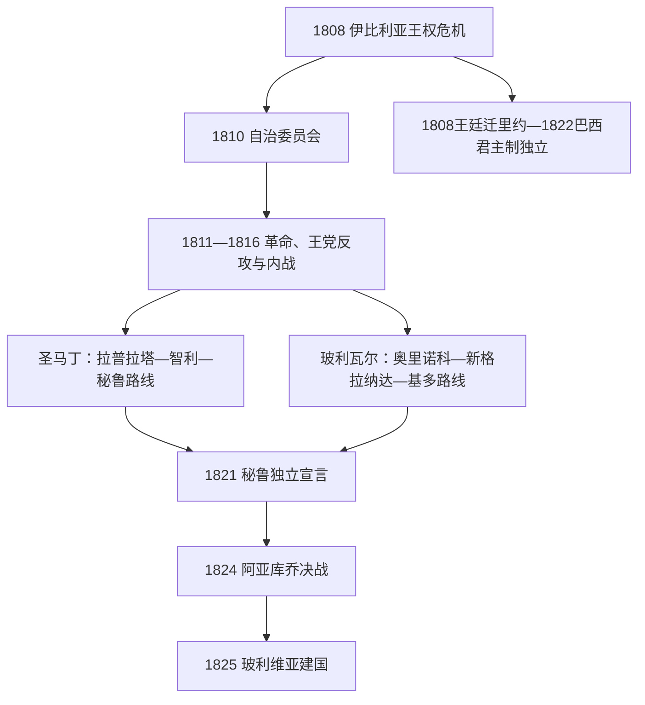

# 南美独立与国家形成

## 时间

1808-1825年为核心，国家边界和政体整合持续至19世纪后期。

## 概括

拿破仑入侵伊比利亚半岛造成西班牙王权危机，南美各地出现自治委员会、地方战争和新的国家方案。独立不是一个统一革命：玻利瓦尔、圣马丁、苏克雷及各地军民组织在不同地区作战；地方精英、原住民、自由有色人种、奴隶与保王派的目标也不相同。巴西因葡萄牙王室在里约热内卢而走向君主制独立。独立后，旧总督区并未自动变为稳定国家，内战、地区主义、边界战争和外债深刻影响新政体。

## 主要节点

| 时间 | 事件 | 意义 |
|---|---|---|
| 1808年 | 葡萄牙王室迁往巴西；西班牙本土王权危机 | 殖民地与宗主国关系被重新定义。 |
| 1810年 | 加拉加斯、布宜诺斯艾利斯、波哥大等地形成自治政府 | 多地革命开始，但不等于立即稳定独立。 |
| 1816年 | 拉普拉塔联合省宣布独立 | 阿根廷国家形成的重要法律节点。 |
| 1817-1818年 | 圣马丁越安第斯、智利独立巩固 | 开辟通向秘鲁的解放路线。 |
| 1819年 | 大哥伦比亚成立 | 试图把新格拉纳达、委内瑞拉、厄瓜多尔整合为共和国。 |
| 1821年 | 秘鲁宣布独立 | 王党势力仍在安第斯内陆作战。 |
| 1822年 | 巴西独立 | 佩德罗一世成为皇帝，巴西未立即成为共和国。 |
| 1824年 | 阿亚库乔战役 | 西班牙在南美大陆的大规模王党军被击败。 |
| 1825年 | 玻利维亚独立 | 上秘鲁形成新共和国。 |
| 1830年 | 大哥伦比亚解体 | 哥伦比亚、委内瑞拉、厄瓜多尔各自发展。 |

## 关键辨析

- 独立战争常以“民族解放”概括，但当时的政治共同体、国籍、边界和人民主权仍在形成；许多参与者首先效忠于城市、省份、教会或地方网络。
- 西班牙美洲的独立并未自动废除奴隶制、种族等级、庄园结构和原住民土地压力。
- 巴西独立在战争烈度、君主制延续和领土统一方面与西属美洲不同。
- 大哥伦比亚、秘鲁—玻利维亚邦联等跨国方案说明“现代国界”不是独立时已经确定的结果。

## 独立战争进程图

## 分阶段过程

1. **王权危机与自治（1808—1810）**：拿破仑迫使西班牙国王退位后，各地争论主权在君主缺位时应归谁。自治委员会最初有人仍以费尔南多七世名义行动，革命目标并非从第一天就一致。
2. **早期共和国与王党反攻（1811—1816）**：委内瑞拉、基多、新格拉纳达和智利的革命政府受到地方竞争、财政短缺、奴隶与自由有色人诉求分化以及王党军反攻；委内瑞拉第一、第二共和国和智利“旧祖国”先后失败。拉普拉塔因地方民兵、港口资源和王党核心较远而维持革命中心。
3. **跨区域解放战争（1817—1822）**：圣马丁越过安第斯，在查卡布科、迈普巩固智利，再从海路进入秘鲁；玻利瓦尔由奥里诺科越岭，在博亚卡、卡拉沃沃取得胜利，苏克雷在皮钦查控制基多。1822年瓜亚基尔会晤后，圣马丁退出，北方军队承担安第斯最后战役。
4. **王党核心崩溃（1823—1825）**：利马的独立宣言并未消灭高地王党军。胡宁、阿亚库乔战役击溃主要野战力量，上秘鲁在1825年建立玻利维亚；卡亚俄要塞残余守军至1826年才投降。
5. **国家形成而非战争终点（1825年后）**：大哥伦比亚和中美洲等联合方案解体，秘鲁—玻利维亚邦联短命；省份、港口、军队和财政围绕宪法持续内战。独立同时保留并改造奴隶制、贡赋、庄园和教会财产等结构。

## 胜利条件与后续脆弱性

- **结构因素**：殖民改革排斥美洲出生精英，城市和地区经济利益分化；大西洋革命语言提供了新的主权方案。
- **外部因素**：西班牙本土战争、1820年自由革命和跨大西洋补给困难削弱王党；英国商贸、志愿军和海上力量提供间接支持，但不能替代本地动员。
- **直接转折**：革命军跨地区协同、动员原住民和非白人士兵、争取或迫使地方精英改换阵营，使王党核心逐步孤立。
- **独立后危机**：战争摧毁税源并扩张军队，外债和关税集中在少数港口；缺乏公认继承规则使考迪罗和军队成为政治仲裁者。各国完整元首序列分别见[北部南美国家元首表](/%E4%BA%BA%E6%96%87%E7%A7%91%E5%AD%A6/%E5%8E%86%E5%8F%B2/%E7%BE%8E%E6%B4%B2/%E5%8D%97%E7%BE%8E/%E5%8C%97%E9%83%A8%E5%8D%97%E7%BE%8E%E5%9B%BD%E5%AE%B6%E5%85%83%E9%A6%96%E8%A1%A8.md)、[安第斯共和国国家元首表](/%E4%BA%BA%E6%96%87%E7%A7%91%E5%AD%A6/%E5%8E%86%E5%8F%B2/%E7%BE%8E%E6%B4%B2/%E5%8D%97%E7%BE%8E/%E5%AE%89%E7%AC%AC%E6%96%AF%E5%85%B1%E5%92%8C%E5%9B%BD%E5%9B%BD%E5%AE%B6%E5%85%83%E9%A6%96%E8%A1%A8.md)、[拉普拉塔共和国国家元首表](/%E4%BA%BA%E6%96%87%E7%A7%91%E5%AD%A6/%E5%8E%86%E5%8F%B2/%E7%BE%8E%E6%B4%B2/%E5%8D%97%E7%BE%8E/%E6%8B%89%E6%99%AE%E6%8B%89%E5%A1%94%E5%85%B1%E5%92%8C%E5%9B%BD%E5%9B%BD%E5%AE%B6%E5%85%83%E9%A6%96%E8%A1%A8.md)。

## 演变关系

- 殖民背景：[西属南美与葡属巴西](/%E4%BA%BA%E6%96%87%E7%A7%91%E5%AD%A6/%E5%8E%86%E5%8F%B2/%E7%BE%8E%E6%B4%B2/%E5%8D%97%E7%BE%8E/%E8%A5%BF%E5%B1%9E%E5%8D%97%E7%BE%8E%E4%B8%8E%E8%91%A1%E5%B1%9E%E5%B7%B4%E8%A5%BF.md)。
- 后续国家史：[北部南美与大哥伦比亚](/%E4%BA%BA%E6%96%87%E7%A7%91%E5%AD%A6/%E5%8E%86%E5%8F%B2/%E7%BE%8E%E6%B4%B2/%E5%8D%97%E7%BE%8E/%E5%8C%97%E9%83%A8%E5%8D%97%E7%BE%8E%E4%B8%8E%E5%A4%A7%E5%93%A5%E4%BC%A6%E6%AF%94%E4%BA%9A.md)、[安第斯共和国](/%E4%BA%BA%E6%96%87%E7%A7%91%E5%AD%A6/%E5%8E%86%E5%8F%B2/%E7%BE%8E%E6%B4%B2/%E5%8D%97%E7%BE%8E/%E5%AE%89%E7%AC%AC%E6%96%AF%E5%85%B1%E5%92%8C%E5%9B%BD.md)、[拉普拉塔、巴拉圭与乌拉圭](/%E4%BA%BA%E6%96%87%E7%A7%91%E5%AD%A6/%E5%8E%86%E5%8F%B2/%E7%BE%8E%E6%B4%B2/%E5%8D%97%E7%BE%8E/%E6%8B%89%E6%99%AE%E6%8B%89%E5%A1%94%E3%80%81%E5%B7%B4%E6%8B%89%E5%9C%AD%E4%B8%8E%E4%B9%8C%E6%8B%89%E5%9C%AD.md)。
- 所属总览：[南美历史](/%E4%BA%BA%E6%96%87%E7%A7%91%E5%AD%A6/%E5%8E%86%E5%8F%B2/%E7%BE%8E%E6%B4%B2/%E5%8D%97%E7%BE%8E/README.md)。
