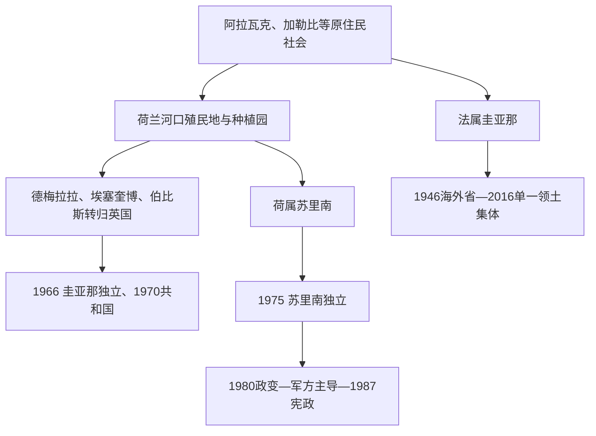

# 圭亚那与苏里南

## 时间

17世纪至今；殖民地形成、奴隶制与契约劳工、20世纪独立为主线。

## 概括

南美北岸的圭亚那与苏里南不能简单并入西属美洲或葡属巴西。苏里南长期受荷兰统治；圭亚那由英国控制的殖民地整合而成；法属圭亚那至今仍是法国海外属地。种植园、被奴役非洲人后裔、逃奴社群、印度和爪哇契约劳工、原住民及多语言社会，使这里的历史与加勒比和大西洋世界同样紧密。

## 政治演变

| 地区 | 殖民遗产 | 独立 / 当代地位 |
|---|---|---|
| 圭亚那 | 荷兰殖民地后转归英国，英语制度与加勒比联系突出 | 1966年独立；族群政治、资源开发和与委内瑞拉的埃塞奎博争议持续存在。 |
| 苏里南 | 荷兰殖民、糖和咖啡种植园 | 1975年独立；荷兰语为官方语言，多族群社会显著。 |
| 法属圭亚那 | 法国殖民与惩罚流放地 | 1946年成为法国海外省，使用欧盟和法国制度。 |

## 重要主题

- 奴隶制废除后，殖民政府引入印度、爪哇和华人等契约劳工，改变人口结构。
- 马龙人（逃离种植园奴役者及其后代）形成自主社区，与殖民政府长期冲突并缔结条约。
- 大河、雨林和低人口密度使国家控制、基础设施和资源开发呈现不同于安第斯与南锥体的形态。
- 石油、黄金、林业和海岸土地使环境、原住民和国际边界问题在当代更突出。

## 演进图

## 殖民、劳工与独立过程

- **殖民竞争**：欧洲据点主要沿可航河流和海岸圩田展开，内陆并未被同等控制。荷兰建立埃塞奎博、德梅拉拉、伯比斯和苏里南种植园；1814年后前三者正式归英国，1831年合为英属圭亚那。法属圭亚那的种植园收益较弱，19世纪又被用作惩罚流放地。
- **奴隶制与马龙社会**：甘蔗、咖啡和棉花依赖被奴役非洲人。1763年伯比斯起义一度威胁殖民秩序；苏里南马龙社群以丛林和河流网络维持自治，18世纪若干条约迫使荷兰承认部分社群。
- **废奴后的契约劳动**：英国1834年废奴并经学徒期至1838年完全解放；荷兰1863年废奴后还有十年国家监督。殖民者随后从英属印度、爪哇、中国和葡属马德拉等地招募契约工，土地、语言、宗教与政党基础由此重组。
- **自治与独立**：英属圭亚那1953年普选宪法被英国暂停，贾根与伯纳姆分裂后政治逐渐族群化；1966年独立、1970年成为共和国、1980年改行政总统制。苏里南1954年获王国内部自治，1975年经谈判独立；1980年军人政变、1982年“十二月杀戮”和内战破坏民主，1987年宪法后逐步恢复选举。
- **法属圭亚那路径**：1946年海外省化不是独立，2016年省、区机构合并为圭亚那领土集体；法国行政长官代表中央国家，民选领土集体主席负责地方自治，两类权力并存。
- **当代资源转折**：圭亚那近海石油使财政规模激增，也放大治理、分配和埃塞奎博边界风险；苏里南面临债务、黄金开采和未来近海油气选择；法属圭亚那同时存在航天中心、非法采金、生活成本与自治诉求。完整元首、总理及法属圭亚那行政长官见[圭亚那与苏里南国家元首及行政首脑表](/%E4%BA%BA%E6%96%87%E7%A7%91%E5%AD%A6/%E5%8E%86%E5%8F%B2/%E7%BE%8E%E6%B4%B2/%E5%8D%97%E7%BE%8E/%E5%9C%AD%E4%BA%9A%E9%82%A3%E4%B8%8E%E8%8B%8F%E9%87%8C%E5%8D%97%E5%9B%BD%E5%AE%B6%E5%85%83%E9%A6%96%E5%8F%8A%E8%A1%8C%E6%94%BF%E9%A6%96%E8%84%91%E8%A1%A8.md)。

## 演变关系

- 大西洋殖民背景：[西属南美与葡属巴西](/%E4%BA%BA%E6%96%87%E7%A7%91%E5%AD%A6/%E5%8E%86%E5%8F%B2/%E7%BE%8E%E6%B4%B2/%E5%8D%97%E7%BE%8E/%E8%A5%BF%E5%B1%9E%E5%8D%97%E7%BE%8E%E4%B8%8E%E8%91%A1%E5%B1%9E%E5%B7%B4%E8%A5%BF.md)。
- 区域当代史：[现代南美区域秩序](/%E4%BA%BA%E6%96%87%E7%A7%91%E5%AD%A6/%E5%8E%86%E5%8F%B2/%E7%BE%8E%E6%B4%B2/%E5%8D%97%E7%BE%8E/%E7%8E%B0%E4%BB%A3%E5%8D%97%E7%BE%8E%E5%8C%BA%E5%9F%9F%E7%A7%A9%E5%BA%8F.md)。
- 所属总览：[南美历史](/%E4%BA%BA%E6%96%87%E7%A7%91%E5%AD%A6/%E5%8E%86%E5%8F%B2/%E7%BE%8E%E6%B4%B2/%E5%8D%97%E7%BE%8E/README.md)。
