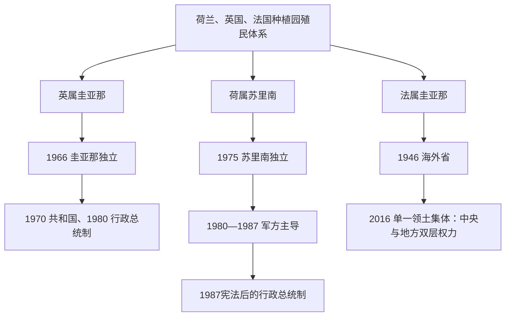

# 圭亚那与苏里南国家元首及行政首脑表

## 范围与口径

圭亚那、苏里南和法属圭亚那分别继承英国、荷兰和法国制度，不能用同一张“总统表”套用。圭亚那1970年前由总督代表英国君主、总理掌政府；1980年后实行行政总统制。苏里南独立初期仍有总理，1987年宪法后总统兼政府首脑。法属圭亚那不是独立国家：法国总统为国家元首，法国政府及行政长官代表中央国家，圭亚那领土集体主席负责地方自治事务。现代信息核验截至2026年7月14日。

## 权力结构演进图

## 英属圭亚那独立前最后阶段的殖民行政首脑

| 总督 | 任期 | 职位 | 关键过程 |
|---|---|---|---|
| 戈登·莱瑟姆 | 1941—1946 | 英属圭亚那总督 | 二战与战后政治改革起点。 |
| 查尔斯·坎贝尔·伍利 | 1947—1953 | 总督 | 普选与人民进步党崛起；1953年宪法被英国暂停。 |
| 阿尔弗雷德·萨维奇 | 1953—1955 | 总督 | 紧急殖民统治。 |
| 帕特里克·缪尔·雷尼森 | 1955—1958 | 总督 | 恢复有限选举与政党分裂。 |
| 拉尔夫·格雷 | 1958—1964 | 总督 | 自治政府、族群党派竞争与罢工暴力。 |
| 理查德·卢伊特 | 1964—1966 | 总督；独立后短任总督 | 伯纳姆联合政府与独立谈判。 |

## 圭亚那国家元首完整表

| 国家元首 | 任期 | 职位 / 取得权力方式 | 实际权力与备注 |
|---|---|---|---|
| 理查德·卢伊特 | 1966年5—12月 | 总督（代表英国君主） | 独立初期礼仪国家元首；福布斯·伯纳姆任总理并掌政府实权。 |
| 戴维·罗斯 | 1966—1969 | 总督 | 礼仪元首。 |
| 爱德华·勒克胡 | 1969—1970 | 总督代行 | 转为共和国前过渡。 |
| 阿瑟·钟 | 1970—1980 | 礼仪总统 | 圭亚那成为共和国；政府实权仍在总理伯纳姆。 |
| **福布斯·伯纳姆** | 1980—1985 | 首任行政总统；任内去世 | 1980年宪法把总统变为国家元首兼政府首脑；一党优势与合作社会主义。 |
| 德斯蒙德·霍伊特 | 1985—1992 | 总理由宪法继任后选举 | 经济开放，1992年恢复被广泛接受的竞争选举。 |
| 切迪·贾根 | 1992—1997 | 选举；任内去世 | 人民进步党回归。 |
| 塞缪尔·海因兹 | 1997年3—12月 | 总理由宪法继任 | 完成贾根去世后的过渡。 |
| 珍妮特·贾根 | 1997—1999 | 选举；因健康辞职 | 首位女性总统。 |
| 巴拉特·贾格迪奥 | 1999—2011 | 总理继任后两次选举 | 债务减免、资源与气候政策。 |
| 唐纳德·拉莫塔尔 | 2011—2015 | 选举 | 少数政府与资源发现前夜。 |
| 戴维·格兰杰 | 2015—2020 | 选举；2018年不信任案后延迟选举引发争议 | 联盟政府、石油开发准备。 |
| **穆罕默德·伊尔凡·阿里** | 2020年至今 | 选举；2025年连任 | 截至2026年7月14日仍任行政总统；海上石油收入和埃塞奎博争议为核心议题。 |

## 圭亚那总理完整表

| 总理 | 任期 | 地位 | 与总统的权力关系 |
|---|---|---|---|
| 福布斯·伯纳姆 | 1966—1980 | 独立后总理 | 1970年前为政府首脑，1970—1980年在礼仪总统之下掌实权。 |
| 普托勒密·里德 | 1980—1984 | 总理兼第一副总统 | 行政总统制下总理从属于总统。 |
| 德斯蒙德·霍伊特 | 1984—1985 | 总理兼第一副总统 | 伯纳姆去世后继任总统。 |
| 汉密尔顿·格林 | 1985—1992 | 总理 | 霍伊特政府。 |
| 塞缪尔·海因兹 | 1992—1997 | 总理 | 贾根去世后短任总统。 |
| 珍妮特·贾根 | 1997年3—12月 | 总理 | 随后当选总统。 |
| 塞缪尔·海因兹 | 1997—1999 | 总理 | 珍妮特·贾根政府。 |
| 巴拉特·贾格迪奥 | 1999年8月 | 总理 | 数日后继任总统。 |
| 塞缪尔·海因兹 | 1999—2015 | 总理 | 贾格迪奥与拉莫塔尔政府。 |
| 摩西·纳加穆图 | 2015—2020 | 总理 | 格兰杰政府。 |
| 马克·菲利普斯 | 2020年至今 | 总理兼第一副总统 | 截至2026年7月14日在任；总统仍为政府首脑。 |

## 荷属苏里南自治与独立前最后阶段总督

| 总督 | 任期 | 地位 | 关键过程 |
|---|---|---|---|
| 约翰内斯·科内利斯·布龙斯 | 1944—1948 | 荷属苏里南总督 | 二战末期与自治讨论。 |
| 威廉·胡恩德尔 | 1948—1949 | 代理总督 | 过渡。 |
| 扬·克拉塞斯 | 1949—1956 | 总督 | 1954年《荷兰王国宪章》后苏里南获得内部自治。 |
| 扬·范蒂尔堡 | 1956—1962 | 总督 | 自治政府扩大。 |
| 阿奇博尔德·柯里 | 1962—1964 | 总督 | 首位苏里南裔总督之一。 |
| 亨利·吕西安·德弗里斯 | 1965—1967 | 总督 | 独立谈判前期。 |
| 约翰·费里尔 | 1968—1975 | 总督 | 1975年独立时转任首任总统。 |

## 苏里南国家元首完整表

| 国家元首 / 军事过渡 | 任期 | 取得权力方式 | 实际权力与备注 |
|---|---|---|---|
| **约翰·费里尔** | 1975—1980 | 独立后总统；在军方压力下辞职 | 议会制时期礼仪倾向的国家元首，亨克·阿龙任政府首脑。 |
| 全国军事委员会 | 1980年8月13—15日直接代行总统职权；委员会延续至1987年 | 德西·鲍特瑟、罗伊·霍布、拉蒙·阿布拉罕斯、斯坦利·朱曼、查斯·迈纳尔斯、劳伦斯·内德、米歇尔·范雷、巴德里塞因·西塔尔 | 八名初始委员构成军事权力中心；西塔尔最初任主席，鲍特瑟凭陆军司令职位迅速成为实际强人。费里尔被迫辞职至钦阿森就任总统的两日间，委员会直接行使国家元首权力。 |
| 亨克·钦阿森 | 1980—1982 | 军方指定总统兼一度任总理；被迫辞职 | 名义文人元首，鲍特瑟掌军权。 |
| 德西·鲍特瑟 | 1982年2月4—8日 | 军事过渡实际元首 | 撤换钦阿森后安排新总统。 |
| 弗雷德·拉姆达特·米西耶 | 1982—1988 | 军方指定总统 | 鲍特瑟作为军队司令和全国军事委员会领袖掌实际最高权力；1982年十二月杀戮。 |
| 拉姆塞瓦克·尚卡尔 | 1988—1990 | 新宪法下选举产生；军事政变推翻 | 民主恢复的首任行政总统。 |
| 伊万·格拉诺赫斯特主持军事过渡 | 1990年12月24—29日 | 军事委员会实际元首 | “电话政变”后的五天过渡。 |
| 约翰·克拉赫 | 1990—1991 | 国民议会选出临时总统 | 主持选举与交接。 |
| 罗纳德·费内蒂安 | 1991—1996 | 议会选举 | 民主与财政重建。 |
| 朱尔斯·韦登博斯 | 1996—2000 | 议会选举 | 鲍特瑟阵营回归、经济危机。 |
| 罗纳德·费内蒂安 | 2000—2010 | 议会选举；两届 | 稳定化与多党联盟。 |
| 德西·鲍特瑟 | 2010—2020 | 议会选举；两届 | 前军事强人转任民选总统；十二月杀戮审判与财政争议。 |
| 钱德里卡佩尔萨德·“昌”·桑托基 | 2020—2025 | 议会选举 | 债务重组；2025年交权。 |
| **珍妮弗·海尔林斯-西蒙斯** | 2025年7月16日至今 | 国民议会选举 | 首位女性总统；截至2026年7月14日仍任国家元首兼政府首脑。 |

## 苏里南总理完整表

| 总理 | 任期 | 地位 | 备注 |
|---|---|---|---|
| 亨克·阿龙 | 1975—1980 | 总理 | 独立初期政府首脑，军事政变推翻。 |
| 亨克·钦阿森 | 1980—1982 | 总理兼总统 | 军方监督下执政。 |
| 亨利·内伊霍斯特 | 1982年 | 总理 | 短暂军政内阁。 |
| 埃罗尔·阿利布克斯 | 1983—1984 | 总理 | 军事当局主导。 |
| 维姆·乌登豪特 | 1984—1986 | 总理 | 军政过渡。 |
| 普雷塔普·拉达基顺 | 1986—1987 | 总理 | 恢复文人政党谈判。 |
| 朱尔斯·韦登博斯 | 1987—1988 | 总理 | 1987年宪法转型；1988年总理职位废除。 |

## 法属圭亚那国家与地方权力

| 层级 | 截至2026年7月14日的首脑 | 权限 |
|---|---|---|
| 法兰西共和国国家元首 | 埃马纽埃尔·马克龙 | 法属圭亚那作为法国领土的国家元首；国防、外交、司法框架和国家立法属于共和国制度。 |
| 法国国家驻圭亚那代表 | 安托万·普西耶行政长官 | 代表总理与各部长，负责治安、国家政策和欧盟政策实施。 |
| 圭亚那领土集体 | 加布里埃尔·塞尔维尔，2021年至今 | 由地方议会产生的地方行政首脑，负责地方发展、交通、教育设施和社会政策等法定自治事务。 |

### 1947年以来法国国家驻圭亚那行政长官完整表

| 行政长官 | 就任时间 | 职位说明 |
|---|---|---|
| 罗贝尔·维尼翁 | 1947年4月18日 | 法属圭亚那及伊尼尼首任省长级行政长官；海外省化。 |
| 皮埃尔·马尔维 | 1955年6月1日 | 法国国家代表。 |
| 皮埃尔·瓦特利耶 | 1957年10月1日 | 法国国家代表。 |
| 安德烈·迪布瓦-沙贝尔 | 1958年9月29日 | 法国国家代表。 |
| 勒内·埃里尼亚克 | 1960年11月22日 | 法国国家代表。 |
| 勒内·莱特利耶 | 1963年12月2日 | 法国国家代表。 |
| 保罗·布泰耶 | 1967年7月12日 | 法国国家代表。 |
| 让·蒙弗雷 | 1970年6月16日 | 法国国家代表。 |
| 雅克·德洛奈 | 1971年12月31日 | 法国国家代表。 |
| 埃尔韦·布尔塞耶 | 1974年2月13日 | 法国国家代表。 |
| 让·勒迪雷阿克 | 1977年5月20日 | 法国国家代表。 |
| 德西雷·卡利 | 1980年2月16日 | 法国国家代表。 |
| 马克西姆·贡萨尔沃 | 1981年7月27日 | 法国国家代表。 |
| 克洛德·西尔贝尔赞 | 1982年7月26日 | 法国国家代表。 |
| 贝尔纳·库尔图瓦 | 1984年9月19日 | 法国国家代表。 |
| 雅克·德瓦特尔 | 1986年5月20日 | 法国国家代表。 |
| 让-皮埃尔·拉克鲁瓦 | 1988年8月22日 | 法国国家代表。 |
| 让-弗朗索瓦·迪基亚拉 | 1990年7月11日 | 法国国家代表。 |
| 让-弗朗索瓦·科尔代 | 1992年5月27日 | 法国国家代表。 |
| 皮埃尔·达尔图 | 1995年1月6日 | 法国国家代表。 |
| 多米尼克·维安 | 1997年2月3日 | 法国国家代表。 |
| 亨利·马斯 | 1999年8月2日 | 法国国家代表。 |
| 昂热·曼奇尼 | 2002年9月2日 | 法国国家代表。 |
| 让-皮埃尔·拉弗拉基耶尔 | 2006年7月20日 | 法国国家代表。 |
| 达尼埃尔·费雷 | 2009年2月19日 | 法国国家代表。 |
| 德尼·拉贝 | 2011年5月16日 | 法国国家代表。 |
| 埃里克·施皮茨 | 2013年6月24日 | 法国国家代表。 |
| 马丁·耶格尔 | 2015年12月17日 | 法国国家代表。 |
| 帕特里斯·福尔 | 2017年8月28日 | 法国国家代表。 |
| 马克·德尔格朗德 | 2019年7月10日 | 法国国家代表。 |
| 蒂埃里·克费莱克 | 2020年12月28日 | 法国国家代表。 |
| **安托万·普西耶** | 2023年8月21日至今 | 截至2026年7月14日任圭亚那大区兼圭亚那省行政长官，代表法国国家与政府。 |

## 权力辨析

- 圭亚那1970—1980年的总统阿瑟·钟主要承担礼仪职能，伯纳姆以总理身份掌政府；1980年宪法后伯纳姆成为行政总统。
- 圭亚那总理在行政总统制下仍是重要部长和第一副总统，但总统兼国家元首与政府首脑，不能把总理当作独立行政中心。
- 苏里南1980—1987年总统和总理多由军方指定，鲍特瑟掌军队与实际最高决策；名义职位不足以说明权力。
- 法属圭亚那的行政长官与领土集体主席分别代表中央国家和地方自治，二者不是“总统—总理”关系。
- 英、荷殖民全期行政首脑众多；本表完整覆盖直接通向自治、独立的最后阶段，并把独立后所有国家元首与总理连续列全。

## 相关笔记

- 主笔记：[圭亚那与苏里南](/%E4%BA%BA%E6%96%87%E7%A7%91%E5%AD%A6/%E5%8E%86%E5%8F%B2/%E7%BE%8E%E6%B4%B2/%E5%8D%97%E7%BE%8E/%E5%9C%AD%E4%BA%9A%E9%82%A3%E4%B8%8E%E8%8B%8F%E9%87%8C%E5%8D%97.md)。
