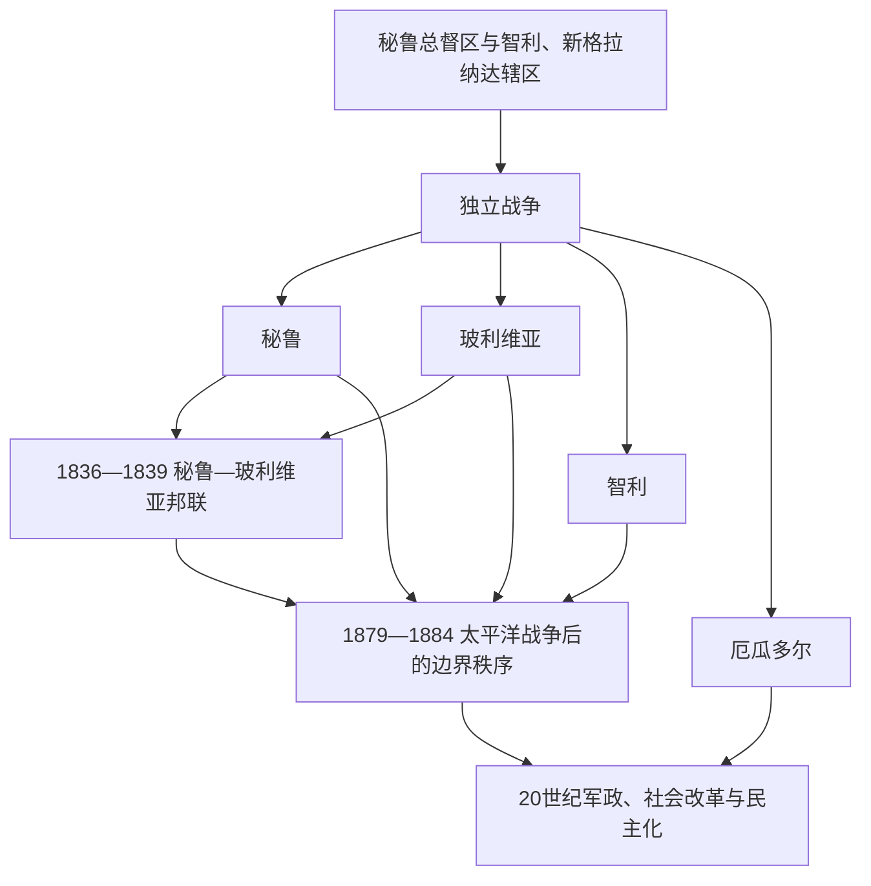

# 安第斯共和国

## 时间

19世纪至今。

## 概括

秘鲁、玻利维亚、智利和厄瓜多尔的共和国史建立在安第斯殖民遗产、矿业与出口经济、原住民社区、军事政治和太平洋世界联系之上。它们并非同一条单线国家史：秘鲁继承利马总督区核心；玻利维亚从上秘鲁独立；智利在中央谷形成较强国家结构并向南部和太平洋扩张；厄瓜多尔则在大哥伦比亚解体后建国。

## 国家形成与主要冲突

| 国家 / 区域 | 关键阶段 | 说明 |
|---|---|---|
| 秘鲁 | 1821-1824年独立；19世纪考迪罗政治；20世纪改革与冲突 | 独立后仍长期面对高地、海岸与亚马孙地区的不均衡整合。 |
| 玻利维亚 | 1825年独立；银、锡、天然气等资源经济 | 多次政变、领土损失与原住民多数政治构成国家主线。 |
| 智利 | 1818年独立；19世纪国家整合与硝石经济 | 太平洋战争后取得硝石产区；1973-1990年经历军政府。 |
| 厄瓜多尔 | 1830年自大哥伦比亚分离 | 高地、海岸和亚马孙地区的经济政治差异持续影响国家。 |

## 重要事件

- 1836-1839年秘鲁—玻利维亚邦联显示安第斯国家仍在探索跨国整合，后在战争中瓦解。
- 1879-1884年太平洋战争中，智利击败秘鲁和玻利维亚；玻利维亚失去太平洋海岸，成为内陆国家。
- 20世纪多国以矿业、石油、农业和进口替代工业化寻求发展，但土地分配、原住民权利和地区不平等持续存在。
- 1960-1980年代的革命、反叛乱和军政府暴力，造成广泛人权创伤；秘鲁的“光辉道路”冲突尤其严重。
- 21世纪的原住民政治、资源民族主义、社会抗争和环境争议，改变了国家与地方社区的关系。

## 演进图

## 国家形成、战争与制度转折

- **秘鲁**：利马1821年宣布独立后，高地王党军仍抵抗至阿亚库乔。独立国家在考迪罗内战、鸟粪财政与债务中形成；卡斯蒂利亚时期废奴并重组国家收入。太平洋战争导致利马被占、并立政府和领土损失；20世纪又经历奥德里亚、1968年军人革命、内部武装冲突和藤森自我政变。2020—2026年频繁继承危机显示行政—国会制度仍不稳定。
- **玻利维亚**：上秘鲁因矿区、地理与玻利瓦尔—苏克雷军政安排于1825年另建国家。圣克鲁斯推动邦联但被外部联盟击败；太平洋战争失海岸、查科战争再失东南领土，战争失败推动军人社会主义和1952年民族革命。矿业国有化、土地改革和普选扩大国家，但军政府至1982年才结束；2006年后多民族国家宪法重写精英与原住民多数关系。
- **智利**：独立后保守派通过1833年宪法、税收和军队形成较稳定中央国家；太平洋战争取得硝石区，国家收入和劳工冲突同步扩大。1891年内战后进入议会共和国，1925年恢复强总统制。1973年政变摧毁宪政，皮诺切特独裁以国家暴力和市场改革重组社会；1990年后民主政府在1980年宪法框架中渐进改革。
- **厄瓜多尔**：高地基多、海岸瓜亚基尔和亚马孙边区的区域联盟反复重组。加西亚·莫雷诺的天主教中央化、阿尔法罗自由革命、20世纪贝拉斯科主义和军政府构成主要周期；石油、美元化、总统罢免与治安危机是近期转折。

## 兴衰与冲突因果

| 类型 | 共同因素 | 不应简化之处 |
|---|---|---|
| 结构因素 | 山地交通、矿产 / 单一出口、土地集中、原住民社区与中央国家关系 | 地理不是命运；铁路、税制、军队和地方联盟会改变国家能力。 |
| 外部压力 | 西班牙复辟、邻国边界战、世界商品价格、冷战干预 | 战争结果取决于财政、补给、联盟与国内合法性，不是单一“武器优劣”。 |
| 直接触发 | 总统继承争议、军队叛变、国会罢免、经济崩溃和大规模抗议 | 直接事件应与长期制度矛盾区分。 |

秘鲁、玻利维亚和智利完整国家元首及集体军政府见[安第斯共和国国家元首表](/%E4%BA%BA%E6%96%87%E7%A7%91%E5%AD%A6/%E5%8E%86%E5%8F%B2/%E7%BE%8E%E6%B4%B2/%E5%8D%97%E7%BE%8E/%E5%AE%89%E7%AC%AC%E6%96%AF%E5%85%B1%E5%92%8C%E5%9B%BD%E5%9B%BD%E5%AE%B6%E5%85%83%E9%A6%96%E8%A1%A8.md)；厄瓜多尔见[北部南美国家元首表](/%E4%BA%BA%E6%96%87%E7%A7%91%E5%AD%A6/%E5%8E%86%E5%8F%B2/%E7%BE%8E%E6%B4%B2/%E5%8D%97%E7%BE%8E/%E5%8C%97%E9%83%A8%E5%8D%97%E7%BE%8E%E5%9B%BD%E5%AE%B6%E5%85%83%E9%A6%96%E8%A1%A8.md)。

## 演变关系

- 文明与殖民背景：[安第斯文明与印加帝国](/%E4%BA%BA%E6%96%87%E7%A7%91%E5%AD%A6/%E5%8E%86%E5%8F%B2/%E7%BE%8E%E6%B4%B2/%E5%8D%97%E7%BE%8E/%E5%AE%89%E7%AC%AC%E6%96%AF%E6%96%87%E6%98%8E%E4%B8%8E%E5%8D%B0%E5%8A%A0%E5%B8%9D%E5%9B%BD.md)、[西属南美与葡属巴西](/%E4%BA%BA%E6%96%87%E7%A7%91%E5%AD%A6/%E5%8E%86%E5%8F%B2/%E7%BE%8E%E6%B4%B2/%E5%8D%97%E7%BE%8E/%E8%A5%BF%E5%B1%9E%E5%8D%97%E7%BE%8E%E4%B8%8E%E8%91%A1%E5%B1%9E%E5%B7%B4%E8%A5%BF.md)。
- 独立背景：[南美独立与国家形成](/%E4%BA%BA%E6%96%87%E7%A7%91%E5%AD%A6/%E5%8E%86%E5%8F%B2/%E7%BE%8E%E6%B4%B2/%E5%8D%97%E7%BE%8E/%E5%8D%97%E7%BE%8E%E7%8B%AC%E7%AB%8B%E4%B8%8E%E5%9B%BD%E5%AE%B6%E5%BD%A2%E6%88%90.md)。
- 所属总览：[南美历史](/%E4%BA%BA%E6%96%87%E7%A7%91%E5%AD%A6/%E5%8E%86%E5%8F%B2/%E7%BE%8E%E6%B4%B2/%E5%8D%97%E7%BE%8E/README.md)。
