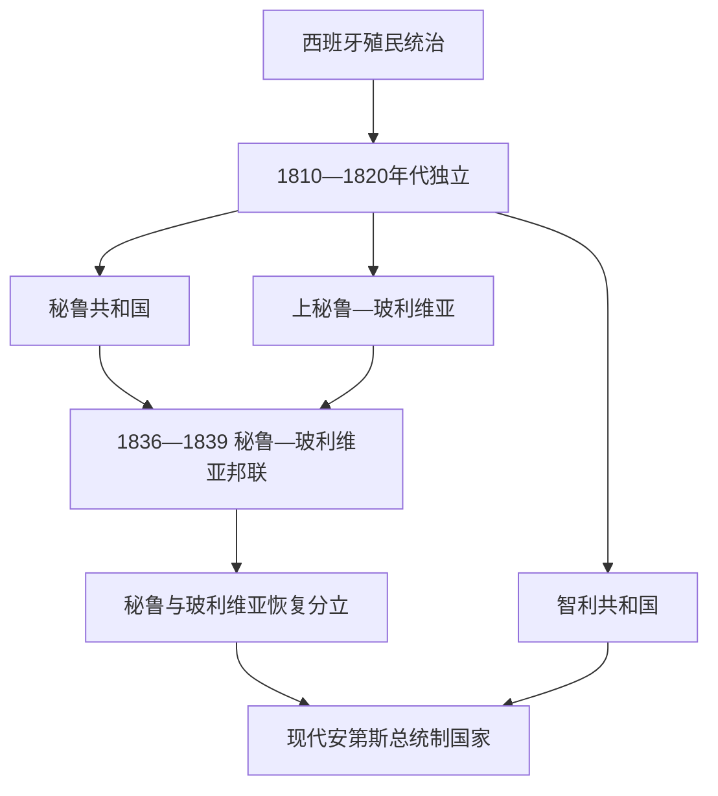

# 安第斯共和国国家元首表

## 范围与口径

本表按实际就任顺序列出秘鲁、玻利维亚和智利自独立革命以来的国家元首、集体政府、事实总统与短期代行者。秘鲁—玻利维亚邦联、并立战争政府和军人委员会均单独标明；总统制国家不虚构议会制总理。早期政变和同时存在的政权，其起止日期在不同史料中可能相差数日，本表以制度连续性和实际控制为主，现代信息核验截至2026年7月14日。

## 政权演进图

## 秘鲁国家元首完整表

| 国家元首 / 集体机构 | 在位 | 地位 / 取得权力方式 | 关键事件与备注 |
|---|---|---|---|
| 何塞·德·圣马丁 | 1821—1822 | 秘鲁护国公 | 宣布独立并建立临时制度，因政治军事分歧辞职。 |
| 最高执政委员会 | 1822—1823 | 何塞·德·拉马尔、费利佩·安东尼奥·阿尔瓦拉多、曼努埃尔·萨拉萨尔·伊·巴基哈诺 | 国会任命的集体行政，王党反攻中垮台。 |
| 何塞·德拉里瓦·阿圭罗 | 1823年2—6月；后在特鲁希略继续主张 | 国会选出首位总统，后被罢免 | 与国会、塔格莱和玻利瓦尔阵营形成并立权力。 |
| 何塞·贝尔纳多·德·塔格莱 | 1823—1824 | 国会任命总统 | 利马危机中与王党谈判，权力转给玻利瓦尔。 |
| **西蒙·玻利瓦尔** | 1824—1826 | 独裁者 / 最高权力 | 胡宁、阿亚库乔胜利后建立中央化制度。 |
| 安德烈斯·德·圣克鲁斯 | 1826—1827 | 政府委员会主席代行 | 玻利瓦尔离境后的过渡。 |
| 何塞·德·拉马尔 | 1827—1829 | 国会选举；政变罢黜 | 对大哥伦比亚战争失利。 |
| 安东尼奥·古铁雷斯·德拉富恩特 | 1829年6—9月 | 事实 / 临时总统 | 加马拉就任前过渡。 |
| 阿古斯丁·加马拉 | 1829—1833 | 临时后宪制总统 | 军人考迪罗与对玻利维亚政策。 |
| 路易斯·何塞·德·奥尔韦戈索 | 1833—1836 | 国会选出；内战中权力分裂 | 1834年佩德罗·巴勃罗·贝穆德斯、1835—1836年费利佩·圣地亚哥·萨拉韦里先后另立政权。 |
| 安德烈斯·德·圣克鲁斯 | 1836—1839 | 秘鲁—玻利维亚邦联最高保护者 | 北秘鲁总统奥尔韦戈索、南秘鲁总统拉蒙·埃雷拉后由胡安·皮奥·德·特里斯坦继任；邦联被智利—秘鲁复国军击败。 |
| 阿古斯丁·加马拉 | 1839—1841 | 复国后临时 / 宪制总统；战死 | 入侵玻利维亚失败。 |
| 曼努埃尔·梅嫩德斯 | 1841—1842 | 国务委员会主席代行 | 加马拉死后继任，被政变推翻。 |
| 胡安·克里索斯托莫·托里科 | 1842年8—10月 | 军事夺权 | 在内战中败于比达尔。 |
| 胡安·弗朗西斯科·德·比达尔 | 1842—1843 | 军政胜利后总统；辞职 | “军事无政府”阶段。 |
| 胡斯托·菲格罗拉 | 1843年3—4月 | 临时总统 | 短暂过渡。 |
| 曼努埃尔·伊格纳西奥·德·比万科 | 1843—1844 | 最高执政官，事实元首 | 与恢复宪政的南部革命政权并立，兵败后流亡。 |
| 多明戈·涅托 | 1843年9月—1844年2月 | 最高政府委员会主席 | 与拉蒙·卡斯蒂利亚共同发动宪政革命；任内去世。 |
| 拉蒙·卡斯蒂利亚 | 1844年2—12月 | 最高政府委员会主席、革命军领袖 | 接替涅托并在卡门阿尔托击败比万科；这一革命政权与利马的法定代行体系一度并存。 |
| 多明戈·埃利亚斯 | 1844年6—8月 | 利马临时执政 | 比万科离开首都后组织“马格纳周”，随后把权力交给菲格罗拉。 |
| 胡斯托·菲格罗拉 | 1844年8—10月 | 国务委员会主席代行 | 短暂恢复法定继承，随后交权给梅嫩德斯。 |
| 曼努埃尔·梅嫩德斯 | 1844年10月—1845年4月 | 临时总统 | 在卡斯蒂利亚军事胜利后恢复宪制政府并主持选举。 |
| **拉蒙·卡斯蒂利亚** | 1845—1851 | 选举 | 鸟粪财政、国家行政整顿与基础设施建设，为其后废奴和取消原住民贡赋奠定条件。 |
| 何塞·鲁菲诺·埃切尼克 | 1851—1855 | 选举；革命推翻 | 债务清偿丑闻。 |
| 拉蒙·卡斯蒂利亚 | 1855—1862 | 革命后临时 / 宪制总统 | 废除奴隶制和原住民贡赋，1860年宪法。 |
| 米格尔·德·圣罗曼 | 1862—1863 | 选举；任内去世 | 货币改革。 |
| 拉蒙·卡斯蒂利亚 | 1863年4月 | 第二副总统临时代行 | 圣罗曼死后的过渡。 |
| 佩德罗·迭斯·坎塞科 | 1863年4—8月 | 第二副总统代行 | 第一副总统返国前代行。 |
| 胡安·安东尼奥·佩塞特 | 1863—1865 | 第一副总统继任；政变推翻 | 与西班牙舰队争端。 |
| 佩德罗·迭斯·坎塞科 | 1865年11月 | 临时总统 | 把权力交给普拉多。 |
| 马里亚诺·伊格纳西奥·普拉多 | 1865—1868 | 革命领袖后宪制总统；辞职 | 反西班牙战争、财政危机。 |
| 佩德罗·迭斯·坎塞科 | 1868年1—8月 | 临时总统 | 主持选举。 |
| 何塞·巴尔塔 | 1868—1872 | 选举；政变中被杀 | 铁路借贷与古铁雷斯兄弟政变。 |
| 托马斯·古铁雷斯 | 1872年7月22—26日 | 事实最高首脑 | 政变失败被杀。 |
| 弗朗西斯科·迭斯·坎塞科 | 1872年7月26—27日 | 第二副总统代行 | 古铁雷斯政变失败后恢复宪制秩序。 |
| 马里亚诺·埃伦西亚·塞瓦略斯 | 1872年7月27日—8月2日 | 第一副总统代行 | 完成巴尔塔余任并保障民选总统帕尔多就任。 |
| 曼努埃尔·帕尔多 | 1872—1876 | 选举 | 首位文人党派总统，财政与硝石政策。 |
| 马里亚诺·伊格纳西奥·普拉多 | 1876—1879 | 选举；战争中离国 | 太平洋战争初期。 |
| 路易斯·拉普埃尔塔 | 1879年12月 | 第一副总统代行 | 被皮埃罗拉夺权。 |
| 尼古拉斯·德·皮埃罗拉 | 1879—1881 | 最高首脑，事实总统 | 利马失守后退入内地。 |
| 弗朗西斯科·加西亚·卡尔德龙 | 1881年3—11月 | 拉马格达莱纳临时政府总统 | 拒绝割地，被智利拘押。 |
| 利萨尔多·蒙特罗 | 1881—1883 | 第一副总统继任 | 在阿雷基帕维持宪制主张。 |
| 米格尔·伊格莱西亚斯 | 1882—1885 | 北部“再生政府”后获承认 | 签署《安孔条约》，与卡塞雷斯内战后辞职。 |
| 安东尼奥·阿雷纳斯 | 1885—1886 | 临时政府委员会主席 | 主持选举。 |
| 安德烈斯·阿韦利诺·卡塞雷斯 | 1886—1890 | 选举 | 战后重建与外债合同。 |
| 雷米希奥·莫拉莱斯·贝穆德斯 | 1890—1894 | 选举；任内去世 | 继承危机。 |
| 胡斯蒂尼亚诺·博尔戈尼奥 | 1894年4—8月 | 第二副总统代行 | 排除第一副总统，主持争议选举。 |
| 安德烈斯·阿韦利诺·卡塞雷斯 | 1894—1895 | 选举争议；革命推翻 | 皮埃罗拉内战获胜。 |
| 曼努埃尔·坎达莫 | 1895年3—9月 | 临时政府委员会主席 | 恢复选举。 |
| 尼古拉斯·德·皮埃罗拉 | 1895—1899 | 选举 | “贵族共和国”制度化。 |
| 爱德华多·洛佩斯·德·罗马尼亚 | 1899—1903 | 选举 | 出口和国家建设。 |
| 曼努埃尔·坎达莫 | 1903—1904 | 选举；任内去世 | 短任。 |
| 塞拉皮奥·卡尔德龙 | 1904年4—9月 | 第二副总统代行 | 主持选举。 |
| 何塞·帕尔多·伊·巴雷达 | 1904—1908 | 选举 | 教育和文官制度。 |
| 奥古斯托·B.莱吉亚 | 1908—1912 | 选举 | 第一任。 |
| 吉列尔莫·比林赫斯特 | 1912—1914 | 选举；政变推翻 | 劳工改革与国会冲突。 |
| 奥斯卡·R.贝纳维德斯 | 1914—1915 | 军事过渡 | 主持选举。 |
| 何塞·帕尔多·伊·巴雷达 | 1915—1919 | 选举；政变推翻 | 一战繁荣与劳工冲突。 |
| 奥古斯托·B.莱吉亚 | 1919—1930 | 政变后长期总统 | “十一年统治”、投资与债务；大萧条中被推翻。 |
| 曼努埃尔·马里亚·庞塞·布鲁塞特 | 1930年8月25—27日 | 军事委员会主席 | 两日过渡。 |
| 路易斯·米格尔·桑切斯·塞罗 | 1930—1931 | 军事夺权；辞职 | 军政委员会后参加选举。 |
| 里卡多·莱昂西奥·埃利亚斯 | 1931年3月1—5日 | 临时政府委员会主席 | 桑切斯·塞罗辞职后在利马接管，旋被南部军政压力迫退。 |
| 古斯塔沃·希门尼斯 | 1931年3月5—11日 | 临时政府委员会主席 | 与阿雷基帕革命力量谈判后把权力交给全国政府委员会。 |
| 大卫·萨马内斯·奥坎波 | 1931年3—12月 | 全国政府委员会主席 | 主持选举。 |
| 路易斯·米格尔·桑切斯·塞罗 | 1931—1933 | 选举；遇刺 | 与APRA冲突及对哥伦比亚战争。 |
| 奥斯卡·R.贝纳维德斯 | 1933—1939 | 国会选出；延长任期 | 威权稳定。 |
| 曼努埃尔·普拉多·乌加特切 | 1939—1945 | 选举 | 二战时期。 |
| 何塞·路易斯·布斯塔曼特·伊·里韦罗 | 1945—1948 | 选举；政变推翻 | APRA冲突与经济危机。 |
| 曼努埃尔·奥德里亚 | 1948年10月—1950年6月 | 军事政变后军政府主席 | 1948年10月29日至11月1日由塞农·诺列加在利马短时代掌行政，奥德里亚随后正式就任；压制APRA并准备个人参选。 |
| 塞农·诺列加 | 1950年6月1日—7月28日 | 军政府临时总统 | 奥德里亚为取得候选资格暂离总统职位期间代行。 |
| 曼努埃尔·奥德里亚 | 1950年7月—1956年7月 | 无实质竞争的选举后总统 | 公共工程和社会支出扩大，同时维持威权统治与政治镇压。 |
| 曼努埃尔·普拉多·乌加特切 | 1956—1962 | 选举；政变推翻 | 军方否定1962年选举。 |
| 里卡多·佩雷斯·戈多伊 | 1962—1963 | 军事委员会主席 | 改革并筹备选举。 |
| 尼古拉斯·林德利 | 1963年3—7月 | 军事委员会主席 | 向民选政府移交。 |
| 费尔南多·贝朗德·特里 | 1963—1968 | 选举；政变推翻 | 改革受阻与石油合同危机。 |
| 胡安·贝拉斯科·阿尔瓦拉多 | 1968—1975 | 军事革命政府总统 | 土地改革、国有化和威权发展主义。 |
| 弗朗西斯科·莫拉莱斯·贝穆德斯 | 1975—1980 | 军内政变继任 | 经济调整与宪政移交。 |
| 费尔南多·贝朗德·特里 | 1980—1985 | 选举；第二任 | 民主恢复、债务与“光辉道路”战争。 |
| 阿兰·加西亚 | 1985—1990 | 选举 | 异端经济、恶性通胀和内部冲突。 |
| 阿尔韦托·藤森 | 1990—2000 | 选举；1992年自我政变；辞职被国会拒绝并罢免 | 稳定通胀、击败主要叛乱组织，同时形成威权、腐败和严重人权侵害。 |
| 巴伦廷·帕尼亚瓜 | 2000—2001 | 国会主席继任临时总统 | 民主转型与真相调查。 |
| 亚历杭德罗·托莱多 | 2001—2006 | 选举 | 民主恢复、资源增长与抗议。 |
| 阿兰·加西亚 | 2006—2011 | 选举；第二任 | 经济增长与社会环境冲突。 |
| 奥良塔·乌马拉 | 2011—2016 | 选举 | 政策温和化与采掘冲突。 |
| 佩德罗·巴勃罗·库琴斯基 | 2016—2018 | 选举；辞职 | 国会冲突与腐败指控。 |
| 马丁·比斯卡拉 | 2018—2020 | 副总统继任；国会罢免 | 反腐、解散国会与程序争议。 |
| 曼努埃尔·梅里诺 | 2020年11月10—15日 | 国会主席继任；抗议中辞职 | 任期五天。 |
| 弗朗西斯科·萨加斯蒂 | 2020—2021 | 国会选出过渡总统 | 主持疫情期选举。 |
| 佩德罗·卡斯蒂略 | 2021—2022 | 选举；企图解散国会后被罢免拘押 | 行政—议会持续冲突。 |
| 迪娜·博卢阿特 | 2022—2025年10月 | 副总统继任；国会罢免 | 反政府抗议、致命镇压与合法性危机。 |
| 何塞·赫里 | 2025年10月—2026年2月 | 国会主席继任；辞职 / 被更换 | 过渡政府与透明度争议。 |
| **何塞·马里亚·巴尔卡萨尔** | 2026年2月18—7月28日（预定） | 国会主席继任 | 截至2026年7月14日仍任总统；任期定位为选举与交接过渡。 |

## 玻利维亚国家元首完整表

| 国家元首 / 集体机构 | 在位 | 地位 / 取得权力方式 | 关键事件与备注 |
|---|---|---|---|
| **西蒙·玻利瓦尔** | 1825年8—12月 | 解放者 / 临时总统 | 制宪并以苏克雷代行。 |
| 安东尼奥·何塞·德·苏克雷 | 1825—1828 | 临时后宪制总统 | 建立新国家制度；兵变和外部干预后辞职。 |
| 何塞·马里亚·佩雷斯·德·乌尔迪内亚 | 1828年4—8月 | 部长会议主席代行 | 苏克雷受伤后过渡。 |
| 何塞·米格尔·德·贝拉斯科 | 1828年8—12月 | 临时总统 | 秘鲁干预后的过渡。 |
| 佩德罗·布兰科·索托 | 1828年12月—1829年1月 | 国会选出；军变中遇害 | 仅数日。 |
| 何塞·米格尔·德·贝拉斯科 | 1829年1—5月 | 临时总统 | 主持圣克鲁斯就任。 |
| **安德烈斯·德·圣克鲁斯** | 1829—1839 | 选举；后兼秘鲁—玻利维亚邦联最高保护者 | 行政改革、军队与邦联；战争失败后流亡。 |
| 何塞·米格尔·德·贝拉斯科 | 1839—1841 | 复国总统；政变与内战中失势 | 废除邦联制度。 |
| 塞瓦斯蒂安·阿格雷达 | 1841年6—7月 | 军事夺权 / 临时总统 | 短暂政变。 |
| 马里亚诺·恩里克·卡尔沃 | 1841年7—9月 | 副总统代行 | 首位以副总统身份继任者。 |
| 何塞·巴利维安 | 1841—1847 | 战场胜利后临时 / 宪制总统 | 因加维战役巩固国家。 |
| 欧塞维奥·吉拉特 | 1847年12月—1848年1月 | 国务委员会主席代行 | 被贝拉斯科推翻。 |
| 何塞·米格尔·德·贝拉斯科 | 1848年1—12月 | 军事夺权 | 被贝尔苏推翻。 |
| 曼努埃尔·伊西多罗·贝尔苏 | 1848—1855 | 军事夺权后宪制总统 | 民众考迪罗政治。 |
| 豪尔赫·科尔多瓦 | 1855—1857 | 选举；政变推翻 | 贝尔苏盟友。 |
| 何塞·马里亚·利纳雷斯 | 1857—1861 | 革命夺权；自称独裁者 | 文官改革与威权。 |
| 政府委员会 | 1861年1—5月 | 何塞·马里亚·阿查、鲁佩托·费尔南德斯、曼努埃尔·安东尼奥·桑切斯 | 推翻利纳雷斯后的集体元首。 |
| 何塞·马里亚·阿查 | 1861—1864 | 委员会后宪制总统；政变推翻 | 政治暴力和军人叛乱。 |
| 马里亚诺·梅尔加雷霍 | 1864—1871 | 军事政变，事实总统 | 领土条约、土地侵夺与个人独裁。 |
| 阿古斯丁·莫拉莱斯 | 1871—1872 | 革命夺权；遇刺 | 推翻梅尔加雷霍。 |
| 托马斯·弗里亚斯 | 1872—1873 | 国务委员会主席继任 | 主持选举。 |
| 阿道弗·巴利维安 | 1873—1874 | 选举；任内去世 | 文人过渡。 |
| 托马斯·弗里亚斯 | 1874—1876 | 国务委员会主席继任；政变推翻 | 达萨夺权。 |
| 伊拉里翁·达萨 | 1876—1879 | 军事政变；战争中被废 | 太平洋战争初期失利。 |
| 佩德罗·何塞·多明戈·德·格拉 | 1879年4月17日—9月10日 | 部长会议主席代行 | 达萨赴前线统军后主持国内行政，任内去世。 |
| 塞拉皮奥·雷耶斯·奥尔蒂斯 | 1879年9月11日—12月28日 | 部长会议主席代行 | 接替格拉；达萨在塔克纳被军队废黜后失去权力。 |
| 拉巴斯军民政府委员会 | 1879年12月28日—1880年1月19日 | 乌拉迪斯劳·席尔瓦、鲁德辛多·卡瓦哈尔、多纳托·巴斯克斯 | 以席尔瓦为主席推翻达萨；起初未获全国各省一致承认，随后推举坎佩罗。 |
| 纳西索·坎佩罗 | 1880年1月—1884年 | 临时后宪制总统 | 1月由政府委员会推举，5月获国民大会确认；主持太平洋战争末期与战后重建。 |
| 格雷戈里奥·帕切科 | 1884—1888 | 国会选出 | 银矿寡头政治。 |
| 阿尼塞托·阿尔塞 | 1888—1892 | 选举 | 铁路与保守精英统治。 |
| 马里亚诺·巴普蒂斯塔 | 1892—1896 | 选举 | 保守党延续。 |
| 塞韦罗·费尔南德斯 | 1896—1899 | 选举；联邦战争推翻 | 自由派崛起。 |
| 自由派政府委员会 | 1899年4—10月 | 何塞·曼努埃尔·潘多、塞拉皮奥·雷耶斯·奥尔蒂斯、马卡里奥·皮尼利亚 | 战争胜利后的集体元首。 |
| 何塞·曼努埃尔·潘多 | 1899—1904 | 委员会后宪制总统 | 首都权力转向拉巴斯、橡胶战争。 |
| 伊斯梅尔·蒙特斯 | 1904—1909 | 选举 | 自由派现代化。 |
| 埃利奥多罗·比利亚松 | 1909—1913 | 选举 | 制度连续。 |
| 伊斯梅尔·蒙特斯 | 1913—1917 | 选举；第二任 | 铁路与财政扩张。 |
| 何塞·古铁雷斯·格拉 | 1917—1920 | 选举；政变推翻 | 自由派寡头终结。 |
| 1920年政府委员会 | 1920—1921 | 包蒂斯塔·萨阿韦德拉、何塞·马里亚·埃斯卡列尔、何塞·曼努埃尔·拉米雷斯 | 共和派政变后的集体元首。 |
| 包蒂斯塔·萨阿韦德拉 | 1921—1925 | 制宪会议选出 | 社会立法与个人统治。 |
| 费利佩·塞贡多·古斯曼 | 1925—1926 | 参议院主席临时总统 | 主持重选。 |
| 埃尔南多·西莱斯·雷耶斯 | 1926—1930 | 选举；辞职 | 大萧条与延任危机。 |
| 西莱斯部长会议 | 1930年5月28日—6月28日 | 集体代行行政权 | 成员为赫尔曼·安特洛·阿劳斯、富兰克林·梅尔卡多、菲德尔·维加、阿尔韦托·迭斯·德·梅迪纳、何塞·阿吉雷·阿查、大卫·托罗·鲁伊洛瓦、卡洛斯·班塞尔·阿利亚加、埃塞基耶尔·罗梅辛·卡尔德龙；西莱斯辞职后接管，延任方案和社会反对引发军变。 |
| 1930年军事政府委员会 | 1930年6月28日—1931年3月5日 | 卡洛斯·布兰科·加林多、何塞·路易斯·兰萨、奥斯卡·马里亚卡·潘多、菲利韦托·奥索里奥·特列斯、埃米利奥·冈萨雷斯·金特、贝纳迪诺·毕尔巴鄂·里奥哈 | 布兰科·加林多主持部长会议；委员会实行大学自治等改革并举行选举，随后交权给萨拉曼卡。 |
| 丹尼尔·萨拉曼卡 | 1931—1934 | 选举；查科战争中军方逼退 | 战争失败削弱文人政府。 |
| 何塞·路易斯·特哈达·索尔萨诺 | 1934—1936 | 副总统继任；军变推翻 | 结束查科战争。 |
| 赫尔曼·布施主持的临时政府委员会 | 1936年5月17—22日 | 军民政变后的集体元首 | 初始成员为布施、路易斯·昆卡、豪尔赫·霍尔丹、恩里克·巴尔迪维索、加夫列尔·戈萨尔韦斯、佩德罗·西尔韦蒂和弗洛伦西奥·坎迪亚；等待大卫·托罗从查科返回。 |
| 大卫·托罗 | 1936年5月22日—1937年7月13日 | 混合后军事政府委员会主席 | 正式委员会由托罗、恩里克·巴尔迪维索、加夫列尔·戈萨尔韦斯、路易斯·昆卡、费尔南多·坎佩罗·阿尔瓦雷斯、奥斯卡·莫斯科索和佩德罗·西尔韦蒂组成；布施、豪尔赫·霍尔丹和温贝托·阿兰迪亚曾在相关成员抵达前代职，政权推行“军人社会主义”。 |
| 赫尔曼·布施 | 1937年7月—1939年8月 | 军事政府委员会主席，后经国民大会确认为宪制总统；任内死亡 | 推翻托罗，继续矿业、劳动和社会改革，1939年宣布独裁统治。 |
| 卡洛斯·金塔尼利亚 | 1939—1940 | 军方临时总统 | 主持选举。 |
| 恩里克·佩尼亚兰达 | 1940—1943 | 选举；政变推翻 | 二战同盟与矿工镇压。 |
| 瓜尔韦托·比利亚罗埃尔 | 1943—1946 | 军政革命后总统；群众暴动中被杀 | 民族主义改革和镇压并存。 |
| 内斯托尔·吉连 | 1946年7—8月 | 高等法院院长临时总统 | 短暂过渡。 |
| 托马斯·蒙赫 | 1946—1947 | 高等法院院长临时总统 | 主持选举。 |
| 恩里克·赫尔佐格 | 1947—1949 | 选举；因病辞职 | MNR反对与矿区冲突。 |
| 马梅托·乌里奥拉戈伊蒂亚 | 1949—1951 | 副总统继任；军方交权 | 拒绝承认1951年选举结果。 |
| 乌戈·巴利维安 | 1951—1952 | 军政府总统 | 被1952年民族革命推翻。 |
| **维克托·帕斯·埃斯登索罗** | 1952—1956 | 革命胜利后总统 | 普选、矿业国有化和土地改革。 |
| 埃尔南·西莱斯·苏亚索 | 1956—1960 | 选举 | 稳定计划与MNR分裂。 |
| 维克托·帕斯·埃斯登索罗 | 1960—1964 | 选举；连任后政变推翻 | 军队重建与继承冲突。 |
| 阿尔弗雷多·奥万多与勒内·巴里恩托斯组成的军事委员会 | 1964年11月4—5日 | 政变后的短暂双首长安排 | 推翻帕斯·埃斯登索罗；两人同任委员会主席的安排迅速转为巴里恩托斯单独主持。 |
| 勒内·巴里恩托斯 | 1964年11月5日—1965年5月26日 | 军事政府委员会主席 | 军方重新掌权并压制矿工和反对派。 |
| 勒内·巴里恩托斯与阿尔弗雷多·奥万多 | 1965年5月26日—1966年1月2日 | 共同总统 | 为平衡军种和个人派系而创设的双元行政；巴里恩托斯为参选辞职。 |
| 阿尔弗雷多·奥万多 | 1966年1月2日—8月6日 | 军事政府委员会主席 | 单独主持选举过渡并把权力交给胜选的巴里恩托斯。 |
| 勒内·巴里恩托斯 | 1966年8月—1969年4月 | 选举；空难去世 | 反叛乱、农村联盟与对矿工运动的镇压。 |
| 路易斯·阿道弗·西莱斯·萨利纳斯 | 1969年4—9月 | 副总统继任；政变推翻 | 短暂文人继承。 |
| 阿尔弗雷多·奥万多 | 1969—1970 | 军事政变 | 左倾军政改革。 |
| 三军执政委员会 | 1970年10月6—7日 | 埃弗兰·瓜查利亚、费尔南多·萨托里、阿尔韦托·阿尔瓦拉辛 | 短暂阻止托雷斯失败。 |
| 胡安·何塞·托雷斯 | 1970—1971 | 军民动员支持的事实总统 | 左翼军政，被班塞尔推翻。 |
| 乌戈·班塞尔 | 1971—1978 | 军事政变；事实总统 | 长期独裁、增长与镇压。 |
| 胡安·佩雷达 | 1978年7—11月 | 争议选举后军事夺权 | 被军内推翻。 |
| 大卫·帕迪利亚 | 1978—1979 | 军事政变 / 过渡 | 举行选举。 |
| 瓦尔特·格瓦拉 | 1979年8—11月 | 国会选出临时总统 | 无候选人过半后的妥协，被政变推翻。 |
| 阿尔韦托·纳图施·布施 | 1979年11月1—16日 | 军事政变，事实总统 | 社会抵抗下退位。 |
| 利迪娅·盖莱尔 | 1979—1980 | 众议院主席临时总统；政变推翻 | 首位女性国家元首。 |
| 路易斯·加西亚·梅萨 | 1980—1981 | 军事政变，事实总统 | 毒品、腐败与严重人权犯罪。 |
| 三军司令委员会 | 1981年8月4日—9月4日 | 塞尔索·托雷利奥、瓦尔多·贝尔纳尔·佩雷拉、奥斯卡·帕莫·罗德里格斯 | 加西亚·梅萨被迫辞职后由陆、空、海军首长集体执政，继续军政体制。 |
| 塞尔索·托雷利奥 | 1981年9月4日—1982年7月21日 | 委员会推举的事实总统 | 国际孤立、经济危机和军内压力迫使其下台。 |
| 吉多·比尔多索 | 1982年7—10月 | 军方过渡总统 | 恢复1980年当选国会。 |
| 埃尔南·西莱斯·苏亚索 | 1982—1985 | 1980年选举授权后就任 | 民主恢复、恶性通胀。 |
| 维克托·帕斯·埃斯登索罗 | 1985—1989 | 国会在无过半候选人中选出 | 新经济政策终结恶性通胀。 |
| 海梅·帕斯·萨莫拉 | 1989—1993 | 国会联盟选出 | 政党协商政治。 |
| 贡萨洛·桑切斯·德洛萨达 | 1993—1997 | 选举 / 国会确认 | 资本化、分权和多文化改革。 |
| 乌戈·班塞尔 | 1997—2001 | 选举 / 国会确认；因病辞职 | 民主身份回归、禁毒冲突。 |
| 豪尔赫·基罗加 | 2001—2002 | 副总统继任 | 完成余任。 |
| 贡萨洛·桑切斯·德洛萨达 | 2002—2003 | 选举 / 国会确认；抗议中辞职 | 天然气战争和致命镇压。 |
| 卡洛斯·梅萨 | 2003—2005 | 副总统继任；辞职 | 天然气公投与社会动员。 |
| 爱德华多·罗德里格斯·贝尔特塞 | 2005—2006 | 最高法院院长依继承顺序任过渡总统 | 主持选举。 |
| **埃沃·莫拉莱斯** | 2006—2019 | 选举；多次连任；危机中辞职 | 原住民多数政治、2009年多民族国家宪法与资源民族主义；2019年选举和军警压力引发权力断裂。 |
| 珍妮娜·阿涅斯 | 2019—2020 | 参议院继承主张下临时总统；合法性有争议 | 过渡中发生严重暴力，后举行选举。 |
| 路易斯·阿尔塞 | 2020—2025 | 选举 | 经济危机、MAS内部冲突与未遂军变。 |
| **罗德里戈·帕斯·佩雷拉** | 2025年11月至今 | 选举 | 截至2026年7月14日仍任总统。 |

## 智利国家元首完整表

| 国家元首 / 集体机构 | 在位 | 地位 / 取得权力方式 | 关键事件与备注 |
|---|---|---|---|
| 马特奥·德·托罗·桑布拉诺 | 1810年9月18日—1811年2月26日 | 第一政府委员会主席 | 委员会完整成员为副主席何塞·安东尼奥·马丁内斯·德·阿尔杜纳特，以及费尔南多·马尔克斯·德拉普拉塔、胡安·马丁内斯·德·罗萨斯、伊格纳西奥·德拉卡雷拉、弗朗西斯科·哈维尔·德·雷纳、胡安·恩里克·罗萨莱斯；秘书为何塞·加斯帕尔·马林、何塞·格雷戈里奥·阿尔戈梅多。委员会以费尔南多七世名义自治，推行自由贸易并召集国会。 |
| 胡安·马丁内斯·德·罗萨斯 | 1811年2月27日—4月2日 | 第一政府委员会临时主席 | 托罗去世、阿尔杜纳特病重后成为主要决策者；镇压菲格罗亚兵变后受温和派制约。 |
| 费尔南多·马尔克斯·德拉普拉塔 | 1811年4月2日—7月4日 | 第一政府委员会主席 | 主持把权力交给第一届国会。 |
| 胡安·安东尼奥·奥瓦列 | 1811年7月4—20日 | 国会主席兼行行政权 | 第一届国会接管国家权力后的首段过渡。 |
| 马丁·卡尔沃·恩卡拉达 | 1811年7月20日—8月5日 | 国会主席兼行行政权 | 在建立独立行政机关前代行。 |
| 曼努埃尔·佩雷斯·德·科塔波斯 | 1811年8月5—11日 | 国会主席兼行行政权 | 主持设立临时行政权机关。 |
| 马丁·卡尔沃·恩卡拉达 | 1811年8月11日—9月4日 | 临时行政权机关主席 | 集体成员为卡尔沃·恩卡拉达、胡安·何塞·阿尔杜纳特、弗朗西斯科·哈维尔·德尔索拉尔；后者由胡安·米格尔·贝纳文特代理。 |
| 胡安·恩里克·罗萨莱斯 | 1811年9月4日—11月16日 | 行政法庭主席 | 完整成员为罗萨莱斯、马丁·卡尔沃·恩卡拉达、胡安·米格尔·贝纳文特、胡安·麦肯纳、何塞·加斯帕尔·马林；由卡雷拉第一次政变建立。 |
| 何塞·米格尔·卡雷拉 | 1811年11月16日—12月13日 | 临时政府委员会主席 | 与贝尔纳多·奥希金斯、何塞·加斯帕尔·马林组成三人委员会；第二次政变后卡雷拉军事实力居主导。 |
| 何塞·米格尔·卡雷拉 | 1811年12月13日—1812年1月8日 | 临时最高权力 | 解散国会后短期集中行政与军权。 |
| 何塞·米格尔·卡雷拉 | 1812年1月8日—4月8日 | 临时政府委员会主席 | 1812—1813年委员会完整成员在各次改组中包括卡雷拉、曼努埃尔·曼索、何塞·尼古拉斯·德拉塞尔达、何塞·圣地亚哥·波塔莱斯、佩德罗·何塞·普拉多·哈拉克马达；颁布临时宪法并创设主权象征。 |
| 何塞·圣地亚哥·波塔莱斯 | 1812年4月8日—8月6日 | 临时政府委员会主席 | 温和派轮值，卡雷拉继续掌军权和强大实际影响。 |
| 佩德罗·何塞·普拉多·哈拉克马达 | 1812年8月6日—12月6日 | 临时政府委员会主席 | 委员会轮值阶段，继续战争准备与行政建设。 |
| 何塞·米格尔·卡雷拉 | 1812年12月6日—1813年3月30日 | 临时政府委员会主席 | 王党远征逼近后赴南方统军。 |
| 胡安·何塞·卡雷拉 | 1813年3月30日—4月13日 | 临时政府委员会主席 | 何塞·米格尔离开首都后的短期家族接替。 |
| 弗朗西斯科·安东尼奥·佩雷斯 | 1813年4月13日—8月23日 | 高级执政委员会主席 | 委员会完整成员在其任内改组中包括佩雷斯、何塞·米格尔·因凡特、阿古斯丁·德·埃萨吉雷、胡安·埃加尼亚、何塞·伊格纳西奥·西恩富戈斯；在战争中维持文官行政。 |
| 何塞·米格尔·因凡特 | 1813年8月23日—1814年1月11日 | 高级执政委员会主席 | 继续组织战争财政和教育机构，委员会迁往塔尔卡应对前线。 |
| 阿古斯丁·德·埃萨吉雷 | 1814年1月11日—3月7日 | 高级执政委员会主席 | 在爱国派军事失利和卡雷拉—奥希金斯分歧中转入一人最高执政官制。 |
| 弗朗西斯科·德拉拉斯特拉 | 1814年3月14日—7月23日 | 最高执政官 | 签订《利尔凯条约》后被卡雷拉第三次政变推翻。 |
| 何塞·米格尔·卡雷拉 | 1814年7月23日—10月8日 | 政府委员会主席 | 与胡利安·乌里韦、曼努埃尔·穆尼奥斯组成末届爱国派委员会；兰卡瓜战败后越境流亡。 |
| 马里亚诺·奥索里奥 | 1814年10月—1815年12月 | 西班牙复辟总督 | 兰卡瓜胜利后恢复殖民行政，清洗爱国派并重建王党军政体系。 |
| 卡西米罗·马尔科·德尔蓬特 | 1815年12月—1817年2月 | 西班牙复辟总督 | 镇压与流放扩大反抗；安第斯军在查卡布科取胜后复辟政权崩溃。 |
| **贝尔纳多·奥希金斯** | 1817—1823 | 最高执政官 | 巩固独立、改革与战争财政；1822年宪法、中央集权及经济负担激起精英和省份反对，最终辞职。 |
| 1823年政府委员会 | 1823年1月28日—3月29日 | 阿古斯丁·德·埃萨吉雷、费尔南多·埃拉苏里斯、何塞·米格尔·因凡特 | 奥希金斯辞职后的集体元首，召集代表并把权力交给弗雷雷。 |
| 拉蒙·弗雷雷 | 1823—1826 | 最高执政官 | 废奴、终结西班牙在奇洛埃统治；财政困境与联邦派压力下辞职。 |
| 曼努埃尔·布兰科·恩卡拉达 | 1826年7—9月 | 首位共和国总统；辞职 | 联邦试验危机。 |
| 阿古斯丁·埃萨吉雷 | 1826—1827 | 副总统代行 | 政治动荡。 |
| 拉蒙·弗雷雷 | 1827年1—5月 | 临时总统 | 再次过渡。 |
| 弗朗西斯科·安东尼奥·平托 | 1827—1829 | 副总统代行后总统；辞职 | 自由派改革与1829年内战。 |
| 弗朗西斯科·拉蒙·比库尼亚 | 1829年7—10月、11—12月 | 副总统 / 临时总统 | 内战期间两度代行。 |
| 1829—1830年执政委员会 | 1829年12月24日—1830年2月18日 | 何塞·托马斯·奥瓦列、伊西多罗·埃拉苏里斯、佩德罗·特鲁希略 | 内战中由保守派控制首都的集体过渡。 |
| 弗朗西斯科·鲁伊斯-塔格莱 | 1830年2月18日—3月31日 | 临时总统；辞职 | 向保守派新秩序过渡，受迭戈·波塔莱斯阵营压力离任。 |
| 何塞·托马斯·奥瓦列 | 1830年4月—1831年3月 | 临时副总统；任内去世 | 平定内战并任用波塔莱斯，奠定保守共和国制度。 |
| 费尔南多·埃拉苏里斯 | 1831年3—9月 | 临时总统 | 主持普列托就任。 |
| 何塞·华金·普列托 | 1831—1841 | 选举；连任 | 1833年宪法与保守共和国。 |
| 曼努埃尔·布尔内斯 | 1841—1851 | 选举；连任 | 国家扩张、教育与移民。 |
| 曼努埃尔·蒙特 | 1851—1861 | 选举；连任 | 中央化、铁路与内战。 |
| 何塞·华金·佩雷斯 | 1861—1871 | 选举；连任 | 自由—保守过渡。 |
| 费德里科·埃拉苏里斯·萨尼亚图 | 1871—1876 | 选举 | 削弱总统连任与教会冲突。 |
| 阿尼瓦尔·平托 | 1876—1881 | 选举 | 太平洋战争爆发。 |
| 多明戈·圣玛丽亚 | 1881—1886 | 选举 | 战争胜利、世俗法与阿劳卡尼亚征服完成。 |
| 何塞·曼努埃尔·巴尔马塞达 | 1886—1891 | 选举；内战失败后自杀 | 总统与国会冲突引发1891年内战。 |
| 伊基克革命政府委员会 | 1891年4月12日—12月26日 | 豪尔赫·蒙特、瓦尔多·席尔瓦、拉蒙·巴罗斯·卢科 | 内战中的反总统并立政府；康孔、普拉西利亚战役获胜后接管全国。 |
| 豪尔赫·蒙特 | 1891—1896 | 委员会领袖后由选举确认 | 军政过渡后确立议会共和国。 |
| 费德里科·埃拉苏里斯·埃乔伦 | 1896—1901 | 选举；任内去世 | 议会内阁不稳。 |
| 阿尼瓦尔·萨尼亚图 | 1901年7—9月 | 内政部长代行 | 主持选举。 |
| 赫尔曼·里斯科 | 1901—1906 | 选举 | 社会问题和议会轮替。 |
| 佩德罗·蒙特 | 1906—1910 | 选举；任内去世 | 铁路、硝石经济与工人镇压。 |
| 埃利亚斯·费尔南德斯·阿尔瓦诺 | 1910年8—9月 | 内政部长代行；任内去世 | 短暂过渡。 |
| 埃米利亚诺·菲格罗亚 | 1910年9—12月 | 部长代行 | 主持选举。 |
| 拉蒙·巴罗斯·卢科 | 1910—1915 | 选举 | 议会共和国和硝石繁荣。 |
| 胡安·路易斯·桑富恩特斯 | 1915—1920 | 选举 | 社会冲突与党争。 |
| 阿图罗·亚历山德里 | 1920—1924 | 选举；军方迫使离国 | 社会立法与行政—议会危机。 |
| 1924年政府委员会 | 1924年9月11日—1925年1月23日 | 路易斯·阿尔塔米拉诺任主席，成员为弗朗西斯科·内夫、胡安·巴勃罗·贝内特 | 军方迫使亚历山德里离国后解散国会，却因保守化和军内“青年军官”反对而被推翻。 |
| 佩德罗·巴勃罗·达特内尔 | 1925年1月23—27日 | 一月政变后的临时最高首脑 | 与埃米利奥·贝略·科德西多、海军上将卡洛斯·沃德组成新委员会，为召回亚历山德里安排过渡。 |
| 埃米利奥·贝略·科德西多 | 1925年1月27日—3月20日 | 政府委员会主席 | 与达特内尔、卡洛斯·沃德共同执政，正式邀请亚历山德里回国完成任期。 |
| 阿图罗·亚历山德里 | 1925年3—10月 | 复职；辞职 | 1925年宪法建立总统制。 |
| 路易斯·巴罗斯·博尔戈尼奥 | 1925年10—12月 | 内政部长代行 | 主持选举。 |
| 埃米利亚诺·菲格罗亚 | 1925—1927 | 选举；辞职 | 伊瓦涅斯掌内政与实际权力。 |
| 卡洛斯·伊瓦涅斯·德尔坎波 | 1927—1931 | 副总统后选举；危机中辞职 | 个人威权、建设和大萧条。 |
| 佩德罗·奥帕索·莱特列尔 | 1931年7月26—27日 | 参议院主席代行 | 一天后把权力交给特鲁科。 |
| 曼努埃尔·特鲁科 | 1931年7—11月 | 临时副总统 | 主持选举。 |
| 胡安·埃斯特万·蒙特罗 | 1931—1932 | 选举；政变推翻 | 萧条中垮台。 |
| 社会主义共和国第一政府委员会 | 1932年6月4—16日 | 阿图罗·普加任主席，成员为欧亨尼奥·马特·乌尔塔多、卡洛斯·达维拉 | 推翻蒙特罗，宣布社会主义共和国并推出债务与民生紧急措施；内部路线冲突导致政变。 |
| 社会主义共和国第二政府委员会 | 1932年6月16日—7月8日 | 卡洛斯·达维拉任主席，成员为阿尔韦托·卡韦罗、佩德罗·诺拉斯科·卡德纳斯 | 驱逐格罗韦与马特后维持集体名义，达维拉随后改任一人临时总统。 |
| 卡洛斯·达维拉 | 1932年7月8日—9月13日 | 社会主义共和国临时总统；军变推翻 | 以戒严、审查和国家干预应对大萧条，但缺乏稳定军民支持。 |
| 巴托洛梅·布兰切 | 1932年9月13日—10月2日 | 临时总统；军区压力下辞职 | 北部和南部驻军要求恢复宪政，遂把权力交给最高法院院长。 |
| 亚伯拉罕·奥亚内德尔 | 1932年10—12月 | 最高法院院长临时副总统 | 恢复选举。 |
| 阿图罗·亚历山德里 | 1932—1938 | 选举；第二个完整任期 | 恢复制度与强力治安。 |
| 佩德罗·阿吉雷·塞尔达 | 1938—1941 | 选举；任内去世 | 人民阵线、工业化和教育。 |
| 赫罗尼莫·门德斯 | 1941—1942 | 内政部长代行 | 主持选举。 |
| 胡安·安东尼奥·里奥斯 | 1942—1946 | 选举；病重离职并去世 | 二战中与轴心国断交。 |
| 阿尔弗雷多·杜阿尔德 | 1946年1月17日—8月3日 | 内政部长以副总统称号代行 | 里奥斯病重及去世后主持行政，并参与继任选举竞争。 |
| 比森特·梅里诺·别利奇 | 1946年8月3—13日 | 海军上将、临时代副总统 | 杜阿尔德为参选暂离职务时短期代行。 |
| 阿尔弗雷多·杜阿尔德 | 1946年8月13日—10月17日 | 复任代副总统；辞职 | 在国会确认当选人前维持政府，后为避免职务与政治冲突辞职。 |
| 胡安·安东尼奥·伊里瓦伦 | 1946年10月17日—11月3日 | 内政部长以副总统称号代行 | 完成向加夫列尔·冈萨雷斯·比德拉的交接。 |
| 加夫列尔·冈萨雷斯·比德拉 | 1946—1952 | 选举 | 人民阵线破裂、禁共法。 |
| 卡洛斯·伊瓦涅斯·德尔坎波 | 1952—1958 | 选举 | 以民粹联盟重返权力。 |
| 豪尔赫·亚历山德里 | 1958—1964 | 选举 | 技术官僚治理与地震重建。 |
| 爱德华多·弗雷·蒙塔尔瓦 | 1964—1970 | 选举 | “自由革命”、土地改革和铜业“智利化”。 |
| 萨尔瓦多·阿连德 | 1970—1973 | 国会确认选举；政变中死亡 | 人民团结政府、国有化、极化与外部干预。 |
| 军事执政委员会 | 1973—1974 | 奥古斯托·皮诺切特、何塞·托里维奥·梅里诺、古斯塔沃·莱、塞萨尔·门多萨 | 集体最高权力，皮诺切特迅速占主导。 |
| 奥古斯托·皮诺切特 | 1974—1990 | 军政府任命总统；1980年宪法延长 | 独裁、国家暴力和市场改革；1988年公投后交权。 |
| 帕特里西奥·艾尔文 | 1990—1994 | 选举 | 民主恢复、真相调查与协商转型。 |
| 爱德华多·弗雷·鲁伊斯-塔格莱 | 1994—2000 | 选举 | 增长、基础设施与亚洲危机。 |
| 里卡多·拉戈斯 | 2000—2006 | 选举 | 社会改革、2005年宪法修订。 |
| 米歇尔·巴切莱特 | 2006—2010 | 选举 | 首位女性总统、社会保护。 |
| 塞瓦斯蒂安·皮涅拉 | 2010—2014 | 选举 | 地震重建、学生运动。 |
| 米歇尔·巴切莱特 | 2014—2018 | 选举；第二任 | 税收、教育和宪改议程。 |
| 塞瓦斯蒂安·皮涅拉 | 2018—2022 | 选举；第二任 | 2019年社会爆发、疫情和制宪启动。 |
| 加夫列尔·博里奇 | 2022—2026 | 选举 | 两次宪法草案失败后的改革协商。 |
| **何塞·安东尼奥·卡斯特** | 2026年3月11日至今 | 选举 | 截至2026年7月14日仍任总统。 |

## 名义权力、并立政权与连续性

- 秘鲁1823—1824年、1834—1836年、1842—1844年和太平洋战争期间存在并立政府；只列利马名义总统会遗漏实际内战结构。
- 秘鲁—玻利维亚邦联中，圣克鲁斯是跨国最高保护者，北秘鲁、南秘鲁与玻利维亚仍各有成员国元首；其关系不是简单的“玻利维亚吞并秘鲁”。
- 玻利维亚在1964—1982年频繁由三军委员会或军内更替产生元首，表中把集体最高权力与后来个人总统分开。
- 智利1973年后先由四人委员会集体声称最高权力，皮诺切特随后取得主席与总统称号；不能把1973年起就视为普通宪制总统继任。
- 现代三国总统均兼国家元首和政府首脑；秘鲁的部长会议主席负责内阁协调，但不取代总统的行政首脑地位。
- 2026年秘鲁总统选举后的当选人尚未在7月14日截止日宣誓，因此本表以巴尔卡萨尔为现任，预定交接日只作备注。

## 相关笔记

- 主笔记：[安第斯共和国](/%E4%BA%BA%E6%96%87%E7%A7%91%E5%AD%A6/%E5%8E%86%E5%8F%B2/%E7%BE%8E%E6%B4%B2/%E5%8D%97%E7%BE%8E/%E5%AE%89%E7%AC%AC%E6%96%AF%E5%85%B1%E5%92%8C%E5%9B%BD.md)。
