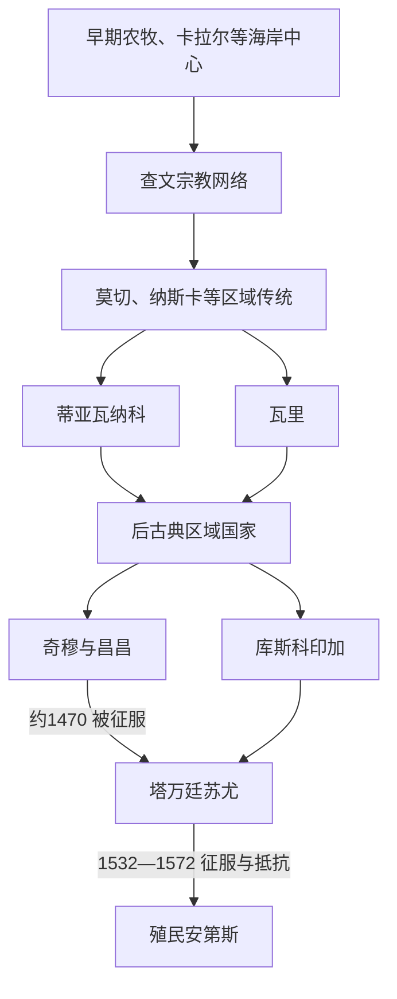

# 安第斯文明与印加帝国

## 时间

约公元前3000年至16世纪；相关社会、语言和文化传统延续至今。

## 概括

安第斯不是印加出现前的“空白前史”。海岸、山谷和高原长期发展出灌溉农业、梯田、牧畜、纺织、城市与礼仪中心。查文、莫切、纳斯卡、蒂亚瓦纳科、瓦里和奇穆等政治文化传统先后兴盛；15世纪印加以库斯科为中心扩张，建立“塔万廷苏尤”，把既有道路、劳役和地方精英网络整合为帝国体系。西班牙征服摧毁了帝国核心，但并未终结安第斯民族、克丘亚语、艾马拉语、社区土地关系和政治记忆。

## 主要发展

| 阶段 / 社会 | 时间 | 区域与特点 |
|---|---|---|
| 早期农牧与海岸聚落 | 前3000年以后 | 玉米、马铃薯、藜麦、羊驼和骆马等资源体系在不同生态带发展。 |
| 查文传统 | 约前900-前200年 | 查文·德·万塔尔为重要礼仪中心，影响范围广但不宜简单称为统一帝国。 |
| 莫切、纳斯卡 | 约1-800年 | 北海岸灌溉政治与南海岸地画、陶器传统并行。 |
| 蒂亚瓦纳科与瓦里 | 约500-1000年 | 高原与中部安第斯的城市、宗教和行政网络。 |
| 奇穆 | 约900-1470年 | 以昌昌为中心的北海岸政治体，后被印加征服。 |
| 印加帝国 | 约1438-1533年 | 以库斯科为中心的扩张国家，称“塔万廷苏尤”。 |

## 印加统治结构

| 层级 | 角色 | 说明 |
|---|---|---|
| 萨帕·印卡 | 帝国最高统治者 | 王权、宗教、军事和再分配的中心。 |
| 库斯科贵族与行政官 | 中央统治集团 | 组织征税、劳役、道路、仓储和军队。 |
| 地方首领 | 地方政治中介 | 许多既有首领被纳入帝国治理，而非完全由外来官员替代。 |
| 艾柳共同体 | 亲属与土地组织 | 组织生产、互助和劳役，是帝国汲取资源的重要基础。 |

## 重要特征

- 道路系统“卡帕克·尼安”连接库斯科与安第斯各地，是行政、贸易、军事和仪式网络；它整合了更早的道路传统。
- 帝国以米塔劳役、仓储和再分配组织资源，不等同于近代货币税收国家。
- 征服常以军事、婚姻、迁徙安置和地方联盟共同实现，地方社会保留不同程度的自治与抵抗。
- 1532年皮萨罗俘获阿塔瓦尔帕时，印加正经历阿塔瓦尔帕与瓦斯卡尔的内战；疾病、联盟、战争和帝国危机共同影响征服结果。
- 1536年曼科·印卡起义并围攻库斯科；维尔卡班巴的印加残余政权持续至1572年。
- 安第斯原住民不是静止的“遗存”：社区、语言、宗教实践和土地权利在殖民与共和国时期持续变化。

## 文明与帝国演进图

## 印加帝国的建立、扩张与灭亡

- **建立背景**：库斯科盆地原有多个政治共同体。传统王表把早期库斯科领袖整理为一条世系，但精确年代和父子关系多来自殖民时期口述，存在争议。约1438年昌卡战争的记忆把帕查库特克塑造成转折君主。
- **崛起机制**：帕查库特克重建库斯科并以“四方之地”组织帝国空间；其子图帕克·印卡·尤潘基和孙瓦伊纳·卡帕克继续扩张。征服结合军事打击、地方首领结盟、王族婚姻、人口迁置和对既有道路网络的接收，并非所有地区都由库斯科直接管理。
- **统治与鼎盛**：米塔劳役调集军役和公共工程，仓储体系缓冲地方歉收，结绳记事辅助人口与贡役管理。国家以克丘亚语传播、太阳崇拜和王族仪式塑造共同秩序，同时允许许多地方神祇和首领延续。
- **结构性脆弱**：辽阔疆域的忠诚不均，王位没有固定长子继承法；每位新王建立自己的王族集团，加剧贵族竞争。瓦伊纳·卡帕克及可能的继承人尼南·库约奇相继死亡后，瓦斯卡尔与阿塔瓦尔帕内战。
- **外部压力与直接灭亡**：欧亚疾病、内战和地方反印加盟友削弱帝国；西班牙人的骑兵、钢铁、火器和书写外交提供战术优势。1532年卡哈马卡伏击俘获阿塔瓦尔帕，1533年库斯科失守。曼科·印卡1536年起义失败后转入维尔卡班巴，1572年图帕克·阿马鲁一世被处决，独立新印加政权终结。
- **长期延续**：原住民社区、语言、道路、农业知识和王权记忆被殖民政权利用也持续反抗；1780年图帕克·阿马鲁二世起义和现代原住民政治都重释了印加遗产。

完整传统王系、阿塔瓦尔帕—瓦斯卡尔并立、西班牙扶立者和维尔卡班巴王系见[安第斯文明与印加统治者世系表](/%E4%BA%BA%E6%96%87%E7%A7%91%E5%AD%A6/%E5%8E%86%E5%8F%B2/%E7%BE%8E%E6%B4%B2/%E5%8D%97%E7%BE%8E/%E5%AE%89%E7%AC%AC%E6%96%AF%E6%96%87%E6%98%8E%E4%B8%8E%E5%8D%B0%E5%8A%A0%E7%BB%9F%E6%B2%BB%E8%80%85%E4%B8%96%E7%B3%BB%E8%A1%A8.md)。

## 演变关系

- 后续殖民体系：[西属南美与葡属巴西](/%E4%BA%BA%E6%96%87%E7%A7%91%E5%AD%A6/%E5%8E%86%E5%8F%B2/%E7%BE%8E%E6%B4%B2/%E5%8D%97%E7%BE%8E/%E8%A5%BF%E5%B1%9E%E5%8D%97%E7%BE%8E%E4%B8%8E%E8%91%A1%E5%B1%9E%E5%B7%B4%E8%A5%BF.md)。
- 独立后的安第斯国家：[安第斯共和国](/%E4%BA%BA%E6%96%87%E7%A7%91%E5%AD%A6/%E5%8E%86%E5%8F%B2/%E7%BE%8E%E6%B4%B2/%E5%8D%97%E7%BE%8E/%E5%AE%89%E7%AC%AC%E6%96%AF%E5%85%B1%E5%92%8C%E5%9B%BD.md)。
- 所属总览：[南美历史](/%E4%BA%BA%E6%96%87%E7%A7%91%E5%AD%A6/%E5%8E%86%E5%8F%B2/%E7%BE%8E%E6%B4%B2/%E5%8D%97%E7%BE%8E/README.md)。
