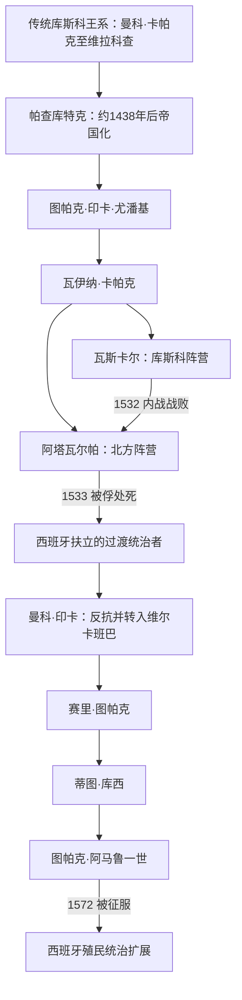

# 安第斯文明与印加统治者世系表

## 范围与口径

本表把“传统库斯科王系”“15世纪可较可靠重建的帝国统治者”“西班牙扶立者”与“维尔卡班巴新印加王系”分开。早期统治者名单主要由16世纪殖民时期编年史根据不同王族的口述传统记录，排列大体稳定，但年代、亲属关系和具体事迹常互相矛盾；因此不以精确年份制造虚假确定性。阿塔瓦尔帕与瓦斯卡尔并立、保柳·印卡与维尔卡班巴并立，均在备注中明确说明。

## 世系演进图

## 公认统治者完整表

| 序列 / 地位 | 统治者 | 约在位 | 继承关系 | 关键事件与辨析 |
|---|---|---|---|---|
| 传统序列1 | 曼科·卡帕克 | 约13世纪；年代存在争议 | 下库斯科王族 | 印加起源传说中的始祖；历史性与具体年代不能据后世编年确定。 |
| 传统序列2 | 辛奇·罗卡 | 年代存在争议 | 曼科·卡帕克之子 | 传说中开始使用王权标志；活动范围仍以库斯科盆地为主。 |
| 传统序列3 | 略克·尤潘基 | 年代存在争议 | 辛奇·罗卡之子 | 后世谱系归于早期库斯科联盟；可靠同时代材料缺乏。 |
| 传统序列4 | 迈塔·卡帕克 | 年代存在争议 | 略克·尤潘基之子 | 传说扩展库斯科周边影响，事迹可能混合王族记忆与政治神话。 |
| 传统序列5 | 卡帕克·尤潘基 | 约14世纪；年代存在争议 | 迈塔·卡帕克之子 | 通常列为下库斯科最后一位统治者；其死因与继承叙述版本不一。 |
| 传统序列6 | 印卡·罗卡 | 约14世纪；年代存在争议 | 传统上称卡帕克·尤潘基之子或近亲 | 上库斯科王系起点；王族重组的具体过程存在争议。 |
| 传统序列7 | 亚瓦尔·瓦卡克 | 约14世纪后期；年代存在争议 | 印卡·罗卡之子 | 有关被俘、复位和死亡的叙述主要来自殖民早期口述记录。 |
| 传统序列8 | 维拉科查·印卡 | 约15世纪前期 | 亚瓦尔·瓦卡克之子 | 面对昌卡压力时离开库斯科的传统叙事，为帕查库特克崛起提供王朝合法性背景。 |
| 9 | **帕查库特克·印卡·尤潘基** | 约1438—1471/1472年 | 维拉科查之子；击败昌卡后取代原定继承人 | 重建库斯科、确立四方疆域观念，推动道路、仓储、劳役和征服体系；帝国扩张的制度奠基者。 |
| 10 | **图帕克·印卡·尤潘基** | 约1471/1472—1493年 | 帕查库特克之子；此前可能已共治并领军 | 征服奇穆并向厄瓜多尔、玻利维亚和智利方向扩张；远征范围与具体次序存在争议。 |
| 11 | **瓦伊纳·卡帕克** | 约1493—1525/1527年 | 图帕克·印卡·尤潘基之子 | 帝国达到最大范围；长期驻北方。其死可能与欧亚疾病先于西班牙主力传播有关，确切死因与年份有争议。 |
| 未即位继承人 | 尼南·库约奇 | 约1525/1527年卒 | 瓦伊纳·卡帕克之子；被指定或被部分贵族推举 | 在完成即位前死亡，通常不列为萨帕·印卡；其死亡引发继承危机。 |
| 12（库斯科） | 瓦斯卡尔 | 约1527—1532年 | 瓦伊纳·卡帕克之子；获库斯科贵族支持 | 与阿塔瓦尔帕内战，战败被俘并遇害；内战消耗军政网络并制造地方倒戈机会。 |
| 13（基多阵营） | 阿塔瓦尔帕 | 1532—1533年 | 瓦伊纳·卡帕克之子；北方军队拥立 | 内战获胜后在卡哈马卡被皮萨罗俘虏，支付赎金后仍被处死；是否完成库斯科传统加冕存在争议。 |
| 西班牙扶立 | 图帕克·瓦尔帕 | 1533年 | 瓦伊纳·卡帕克之子；阿塔瓦尔帕之弟 | 由征服者扶立，在进军库斯科途中死亡；实际独立权力极有限。 |
| 西班牙扶立后反抗 | **曼科·印卡·尤潘基** | 1533—1544年 | 瓦伊纳·卡帕克之子 | 起初被扶立，1536年围攻库斯科失败后转入维尔卡班巴，建立新印加抵抗中心。 |
| 并立亲西政权 | 保柳·印卡 | 约1537—1549年 | 瓦伊纳·卡帕克之子；曼科之弟 | 与西班牙结盟并在库斯科活动，与维尔卡班巴政权并立；不能与独立抵抗王系统一计数。 |
| 维尔卡班巴2 | 赛里·图帕克 | 1544—1558年 | 曼科·印卡之子 | 幼年继承；后离开维尔卡班巴并接受西班牙封赐，抵抗中心转由亲族维持。 |
| 维尔卡班巴3 | 蒂图·库西·尤潘基 | 约1558—1571年 | 曼科·印卡之子；赛里·图帕克之兄弟 | 通过外交、传教协商与有限战争维持自主；留下口述历史记录。 |
| 维尔卡班巴4 | **图帕克·阿马鲁一世** | 1571—1572年 | 曼科·印卡之子；蒂图·库西之弟 | 西班牙远征攻占维尔卡班巴后被俘并在库斯科处决，独立的新印加国家终结。 |

## 王位继承与帝国兴亡

- **崛起机制**：帕查库特克一代把库斯科王国转化为扩张国家，征服并非只靠战斗，还包括与地方首领结盟、王族婚姻、人口迁置、道路与仓储建设，以及按共同体征调的米塔劳役。图帕克·印卡和瓦伊纳·卡帕克在既有行政骨架上继续扩张。
- **鼎盛条件**：安第斯垂直生态带互补、既有瓦里和地方道路传统、国家仓储、驿站传递与对地方首领的间接统治，使帝国能在没有轮式运输和货币税制的条件下调动物资与兵员。
- **结构性脆弱**：扩张过快使地方忠诚不均；继承没有固定长子原则，王位要由王族、祭司和军队联盟确认；新王建立自己的王族集团与地产，也加剧精英竞争。
- **外部压力**：欧亚疾病可能在征服者主力到达前已造成死亡与继承危机。西班牙人以骑兵、钢铁武器、火器和跨洋补给取得战术优势，更关键的是动员卡尼亚里、万卡等反印加或寻求重新议价的地方盟友。
- **直接触发与灭亡过程**：瓦伊纳·卡帕克及继承人相继死亡后，瓦斯卡尔与阿塔瓦尔帕内战。1532年阿塔瓦尔帕刚获胜即在卡哈马卡被俘；1533年库斯科失守。曼科·印卡1536年大起义未能夺回库斯科，抵抗中心退至维尔卡班巴，最终在1572年被总督托莱多发动的远征摧毁。
- **延续而非消失**：帝国政权灭亡不等于安第斯社会终止。艾柳、克丘亚语和艾马拉语、地方仪式、纺织和土地记忆在殖民制度中重组，并持续影响共和国时期的身份、土地与自治政治。

## 继承辨析

- “印加统治者只有十三位”是常见简化；它通常把早期传统王系与瓦斯卡尔、阿塔瓦尔帕纳入一条序列，却不含1533年后的扶立者和维尔卡班巴统治者。
- 早期王系可能把若干同时存在的库斯科亲族集团整理为父子相承序列；应把它视为政治记忆，而非可逐年验证的编年。
- 佩德罗·萨米恩托、印卡·加西拉索等殖民时期记录者的立场和所接触王族不同，不能据单一版本断言所有年代。
- 阿塔瓦尔帕控制帝国军队并击败瓦斯卡尔，但未必完成库斯科的完整即位礼；本表仍将其列为事实上的最高统治者。
- 保柳·印卡与曼科·印卡之后的维尔卡班巴王系并立，分别代表亲西班牙的库斯科贵族路线和持续反抗路线。

## 相关笔记

- 主笔记：[安第斯文明与印加帝国](/%E4%BA%BA%E6%96%87%E7%A7%91%E5%AD%A6/%E5%8E%86%E5%8F%B2/%E7%BE%8E%E6%B4%B2/%E5%8D%97%E7%BE%8E/%E5%AE%89%E7%AC%AC%E6%96%AF%E6%96%87%E6%98%8E%E4%B8%8E%E5%8D%B0%E5%8A%A0%E5%B8%9D%E5%9B%BD.md)。
